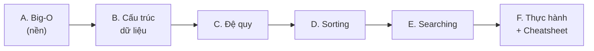

# MOC: Data Structures & Algorithms

> Module `L1_AL_NLS_DSAA`. Thi: **Final Theory Test + Final Practical Test**.
> Nguồn: *Programming Foundations: Algorithms* (Joe Marini, LinkedIn Learning) — Python.
> ✅ 11 note · 6 cụm.

## Cụm A — Nền tảng lý thuyết

| # | Note | Nội dung | Trạng thái |
|---|------|----------|------------|
| 1 | [[01-Tong-quan-Thuat-toan\|Tổng quan Thuật toán]] | Thuật toán là gì, đặc điểm, phân loại, 4 nhóm, Euclid GCD | ✅ |
| 2 | [[02-Do-phuc-tap-Big-O\|Độ phức tạp & Big-O]] ⭐ | Big-O, time/space, O(1)→O(n²), nhận diện trong code | ✅ |

## Cụm B — Cấu trúc dữ liệu

| # | Note | Nội dung | Trạng thái |
|---|------|----------|------------|
| 3 | [[03-Array\|Array]] | Mảng 1D/2D, random access, Big-O từng thao tác | ✅ |
| 4 | [[04-Linked-List\|Linked List]] | Node/head, singly/doubly, insert/find/delete, code Python | ✅ |
| 5 | [[05-Stack-va-Queue\|Stack & Queue]] | LIFO/FIFO, deque, ứng dụng, code Python | ✅ |
| 6 | [[06-Dictionary-Hash-Table\|Dictionary & Hash Table]] | Hash function, collision, Set, Big-O | ✅ |

## Cụm C — Đệ quy

| # | Note | Nội dung | Trạng thái |
|---|------|----------|------------|
| 7 | [[07-De-quy-Recursion\|Đệ quy]] | Base case, call stack, countdown/power/factorial | ✅ |

## Cụm D — Sắp xếp

| # | Note | Nội dung | Trạng thái |
|---|------|----------|------------|
| 8 | [[08-Sorting\|Sorting]] | Bubble, Merge, Quick (divide & conquer), code Python | ✅ |

## Cụm E — Tìm kiếm

| # | Note | Nội dung | Trạng thái |
|---|------|----------|------------|
| 9 | [[09-Searching\|Searching]] | Linear, Binary search, kiểm tra sorted, code Python | ✅ |

## Cụm F — Thực hành & tra cứu

| # | Note | Nội dung | Trạng thái |
|---|------|----------|------------|
| 10 | [[10-Thuat-toan-ung-dung\|Thuật toán ứng dụng]] ⭐ | Set lọc unique · Dict đếm · find max đệ quy · Stack cân bằng ngoặc | ✅ |
| 11 | [[11-DSA-Cheatsheet\|DSA Cheatsheet]] | Bảng Big-O tổng hợp · khi nào dùng gì · snippet · glossary | ✅ |

## Lộ trình học

## Liên quan
- [[../00-MOC-Foundations|MOC: Foundations]]
