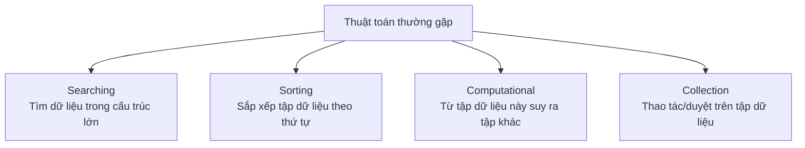
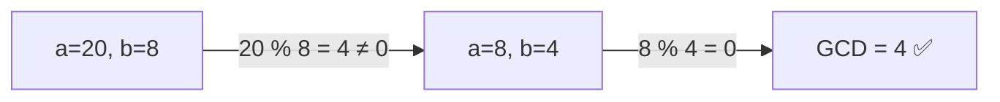

# Tổng quan Thuật toán — Algorithm là gì?

> [!summary] TL;DR
> **Thuật toán (algorithm)** = một tập **các bước** hữu hạn, có thứ tự, giải quyết **một bài toán cụ thể** (recipe). Mỗi thuật toán có **độ phức tạp** (time + space), một **tập input** và **output** xác định. Có thể phân loại theo nhiều tiêu chí (serial/parallel, exact/approximate, deterministic/non-deterministic). 4 nhóm hay gặp khi lập trình: **searching, sorting, computational, collection**. Ví dụ kinh điển: **thuật toán Euclid** tìm ước chung lớn nhất (GCD).

---

## 1. Thuật toán là gì?

> **Algorithm** = một quy trình / công thức / tập chỉ dẫn mô tả **cách thực hiện một tác vụ** để cho ra kết quả mong muốn.

Ví dụ: bạn có một đống hình, cần **nhóm các hình giống nhau** lại. Cách đơn giản: lặp qua từng hình → xác định loại → bỏ vào nhóm tương ứng. Toàn bộ chuỗi bước đó **hợp lại = một thuật toán**.

Mọi phần mềm đều chạy trên thuật toán. Không hiểu thuật toán mà code thì giống như "lắp ô tô mà không hiểu động cơ hoạt động ra sao".

---

## 2. Đặc điểm của một thuật toán

| Đặc điểm | Ý nghĩa |
|----------|---------|
| **Time complexity** | Thuật toán **nhanh/chậm** thế nào khi kích thước input tăng → xem [[02-Do-phuc-tap-Big-O]] |
| **Space complexity** | Thuật toán cần bao nhiêu **bộ nhớ / dung lượng** để chạy |
| **Input** | Tập giá trị đầu vào thuật toán nhận để xử lý |
| **Output** | Kết quả thuật toán tạo ra |

Một thuật toán **luôn có ít nhất một** độ phức tạp, thường là **nhiều hơn một** (vì một cấu trúc dữ liệu có thể làm nhiều thao tác — insert, search… mỗi thao tác một Big-O riêng).

---

## 3. Phân loại thuật toán (các tiêu chí)

| Tiêu chí | Loại 1 | Loại 2 |
|----------|--------|--------|
| **Cách xử lý dữ liệu** | **Serial** (tuần tự — xử lý lần lượt) | **Parallel** (song song — chia nhỏ, xử lý đồng thời) |
| **Tính chính xác** | **Exact** (cho ra giá trị **đoán trước được**) | **Approximate** (cho ra đáp án *có thể* không chính xác — vd nhận diện khuôn mặt) |
| **Cách ra quyết định** | **Deterministic** (mỗi bước quyết định **chính xác**) | **Non-deterministic** (đoán dần, càng về sau càng chính xác) |

> [!question] Phỏng vấn: "Exact khác Deterministic chỗ nào?"
> - **Exact ↔ Approximate** nói về **kết quả** (có đúng tuyệt đối không).
> - **Deterministic ↔ Non-deterministic** nói về **quá trình** (mỗi bước có quyết định cứng hay đoán dần).
> Một thuật toán có thể vừa deterministic vừa exact (vd Euclid GCD), hoặc non-deterministic + approximate (vd nhiều thuật toán ML/AI).

---

## 4. Bốn nhóm thuật toán hay gặp khi lập trình



| Nhóm | Làm gì | Ví dụ |
|------|--------|-------|
| **Searching** | Tìm một phần tử trong cấu trúc lớn hơn | Tìm chuỗi con trong chuỗi, tìm file trong cây thư mục → [[13-Searching]] |
| **Sorting** | Đưa tập dữ liệu về một thứ tự | Sắp xếp bất động sản theo giá → [[12-Sorting]] |
| **Computational** | Lấy tập dữ liệu này, **suy ra** tập khác | Kiểm tra số nguyên tố, đổi đơn vị nhiệt độ |
| **Collection** | Thao tác/điều hướng trên tập dữ liệu trong một cấu trúc | Đếm phần tử, lọc dữ liệu thừa → [[14-Thuat-toan-ung-dung]] |

---

## 5. Ví dụ kinh điển: Thuật toán Euclid (GCD)

**Ước chung lớn nhất (Greatest Common Denominator)** của 2 số = số nguyên lớn nhất chia hết **cả hai**. Vd: GCD(8, 20) = 4.

**Quy tắc Euclid:** có 2 số `a > b`. Chia `a` cho `b` lấy **số dư**:
- Nếu dư = 0 → `b` chính là GCD, dừng.
- Ngược lại: gán `a = b`, `b = số dư`, lặp lại.



```python
def gcd(a, b):
    while b != 0:
        t = a          # giữ a lại
        a = b          # a ← b
        b = t % b      # b ← số dư (a cũ % b)
    return a           # khi b = 0, a chính là GCD

print(gcd(60, 96))   # 12
print(gcd(20, 8))    # 4
```

```
★ Insight ─────────────────────────────────────
• "Thuật toán" và "cấu trúc dữ liệu" đi cặp với nhau: thuật toán
  cần dữ liệu để làm việc, dữ liệu cần được tổ chức (CTDL) để thuật
  toán chạy hiệu quả. Chọn sai CTDL → thuật toán chậm dù logic đúng.
• Một bài toán luôn có NHIỀU thuật toán giải được — khác nhau ở
  Big-O. Kỹ năng cốt lõi không phải "biết 1 cách" mà là "chọn cách
  tốt nhất cho ngữ cảnh" (dữ liệu lớn/nhỏ, đã sort chưa, RAM ít…).
• Euclid GCD là ví dụ đẹp của "vòng lặp + giảm dần bài toán" — cùng
  ý tưởng với đệ quy ở [[11-De-quy-Recursion]].
─────────────────────────────────────────────────
```

---

## Tự kiểm tra

1. Nêu 4 đặc điểm mô tả một thuật toán.
2. Phân biệt **exact ↔ approximate** và **deterministic ↔ non-deterministic**. Cho ví dụ một thuật toán vừa non-deterministic vừa approximate.
3. Kể 4 nhóm thuật toán hay gặp và cho mỗi nhóm một ví dụ.
4. Giải thích thuật toán Euclid bằng lời, rồi chạy tay GCD(48, 18).

---

## Liên quan
- [[02-Do-phuc-tap-Big-O]] — đo hiệu năng thuật toán
- [[00-MOC-DSA]] — quay lại MOC
