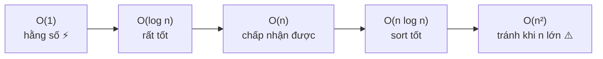

# Độ phức tạp & Big-O Notation

> [!summary] TL;DR
> **Big-O** mô tả hiệu năng của thuật toán **thay đổi thế nào khi kích thước input (n) tăng**. Chữ O = **order of operation** (bậc của phép toán). Big-O thường mô tả **worst-case** (trường hợp xấu nhất). Thứ tự từ tốt → xấu: **O(1) < O(log n) < O(n) < O(n log n) < O(n²)**. Mẹo: thấy **vòng lặp lồng vòng lặp** thường là **O(n²)**. Một cấu trúc/thuật toán có thể có **nhiều** giá trị Big-O (mỗi thao tác một bậc).

---

## 1. Vì sao cần Big-O?

Ta muốn đo: **hiệu năng thay đổi ra sao theo kích thước input?** Đây là yếu tố quyết định chọn thuật toán nào, và hiểu chương trình sẽ hành xử thế nào khi dữ liệu lớn lên.

Big-O **không** đo "chạy mất mấy giây" (phụ thuộc máy), mà đo **tốc độ tăng** của số phép toán theo `n`. Nó bỏ qua hằng số và số hạng bậc thấp:
- `3n + 5` → **O(n)**
- `2n² + 100n` → **O(n²)** (khi n lớn, n² át tất cả)

---

## 2. Bảng các bậc Big-O (từ tốt → xấu)

| Big-O | Tên | n tăng gấp đôi thì… | Ví dụ điển hình |
|-------|-----|----------------------|-----------------|
| **O(1)** | Constant — hằng số | **không đổi** | Kiểm tra số chẵn/lẻ; truy cập `arr[i]` theo index |
| **O(log n)** | Logarithmic | thêm **vài** phép | **Binary search** trên mảng đã sort |
| **O(n)** | Linear — tuyến tính | gấp **đôi** | Tìm trong mảng **chưa** sort; đếm phần tử |
| **O(n log n)** | Log-linear | hơi hơn gấp đôi | **Merge sort, Quick sort, Heap sort** |
| **O(n²)** | Quadratic — bậc hai | gấp **bốn** | **Bubble sort, Selection sort** |

> Còn các bậc xấu hơn nữa (O(2ⁿ), O(n!)) nhưng đây là nhóm hay gặp khi đi làm.



---

## 3. Time complexity vs Space complexity

| | Đo cái gì | Câu hỏi |
|---|-----------|---------|
| **Time complexity** | Số phép toán theo `n` | Chạy **nhanh** cỡ nào? |
| **Space complexity** | Bộ nhớ phụ cần dùng theo `n` | Tốn **RAM** cỡ nào? |

> [!question] Phỏng vấn: "Merge sort và Quick sort cùng O(n log n), chọn cái nào?"
> Khác nhau ở **space**: **Merge sort** cần **bộ nhớ phụ O(n)** (tạo mảng mới khi merge). **Quick sort** sắp xếp **in-place** (O(log n) cho call stack), tiết kiệm RAM hơn → thường nhanh hơn thực tế. Nhưng Quick sort **worst-case O(n²)** khi mảng đã gần sort. Xem [[12-Sorting]].

---

## 4. Best / Worst / Average case

Big-O thường nói **worst-case** (đảm bảo "tệ nhất cũng chỉ đến mức này"). Nhưng một thuật toán có 3 mức:
- **Best case** (Ω) — input thuận lợi nhất.
- **Average case** (Θ) — trung bình.
- **Worst case** (O) — xấu nhất.

Ví dụ **linear search**: best = O(1) (phần tử ở đầu), worst = O(n) (ở cuối hoặc không có).

---

## 5. Mẹo nhận diện Big-O trong code

```python
# O(1) — không phụ thuộc n
def is_even(x):
    return x % 2 == 0

# O(n) — 1 vòng lặp qua n phần tử
def total(arr):
    s = 0
    for x in arr:      # chạy n lần
        s += x
    return s

# O(n²) — vòng lặp LỒNG vòng lặp
def has_dup(arr):
    for i in arr:          # n lần
        for j in arr:      # × n lần  → n²
            ...
```

> [!tip] Quy tắc nhanh
> - **Không lặp theo n** → O(1)
> - **1 vòng lặp** qua n → O(n)
> - **2 vòng lặp lồng nhau** → O(n²)
> - **Chia đôi dữ liệu mỗi bước** (binary search, divide & conquer) → có `log n`
> - **Đệ quy:** Big-O ≈ **số lần hàm được gọi** → xem [[11-De-quy-Recursion]]

```
★ Insight ─────────────────────────────────────
• Big-O là "ngôn ngữ chung" để so sánh thuật toán độc lập với phần
  cứng. Một thuật toán O(n log n) trên laptop cũ vẫn thắng O(n²)
  trên server xịn khi n đủ lớn — vì Big-O nói về XU HƯỚNG tăng.
• "Một cấu trúc có nhiều Big-O": vd Array có truy cập O(1) nhưng
  chèn đầu O(n); Linked List ngược lại. Luôn hỏi "Big-O của THAO
  TÁC NÀO?" chứ không phải "Big-O của cấu trúc".
• Đừng tối ưu mù quáng: với n nhỏ, O(n²) có thể nhanh hơn O(n log n)
  vì hằng số nhỏ. Big-O chỉ quan trọng khi n LỚN.
─────────────────────────────────────────────────
```

---

## Tự kiểm tra

1. Big-O đo cái gì? Vì sao bỏ qua hằng số (`3n+5 → O(n)`)?
2. Sắp xếp các bậc sau từ tốt → xấu: O(n²), O(1), O(n log n), O(log n), O(n).
3. Thấy 2 vòng `for` lồng nhau thường suy ra Big-O nào? Vì sao?
4. Hai thuật toán cùng O(n log n) — còn tiêu chí nào để chọn? (gợi ý: space).
5. Linear search có best/worst case là gì?

---

## Liên quan
- [[01-Tong-quan-Thuat-toan]] — đặc điểm thuật toán
- [[03-Array]] · [[04-Linked-List]] · [[05-Stack-va-Queue]] · [[06-Dictionary-Hash-Table]] — Big-O từng cấu trúc
- [[15-DSA-Cheatsheet]] — bảng Big-O tổng hợp
