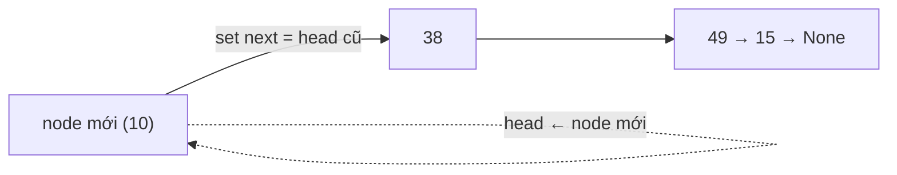
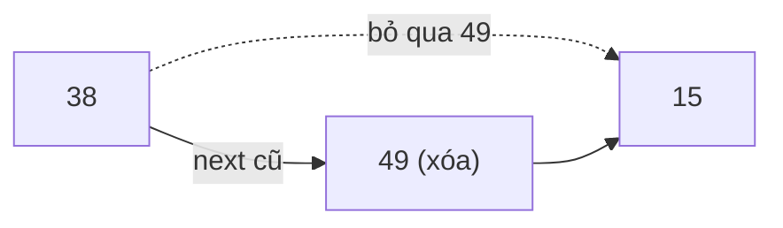

# Linked List — Danh sách liên kết

> [!summary] TL;DR
> **Linked List** = tập dữ liệu tuyến tính gồm các **node**; mỗi node chứa **dữ liệu** + một **con trỏ (next)** tới node kế tiếp. Node đầu = **head**, node cuối trỏ tới **None** (báo hết list). **Singly** = chỉ trỏ tới next; **Doubly** = trỏ cả prev lẫn next. Ưu điểm: **chèn/xóa nhanh O(1)** (chỉ đổi pointer, không cần dịch bộ nhớ). Nhược điểm: **không có random access** — tìm phần tử bất kỳ là **O(n)** (phải đi từ head).

---

## 1. Cấu trúc Linked List


- **Node**: đơn vị chứa `data` + `next`.
- **Head**: node đầu tiên.
- Node cuối: `next = None` → đánh dấu **hết list**.

Dữ liệu **không cần nằm liền kề** trong bộ nhớ (khác array) — các node nối nhau bằng pointer.

---

## 2. Singly vs Doubly Linked List

| | Singly Linked List | Doubly Linked List |
|---|--------------------|--------------------|
| Hướng liên kết | Chỉ `next` (1 chiều) | Cả `prev` và `next` (2 chiều) |
| Mỗi node biết | Node kế tiếp | Node trước **và** sau |
| Bộ nhớ/node | Ít hơn | Nhiều hơn (thêm 1 pointer) |
| Duyệt ngược | Không | Có |


---

## 3. Các thao tác

**Chèn vào head** (O(1)): node mới trỏ vào head cũ → head = node mới.



**Xóa node** (O(1) nếu biết node trước): cho node trước trỏ thẳng tới node sau node-cần-xóa.



**Tìm phần tử** (O(n)): bắt đầu từ head, đi từng node tới khi gặp giá trị cần tìm.

---

## 4. Cài đặt Python

```python
class Node:
    def __init__(self, data):
        self.data = data
        self.next = None

class LinkedList:
    def __init__(self):
        self.head = None
        self.count = 0

    def insert(self, data):          # chèn vào head — O(1)
        new_node = Node(data)
        new_node.next = self.head
        self.head = new_node
        self.count += 1

    def find(self, data):            # tìm — O(n)
        item = self.head
        while item is not None:
            if item.data == data:
                return item
            item = item.next
        return None

    def delete_at(self, index):      # xóa theo index — O(n)
        if index >= self.count:
            return
        if index == 0:               # xóa head
            self.head = self.head.next
        else:                        # đi tới node TRƯỚC node cần xóa
            temp_idx = 0
            node = self.head
            while temp_idx < index - 1:
                node = node.next
                temp_idx += 1
            node.next = node.next.next   # bỏ qua node cần xóa
        self.count -= 1
```

---

## 5. Big-O & so với Array

| Thao tác | Linked List | Array |
|----------|-------------|-------|
| Truy cập phần tử thứ i | **O(n)** ❌ | **O(1)** ✅ |
| Chèn/xóa ở **head** | **O(1)** ✅ | **O(n)** ❌ |
| Tìm giá trị | **O(n)** | **O(n)** |
| Bộ nhớ | Rải rác, linh hoạt | Liền kề, cần khối lớn |

> [!question] Phỏng vấn: "Khi nào dùng Linked List thay Array?"
> Khi bạn **chèn/xóa nhiều ở đầu/giữa** và **không cần truy cập ngẫu nhiên theo index**. Vd: triển khai Stack/Queue, hàng đợi tác vụ, undo history. Nếu cần đọc phần tử thứ i thường xuyên → chọn Array (O(1)).

```
★ Insight ─────────────────────────────────────
• Linked List đánh đổi NGƯỢC với Array: được O(1) khi chèn/xóa
  (chỉ sửa pointer, không dịch bộ nhớ) nhưng mất O(1) khi truy cập
  (phải đi từ head). Không có CTDL "tốt mọi mặt" — chỉ có phù hợp.
• Mọi thao tác xóa/chèn thực chất chỉ là "đổi vài con trỏ". Vẽ ra
  giấy ai-trỏ-ai trước/sau khi sửa là cách chống bug số 1.
• Node cuối trỏ None là "điểm dừng" của mọi vòng duyệt — quên kiểm
  tra None là lỗi kinh điển gây crash/vòng lặp vô hạn.
─────────────────────────────────────────────────
```

---

## Tự kiểm tra

1. Một node gồm những thành phần nào? Head và node cuối khác gì nhau?
2. Vì sao chèn vào head là O(1) nhưng tìm phần tử là O(n)?
3. Singly vs Doubly khác nhau chỗ nào? Đánh đổi là gì?
4. Viết hàm `find` cho singly linked list (Python).
5. Để xóa node ở index `i`, vì sao phải đi tới node ở index `i-1`?

---

## Liên quan
- [[03-Array]] — cấu trúc "đối thủ"
- [[05-Stack-va-Queue]] — thường cài bằng linked list
- [[02-Do-phuc-tap-Big-O]] — đánh đổi Big-O giữa các CTDL
