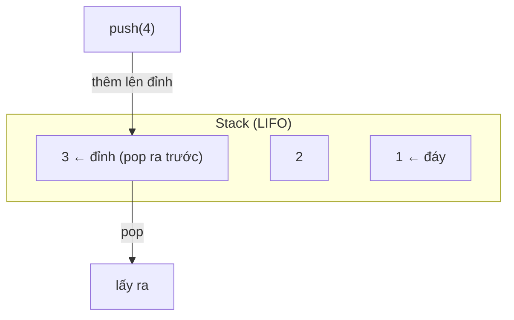
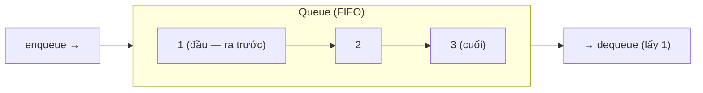

# Stack & Queue — Ngăn xếp và Hàng đợi

> [!summary] TL;DR
> **Stack** = cấu trúc **LIFO** (Last In, First Out): phần tử **push** vào sau cùng là phần tử **pop** ra đầu tiên. **Queue** = **FIFO** (First In, First Out): vào trước ra trước, như xếp hàng. Cả hai thao tác thêm/lấy đều **O(1)**. Stack dùng cho: nút **Back** trình duyệt, đánh giá biểu thức, **call stack** của đệ quy. Queue dùng cho: xử lý đơn hàng, hàng đợi tin nhắn. Trong Python dùng `list` cho stack, nhưng nên dùng **`collections.deque`** cho queue (pop đầu list là O(n)).

---

## 1. Stack — LIFO

Hai thao tác chính: **push** (đẩy vào đỉnh), **pop** (lấy khỏi đỉnh). **Phần tử vào sau cùng ra trước tiên.**



Cả push và pop đều **O(1)** (không phụ thuộc số phần tử đang có).

**Ứng dụng Stack:**
- **Nút Back trình duyệt:** mỗi link click đẩy vào stack; bấm Back → pop URL gần nhất.
- **Đánh giá biểu thức** (vd Reverse Polish Notation), **cân bằng ngoặc** → [[14-Thuat-toan-ung-dung]].
- **Backtracking** và **call stack** của đệ quy → [[11-De-quy-Recursion]].

```python
stack = []
stack.append(1)      # push
stack.append(2)
stack.append(3)
x = stack.pop()      # → 3 (vào sau cùng, ra trước)
```

---

## 2. Queue — FIFO

Hai thao tác: **enqueue** (thêm vào cuối), **dequeue** (lấy từ đầu). **Vào trước ra trước**, như hàng người xếp hàng.



**Ứng dụng Queue:**
- **Xử lý đơn hàng:** đảm bảo đơn được xử lý đúng thứ tự nhận.
- **Hàng đợi tin nhắn (SMS):** gửi tin theo đúng thứ tự soạn.
- Hàng đợi tác vụ, BFS duyệt cây/đồ thị.

### Queue chuyên biệt (specialized queues)
| Loại | Khác queue thường | Dùng khi |
|------|-------------------|----------|
| **Deque** (double-ended) | Thêm/lấy ở **cả 2 đầu**, đều O(1) | Cần linh hoạt 2 đầu; làm cả stack lẫn queue |
| **Circular queue** (vòng) | Cuối nối lại đầu (mảng cố định, dùng modulo) | Buffer cố định: streaming, vòng đệm I/O |
| **Priority queue** | Lấy ra theo **độ ưu tiên**, không theo thứ tự vào | Lập lịch, Dijkstra → cài bằng **heap**, xem [[09-Heap-Priority-Queue]] |

---

## 3. Python: `list` vs `deque`

Dùng `list` làm queue **rất chậm**: `list.pop(0)` (lấy đầu) là **O(n)** vì mọi phần tử phải dịch xuống. Dùng **`collections.deque`** (double-ended queue) — tối ưu thêm/lấy ở **cả hai đầu**, đều **O(1)**.

```python
from collections import deque

queue = deque()
queue.append(1)        # thêm cuối
queue.append(2)
queue.append(3)
x = queue.popleft()    # → 1 (lấy đầu, FIFO) — O(1)
y = queue.pop()        # → 3 (lấy cuối)
```

> [!question] Phỏng vấn: "Vì sao không dùng list làm queue trong Python?"
> `list.pop(0)` là **O(n)** — xóa phần tử đầu buộc toàn bộ phần tử sau dịch xuống một ô. `deque.popleft()` là **O(1)** vì deque được thiết kế tối ưu cho thao tác ở hai đầu. Với stack thì `list` ổn vì `append`/`pop` ở **cuối** đều O(1).

---

## 4. Bảng phân biệt

| | Stack | Queue |
|---|-------|-------|
| Nguyên tắc | **LIFO** (vào sau ra trước) | **FIFO** (vào trước ra trước) |
| Thêm | push (đỉnh) | enqueue (cuối) |
| Lấy | pop (đỉnh) | dequeue (đầu) |
| Big-O thêm/lấy | O(1) | O(1) |
| Ví dụ đời thực | Chồng đĩa, nút Back | Xếp hàng, đơn hàng |
| Python | `list` (append/pop) | `collections.deque` |

```
★ Insight ─────────────────────────────────────
• Stack và Queue không phải "cấu trúc lưu trữ mới" — chúng là RÀNG
  BUỘC CÁCH TRUY CẬP áp lên list/linked list. Sức mạnh nằm ở kỷ
  luật "chỉ được lấy theo 1 đầu", giúp mô hình hóa bài toán gọn gàng.
• Đệ quy CHÍNH LÀ stack ngầm: mỗi lời gọi hàm push một frame lên
  call stack, return thì pop. Hiểu stack là hiểu đệ quy.
• Chọn sai list/deque cho queue là bug hiệu năng "ẩn": code vẫn
  đúng nhưng chậm O(n) mỗi lần dequeue — chỉ lộ ra khi dữ liệu lớn.
─────────────────────────────────────────────────
```

---

## Tự kiểm tra

1. LIFO và FIFO là gì? Stack/Queue tương ứng với cái nào?
2. Nút Back trình duyệt dùng Stack hay Queue? Vì sao?
3. Vì sao nên dùng `deque` thay `list` cho queue trong Python?
4. Push 1,2,3 vào stack rồi pop 2 lần — kết quả pop là gì?
5. Mối liên hệ giữa Stack và đệ quy là gì?

---

## Liên quan
- [[04-Linked-List]] — nền tảng cài đặt stack/queue
- [[11-De-quy-Recursion]] — call stack
- [[14-Thuat-toan-ung-dung]] — Stack cân bằng ngoặc
