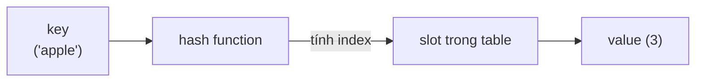

# Dictionary & Hash Table — Bảng băm

> [!summary] TL;DR
> **Dictionary** (còn gọi **hash table / hash map / associative array**) ánh xạ **key → value** thông qua một **hash function**. Hàm băm biến key thành **index** vào các slot lưu value → tra cứu **trung bình O(1)**. Khi 2 key băm ra **cùng slot** → **collision (va chạm)**, hash table phải có cơ chế giải quyết. Ưu điểm: tra cứu **rất nhanh** kể cả khi nhiều phần tử. Nhược điểm: **không đảm bảo thứ tự**; với ít phần tử thì list thường đủ và đơn giản hơn. **Set** = họ hàng của dict, chỉ chứa **giá trị duy nhất**.

---

## 1. Dictionary hoạt động thế nào?



- **Hash function** lấy `key`, tính ra một **index** vào mảng slot bên dưới.
- Lý tưởng: mỗi key → một slot **duy nhất**.
- Thực tế: đôi khi 2 key khác nhau băm ra **cùng slot** → **collision**.

> Hầu hết ngôn ngữ đã cài sẵn dict với cơ chế xử lý collision — ta chỉ cần biết **dùng** và hiểu **ưu/nhược**.

---

## 2. Collision — va chạm

> **Collision** = khi hai key khác nhau được hàm băm map vào **cùng một slot**.

Hash table phải có cách giải quyết (vd **chaining** — mỗi slot là một list, hoặc **open addressing** — tìm slot trống kế tiếp) để value vẫn map đúng key. Hiếm gặp nhưng **có** xảy ra; collision nhiều làm tra cứu **tệ dần** về O(n) ở worst-case.

---

## 3. Ưu / Nhược điểm

| Ưu điểm | Nhược điểm |
|---------|-----------|
| Map **duy nhất** key → value | **Không đảm bảo thứ tự** phần tử |
| Tra cứu **nhanh O(1)** trung bình, kể cả n lớn | Với n **nhỏ**, list/array có thể hiệu quả hơn (không phải xử lý collision) |
| Cài được **counter, filter** dễ dàng | Liệt kê các key "gần nhau" không hiệu quả (dữ liệu rải ngẫu nhiên) |

| Thao tác | Big-O trung bình | Worst-case |
|----------|------------------|-----------|
| Insert / Lookup / Delete theo key | **O(1)** | O(n) (collision nhiều) |

> [!question] Phỏng vấn: "Dict tra cứu O(1), vì sao không phải lúc nào cũng dùng dict?"
> Vì: (1) **không có thứ tự** — cần duyệt theo thứ tự thì phải sort thêm; (2) với **ít phần tử**, overhead hàm băm + xử lý collision khiến list đơn giản còn nhanh hơn; (3) worst-case (collision dày) tụt về **O(n)**. Dùng dict khi cần **tra cứu theo key thật nhanh trên tập lớn**.

---

## 4. Python dictionary

```python
# Tạo bằng constructor
items1 = dict(key1=1, key2=2, key3=3)

# Tạo rỗng rồi thêm dần (dict tự co giãn)
items2 = {}
items2["key1"] = 1
items2["key2"] = 2
items2["key2"] = "two"     # gán lại key đã có → GHI ĐÈ value

# Truy cập key không tồn tại → KeyError
# print(items1["key6"])    # ❌ lỗi
items1.get("key6")         # ✅ trả None thay vì lỗi

# Duyệt key + value
for key, value in items2.items():
    print(key, value)
```

---

## 5. Set — tập hợp giá trị duy nhất

**Set** giống list nhưng **chỉ chứa giá trị duy nhất** (loại trùng tự động). Dựa trên cùng cơ chế băm như dict → kiểm tra "có trong set không" là **O(1)**.

```python
nums = set([1, 2, 2, 3, 3, 3])   # → {1, 2, 3}  (tự loại trùng)
nums.add(2)                       # đã có → không thêm
nums.add(7)                       # mới → thêm vào

# Lọc unique bằng set comprehension
unique = {c for c in "Hello World".lower() if c.isalnum()}
```

→ Ứng dụng lọc unique / đếm: xem [[10-Thuat-toan-ung-dung]].

```
★ Insight ─────────────────────────────────────
• "Phép màu O(1)" của dict đến từ hash function biến key thành index
  như array — về bản chất dict là array + một hàm băm thông minh
  phía trước. Mất hàm băm tốt (collision dày) là mất O(1).
• Key phải BẤT BIẾN (immutable: str, int, tuple) vì value của hàm
  băm phải ổn định. Đó là lý do Python không cho dùng list làm key.
• Set và dict là "dao mổ" cho hai bài toán cực phổ biến: KHỬ TRÙNG
  (set) và ĐẾM TẦN SUẤT (dict counter) — đều O(n), gọn hơn nhiều
  so với nested loop O(n²).
─────────────────────────────────────────────────
```

---

## Tự kiểm tra

1. Hash function làm gì trong dictionary? Vì sao tra cứu được O(1)?
2. Collision là gì? Khi nào nó làm hiệu năng tụt về O(n)?
3. Nêu 2 nhược điểm của dictionary so với list.
4. Set khác list ở điểm cốt lõi nào? Cho ví dụ lọc unique.
5. Vì sao không dùng `list` làm key của dict trong Python?

---

## Liên quan
- [[03-Array]] — dict là "array + hàm băm"
- [[10-Thuat-toan-ung-dung]] — counter & filter bằng dict/set
- [[02-Do-phuc-tap-Big-O]] — O(1) trung bình vs O(n) worst-case
