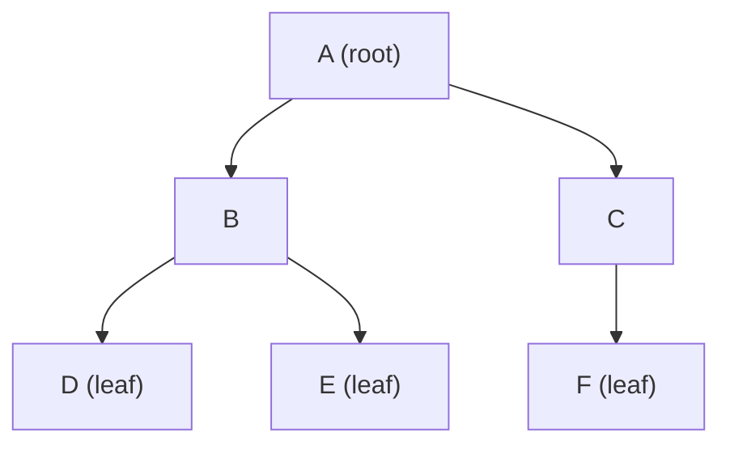
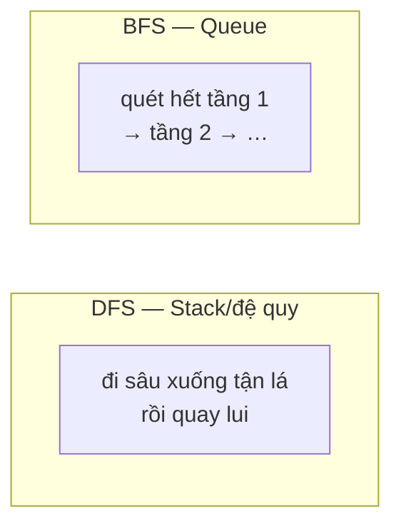

# Tree — Cây

> [!summary] TL;DR
> **Tree** = cấu trúc **phân cấp** (hierarchical) gồm các **node** nối nhau bằng cạnh, không có chu trình. Có **đúng một root** (gốc, không có cha); mỗi node có 0+ **con (child)**; node không con là **leaf (lá)**; hai node cùng cha là **sibling (anh em)**. **Binary tree** = mỗi node tối đa **2 con** (trái/phải). Duyệt cây có 2 nhóm: **DFS** (pre/in/post-order, dùng đệ quy/stack) và **BFS** (theo tầng, dùng queue). Cây mô hình hóa tự nhiên: cây thư mục, DOM, cây quyết định, tổ chức công ty.

---

## 1. Thuật ngữ cây (BẮT BUỘC nhớ)



| Thuật ngữ | Định nghĩa |
|-----------|-----------|
| **Root node** (gốc) | Node **bắt đầu** của cây — **không có cha** |
| **Parent node** (cha) | Node **tham chiếu** tới node khác |
| **Child node** (con) | Node **được** node khác tham chiếu tới |
| **Leaf node** (lá) | Node **không có con** nào |
| **Sibling** (anh em) | Hai node con **cùng một cha** |
| **Edge** (cạnh) | Liên kết cha–con |
| **Depth** (độ sâu) | Số cạnh từ root tới node đó |
| **Height** (chiều cao) | Số cạnh từ node tới leaf xa nhất |
| **Subtree** (cây con) | Một node + toàn bộ con cháu của nó |

> Ở ví dụ trên: `A` là root; `D, E, F` là leaf; `D` và `E` là sibling; chiều cao cây = 2.

---

## 2. Binary Tree — cây nhị phân

> **Binary tree** = cây mà mỗi node có **tối đa 2 con**: con trái (left) và con phải (right).

```python
class TreeNode:
    def __init__(self, data):
        self.data = data
        self.left = None      # con trái
        self.right = None     # con phải
```

Một vài loại binary tree:
- **Full**: mỗi node có **0 hoặc 2** con.
- **Complete**: lấp đầy từ trái sang phải, các tầng trên đầy (cơ sở của [[09-Heap-Priority-Queue|Heap]]).
- **Balanced**: chênh lệch chiều cao 2 cây con ≤ 1 → giữ thao tác **O(log n)**.

---

## 3. Duyệt cây (Traversal)

### DFS — Depth First Search (đi sâu trước)
Dùng **đệ quy** (ngầm là [[05-Stack-va-Queue|stack]]). 3 thứ tự, khác nhau ở chỗ **thăm node gốc lúc nào**:

| Kiểu | Thứ tự | Ghi nhớ |
|------|--------|---------|
| **Pre-order** | **Node** → Trái → Phải | "gốc trước" — copy cây, in cây thư mục |
| **In-order** | Trái → **Node** → Phải | với [[08-Binary-Search-Tree|BST]] cho ra **dãy đã sort** |
| **Post-order** | Trái → Phải → **Node** | "gốc sau" — xóa cây, tính kích thước thư mục |

```python
def pre_order(node):
    if node:
        print(node.data)        # thăm gốc TRƯỚC
        pre_order(node.left)
        pre_order(node.right)

def in_order(node):
    if node:
        in_order(node.left)
        print(node.data)        # thăm gốc GIỮA
        in_order(node.right)

def post_order(node):
    if node:
        post_order(node.left)
        post_order(node.right)
        print(node.data)        # thăm gốc SAU
```

### BFS — Breadth First Search (đi rộng/theo tầng)
Dùng **queue** ([[05-Stack-va-Queue|FIFO]]): thăm hết tầng này rồi xuống tầng dưới.

```python
from collections import deque

def bfs(root):
    if not root:
        return
    q = deque([root])
    while q:
        node = q.popleft()       # lấy đầu queue
        print(node.data)
        if node.left:  q.append(node.left)
        if node.right: q.append(node.right)
```



> [!question] Phỏng vấn: "DFS dùng cấu trúc gì, BFS dùng gì?"
> **DFS dùng Stack** (hoặc đệ quy — vì call stack chính là stack); **BFS dùng Queue**. Mẹo nhớ: muốn **đi sâu** thì LIFO (luôn xử lý node vừa thêm); muốn **lan tỏa theo tầng** thì FIFO (xử lý theo thứ tự vào). In-order trên **BST** cho ra dãy **tăng dần** — câu hỏi rất hay gặp.

---

## 4. Big-O & ứng dụng

| Thao tác | Cây cân bằng | Cây suy biến (lệch như linked list) |
|----------|--------------|-------------------------------------|
| Tìm / chèn / xóa (BST) | **O(log n)** | O(n) |
| Duyệt toàn bộ | O(n) | O(n) |

**Ứng dụng:** cây thư mục/file, **DOM** HTML, cây quyết định (AI/ML), cây cú pháp (compiler), [[08-Binary-Search-Tree|BST]] để tra cứu nhanh, [[09-Heap-Priority-Queue|Heap]] cho priority queue.

```
★ Insight ─────────────────────────────────────
• Tree là Linked List "phân nhánh": thay vì 1 con trỏ next, mỗi
  node có nhiều con trỏ con. Mất tính tuyến tính, được tính phân
  cấp — hợp với mọi dữ liệu "lồng nhau".
• 3 kiểu DFS chỉ khác Ở CHỖ đặt câu lệnh "thăm node" trước/giữa/sau
  2 lời gọi đệ quy. Hiểu điều này là thuộc luôn cả 3.
• "In-order trên BST = sorted" là cầu nối đẹp giữa cấu trúc cây và
  bài toán sắp xếp — gốc của tree sort O(n log n).
─────────────────────────────────────────────────
```

---

## Tự kiểm tra

1. Định nghĩa root / parent / child / leaf / sibling.
2. Binary tree khác tree thường ở điểm nào? Complete tree là gì?
3. Nêu 3 kiểu duyệt DFS và thứ tự thăm node của mỗi kiểu.
4. DFS dùng cấu trúc dữ liệu gì? BFS dùng gì? Vì sao?
5. In-order traversal trên BST cho ra dãy thế nào?

---

## Liên quan
- [[04-Linked-List]] — tree là "linked list phân nhánh"
- [[08-Binary-Search-Tree]] — cây nhị phân có thứ tự
- [[09-Heap-Priority-Queue]] — cây nhị phân đặc biệt
- [[10-Graph]] — tree là trường hợp đặc biệt của graph (không chu trình)
