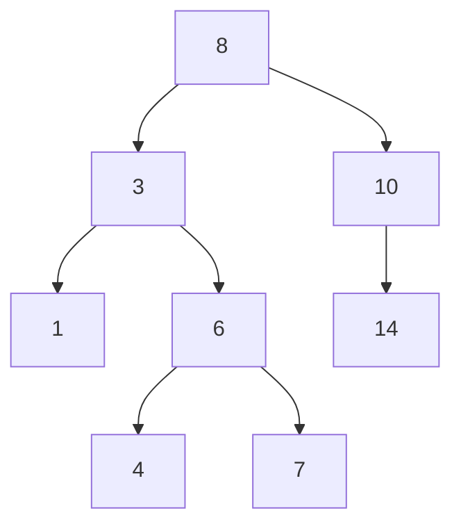
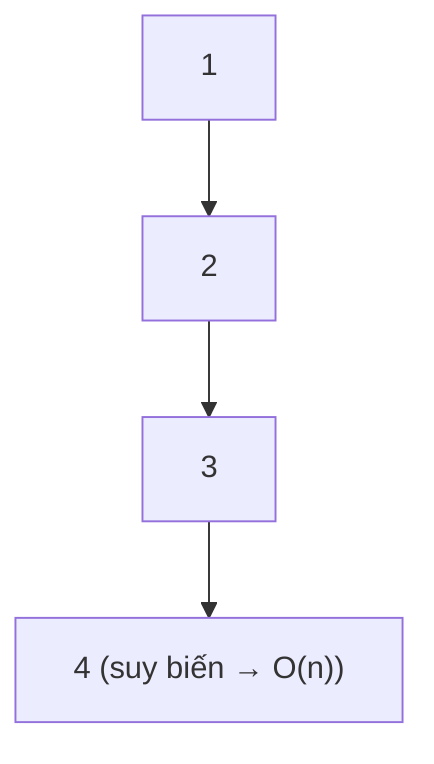

# Binary Search Tree (BST)

> [!summary] TL;DR
> **BST** = binary tree có **quy tắc thứ tự**: với mọi node, **con trái < node < con phải**. Nhờ đó tìm/chèn/xóa chỉ cần đi **một nhánh** (loại nửa cây mỗi bước) → **O(log n)** khi cây **cân bằng**. **In-order traversal** của BST cho ra **dãy tăng dần**. Điểm yếu: nếu chèn dữ liệu **đã sort**, cây **suy biến** thành linked list → tụt về **O(n)**; khắc phục bằng cây **tự cân bằng** (AVL, Red-Black).

---

## 1. Quy tắc BST

> Với **mỗi** node: mọi giá trị bên **cây con trái** đều **nhỏ hơn** node; mọi giá trị bên **cây con phải** đều **lớn hơn** node.



→ Trái `8` toàn số < 8 (`3,1,6,4,7`); phải `8` toàn số > 8 (`10,14`). Quy tắc đúng **đệ quy** ở mọi node.

---

## 2. Tìm kiếm — O(log n)

Bắt đầu từ root, so giá trị: nhỏ hơn → đi **trái**, lớn hơn → đi **phải**. Mỗi bước **loại nửa cây** (giống [[13-Searching|binary search]] nhưng trên cây).

```python
def search(node, target):
    if node is None or node.data == target:
        return node
    if target < node.data:
        return search(node.left, target)    # đi trái
    else:
        return search(node.right, target)   # đi phải
```

---

## 3. Chèn & Xóa

**Chèn:** đi xuống như tìm kiếm tới khi gặp chỗ trống (None) thì gắn node mới — luôn thành **leaf**.

```python
def insert(node, data):
    if node is None:
        return TreeNode(data)
    if data < node.data:
        node.left = insert(node.left, data)
    elif data > node.data:
        node.right = insert(node.right, data)
    return node
```

**Xóa** có 3 trường hợp:
| Trường hợp | Cách xử lý |
|------------|-----------|
| Node **lá** | Xóa thẳng |
| Node có **1 con** | Nối cha với đứa con duy nhất |
| Node có **2 con** | Thay bằng **in-order successor** (node nhỏ nhất của cây con phải), rồi xóa successor |

---

## 4. Big-O & điểm yếu suy biến

| Thao tác | Cân bằng | Suy biến (lệch) |
|----------|----------|-----------------|
| Search / Insert / Delete | **O(log n)** | **O(n)** ❌ |

> [!warning] Cây suy biến
> Nếu chèn dữ liệu **đã sort** (1,2,3,4,5…), mỗi node chỉ có con phải → cây thành **đường thẳng** = linked list → mọi thao tác **O(n)**.



**Khắc phục:** cây **tự cân bằng** — **AVL tree** (cân bằng nghiêm ngặt), **Red-Black tree** (cân bằng nới lỏng, dùng trong `std::map` C++, `TreeMap` Java) — tự xoay (rotation) để giữ chiều cao ~log n.

> [!question] Phỏng vấn: "BST vs Hash Table, khi nào chọn cái nào?"
> **Hash table** ([[06-Dictionary-Hash-Table]]): tra cứu **O(1)** trung bình nhưng **không có thứ tự**. **BST**: tra cứu **O(log n)** nhưng **giữ thứ tự** → làm được **range query** (tìm mọi key trong [a,b]), **min/max**, **kế tiếp/liền trước**, duyệt tăng dần (in-order). Cần thứ tự → BST; chỉ cần tra nhanh → hash.

```
★ Insight ─────────────────────────────────────
• BST là "binary search được vật chất hóa thành cấu trúc": mỗi bước
  loại nửa cây = mỗi bước binary search loại nửa mảng. Cùng tư duy
  chia đôi → cùng O(log n).
• Sức mạnh độc quyền của BST so với hash là DUY TRÌ THỨ TỰ — đó là
  lý do nó tồn tại dù hash nhanh hơn. Range query, min/max, successor
  là nơi hash bó tay.
• "Cân bằng" là sống còn: BST không cân bằng = linked list trá hình.
  Đây là lý do thực tế người ta dùng AVL/Red-Black, hiếm khi BST trần.
─────────────────────────────────────────────────
```

---

## Tự kiểm tra

1. Phát biểu quy tắc thứ tự của BST.
2. Tìm kiếm trong BST cân bằng có Big-O bao nhiêu? Vì sao?
3. Khi nào BST suy biến thành O(n)? Cách khắc phục?
4. Xóa một node có 2 con xử lý thế nào (in-order successor)?
5. BST khác Hash Table ở khả năng nào mà hash không có?

---

## Liên quan
- [[07-Tree]] — nền tảng cây & traversal
- [[13-Searching]] — binary search (cùng tư duy)
- [[06-Dictionary-Hash-Table]] — so sánh BST vs hash
