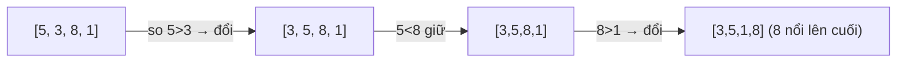
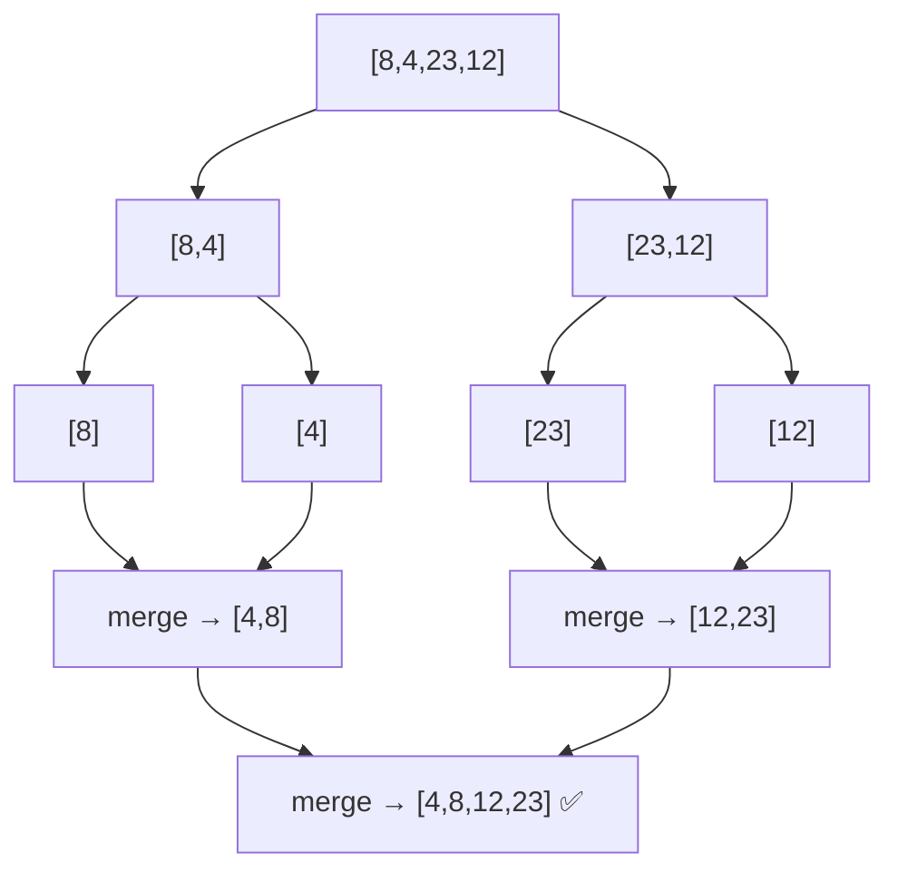
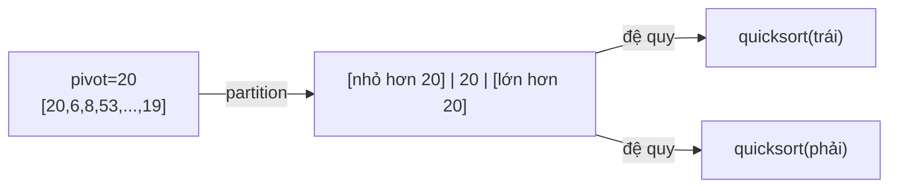

# Sorting — Thuật toán sắp xếp

> [!summary] TL;DR
> Sắp xếp đưa tập dữ liệu về **một thứ tự** — vừa để hiển thị cho người dùng, vừa để app xử lý hiệu quả hơn (vd lọc theo khoảng). **Bubble sort**: so sánh cặp kề nhau & hoán đổi, đơn giản nhưng **O(n²)** — chỉ để dạy học. **Merge sort**: chia để trị bằng đệ quy, gộp 2 mảng đã sort, **O(n log n)** nhưng **tốn bộ nhớ phụ O(n)**. **Quick sort**: chọn **pivot**, phân hoạch quanh pivot, **O(n log n)** trung bình, sort **in-place** (ít RAM) nhưng **worst-case O(n²)** khi mảng đã gần sort. Ngôn ngữ hiện đại đã có sort sẵn — học để **hiểu & chọn đúng**.

---

## 1. Vì sao cần sort?

- **Hiển thị:** người dùng app bất động sản muốn xem nhà theo giá tăng dần.
- **Hiệu quả xử lý:** nếu dữ liệu đã sort, app lọc theo khoảng giá / **binary search** nhanh hơn nhiều ([[09-Searching]]).

3 thuật toán đại diện 3 cách tiếp cận: Bubble (ngây thơ), Merge & Quick (divide & conquer).

---

## 2. Bubble Sort — O(n²)

So sánh **2 phần tử kề nhau**, nếu cái trước lớn hơn thì **hoán đổi**. Lặp đi lặp lại; sau mỗi vòng, phần tử lớn nhất "nổi" lên cuối (như bọt khí).



```python
def bubble_sort(data):
    for i in range(len(data) - 1, 0, -1):   # vùng xét co dần
        for j in range(i):                  # so cặp kề nhau
            if data[j] > data[j + 1]:
                data[j], data[j + 1] = data[j + 1], data[j]  # swap
    return data
```

> **2 vòng `for` lồng nhau → O(n²).** Bubble sort còn không biết "mảng đã sort xong" nên vẫn chạy hết các vòng → kém. Chỉ dùng làm công cụ dạy học.

---

## 3. Merge Sort — O(n log n)

**Divide & conquer:** chia mảng đôi liên tục tới khi còn **mảng 1 phần tử** (mặc nhiên đã sort), rồi **gộp (merge)** ngược lên thành mảng lớn vẫn sort.



**Chìa khóa = bước merge:** so phần tử đầu của 2 mảng đã sort, lấy cái nhỏ hơn bỏ vào kết quả, dịch index — lặp tới hết.

```python
def merge_sort(dataset):
    if len(dataset) > 1:
        mid = len(dataset) // 2
        left = dataset[:mid]
        right = dataset[mid:]
        merge_sort(left)               # đệ quy nửa trái
        merge_sort(right)              # đệ quy nửa phải

        i = j = k = 0
        while i < len(left) and j < len(right):    # bước merge
            if left[i] < right[j]:
                dataset[k] = left[i]; i += 1
            else:
                dataset[k] = right[j]; j += 1
            k += 1
        while i < len(left):           # copy phần dư bên trái
            dataset[k] = left[i]; i += 1; k += 1
        while j < len(right):          # copy phần dư bên phải
            dataset[k] = right[j]; j += 1; k += 1
    return dataset
```

> Merge sort **cần bộ nhớ phụ O(n)** (tạo `left`/`right`). Đây là cái giá cho sự ổn định.

---

## 4. Quick Sort — O(n log n) trung bình, in-place

Cũng divide & conquer + đệ quy, nhưng **mọi việc xảy ra ở bước phân hoạch (partition)**, sort **tại chỗ** không cần mảng phụ.

**Cơ chế:** chọn một **pivot** (vd phần tử đầu). Dùng 2 index chạy từ 2 phía: trái tiến tới khi gặp giá trị **> pivot**, phải lùi tới khi gặp giá trị **< pivot**, rồi **hoán đổi**. Khi 2 index cắt nhau → đổi pivot vào điểm chia. Giờ trái < pivot < phải. **Đệ quy** lên 2 nửa.



```python
def quicksort(data, first, last):
    if first < last:
        pivot_idx = partition(data, first, last)
        quicksort(data, first, pivot_idx - 1)    # đệ quy trái
        quicksort(data, pivot_idx + 1, last)     # đệ quy phải

def partition(data, first, last):
    pivot = data[first]
    lower, upper = first + 1, last
    done = False
    while not done:
        while lower <= upper and data[lower] <= pivot:
            lower += 1
        while data[upper] >= pivot and upper >= lower:
            upper -= 1
        if upper < lower:
            done = True
        else:
            data[lower], data[upper] = data[upper], data[lower]
    data[first], data[upper] = data[upper], data[first]   # pivot vào chỗ
    return upper
```

> **Worst-case O(n²)** khi mảng **đã sort/gần sort** và pivot chọn dở (vd luôn lấy phần tử đầu) → phân hoạch lệch.

---

## 5. Bảng so sánh

| | Bubble | Merge | Quick |
|---|--------|-------|-------|
| Big-O trung bình | O(n²) | **O(n log n)** | **O(n log n)** |
| Big-O worst | O(n²) | O(n log n) | **O(n²)** |
| Bộ nhớ phụ | O(1) | **O(n)** ❌ | **O(log n)** (in-place) ✅ |
| Kỹ thuật | So cặp kề | Divide & conquer (merge) | Divide & conquer (partition) |
| Việc chính ở | mỗi lần swap | **bước merge** | **bước partition** |
| Dùng khi | Dạy học | Cần ổn định, RAM dư | Mặc định, RAM hạn chế |

> [!question] Phỏng vấn: "Merge ở đâu, Quick ở đâu?"
> Trong **Merge sort**, mảng được chẻ "ngây thơ" rồi **mọi công sức nằm ở bước GỘP**. Trong **Quick sort** ngược lại — **mọi công sức ở bước PHÂN HOẠCH** (đặt nhỏ-trái/lớn-phải quanh pivot), bước gộp chẳng làm gì vì đã sort in-place. Đây là câu hỏi "bẫy" rất hay gặp.

```
★ Insight ─────────────────────────────────────
• Bubble sort dạy ta dấu hiệu O(n²): "for lồng for". Nó còn minh họa
  điểm yếu "không biết khi nào xong" — bài học về thuật toán không
  tận dụng thông tin sẵn có.
• Merge vs Quick là đánh đổi THỜI GIAN ổn định ↔ BỘ NHỚ: Merge luôn
  O(n log n) nhưng tốn RAM; Quick tiết kiệm RAM, thường nhanh hơn,
  nhưng có gót chân Achilles O(n²). Chọn pivot ngẫu nhiên/median
  giúp Quick né worst-case.
• Thực tế bạn HIẾM KHI tự viết sort (ngôn ngữ có sẵn — Python dùng
  Timsort O(n log n)). Học 3 thuật toán này là để ĐỌC HIỂU & CHỌN,
  và vì chúng là bài thi/phỏng vấn kinh điển.
─────────────────────────────────────────────────
```

---

## Tự kiểm tra

1. Vì sao bubble sort là O(n²)? Dấu hiệu nào trong code báo điều đó?
2. Merge sort "chia để trị" thế nào? Bước nào làm phần lớn công việc?
3. Pivot trong quick sort là gì? Khi nào quick sort tụt xuống O(n²)?
4. Merge và Quick cùng O(n log n) — khác nhau ở space ra sao?
5. Viết lại bước merge (gộp 2 mảng đã sort) bằng lời.

---

## Liên quan
- [[07-De-quy-Recursion]] — nền tảng cho merge & quick
- [[02-Do-phuc-tap-Big-O]] — vì sao O(n²) vs O(n log n)
- [[09-Searching]] — sort xong để binary search
