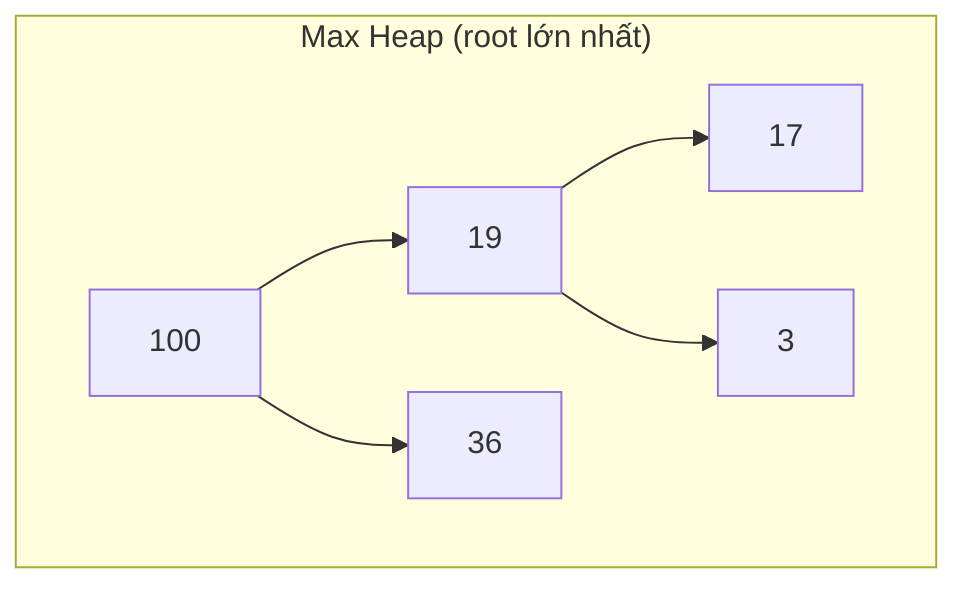

# Heap & Priority Queue

> [!summary] TL;DR
> **Heap** = cấu trúc cài bằng **complete binary tree** giữ một **heap property**: **max heap** → mỗi cha **≥** con (root là **lớn nhất**); **min heap** → mỗi cha **≤** con (root là **nhỏ nhất**). Lấy phần tử lớn/nhỏ nhất là **O(1)** (xem root); chèn/xóa root là **O(log n)** (sift up/down). Heap là cách hiện thực **Priority Queue** (hàng đợi lấy ra theo độ ưu tiên chứ không theo thứ tự vào). Heap còn là nền của **Heap sort O(n log n)**. Thường lưu bằng **mảng**, không cần con trỏ.

---

## 1. Heap property

> **Heap** = một **complete binary tree** (lấp đầy trái→phải) thỏa:
> - **Max heap:** giá trị mỗi node **≥** giá trị các con → **root = lớn nhất**.
> - **Min heap:** giá trị mỗi node **≤** giá trị các con → **root = nhỏ nhất**.



> Lưu ý: heap **không** sort toàn bộ như BST — chỉ đảm bảo quan hệ **cha–con**. Anh em (sibling) không có thứ tự với nhau.

---

## 2. Lưu heap bằng mảng (không cần pointer)

Vì là complete tree, heap map gọn vào **array**: node ở index `i` thì
- con trái = `2i + 1`, con phải = `2i + 2`, cha = `(i-1) // 2`.

```
        100              index: 0   1   2   3   4
       /    \            array: [100, 19, 36, 17, 3]
     19      36
    /  \
  17    3
```

---

## 3. Thao tác & Big-O

| Thao tác | Big-O | Cách làm |
|----------|-------|----------|
| **Peek** (xem max/min) | **O(1)** | Đọc root (array[0]) |
| **Insert** (push) | **O(log n)** | Thêm cuối → **sift up** (đổi với cha tới khi đúng heap property) |
| **Extract** (pop max/min) | **O(log n)** | Lấy root → đưa phần tử cuối lên root → **sift down** |

```python
import heapq            # Python: heapq là MIN heap

h = []
heapq.heappush(h, 5)
heapq.heappush(h, 1)
heapq.heappush(h, 3)
print(heapq.heappop(h))   # 1 (nhỏ nhất) — O(log n)

# Muốn MAX heap: đẩy giá trị ÂM
heapq.heappush(h, -x)     # rồi -heapq.heappop(h)
```

---

## 4. Priority Queue — hàng đợi ưu tiên

> **Priority Queue** = hàng đợi mà phần tử lấy ra theo **độ ưu tiên** (cao nhất/thấp nhất trước), **không** theo thứ tự vào như [[05-Stack-va-Queue|queue FIFO]] thường.

Heap là cách cài priority queue hiệu quả nhất. Ứng dụng: lập lịch CPU, **Dijkstra** tìm đường ngắn nhất ([[10-Graph]]), nén **Huffman**, lấy "top K phần tử lớn nhất".

| | Queue thường (FIFO) | Priority Queue |
|---|---------------------|----------------|
| Lấy ra theo | Thứ tự **vào** | **Độ ưu tiên** |
| Cài bằng | deque | **heap** |

---

## 5. Heap Sort — O(n log n)

Dùng heap để sort: (1) build heap từ mảng, (2) liên tục **extract** root (max) đưa về cuối.

```python
import heapq
def heap_sort(data):
    heapq.heapify(data)                       # O(n) build min heap
    return [heapq.heappop(data) for _ in range(len(data))]  # n × O(log n)
```

> [!question] Phỏng vấn: "Heap khác BST chỗ nào?"
> **BST** sort **toàn bộ** (trái<gốc<phải) → tra cứu giá trị bất kỳ O(log n), in-order ra dãy sorted. **Heap** **chỉ** đảm bảo root là max/min, anh em vô thứ tự → **không** tra cứu giá trị bất kỳ hiệu quả, nhưng lấy max/min cực nhanh **O(1)** và luôn **cân bằng** (complete tree). Cần "lấy phần tử ưu tiên nhất liên tục" → heap; cần "tra cứu/duyệt có thứ tự" → BST.

```
★ Insight ─────────────────────────────────────
• Heap đánh đổi "thứ tự toàn cục" (như BST) để lấy "luôn cân bằng +
  truy cập đỉnh O(1)". Nó là cấu trúc tối ưu cho đúng MỘT câu hỏi:
  "phần tử ưu tiên nhất là gì?" hỏi đi hỏi lại.
• Mẹo lưu heap bằng MẢNG (không pointer) nhờ tính complete tree là
  ví dụ đẹp: chọn đúng cách biểu diễn giúp tiết kiệm bộ nhớ + truy
  cập cha/con bằng phép tính index O(1).
• Python heapq là MIN heap — muốn max heap thì đẩy số âm. Bẫy phỏng
  vấn/thực hành rất hay quên.
─────────────────────────────────────────────────
```

---

## Tự kiểm tra

1. Phát biểu heap property của max heap và min heap.
2. Vì sao peek max/min là O(1) nhưng insert/extract là O(log n)?
3. Heap lưu bằng mảng: con trái/phải/cha của index `i` tính sao?
4. Priority queue khác queue FIFO thường ở điểm gì? Cài bằng gì?
5. Heap khác BST ở chỗ nào? Mỗi cái mạnh ở bài toán nào?

---

## Liên quan
- [[07-Tree]] — heap là complete binary tree
- [[05-Stack-va-Queue]] — priority queue vs FIFO queue
- [[12-Sorting]] — heap sort
- [[10-Graph]] — Dijkstra dùng priority queue
