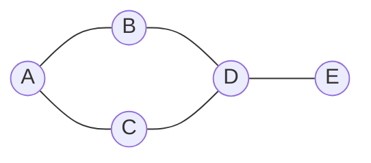

# Graph — Đồ thị

> [!summary] TL;DR
> **Graph** = tập **đỉnh (vertex/node)** nối nhau bằng **cạnh (edge)**. Khác tree: graph **có thể có chu trình** và không có gốc cố định (**tree là graph đặc biệt: liên thông, không chu trình**). Phân loại: **vô hướng/có hướng** (directed), **có trọng số/không**. Hai cách biểu diễn: **adjacency list** (tiết kiệm khi thưa) và **adjacency matrix** (tra cạnh O(1) nhưng tốn O(V²)). Duyệt: **BFS** (queue — tìm đường ngắn nhất theo số cạnh) và **DFS** (stack/đệ quy). Đường ngắn nhất có trọng số: **Dijkstra** (dùng priority queue).

> [!note] Ghi chú nguồn
> Phần Graph **không có** trong transcript LinkedIn gốc, được bổ sung vì là nội dung **chuẩn** của mọi kỳ thi DSA.

---

## 1. Khái niệm & phân loại



| Tiêu chí | Loại 1 | Loại 2 |
|----------|--------|--------|
| Hướng cạnh | **Undirected** (vô hướng, A–B đi 2 chiều) | **Directed** (có hướng, A→B một chiều) |
| Trọng số | **Unweighted** | **Weighted** (cạnh có "chi phí") |
| Chu trình | **Acyclic** (không chu trình, vd **DAG**) | **Cyclic** |

> **Tree = graph liên thông, không chu trình, có gốc.** Mọi tree là graph; không phải graph nào cũng là tree.

---

## 2. Hai cách biểu diễn

| | Adjacency List | Adjacency Matrix |
|---|----------------|------------------|
| Cấu trúc | dict/mảng: mỗi đỉnh → list hàng xóm | ma trận V×V, `[i][j]=1` nếu có cạnh |
| Bộ nhớ | **O(V + E)** — tốt khi đồ thị **thưa** | **O(V²)** — tốn khi thưa |
| Kiểm tra "có cạnh u–v?" | O(bậc của u) | **O(1)** ✅ |
| Duyệt hàng xóm | Nhanh | O(V) |

```python
# Adjacency list
graph = {
    "A": ["B", "C"],
    "B": ["A", "D"],
    "C": ["A", "D"],
    "D": ["B", "C", "E"],
    "E": ["D"],
}
```

---

## 3. Duyệt đồ thị: BFS & DFS

Khác cây: graph **có chu trình** → phải nhớ **visited** để khỏi lặp vô hạn.

**BFS** (queue) — lan theo tầng, cho **đường ngắn nhất theo số cạnh** (đồ thị không trọng số):

```python
from collections import deque
def bfs(graph, start):
    visited = {start}
    q = deque([start])
    while q:
        node = q.popleft()
        print(node)
        for nb in graph[node]:
            if nb not in visited:
                visited.add(nb)
                q.append(nb)
```

**DFS** (stack/đệ quy) — đâm sâu một nhánh rồi quay lui:

```python
def dfs(graph, node, visited=None):
    if visited is None:
        visited = set()
    visited.add(node)
    print(node)
    for nb in graph[node]:
        if nb not in visited:
            dfs(graph, nb, visited)
```

| | BFS | DFS |
|---|-----|-----|
| Cấu trúc | **Queue** (FIFO) | **Stack**/đệ quy (LIFO) |
| Mạnh ở | Đường ngắn nhất (số cạnh), tìm theo tầng | Phát hiện chu trình, topo sort, đường đi/connectivity |
| Big-O | O(V + E) | O(V + E) |

---

## 4. Đường ngắn nhất & thuật toán kinh điển

| Thuật toán | Bài toán | Ghi chú |
|------------|----------|---------|
| **BFS** | Đường ngắn nhất **không trọng số** | O(V+E) |
| **Dijkstra** | Đường ngắn nhất **trọng số không âm** | Dùng **priority queue** ([[09-Heap-Priority-Queue]]) |
| **Bellman-Ford** | Có trọng số **âm** | Chậm hơn, phát hiện chu trình âm |
| **Topological sort** | Sắp thứ tự DAG (task có phụ thuộc) | Dựa trên DFS |

> [!question] Phỏng vấn: "BFS hay DFS để tìm đường ngắn nhất?"
> Trên đồ thị **không trọng số** → **BFS** (lan theo tầng, lần đầu chạm đích là ngắn nhất theo số cạnh). DFS **không** đảm bảo ngắn nhất. Có **trọng số** → cần **Dijkstra** (BFS có ưu tiên bằng heap). Đây là câu hỏi phân biệt rất hay gặp.

```
★ Insight ─────────────────────────────────────
• Graph là tổng quát hóa của mọi cấu trúc đã học: linked list là
  graph đường thẳng, tree là graph không chu trình. Hiểu graph là
  có "khung nhìn" thống nhất cho tất cả.
• BFS↔Queue, DFS↔Stack lặp lại y hệt như duyệt cây ([[07-Tree]]) —
  chỉ thêm tập visited vì graph có chu trình. Một mẫu tư duy, dùng
  ở cả cây lẫn đồ thị.
• Chọn biểu diễn theo MẬT ĐỘ: đồ thị thưa (mạng xã hội, bản đồ
  đường) → adjacency list; đồ thị dày / cần tra cạnh O(1) → matrix.
─────────────────────────────────────────────────
```

---

## Tự kiểm tra

1. Graph khác Tree ở điểm cốt lõi nào? Tree có phải graph không?
2. Adjacency list vs matrix: bộ nhớ và tra cạnh khác nhau ra sao?
3. Vì sao duyệt graph cần tập `visited` mà duyệt tree thì không?
4. BFS dùng cấu trúc gì, DFS dùng gì? Cái nào cho đường ngắn nhất (không trọng số)?
5. Đồ thị có trọng số dương → dùng thuật toán nào tìm đường ngắn nhất?

---

## Liên quan
- [[07-Tree]] — tree là graph đặc biệt
- [[05-Stack-va-Queue]] — BFS=queue, DFS=stack
- [[09-Heap-Priority-Queue]] — Dijkstra dùng priority queue
