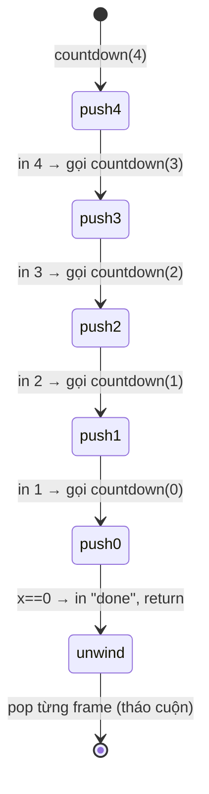

# Đệ quy — Recursion

> [!summary] TL;DR
> **Đệ quy (recursion)** = hàm **tự gọi chính nó** từ bên trong code. Mọi hàm đệ quy **bắt buộc** có **breaking/base condition** (điều kiện dừng) — nếu không sẽ lặp vô hạn và crash (hết bộ nhớ). Mỗi lời gọi lưu lại tham số của lời gọi trước nhờ **call stack** (chính là cấu trúc Stack). Khi chạm base case, các lời gọi **lần lượt return** và call stack được **"tháo cuộn" (unwind)** ngược về đầu. Đệ quy hợp với bài toán **lặp lại cấu trúc nhỏ hơn**: duyệt cây thư mục, sort (merge/quick), factorial.

---

## 1. Đệ quy là gì?

> **Recursion**: hàm tự gọi lại chính nó với bài toán **nhỏ hơn**, cho tới khi đủ nhỏ để giải trực tiếp.

Ví dụ tìm file trong cây thư mục lồng nhau (không biết sâu bao nhiêu cấp): với mỗi item, nếu là file cần tìm → xong; nếu là thư mục → **lặp lại chính logic đó** lên thư mục con. Tái dùng logic = đệ quy tự nhiên.

---

## 2. Hai thành phần BẮT BUỘC

| Thành phần | Vai trò | Quên thì sao |
|------------|---------|--------------|
| **Base case** (breaking condition) | Điều kiện **dừng** đệ quy, trả về trực tiếp | Lặp **vô hạn** → tràn stack → crash |
| **Recursive case** | Hàm tự gọi với bài toán **nhỏ hơn**, tiến dần về base case | Không hội tụ → cũng tràn stack |

> Mỗi lời gọi phải **tiến gần hơn** tới base case (vd `n-1`), nếu không sẽ không bao giờ dừng.

---

## 3. Call stack — trái tim của đệ quy

Mỗi lần gọi hàm, tham số của lời gọi **trước** được **lưu lại** (không bị ghi đè) nhờ **call stack** (đúng là cấu trúc [[05-Stack-va-Queue|Stack]] LIFO).

Ví dụ `countdown(4)`:



```python
def countdown(x):
    if x == 0:           # ← base case
        print("done")
        return
    print(x)
    countdown(x - 1)     # ← recursive case (tiến về 0)

countdown(5)             # 5,4,3,2,1,done
```

> [!tip] Hiểu "unwind": code SAU lời gọi đệ quy
> Nếu thêm `print("hey")` **sau** `countdown(x-1)`, thì các "hey" in ra **sau** khi đã chạm "done" — vì chúng chạy lúc call stack **tháo cuộn ngược lên**. Đây là điểm nhiều người nhầm.

---

## 4. Ví dụ: Power và Factorial

**Power** — `num` mũ `pwr` = nhân `num` với chính nó `pwr` lần:

```python
def power(num, pwr):
    if pwr == 0:                      # base: x^0 = 1
        return 1
    return num * power(num, pwr - 1)  # đệ quy, giảm pwr

power(2, 4)   # 16
```

**Factorial** — `n! = n × (n-1) × … × 1`, đặc biệt `0! = 1`:

```python
def factorial(num):
    if num == 0:                      # base: 0! = 1
        return 1
    return num * factorial(num - 1)   # đệ quy, giảm num

factorial(5)   # 120
```

> Ở factorial, **một** tham số vừa là **giá trị** vừa là **bộ đếm** (vì số lần nhân do chính giá trị quyết định).

---

## 5. Đệ quy vs Vòng lặp & Big-O

| | Đệ quy | Vòng lặp |
|---|--------|----------|
| Cách lặp | Hàm tự gọi | `for`/`while` |
| Bộ nhớ | Tốn **call stack** (mỗi lời gọi 1 frame) | Hằng số |
| Rủi ro | **Stack overflow** nếu quá sâu | Không |
| Phù hợp | Bài toán **chia nhỏ** (cây, divide & conquer) | Lặp tuyến tính đơn giản |

> [!question] Phỏng vấn: "Big-O của hàm đệ quy tính sao?"
> ≈ **số lần hàm được gọi**. `factorial(n)` gọi n+1 lần → **O(n)**. Merge sort chia đôi `log n` tầng × xử lý n mỗi tầng → **O(n log n)**. Mỗi lời gọi cũng tốn **space** trên call stack → đệ quy sâu O(n) tốn O(n) bộ nhớ stack.

```
★ Insight ─────────────────────────────────────
• Đệ quy và Stack là MỘT: máy tính dùng call stack (LIFO) để nhớ
  "đang ở đâu" trong chuỗi lời gọi. Mọi đệ quy đều viết lại được
  bằng vòng lặp + stack thủ công, và ngược lại.
• Base case không chỉ để "dừng" — nó là VIÊN GẠCH đầu tiên. Code
  sau lời gọi đệ quy chạy khi stack THÁO CUỘN, nên thứ tự thực thi
  ngược với thứ tự gọi. Nắm điều này là nắm đệ quy.
• Sức mạnh thật của đệ quy không phải factorial (vòng lặp làm tốt
  hơn) mà là bài toán PHÂN RÃ tự nhiên: cây thư mục, merge/quick
  sort, duyệt đồ thị — nơi viết bằng vòng lặp rất rối.
─────────────────────────────────────────────────
```

---

## Tự kiểm tra

1. Hai thành phần bắt buộc của hàm đệ quy là gì? Thiếu base case thì sao?
2. Call stack là cấu trúc gì? Nó lưu cái gì khi hàm tự gọi?
3. Nếu đặt một `print` **sau** lời gọi đệ quy, nó in ra lúc nào? Vì sao?
4. Viết hàm đệ quy tính `factorial(n)` và giải thích Big-O.
5. Khi nào nên dùng đệ quy thay vòng lặp, và rủi ro của đệ quy là gì?

---

## Liên quan
- [[05-Stack-va-Queue]] — call stack chính là Stack
- [[12-Sorting]] — Merge & Quick sort dùng đệ quy
- [[14-Thuat-toan-ung-dung]] — find max đệ quy
