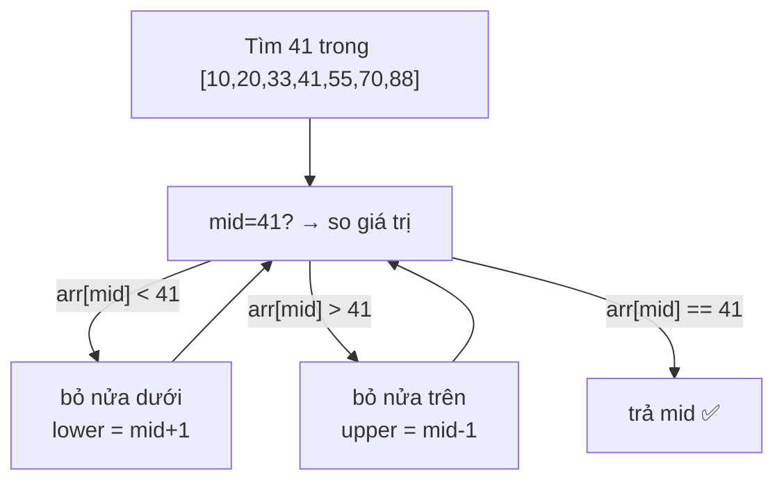

# Searching — Tìm kiếm dữ liệu

> [!summary] TL;DR
> **Linear search** (tìm tuyến tính): duyệt từng phần tử cho tới khi gặp — dùng cho list **chưa sort**, **O(n)**. **Binary search** (tìm nhị phân): chỉ dùng cho list **đã sort** — bắt đầu ở **giữa**, mỗi bước **loại nửa sai**, lặp lại → **O(log n)**, nhanh vượt trội. Quy tắc vàng: list đã sort → luôn binary search. Kiểm tra "list đã sort chưa" là một biến thể linear search, **O(n)**.

---

## 1. Linear Search — list chưa sort, O(n)

List chưa sort thì **không có cách nào** ngoài duyệt từng phần tử.

```python
def find_item(item, item_list):
    for i in range(len(item_list)):
        if item == item_list[i]:
            return i        # tìm thấy → trả index
    return None             # duyệt hết, không có
```

- **Big-O = O(n)** (linear). Thêm gấp đôi phần tử → worst-case mất gấp đôi thời gian.
- Worst-case: phần tử ở **cuối** hoặc **không tồn tại**. Với 1 triệu phần tử → ~1 triệu phép so.
- Mẹo "2 index từ 2 đầu chạy vào giữa" giảm còn ~500k phép so — nhưng **vẫn O(n)** (hằng số không đổi bậc).

---

## 2. Binary Search — list đã sort, O(log n)

Tận dụng thông tin quý: **list đã được sort**. Đặt 2 index (đầu, cuối), tính **midpoint**:
- Nếu `arr[mid]` = giá trị cần → trả `mid`.
- Nếu `arr[mid]` **<** giá trị → bỏ **nửa dưới**, dời `lower = mid + 1`.
- Nếu `arr[mid]` **>** giá trị → bỏ **nửa trên**, dời `upper = mid - 1`.
- Lặp lại tới khi tìm thấy hoặc 2 index **vượt nhau** (không có).



```python
def binary_search(item, item_list):
    lower, upper = 0, len(item_list) - 1
    while lower <= upper:
        mid = (lower + upper) // 2     # floor division
        if item_list[mid] == item:
            return mid
        elif item > item_list[mid]:
            lower = mid + 1            # bỏ nửa dưới
        else:
            upper = mid - 1            # bỏ nửa trên
    return None                        # 2 index vượt nhau → không có
```

> **Mỗi bước loại một nửa** → số bước ≈ `log₂(n)`. List gấp đôi kích thước chỉ tốn thêm **1 phép** → cực kỳ co giãn.

> [!question] Phỏng vấn: "Khi nào dùng linear, khi nào binary?"
> **Binary search yêu cầu list đã sort** — đó là điều kiện tiên quyết. Nếu list **chưa sort** và chỉ tìm 1 lần → **linear** (O(n)) còn rẻ hơn việc sort (O(n log n)) rồi binary. Nhưng nếu **tìm nhiều lần** trên cùng list → **sort 1 lần** rồi binary search nhiều lần sẽ thắng.

---

## 3. Kiểm tra list đã sort chưa — O(n)

Không biết list đã sort hay chưa thì phải **duyệt từng phần tử** → **O(n)**.

```python
def is_sorted(itemlist):
    for i in range(len(itemlist) - 1):
        if itemlist[i] > itemlist[i + 1]:   # tăng dần
            return False
    return True

# Cách "Pythonic" tương đương bằng all() + comprehension:
def is_sorted_py(itemlist):
    return all(itemlist[i] <= itemlist[i + 1]
               for i in range(len(itemlist) - 1))
```

> Tăng dần thì kiểm tra `arr[i] <= arr[i+1]`; giảm dần thì ngược lại.

---

## 4. Bảng so sánh

| | Linear Search | Binary Search |
|---|---------------|---------------|
| Điều kiện | List bất kỳ | List **đã sort** |
| Cách làm | Duyệt từng phần tử | Loại nửa sai mỗi bước |
| Big-O | **O(n)** | **O(log n)** |
| n gấp đôi | thời gian gấp đôi | thêm ~1 phép |
| Khi dùng | Chưa sort / tìm 1 lần | Đã sort / tìm nhiều lần |

```
★ Insight ─────────────────────────────────────
• Binary search là minh họa đẹp nhất của O(log n): "chia đôi không
  gian tìm kiếm mỗi bước". Mọi thuật toán có dạng chia-đôi-dữ-liệu
  đều mang log n trong Big-O.
• Điều kiện "đã sort" chính là THÔNG TIN giúp binary nhanh. Bài học:
  thuật toán giỏi là thuật toán tận dụng tối đa thông tin sẵn có
  (đối lập với bubble sort "mù" ở [[12-Sorting]]).
• Tính toán chi phí TỔNG THỂ: sort O(n log n) + nhiều binary O(log n)
  vs nhiều linear O(n). Tìm 1 lần → linear thắng; tìm vạn lần → sort
  trước rồi binary thắng. Luôn nghĩ theo workload, không theo 1 thao tác.
─────────────────────────────────────────────────
```

---

## Tự kiểm tra

1. Linear search có Big-O bao nhiêu? Best/worst case là gì?
2. Điều kiện tiên quyết của binary search là gì? Vì sao nó là O(log n)?
3. Trong binary search, khi `arr[mid] < target` thì dời index nào, về đâu?
4. List chưa sort, chỉ tìm 1 lần — nên sort rồi binary hay linear luôn? Vì sao?
5. Viết hàm kiểm tra list tăng dần (O(n)).

---

## Liên quan
- [[12-Sorting]] — sort trước để binary search
- [[02-Do-phuc-tap-Big-O]] — O(n) vs O(log n)
- [[03-Array]] — binary search chạy trên array đã sort
