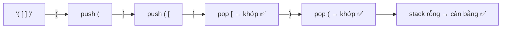

# Thuật toán ứng dụng thực tế

> [!summary] TL;DR
> Gom 4 bài toán **kết hợp cấu trúc dữ liệu + thuật toán** hay ra trong **Practical Test**: (1) **lọc giá trị duy nhất** bằng **Set** — O(n); (2) **đếm tần suất** bằng **Dictionary** (counter) — O(n); (3) **tìm max bằng đệ quy** — O(n); (4) **kiểm tra cân bằng ngoặc** bằng **Stack** — O(n). Mỗi bài cho thấy chọn đúng CTDL biến bài toán "khó" thành vài dòng gọn gàng.

---

## 1. Lọc giá trị duy nhất — Set, O(n)

**Set** chỉ chứa giá trị **duy nhất** → khử trùng tự nhiên.

```python
# Khử trùng list
items = ["apple", "pear", "apple", "orange", "pear"]
unique = set()
for item in items:
    unique.add(item)            # trùng thì bỏ qua
# → {'apple', 'pear', 'orange'}

# Lọc ký tự duy nhất bằng set comprehension (bỏ dấu cách, dấu câu, gộp hoa-thường)
sentence = "The quick brown fox."
unique_chars = {c for c in sentence.lower() if c.isalnum()}
```

**Big-O = O(n):** mỗi phần tử thêm vào set một lần, thêm là O(1) trung bình → tổng O(n).

---

## 2. Đếm tần suất — Dictionary counter, O(n)

Key của dict là **duy nhất** → dùng làm bộ đếm: gặp item thì +1, chưa có thì khởi tạo = 1.

```python
items = ["apple", "pear", "apple", "orange", "apple", "pear"]
counter = {}
for item in items:
    if item in counter:
        counter[item] += 1
    else:
        counter[item] = 1
# → {'apple': 3, 'pear': 2, 'orange': 1}
```

> [!tip] Pythonic
> `collections.Counter(items)` làm đúng việc này một dòng. Nhưng phỏng vấn thường yêu cầu **tự cài** để chứng minh hiểu cơ chế.

**Big-O = O(n):** duyệt mỗi item một lần, tra/cập nhật dict O(1) trung bình.

---

## 3. Tìm max bằng đệ quy — O(n)

So phần tử đầu với **max của phần còn lại** (gọi đệ quy), tới khi list còn 1 phần tử (base case).

```python
def find_max(items):
    if len(items) == 1:              # base: 1 phần tử → chính nó là max
        return items[0]
    val1 = items[0]
    val2 = find_max(items[1:])       # max của phần đuôi
    return val1 if val1 > val2 else val2

find_max([7, 3, 9, 2, 8])   # 9
```

**Big-O = O(n):** mỗi lần gọi xử lý 1 phần tử → n lời gọi. (Ví dụ "có tính minh họa" — đệ quy ở đây không tối ưu hơn vòng lặp, nhưng dạy cách đệ quy hoạt động → xem [[11-De-quy-Recursion]].)

---

## 4. Cân bằng ngoặc bằng Stack — O(n)

Kiểm tra biểu thức có ngoặc `() [] {}` **cân bằng** (mỗi mở có một đóng đúng loại, đúng thứ tự).

**Ý tưởng:** duyệt từng ký tự — gặp ngoặc **mở** thì **push** vào stack; gặp ngoặc **đóng** thì **pop** ra và kiểm tra có khớp loại không. Cuối cùng stack phải **rỗng**.



```python
def is_balanced(statement):
    stack = []
    for c in statement:
        if c in "([{":               # ngoặc mở → push
            stack.append(c)
        elif c in ")]}":             # ngoặc đóng
            if len(stack) == 0:      # không có mở tương ứng
                return False
            test = stack.pop()
            if test == "(" and c != ")": return False
            if test == "[" and c != "]": return False
            if test == "{" and c != "}": return False
    return len(stack) == 0           # còn dư ngoặc mở → không cân bằng
```

> [!question] Phỏng vấn: "Vì sao Stack hợp cho cân bằng ngoặc?"
> Vì tính **LIFO** khớp đúng quy luật lồng ngoặc: ngoặc **mở gần nhất** phải được **đóng trước**. Pop luôn trả ngoặc mở gần nhất → so khớp đúng cặp. Đây là ví dụ kinh điển cho thấy chọn đúng CTDL làm bài toán trở nên hiển nhiên.

**Big-O = O(n):** duyệt mỗi ký tự một lần, push/pop O(1).

```
★ Insight ─────────────────────────────────────
• 4 bài này dạy một tư duy: "khử trùng → Set", "đếm/tra theo khóa →
  Dict", "lồng/đảo thứ tự → Stack", "phân rã → đệ quy". Nhận diện
  ĐÚNG MẪU là bước đầu giải mọi bài thuật toán.
• Cả 4 đều O(n) — chọn đúng CTDL biến bài toán có vẻ O(n²) (vd
  nested loop để khử trùng/đếm) xuống O(n). Đây là giá trị thực
  của việc học CTDL.
• Ranh giới "tự cài vs dùng hàm có sẵn": đi làm thì dùng set(),
  Counter()… cho gọn; đi thi/phỏng vấn thì tự cài để chứng minh
  hiểu cơ chế. Biết cả hai.
─────────────────────────────────────────────────
```

---

## Tự kiểm tra

1. Dùng cấu trúc nào để khử trùng một list? Big-O bao nhiêu?
2. Viết counter đếm tần suất phần tử bằng dict (không dùng `Counter`).
3. Vì sao Stack phù hợp kiểm tra cân bằng ngoặc? Khi nào trả `False`?
4. `find_max` đệ quy có base case là gì? Big-O bao nhiêu?
5. Với mỗi "mẫu" (khử trùng / đếm / lồng ngoặc / phân rã) nêu CTDL tương ứng.

---

## Liên quan
- [[06-Dictionary-Hash-Table]] — Set & Dict
- [[05-Stack-va-Queue]] — Stack cho cân bằng ngoặc
- [[11-De-quy-Recursion]] — find max đệ quy
- [[15-DSA-Cheatsheet]] — tra cứu nhanh
