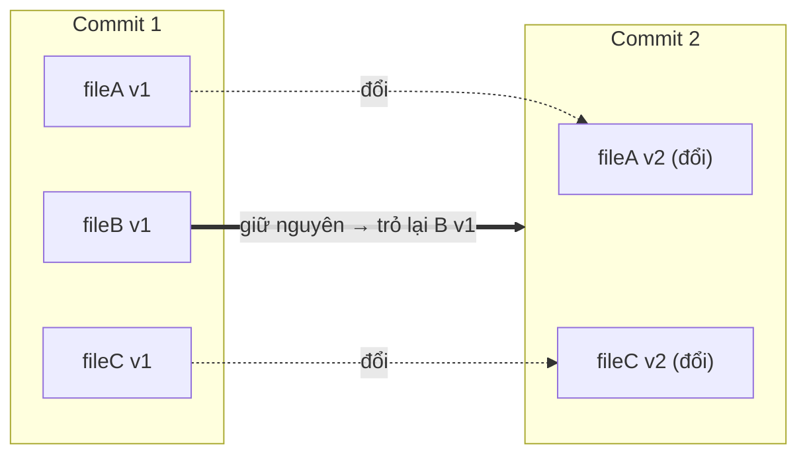
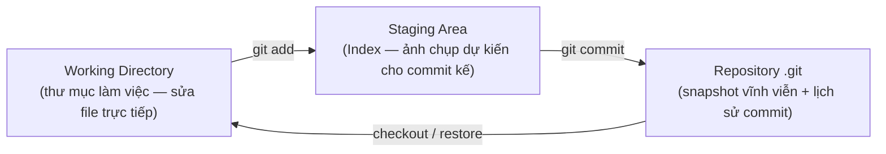
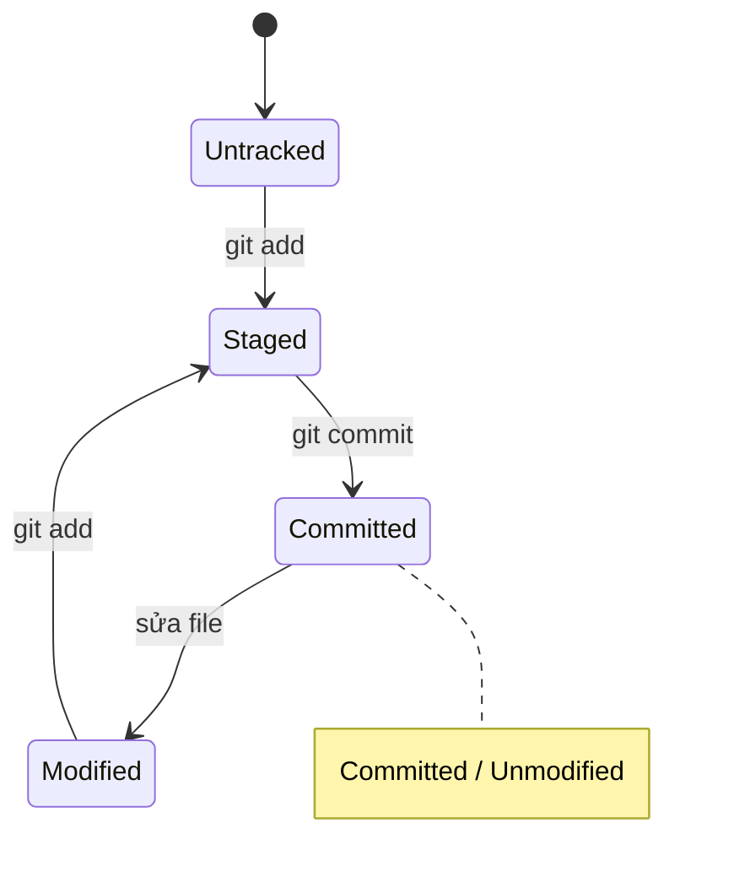
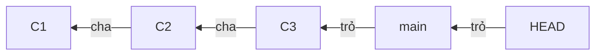

# How Git Works — Git hoạt động thế nào

> [!summary] TL;DR
> **Git** là hệ thống quản lý phiên bản **phân tán** (distributed VCS). Khác với SVN/CVS lưu *thay đổi* (delta) theo từng file, Git lưu **snapshot** (ảnh chụp toàn bộ project) ở mỗi commit. Mỗi snapshot được nhận diện bằng một **hash SHA-1** (40 ký tự). Code của bạn đi qua **3 vùng**: Working Directory → Staging Area (Index) → Repository. `HEAD` là con trỏ chỉ tới commit hiện tại bạn đang đứng.

---

## 1. Version control là gì và tại sao cần?

**Version Control System (VCS)** = hệ thống ghi lại mọi thay đổi của file theo thời gian, để bạn có thể:

- Quay về bất kỳ phiên bản cũ nào (undo "lịch sử").
- Biết **ai** sửa **gì**, **khi nào**, **tại sao** (qua commit message).
- Nhiều người cùng làm trên một codebase mà không đè code lên nhau.
- Thử nghiệm tính năng mới trên **branch** riêng mà không phá code chính.

> [!question] Phỏng vấn: "Centralized vs Distributed VCS khác gì?"
> - **Centralized (SVN, CVS):** chỉ có **một** repo trung tâm trên server. Muốn xem lịch sử / commit đều phải kết nối server. Server chết = cả team kẹt.
> - **Distributed (Git):** **mỗi máy** clone về có **bản sao đầy đủ** cả lịch sử. Làm việc offline được (commit, xem log, tạo branch). Server (GitHub) chỉ là một "remote" để đồng bộ, không phải nơi duy nhất giữ dữ liệu.

---

## 2. Điểm cốt lõi: Git lưu **snapshot**, không lưu **delta**

Đây là khái niệm quan trọng nhất, và là câu hỏi phỏng vấn kinh điển.

| | Cách lưu | Mỗi phiên bản là |
|---|----------|------------------|
| **SVN/CVS (delta-based)** | Lưu file gốc + danh sách **thay đổi** của từng file qua từng phiên bản | Tập hợp các "diff" cộng dồn |
| **Git (snapshot-based)** | Mỗi commit chụp lại **toàn bộ trạng thái** của project tại thời điểm đó | Một "ảnh chụp" hoàn chỉnh |

Nghe có vẻ tốn dung lượng, nhưng Git tối ưu rất khéo: **file nào không đổi giữa 2 commit thì Git không lưu lại bản sao** — nó chỉ lưu một **con trỏ (reference)** tới file y hệt ở commit trước.



```
★ Insight ─────────────────────────────────────
• Vì mỗi commit là một snapshot độc lập + con trỏ, nên thao tác "nhảy" về
  commit cũ (checkout), tạo branch, so sánh phiên bản đều CỰC NHANH — Git chỉ
  cần đổi con trỏ chứ không phải "tua ngược" hàng loạt delta như SVN.
• Đây là lý do gốc khiến branch trong Git "rẻ" (cheap): tạo branch chỉ là tạo
  thêm một con trỏ 41 byte, không sao chép file. Hiểu điều này thì [[05-Branch-Merge-PR]]
  trở nên hiển nhiên.
─────────────────────────────────────────────────
```

---

## 3. Ba vùng làm việc (3 areas) — xương sống của Git

Mọi file trong project Git luôn ở một trong các vùng sau. Hiểu rõ 3 vùng này là hiểu 80% Git.



| Vùng | Là gì | Lệnh đưa vào |
|------|-------|--------------|
| **Working Directory** | Thư mục thật trên ổ đĩa, nơi bạn edit code | (bạn sửa file trực tiếp) |
| **Staging Area** (Index) | Vùng "chờ" — gom các thay đổi bạn *chọn* để đưa vào commit kế tiếp | `git add` |
| **Repository** | Thư mục `.git` ẩn — lưu toàn bộ snapshot + lịch sử | `git commit` |

### Trạng thái của một file



- **Untracked:** file mới, Git chưa từng biết tới.
- **Modified:** file đã được track nhưng vừa bị sửa, chưa stage.
- **Staged:** đã `git add`, đang chờ vào commit.
- **Committed / Unmodified:** đã lưu an toàn vào repo, không khác với bản đã commit.

```
★ Insight ─────────────────────────────────────
• Staging Area là điểm khác biệt lớn nhất của Git so với "Ctrl+S". Nó cho phép
  bạn commit CHỌN LỌC: sửa 5 file nhưng chỉ commit 2 file liên quan tới 1 việc,
  giữ lịch sử sạch. Đây chính là nền của kỹ thuật `git add -p` ở [[07-Staging-chon-loc]].
• Một file có thể đồng thời vừa Staged vừa Modified: bạn add (chụp ảnh), rồi sửa
  tiếp — bản đã staged là ảnh CŨ, phần sửa mới nằm ở working dir. Phải add lại
  thì commit mới có phần mới.
─────────────────────────────────────────────────
```

---

## 4. Commit, HEAD và lịch sử

### Commit là gì?

Một **commit** là một snapshot + metadata:

- **Hash (SHA-1):** mã định danh duy nhất, vd `a1b2c3d...` (thường viết tắt 7 ký tự `a1b2c3d`).
- **Author & committer** + thời gian.
- **Commit message** (mô tả thay đổi).
- **Con trỏ tới (các) commit cha** (parent) — tạo thành chuỗi lịch sử.



### HEAD là gì?

`HEAD` = con trỏ chỉ tới **commit hiện tại bạn đang đứng** (thường là commit mới nhất của branch hiện tại). Khi bạn commit mới, `HEAD` (và branch) tự động dịch lên commit mới.

- `HEAD` → trỏ tới branch hiện tại (vd `main`).
- `HEAD~1` → commit cha (lùi 1 bước). `HEAD~2` → lùi 2 bước.
- `HEAD^` → cũng là commit cha (dùng cho merge nhiều cha: `HEAD^1`, `HEAD^2`).

> [!tip] `HEAD~n` rất hay gặp khi hoàn tác. Ví dụ `git reset --soft HEAD~1` = "lùi HEAD về commit cha, giữ thay đổi" — xem [[09-Hoan-tac-va-sua-lich-su]].

---

## 5. Bên trong `.git` (mức khái niệm)

Khi `git init`, Git tạo thư mục ẩn `.git/` chứa **toàn bộ** database. Git lưu mọi thứ dưới dạng **4 object** (đánh địa chỉ bằng hash):

| Object | Lưu gì |
|--------|--------|
| **blob** | Nội dung một file (không gồm tên file) |
| **tree** | Một "thư mục": ánh xạ tên → blob/tree con |
| **commit** | Trỏ tới một tree (snapshot) + parent + author + message |
| **tag** | Nhãn cố định trỏ tới một commit (vd version release) |

> [!warning] Xóa thư mục `.git/` = **mất toàn bộ lịch sử**, project trở lại thành thư mục thường. Đừng bao giờ xóa `.git` trừ khi bạn cố ý "gỡ" Git khỏi project.

```
★ Insight ─────────────────────────────────────
• Git là một "content-addressable filesystem": nội dung giống nhau → hash giống
  nhau → chỉ lưu MỘT lần. Hai file trùng nội dung ở hai nơi vẫn chỉ tốn 1 blob.
• Vì commit trỏ về parent bằng hash, và hash phụ thuộc TOÀN BỘ nội dung + lịch
  sử trước đó, nên không ai có thể sửa lén một commit cũ mà không làm đổi hash
  của mọi commit sau nó. Đây là tính TOÀN VẸN (integrity) của Git.
─────────────────────────────────────────────────
```

---

## 6. Vòng đời cơ bản (gắn với 3 vùng)

```bash
# 1. Sửa file trong Working Directory  (Modified)
vim index.html

# 2. Đưa thay đổi vào Staging Area      (Staged)
git add index.html

# 3. Lưu snapshot vào Repository        (Committed)
git commit -m "feat: thêm trang chủ"

# Kiểm tra trạng thái bất cứ lúc nào
git status
```

Chi tiết từng lệnh hằng ngày: xem [[03-Daily-Workflow]].

---

## 7. Tự kiểm tra (mini-quiz)

1. Git lưu snapshot hay delta? Khác SVN ở điểm nào? *(snapshot; SVN lưu delta)*
2. Kể tên 3 vùng và lệnh chuyển giữa chúng. *(Working→`add`→Staging→`commit`→Repo)*
3. `HEAD~2` nghĩa là gì? *(commit lùi 2 bước so với HEAD hiện tại)*
4. Vì sao tạo branch trong Git lại "rẻ"? *(chỉ tạo thêm 1 con trỏ, không copy file)*
5. Xóa `.git/` thì mất gì? *(toàn bộ lịch sử & object)*

## Liên quan
- [[00-MOC-Git|⬅ MOC Git]]
- Kế tiếp: [[02-Install-Configure-Git|Install & Configure Git]]
- [[03-Daily-Workflow|Workflow hằng ngày]] · [[05-Branch-Merge-PR|Branch · Merge · PR]]
