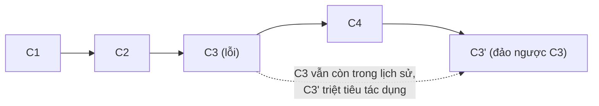

# Hoàn tác & sửa lịch sử — reset · amend · revert

> [!summary] TL;DR
> Câu hỏi quyết định **luôn là: "code đã PUSH lên remote chưa?"** <br>
> • **Chưa push** (local) → tự do sửa: `commit --amend` (sửa commit cuối), `reset` (lùi HEAD), rebase. <br>
> • **Đã push** (người khác có thể đã pull) → **chỉ dùng `git revert`** (tạo commit mới đảo ngược, KHÔNG xóa lịch sử cũ). <br>
> `reset` có 3 chế độ: `--soft` (giữ staged), `--mixed` (mặc định, giữ working), `--hard` (xóa sạch — nguy hiểm). Lỡ tay vẫn cứu được bằng `git reflog`.

---

## 1. Quy tắc nền tảng: local vs đã push

```mermaid
flowchart TD
    Q{"Code đã push<br/>lên remote chưa?"}
    Q -->|CHƯA (local)| A["amend / reset / rebase<br/>(viết lại lịch sử OK)"]
    Q -->|ĐÃ PUSH| B["chỉ git revert<br/>(thêm commit đảo ngược)"]
```

```
★ Insight ─────────────────────────────────────
• Vì sao "đã push thì đừng viết lại lịch sử"? Khi push, hash các commit đã thành
  "điểm neo" chung mà người khác dựa vào. amend/reset/rebase đổi hash → lịch sử
  của họ và của bạn rẽ đôi → khi họ push/pull sẽ loạn, dễ mất commit. revert thì
  không đụng quá khứ, chỉ THÊM một commit mới đảo ngược → ai cũng đồng bộ êm.
• Trước MỌI thao tác hoàn tác, hãy tự hỏi đúng một câu: "tôi đã push chưa?".
  Trả lời được câu này là chọn đúng lệnh 90% trường hợp.
─────────────────────────────────────────────────
```

---

## 2. Sửa thay đổi CHƯA commit

```bash
# Bỏ sửa đổi 1 file ở working dir (về bản đã commit) — MẤT sửa đổi
git restore file
git checkout -- file            # cách cũ, tương đương

# Gỡ file khỏi staging (giữ sửa đổi ở working dir)
git restore --staged file
git reset file                  # cách cũ
```

---

## 3. `git commit --amend` — sửa commit CUỐI (chưa push)

Dùng khi vừa commit xong mà: quên thêm file, gõ sai message, sót một dòng.

```bash
# Quên add 1 file vào commit vừa rồi:
git add file-bi-quen
git commit --amend --no-edit    # gộp vào commit cuối, GIỮ message cũ

# Chỉ sửa message commit cuối:
git commit --amend -m "feat: message đúng"
```

> [!warning] `--amend` **thay thế** commit cuối bằng commit mới (hash khác). Nếu commit cũ đã push, amend rồi push thường sẽ bị từ chối → đừng amend commit đã chia sẻ (hoặc phải `--force-with-lease`, chỉ khi nhánh riêng).

---

## 4. `git reset` — lùi HEAD về commit trước (chủ yếu local)

`reset` dời con trỏ branch/HEAD về một commit cũ. **3 chế độ** khác nhau ở chỗ "đụng" tới Staging và Working Directory hay không — đây là bảng phỏng vấn cực hay hỏi:

| Chế độ | Dời HEAD? | Staging | Working Dir | Dùng khi |
|--------|-----------|---------|-------------|----------|
| `--soft` | ✅ | **giữ** (staged) | **giữ** | Gộp/sửa lại commit, code vẫn staged sẵn |
| `--mixed` *(mặc định)* | ✅ | **bỏ stage** | **giữ** | Lùi commit, xem lại rồi add chọn lọc |
| `--hard` | ✅ | **xóa** | **xóa** | Vứt sạch — ⚠️ MẤT code chưa commit |

```bash
git reset --soft HEAD~1     # bỏ commit cuối, code vẫn nằm trong Staging
git reset HEAD~1            # (--mixed) bỏ commit cuối, code về working dir, chưa stage
git reset --hard HEAD~1    # ⚠️ XÓA commit cuối VÀ mọi thay đổi — không hỏi lại
```

```text
Trước:   C1 ── C2 ── C3 (HEAD, main)

git reset --soft HEAD~1:
         C1 ── C2 (HEAD, main)     [thay đổi của C3 → nằm ở Staging]
git reset --mixed HEAD~1:
         C1 ── C2 (HEAD, main)     [thay đổi của C3 → nằm ở Working Dir, chưa add]
git reset --hard HEAD~1:
         C1 ── C2 (HEAD, main)     [thay đổi của C3 → BIẾN MẤT]
```

### Tình huống điển hình: "lùi commit để làm lại"

```bash
# Vừa commit nhưng muốn sửa thêm rồi commit lại:
git reset --soft HEAD~1     # commit cuối "tan ra", code vẫn staged
# ... sửa thêm ...
git add -p
git commit -m "feat: more text"   # commit lại gọn gàng
```

> [!warning] `git reset --hard` là một trong số ít lệnh Git **thật sự xóa** code chưa commit không qua thùng rác. Hít thở sâu trước khi gõ. May là vẫn có [reflog](#7-cứu-hộ-git-reflog) cứu commit (nhưng không cứu thay đổi chưa từng commit).

---

## 5. `git revert` — hoàn tác AN TOÀN (cho code đã push)

`revert` **không xóa** commit cũ. Nó tạo một commit **mới** có nội dung đảo ngược commit bị lỗi → lịch sử được giữ nguyên, an toàn cho branch chung.

```bash
git log --oneline           # tìm hash commit cần đảo, vd a1b2c3d
git revert a1b2c3d          # tạo commit mới "Revert ..." đảo ngược a1b2c3d
# Git mở editor cho message revert — lưu lại (Vim: :wq) là xong
```



```bash
git revert HEAD             # đảo commit mới nhất
git revert <hash> --no-edit # đảo, dùng message mặc định
git revert -m 1 <merge-hash> # đảo một MERGE commit (chọn cha số 1 làm mạch chính)
```

---

## 6. So sánh reset vs revert vs amend — bảng tổng

| | `amend` | `reset` | `revert` |
|---|---------|---------|----------|
| Tác động | Thay commit **cuối** | Dời HEAD về commit cũ | Thêm commit đảo ngược |
| Sửa lịch sử? | Có (đổi hash) | Có (bỏ commit) | **Không** (chỉ thêm) |
| An toàn khi đã push? | ❌ | ❌ | ✅ |
| Dùng cho | Sửa nhanh commit vừa tạo | Lùi/làm lại local | Hủy tác dụng commit đã chia sẻ |

```
★ Insight ─────────────────────────────────────
• Cùng là "hoàn tác" nhưng 3 lệnh khác bản chất: amend = "viết lại trang cuối",
  reset = "xé vài trang cuối", revert = "viết thêm trang đính chính". Sách (lịch
  sử) đã phát hành (push) thì chỉ được viết thêm trang đính chính.
• Câu hỏi phỏng vấn "undo một commit đã push" — đáp án ĐÚNG luôn là revert, không
  phải reset. Trả lời reset cho commit đã push là tín hiệu chưa nắm chắc Git.
─────────────────────────────────────────────────
```

---

## 7. Cứu hộ: `git reflog`

`git reflog` ghi lại **mọi nơi HEAD từng đứng** (kể cả commit bị reset "mất"). Đây là phao cứu sinh khi lỡ `reset --hard` hay rebase hỏng.

```bash
git reflog
#   a1b2c3d HEAD@{0}: reset: moving to HEAD~1
#   e4f5g6h HEAD@{1}: commit: feat: tính năng lỡ xóa   ← commit tưởng mất
git reset --hard e4f5g6h        # quay lại đúng chỗ đó → commit "sống lại"
```

> [!tip] Reflog chỉ giữ commit (thứ đã từng được commit). Thay đổi **chưa bao giờ commit** mà bị `reset --hard` thì reflog **không** cứu được. Bài học: commit sớm, commit thường xuyên.

---

## 8. Bảng lệnh tra nhanh

| Việc | Lệnh |
|------|------|
| Bỏ sửa đổi 1 file (chưa stage) | `git restore <file>` |
| Gỡ file khỏi stage | `git restore --staged <file>` |
| Sửa message commit cuối | `git commit --amend -m "..."` |
| Thêm file vào commit cuối | `git add f && git commit --amend --no-edit` |
| Lùi commit, giữ staged | `git reset --soft HEAD~1` |
| Lùi commit, giữ working | `git reset HEAD~1` |
| Vứt sạch về commit cũ ⚠️ | `git reset --hard <commit>` |
| Đảo ngược 1 commit (đã push) | `git revert <hash>` |
| Cứu commit lỡ xóa | `git reflog` + `git reset --hard <hash>` |

## 9. Tự kiểm tra

1. Commit đã push, muốn hủy tác dụng — dùng lệnh nào? *(`git revert`)*
2. 3 chế độ reset khác nhau ở đâu? *(soft giữ staged, mixed giữ working, hard xóa hết)*
3. `--amend` an toàn khi commit đã push không? *(không)*
4. Lỡ `reset --hard` mất commit — cứu bằng gì? *(`git reflog`)*
5. revert có xóa commit lỗi khỏi lịch sử không? *(không, chỉ thêm commit đảo ngược)*

## Liên quan
- [[00-MOC-Git|⬅ MOC Git]]
- Trước: [[08-Push-tuong-minh]] · Kế tiếp: [[10-Git-Log-nang-cao|git log nâng cao]]
- [[05-Branch-Merge-PR|Merge vs Rebase]]
