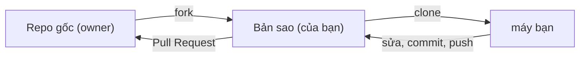

# Git Hooks & mẹo GitHub

> [!summary] TL;DR
> **Git Hooks** = script tự chạy ở các mốc trong vòng đời Git (vd ngay trước commit). Phổ biến nhất: **pre-commit hook** để chặn code xấu (lint fail, test fail, có secret) trước khi vào lịch sử. Quản lý hook dễ hơn bằng tool: **husky** (Node) hay **pre-commit** (Python). Phần mẹo GitHub: phím **`.`** mở editor web (github.dev), **fork** để đóng góp repo người khác, **Codespaces** môi trường dev trên cloud.

---

## Phần 1 — Git Hooks

## 1. Hook là gì?

Hook là các **script** Git tự gọi khi một sự kiện xảy ra (commit, push, merge…). Chúng nằm trong `.git/hooks/`. Mặc định có các file `*.sample` (gỡ đuôi `.sample` để kích hoạt).

| Hook | Chạy khi | Dùng để |
|------|----------|---------|
| `pre-commit` | **Trước** khi tạo commit | Lint, format, chạy test nhanh, chặn secret |
| `commit-msg` | Sau khi nhập message | Kiểm tra message đúng Conventional Commits |
| `pre-push` | Trước khi push | Chạy test đầy đủ trước khi đẩy lên |
| `post-merge` | Sau khi merge | Tự `npm install` nếu lock file đổi |

> [!warning] Hook trong `.git/hooks/` **không được commit** (vì `.git/` không nằm trong repo). Nên mỗi người clone về sẽ **không** tự có hook của bạn → đó là lý do dùng tool (husky/pre-commit) để chia sẻ hook qua repo.

```
★ Insight ─────────────────────────────────────
• Hook là "hàng rào local": chặn lỗi NGAY trên máy lập trình viên trước khi nó
  kịp vào commit/push. Nhưng vì hook ở .git/ không đi theo repo và có thể bị bỏ
  qua (`--no-verify`), nó KHÔNG đủ tin cậy một mình — phải có CI trên server làm
  "hàng rào cuối" không ai vượt được. Hook + CI là cặp bài trùng → [[12-CI-CD-la-gi]].
─────────────────────────────────────────────────
```

---

## 2. Ví dụ pre-commit hook thủ công

Tạo `.git/hooks/pre-commit` (cho quyền chạy `chmod +x`):

```bash
#!/bin/sh
# Chặn commit nếu lint fail
npm run lint || {
  echo "❌ Lint fail — sửa trước khi commit."
  exit 1     # exit khác 0 → Git HỦY commit
}
```

Quy tắc: hook **exit 0** = cho phép tiếp tục; **exit ≠ 0** = chặn thao tác.

Bỏ qua hook một lần (khi thật cần): `git commit --no-verify`.

---

## 3. Quản lý hook bằng tool (khuyến nghị)

Vì hook thủ công không chia sẻ được, dùng tool để cấu hình hook **trong repo** (commit kèm theo), ai clone về cũng có.

### husky (dự án Node/JS)

```bash
npm install --save-dev husky
npx husky init                 # tạo thư mục .husky/ (được commit)
# Thêm lệnh vào .husky/pre-commit, vd:
echo "npm test" > .husky/pre-commit
```

Thường ghép với **lint-staged** để chỉ lint/format đúng file đang staged (nhanh):

```json
// package.json
{
  "lint-staged": { "*.{js,ts}": ["eslint --fix", "prettier --write"] }
}
```

### pre-commit (dự án Python / đa ngôn ngữ)

Tool tên là `pre-commit`, cấu hình bằng `.pre-commit-config.yaml`:

```yaml
repos:
  - repo: https://github.com/pre-commit/pre-commit-hooks
    rev: v4.5.0
    hooks:
      - id: trailing-whitespace
      - id: end-of-file-fixer
      - id: check-added-large-files
  - repo: https://github.com/psf/black
    rev: 24.1.0
    hooks:
      - id: black            # format code Python
```

```bash
pip install pre-commit
pre-commit install           # gắn vào .git/hooks/pre-commit
pre-commit run --all-files   # chạy thử trên toàn repo
```

> [!tip] Hook thường dùng cho: **format** (prettier/black), **lint** (eslint/flake8), chặn **file lớn**, chặn **secret** (detect-secrets/gitleaks), kiểm **commit message**.

---

## Phần 2 — Mẹo GitHub

## 4. Phím `.` — mở VS Code web ngay trên repo

Ở bất kỳ repo nào trên GitHub, **gõ phím `.` (dấu chấm)** → mở **github.dev**: một bản VS Code chạy trong trình duyệt, sửa file & commit thẳng. (Hoặc đổi URL `github.com` → `github.dev`.)

- Hợp để: sửa nhanh README, đọc/review code, sửa typo — mọi nơi có trình duyệt.
- Không chạy code/terminal (chỉ soạn thảo). Muốn chạy được thì dùng **Codespaces** (mục 6).

## 5. Fork — đóng góp cho repo người khác

**Fork** = tạo **bản sao repo** vào tài khoản của bạn (vì bạn không có quyền push thẳng vào repo gốc).



Luồng đóng góp open-source:

1. **Fork** repo gốc trên GitHub.
2. **Clone** bản fork về máy.
3. Tạo branch, sửa, commit, **push** lên fork của bạn.
4. Mở **Pull Request** từ fork → repo gốc.
5. (Duy trì) thêm remote `upstream` trỏ repo gốc để đồng bộ:
   ```bash
   git remote add upstream git@github.com:owner/repo.git
   git fetch upstream && git merge upstream/main
   ```

> [!tip] Phân biệt **fork** (bản sao trên GitHub, account khác — để đóng góp) vs **clone** (bản sao về máy local — để làm việc) vs **branch** (nhánh trong cùng repo). Đây là câu hay nhầm.

## 6. GitHub Codespaces — môi trường dev trên cloud

**Codespaces** = một máy ảo + VS Code đầy đủ chạy trên cloud, mở từ nút **Code → Codespaces → Create**. Khác github.dev ở chỗ **có terminal, chạy code, cài đặt, debug** thật.

- Cấu hình sẵn qua `.devcontainer/` → ai mở cũng có cùng môi trường (hết cảnh "máy tôi chạy được").
- Hữu ích khi: máy cá nhân đang bận, onboard nhanh, demo, hoặc cần môi trường đồng nhất.
- Mọi thay đổi lưu trên máy ảo; đóng nhầm tab vẫn lấy lại được qua menu Code → Codespaces.

```
★ Insight ─────────────────────────────────────
• github.dev (phím ".") và Codespaces nằm trên cùng phổ "code trên cloud": ".",
  nhẹ — chỉ soạn thảo; Codespaces nặng — máy ảo chạy được mọi thứ. Chọn theo nhu
  cầu: sửa typo dùng "."; chạy/test/debug dùng Codespaces.
• Devcontainer chuẩn hóa môi trường giống cách Docker làm cho deploy: "môi trường
  là code", commit kèm repo → tái lập y hệt ở mọi nơi.
─────────────────────────────────────────────────
```

---

## 7. Bảng tra nhanh

| Việc | Cách |
|------|------|
| Pre-commit hook thủ công | `.git/hooks/pre-commit` (exit ≠ 0 = chặn) |
| Bỏ qua hook 1 lần | `git commit --no-verify` |
| Hook chia sẻ được (Node) | husky + lint-staged |
| Hook chia sẻ được (Python) | `pre-commit` + `.pre-commit-config.yaml` |
| Mở editor web | gõ `.` trên repo (github.dev) |
| Đóng góp repo người khác | Fork → clone → PR |
| Dev env trên cloud | Codespaces |

## 8. Tự kiểm tra

1. pre-commit hook exit code 1 thì sao? *(Git hủy commit)*
2. Vì sao hook trong `.git/hooks` không tự chia sẻ cho team? *(`.git/` không nằm trong repo → dùng husky/pre-commit)*
3. Hook có thay thế được CI không? *(không — hook bị `--no-verify` bỏ qua; CI là hàng rào server bắt buộc)*
4. fork khác clone thế nào? *(fork: bản sao trên GitHub account khác; clone: bản sao về máy)*
5. github.dev (".") khác Codespaces? *(. chỉ soạn thảo; Codespaces chạy được code/terminal)*

## Liên quan
- [[00-MOC-Git|⬅ MOC Git]]
- Trước: [[10-Git-Log-nang-cao]] · Kế tiếp (Phần C): [[12-CI-CD-la-gi|CI/CD là gì]]
- [[05-Branch-Merge-PR|Pull Request]]
