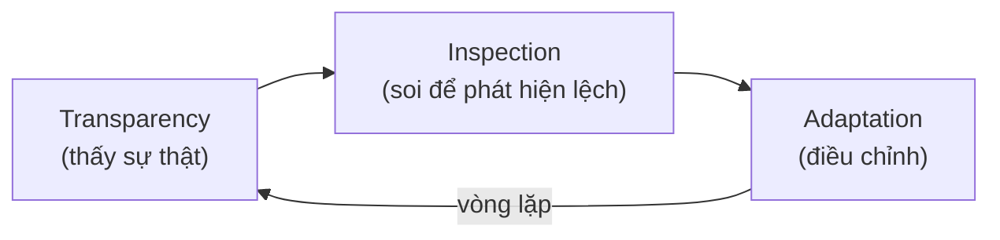
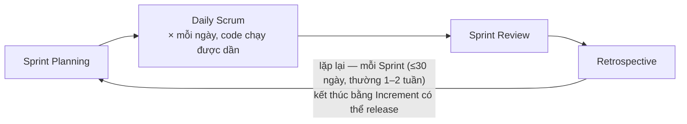

# Tổng quan Agile & Scrum

> [!summary] TL;DR
> **Agile** là một **tư duy/triết lý** (mindset) làm phần mềm linh hoạt, lặp đi lặp lại, lấy giá trị cho khách hàng làm trọng tâm — gói trong **Agile Manifesto** (4 giá trị, 12 nguyên tắc). **Scrum** là một **framework** cụ thể hiện thực hóa Agile, dựa trên **empiricism** (kinh nghiệm thực chứng) với **3 trụ cột: Transparency · Inspection · Adaptation**. Scrum gồm 3 thành phần: **Roles** (3) · **Artifacts** (3) · **Events** (5). Lưu ý: Scrum **không có** vai trò Project Manager.

---

## 1. Agile vs Scrum — đừng nhầm

| | **Agile** | **Scrum** |
|---|-----------|-----------|
| Là gì | **Tư duy/triết lý** (mindset) — cách nghĩ | **Framework** — bộ luật chơi cụ thể |
| Mức độ | Trừu tượng (giá trị, nguyên tắc) | Cụ thể (vai trò, sự kiện, vật phẩm) |
| Quan hệ | Cái ô lớn | Một cách *làm theo* Agile |
| Khác lựa chọn | — | Kanban, XP, SAFe… cũng là cách làm Agile |

> [!tip] Câu một dòng để nhớ: **"Agile là tư duy, Scrum là một cách thực hành tư duy đó."** Scrum là framework Agile **phổ biến nhất**, nhưng không phải duy nhất.

```
★ Insight ─────────────────────────────────────
• Lỗi nhận thức kinh điển: "dùng Jira / họp standup = đã Agile". Sai. Agile là
  văn hóa & tư duy; công cụ và nghi thức chỉ là biểu hiện. Có thể làm đủ event
  Scrum mà vẫn KHÔNG agile (gọi là "mechanical scrum" — làm vì sách bảo thế, không
  hiểu vì sao). Hiểu "tại sao" của mỗi luật mới là agile thật → [[07-Cong-cu-va-Theo-doi]].
─────────────────────────────────────────────────
```

---

## 2. Agile Manifesto — 4 giá trị

Tuyên ngôn Agile (2001) nêu 4 cặp ưu tiên. **Vế trái coi trọng hơn vế phải** (không phủ nhận vế phải):

| Coi trọng hơn | … hơn là |
|---------------|----------|
| **Cá nhân & tương tác** | quy trình & công cụ |
| **Phần mềm chạy được** | tài liệu đầy đủ |
| **Hợp tác với khách hàng** | đàm phán hợp đồng |
| **Phản ứng với thay đổi** | bám theo kế hoạch |

> [!warning] "Coi trọng software chạy được hơn tài liệu" **không** có nghĩa là bỏ tài liệu. Tài liệu vẫn cần (BRD/SRS/spec — xem [[10-Tai-lieu-Yeu-cau-va-Dac-ta]]), chỉ là **vừa đủ**, không sa đà.

12 nguyên tắc (principles) cụ thể hóa 4 giá trị này — vài ý cốt lõi: giao phần mềm giá trị **sớm & thường xuyên**, **chào đón thay đổi**, làm việc **đều đặn bền vững**, **đội tự tổ chức**, thường xuyên **phản tỉnh & điều chỉnh**.

---

## 3. Empiricism — nền tảng của Scrum

Scrum dựa trên **chủ nghĩa thực chứng (empiricism)**: ra quyết định dựa trên **những gì đã quan sát/biết được thực tế**, không dựa trên kế hoạch cứng nhắc vẽ sẵn từ đầu. Phần mềm phức tạp, không đoán hết được → cứ làm từng vòng ngắn, học, rồi điều chỉnh.

Empiricism đứng trên **3 trụ cột (3 pillars)** — câu hỏi phỏng vấn rất hay:

| Trụ cột | Nghĩa | Thể hiện trong Scrum |
|---------|-------|----------------------|
| **Transparency** (Minh bạch) | Mọi người cùng thấy sự thật chung (tiến độ, vấn đề) | Backlog công khai, board, **Definition of Done** thống nhất |
| **Inspection** (Kiểm tra) | Thường xuyên soi tiến độ & sản phẩm để phát hiện lệch | Daily Scrum, Sprint Review |
| **Adaptation** (Thích nghi) | Phát hiện lệch thì điều chỉnh ngay | Retrospective, cập nhật backlog |



```
★ Insight ─────────────────────────────────────
• 3 trụ cột vận hành như một VÒNG LẶP điều khiển: phải minh bạch thì kiểm tra mới
  ra đúng vấn đề; kiểm tra ra vấn đề thì mới thích nghi được. Thiếu một trụ là gãy
  cả chuỗi — vd Definition of Done mập mờ (mất transparency) → review không biết
  "xong" là gì (inspection vô nghĩa) → không điều chỉnh đúng.
• Mọi event/artifact của Scrum đều phục vụ 1 trong 3 trụ cột. Khi bí "event này để
  làm gì?", quy về trụ cột: Daily = inspection, Retro = adaptation, DoD = transparency.
─────────────────────────────────────────────────
```

Scrum Guide còn nêu **5 giá trị (values)**: Commitment, Courage, Focus, Openness, Respect — văn hóa để 3 trụ cột sống được.

---

## 4. Bộ khung Scrum — bức tranh tổng

Scrum gồm **3 + 3 + 5**:

```text
   ┌──────────── SCRUM TEAM ────────────┐
   │  3 ROLES:                           │
   │   • Product Owner   (cái "gì")      │  → [[02-Scrum-Roles]]
   │   • Scrum Master    (servant leader)│
   │   • Development Team (cách làm)      │
   ├─────────────────────────────────────┤
   │  3 ARTIFACTS:                       │
   │   • Product Backlog                 │  → [[03-Scrum-Artifacts-va-DoD]]
   │   • Sprint Backlog                  │
   │   • Increment (+ Definition of Done)│
   ├─────────────────────────────────────┤
   │  5 EVENTS:                          │
   │   • Sprint (container)              │  → [[04-Scrum-Events]]
   │   • Sprint Planning                 │
   │   • Daily Scrum                     │
   │   • Sprint Review                   │
   │   • Sprint Retrospective            │
   └─────────────────────────────────────┘
```

> [!warning] **Scrum KHÔNG có vai trò Project Manager.** Tổ chức vẫn có thể có PM, nhưng PM **không** thuộc Scrum Team. Trách nhiệm quản lý được **chia sẻ** giữa 3 vai trò. Đừng nhầm Product Owner = Project Manager hay Product Manager.

---

## 5. Vòng đời một Sprint (xem trước)



Chi tiết từng event: [[04-Scrum-Events]].

---

## 6. Ví dụ xuyên suốt: đội Agile Fitness

Tài liệu khoá học dùng một ví dụ thống nhất — **chuỗi phòng gym** đang làm lại website + app:
- **Bob Jones** — Product Owner (20 năm trong ngành, hiểu nghiệp vụ, giao tiếp tốt).
- **Ashley Wright** — Scrum Master (servant leader).
- **Dev Team**: Jim, Maria, Ravi, Chuck, Jamal (đủ kỹ năng design/code/test/doc).

Ta sẽ gặp lại đội này ở các note sau.

---

## 7. Tự kiểm tra

1. Agile và Scrum khác nhau thế nào? *(Agile = tư duy; Scrum = framework hiện thực Agile)*
2. 3 trụ cột của empiricism? *(Transparency, Inspection, Adaptation)*
3. Scrum có Project Manager không? *(không)*
4. Cấu trúc 3+3+5 của Scrum là gì? *(3 roles, 3 artifacts, 5 events)*
5. "Mechanical scrum" là gì, vì sao xấu? *(làm đúng nghi thức nhưng không hiểu vì sao → mất tinh thần agile)*

## Liên quan
- [[00-MOC-Agile-Scrum|⬅ MOC Agile-Scrum]]
- Kế tiếp: [[02-Scrum-Roles|Scrum Roles]]
- [[03-Scrum-Artifacts-va-DoD]] · [[04-Scrum-Events]]
