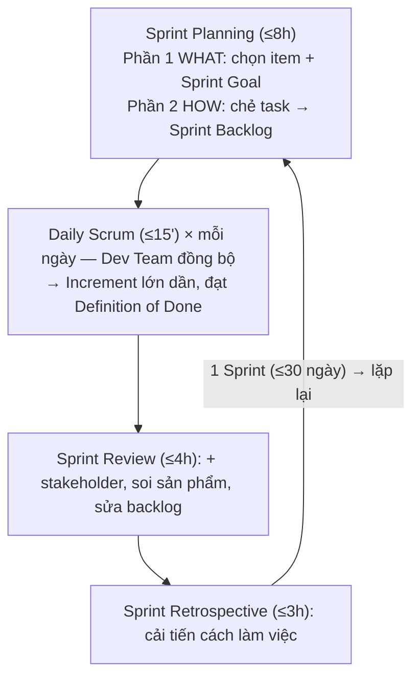

# Scrum Events — 5 sự kiện

> [!summary] TL;DR
> Scrum có **5 sự kiện**, tất cả đều **timeboxed** (giới hạn thời gian). **Sprint** là "container" chứa 4 sự kiện còn lại (≤30 ngày, thường 1–2 tuần). Mỗi Sprint: **Sprint Planning** (lập kế hoạch — *what* & *how*) → **Daily Scrum** (đồng bộ 15 phút mỗi ngày) → **Sprint Review** (cùng stakeholder soi sản phẩm) → **Sprint Retrospective** (cải tiến quy trình). Mỗi Sprint kết thúc bằng một Increment "có thể release".

---

## 1. Bảng timebox ⭐ (học thuộc)

Timebox chuẩn tính cho **Sprint 30 ngày (1 tháng)**; Sprint ngắn hơn thì giảm tỉ lệ.

| Sự kiện | Timebox (Sprint 1 tháng) | Ai tham gia (bắt buộc) | Trụ cột chính |
|---------|--------------------------|------------------------|---------------|
| **Sprint** | ≤ 30 ngày (thường 1–2 tuần) | Cả Scrum Team | (container) |
| **Sprint Planning** | ≤ 8 giờ | Cả Scrum Team | Adaptation |
| **Daily Scrum** | ≤ 15 phút/ngày | **Chỉ Dev Team** | Inspection |
| **Sprint Review** | ≤ 4 giờ | Scrum Team + **stakeholder ngoài** | Inspection |
| **Sprint Retrospective** | ≤ 3 giờ | Cả Scrum Team | Adaptation |

> [!tip] Mẹo nhớ con số: **8 – 15ph – 4 – 3** (Planning 8h, Daily 15 phút, Review 4h, Retro 3h) cho Sprint 1 tháng. Timebox là **giới hạn TRÊN**, không có giới hạn dưới (xong sớm thì thôi).

```
★ Insight ─────────────────────────────────────
• Mọi event là một điểm "inspect & adapt" theo nhịp: Daily (nhịp ngày) → Review
  & Retro (nhịp Sprint). Timebox không phải để gò bó mà để TẠO NHỊP đều và buộc
  hội họp đi thẳng vào việc. Sprint là container ôm tất cả → bản thân Sprint cũng
  là một vòng inspect-adapt lớn.
─────────────────────────────────────────────────
```

---

## 2. Sprint — "container event"

Mỗi vòng lặp công việc gọi là một **Sprint**. Đặc điểm:

- **≤ 30 ngày**; đa số team chọn **1–2 tuần** (tuần lễ Sprint ngày càng phổ biến với team hiện đại).
- Chứa 4 event còn lại; Sprint mới bắt đầu **ngay** khi Sprint trước kết thúc.
- **Mỗi Sprint phải cho ra một Increment "potentially releasable"** — đây là **luật Scrum duy nhất** áp lên đầu ra Sprint.
- Increment phải là **"lát cắt dọc" (vertical slice)**: chạy được đầu-cuối qua các tầng (UI → business → DB), dùng được, có giá trị.

```text
   ✅ Tốt: chức năng tìm sản phẩm theo tên + khoảng giá
           (UI nhập + logic lọc + truy vấn DB) — dùng được ngay
   ❌ Xấu: chỉ có schema DB, hoặc UI giả không có logic — không dùng được
```

### Anti-patterns (thực hành nên TRÁNH)

| Khái niệm | Là gì | Vì sao tránh |
|-----------|-------|--------------|
| **Sprint Zero** | Sprint đầu chỉ lập kế hoạch, không ra sản phẩm | Vi phạm "mỗi Sprint ra giá trị"; nên gộp planning với phần việc có giá trị |
| **Hardening Sprint** | Sprint chỉ để sửa lỗi/ổn định cuối kỳ | Khuyến khích ra sản phẩm kém ổn định ở các Sprint trước, giảm minh bạch |
| **Sprint toàn Spike** | Sprint chỉ làm research | Spike (nghiên cứu) được phép nhưng phải **trộn** với việc có giá trị |

> [!tip] **Continuous Delivery & Scrum không mâu thuẫn:** luật duy nhất là "mỗi Sprint ra Increment releasable". Nếu bạn có pipeline CD release nhiều lần/ngày ([[../02-Git/12-CI-CD-la-gi|CI/CD]]) thì càng tốt — không vi phạm gì.

---

## 3. Sprint Planning — lập kế hoạch (what & how)

Mở đầu mỗi Sprint. Timebox **≤ 8 giờ** (team kinh nghiệm thường ≤2h). Cả Scrum Team dự. Chia **2 phần**:

### Phần 1 — WHAT (cái gì)
- PO trình bày **mục tiêu ưu tiên** & Product Backlog (đỉnh = ưu tiên cao nhất).
- Dev Team **kéo** một tập con story/bug từ đỉnh xuống Sprint.
- Cùng nhau chốt **Sprint Goal** — tóm tắt ngắn gọn, truyền cảm hứng, **giới hạn phạm vi** cho Sprint.

```text
❌ Sprint Goal dở (quá chung): "Làm hết mọi user story đã chọn và fix hết bug."
✅ Sprint Goal tốt: "Nâng cấp website để thu hút hội viên mới & khuyến khích đăng ký dùng thử;
   cập nhật app cho check-in nhanh, tiện hơn."
```

### Phần 2 — HOW (làm thế nào)
- **Dev Team sở hữu** phần này. PO/SM hỗ trợ, trả lời câu hỏi, **không** áp đặt.
- Dev Team chẻ mỗi item thành các **task** (design, code, integration, test…).
- Không cần kế hoạch chi tiết cho cả Sprint — chỉ đủ cho vài ngày tới, **học dần** (empiricism, "last responsible moment").

> Kết quả: **Sprint Backlog** ra đời (item đã chọn + kế hoạch). Dev Team **tự kéo** việc theo năng lực & lịch sử, **không** ai giao việc (bottom-up).

---

## 4. Daily Scrum — đồng bộ hằng ngày ⭐ (event hay bị hiểu sai nhất)

- **≤ 15 phút**, **mỗi ngày**, **cùng giờ cùng chỗ**.
- **Của Dev Team, do Dev Team, vì Dev Team.** Người bắt buộc: **chỉ Dev Team**. PO & SM **không bắt buộc** dự (có thể tham gia hỗ trợ/làm rõ).
- Là buổi **inspect & adapt** kế hoạch tiến tới Sprint Goal.

### Phá các "myth" (rất hay hỏi)

| Myth (sai) | Sự thật |
|------------|---------|
| "Scrum Master chủ trì Daily" | SM **không** bắt buộc dự; chỉ coach giữ nhịp & timebox |
| "Daily = họp standup" | Scrum Guide **không** có từ "standup"; đứng là tùy team |
| "Daily = họp báo cáo tiến độ cho sếp/PO" | KHÔNG — là buổi đồng bộ của Dev Team, không phải status meeting |

### Định dạng 3 câu hỏi (3QF) — *tùy chọn* (từ Scrum Guide 2017)
1. Hôm qua (từ Daily trước) tôi đã làm gì?
2. Hôm nay tôi sẽ làm gì?
3. Có **trở ngại (impediment)** nào cản tôi không?

```
★ Insight ─────────────────────────────────────
• Sai lầm lớn nhất là biến Daily thành "báo cáo cho sếp". Khi đó Dev nói với PO/SM
  thay vì nói với NHAU → mất mục đích đồng bộ & tự tổ chức. Test nhanh: nếu PO/SM
  vắng mà buổi họp vô nghĩa, thì bạn đang làm sai Daily.
• 3 câu hỏi giờ chỉ là GỢI Ý (optional từ 2017): cốt lõi là "chúng ta có đang đi
  đúng hướng tới Sprint Goal không, vướng gì không", chứ không phải đọc form máy móc.
─────────────────────────────────────────────────
```

---

## 5. Sprint Review — soi sản phẩm cùng stakeholder

Cuối Sprint. Timebox **≤ 4 giờ**. Đây là **event DUY NHẤT** mà **stakeholder ngoài** là người dự **bắt buộc**.

- **Informal**, KHÔNG phải "demo có kịch bản". Có demo nhưng stakeholder **tự tương tác** với sản phẩm.
- Hai mục tiêu: (1) **inspect Increment** — xem đã đi tới đâu; (2) **adapt Product Backlog** — bàn & quyết làm gì tiếp.
- Stakeholder mang hiểu biết thị trường, đối thủ, mục tiêu tổ chức vào → điều chỉnh backlog cho sát thực tế.

> Ví dụ: PO Bob chiếu Sprint Backlog & Sprint Goal, nói item nào sẵn release item nào chưa; stakeholder thử nhập liệu trên điện thoại; team thêm vài backlog item mới, hạ ưu tiên vài cái; 1 item lỗi nặng bị trả về Product Backlog.

> [!warning] Phân biệt **Review vs Retrospective**: Review soi **sản phẩm (cái gì làm ra)** với stakeholder; Retrospective soi **quy trình (cách làm việc)** nội bộ team. Đây là câu hỏi phỏng vấn kinh điển.

---

## 6. Sprint Retrospective — cải tiến quy trình

Sự kiện **cuối cùng** của Sprint. Timebox **≤ 3 giờ**. Cả Scrum Team dự (nội bộ, không có stakeholder ngoài).

- Mục tiêu: **inspect & adapt mọi thứ TRỪ sản phẩm** — tức con người, tương tác, **quy trình, công cụ**, và cả **Definition of Done**.
- Bàn 3 câu: **Cái gì tốt? · Cái gì nên làm khác? · Cam kết thay đổi gì?**
- Tạo ra **action item** cải tiến.

> Ví dụ Agile Fitness: dùng bảng 3 cột (Went well / Didn't go well / Action items). Chốt vài action (vd "cập nhật quy trình test cho trình duyệt cũ", "thêm XML comment vào code review"), đưa vào backlog & gán người.

> [!tip] **Đừng bỏ Retrospective** dù thấy "quy trình ổn rồi": luôn có chỗ cải tiến; và việc bạn làm tốt có thể là thứ team khác đang vật lộn → chia sẻ giúp cả tổ chức. **1–2 action item/Sprint là vừa** (ôm quá nhiều thì không làm nổi — như "nghị quyết năm mới").

```
★ Insight ─────────────────────────────────────
• Cặp Review/Retro chia rạch ròi 2 trục: SẢN PHẨM (Review, hướng ra ngoài, có
  stakeholder) vs CÁCH LÀM (Retro, hướng vào trong, nội bộ). Nhầm lẫn dẫn tới
  Retro biến thành demo, hoặc Review biến thành đổ lỗi nội bộ — cả hai đều hỏng.
• Action item của Retro nên đi vào backlog & có người phụ trách, nếu không nó chỉ
  là lời hứa suông. Ít mà làm được hơn nhiều mà bỏ → giống commit atomic trong git.
─────────────────────────────────────────────────
```

---

## 7. Tổng kết dòng chảy một Sprint



(Ngoài 5 event này còn **Product Backlog Refinement** — hoạt động liên tục, không tính là event chính thức: xem [[05-Product-Backlog-Refinement]].)

---

## 8. Tự kiểm tra

1. 5 sự kiện Scrum? *(Sprint, Planning, Daily, Review, Retrospective)*
2. Timebox cho Sprint 1 tháng: Planning / Daily / Review / Retro? *(8h / 15ph / 4h / 3h)*
3. Daily Scrum bắt buộc ai dự? *(chỉ Dev Team)*
4. Event nào bắt buộc có stakeholder ngoài? *(Sprint Review)*
5. Review vs Retrospective khác gì? *(Review: sản phẩm + stakeholder; Retro: quy trình, nội bộ)*
6. Sprint Planning gồm 2 phần gì, ai sở hữu phần HOW? *(WHAT & HOW; Dev Team sở hữu HOW)*

## Liên quan
- [[00-MOC-Agile-Scrum|⬅ MOC Agile-Scrum]]
- Trước: [[03-Scrum-Artifacts-va-DoD]] · Kế tiếp: [[05-Product-Backlog-Refinement|Backlog & Refinement]]
- [[07-Cong-cu-va-Theo-doi|Theo dõi tiến độ]]
