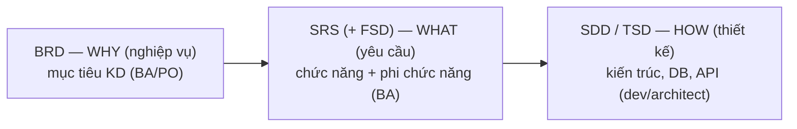

# Tài liệu yêu cầu & đặc tả — BRD · SRS · Spec

> [!summary] TL;DR
> Chuỗi tài liệu từ "nghiệp vụ" đến "kỹ thuật": **BRD** (Business Requirement Doc — *vì sao*, mục tiêu kinh doanh, do BA/PO viết) → **SRS** (Software Requirement Specification — *cái gì*, gồm functional + non-functional, chi tiết) → **FSD** (Functional Spec — hệ thống *hành xử* thế nào) → **SDD/TSD** (Software/Technical Design Doc — *làm thế nào* về kỹ thuật, do dev/architect viết). Trong Agile, các tài liệu này được làm **nhẹ & dần**; yêu cầu thường biểu diễn bằng **User Story + Acceptance Criteria** thay vì SRS đồ sộ.

---

## 1. Chuỗi tài liệu: từ WHY → WHAT → HOW


> Càng sang phải càng **kỹ thuật**, càng **cụ thể**.

| Tài liệu | Tên đầy đủ | Trả lời | Ai viết | Nội dung chính |
|----------|-----------|---------|---------|----------------|
| **BRD** | Business Requirement Document | **Vì sao** (mục tiêu KD) | BA / PO / stakeholder | Mục tiêu, phạm vi, business need, ràng buộc |
| **SRS** | Software Requirement Specification | **Cái gì** (yêu cầu) | BA / System Analyst | Functional + Non-functional requirement, use case |
| **FSD** | Functional Specification Document | Hệ thống **hành xử** ra sao | BA / PO | Luồng màn hình, quy tắc nghiệp vụ, hành vi từng chức năng |
| **SDD / TSD** | Software/Technical Design Document | **Làm thế nào** (kỹ thuật) | Dev / Architect | Kiến trúc, sơ đồ DB, API, component, công nghệ |

> [!tip] Một số nơi gộp FSD vào SRS; một số tách riêng. Cốt lõi cần nhớ là **trục WHY → WHAT → HOW** và **độ kỹ thuật tăng dần**, đừng quá câu nệ ranh giới từng tên.

```
★ Insight ─────────────────────────────────────
• Nhầm lẫn kinh điển: SRS nói "hệ thống PHẢI làm gì" (what), SDD nói "code/DB
  được THIẾT KẾ thế nào" (how). SRS không chứa quyết định công nghệ (chọn Postgres
  hay Mongo là việc của SDD). Lẫn lộn what/how làm tài liệu vừa thừa vừa cứng nhắc.
• BRD → SRS → SDD là một "phễu cụ thể hóa": mỗi tầng dịch yêu cầu sang ngôn ngữ
  gần code hơn. Traceability ([[13-Test-Plan-va-QA]]) chính là sợi chỉ nối các
  tầng này lại để không "rớt" yêu cầu nào giữa đường.
─────────────────────────────────────────────────
```

---

## 2. SRS gồm gì? (IEEE 830 — sườn kinh điển)

- **Giới thiệu:** mục đích, phạm vi, định nghĩa/thuật ngữ.
- **Mô tả tổng quan:** bối cảnh sản phẩm, loại người dùng, ràng buộc, giả định.
- **Functional requirements:** liệt kê chức năng (thường kèm **use case**).
- **Non-functional requirements:** performance, security, usability… ([[09-Tiep-nhan-va-Phan-tich-Yeu-cau]]).
- **Giao diện ngoài:** UI, phần cứng, phần mềm khác, giao tiếp.

---

## 3. Use Case vs User Story (cách mô tả yêu cầu)

| | **Use Case** | **User Story** |
|---|---|---|
| Phong cách | Chi tiết, có luồng chính/phụ, điều kiện | Ngắn gọn, 1–2 câu |
| Thuộc | Thiên về truyền thống / SRS | Thiên về Agile / backlog |
| Mẫu | Actor + luồng các bước + alternate flow | "Là &lt;role&gt;, tôi muốn &lt;goal&gt; để &lt;benefit&gt;" |
| Kèm theo | Sơ đồ use case (UML) | Acceptance Criteria |

**User Story mẫu:**
```text
Là một hội viên, tôi muốn đặt lịch lớp yoga qua app
để khỏi phải gọi điện cho phòng gym.
```

**Use Case mẫu (rút gọn):**
```text
Use case: Đặt lịch lớp
Actor: Hội viên
Luồng chính: 1.Chọn lớp → 2.Hệ thống kiểm tra chỗ → 3.Xác nhận → 4.Gửi email
Luồng phụ: 2a. Lớp đầy → hiển thị danh sách chờ
```

---

## 4. INVEST — tiêu chí user story tốt ⭐

| Chữ | Nghĩa | Ý |
|-----|-------|----|
| **I**ndependent | Độc lập | Làm được không phụ thuộc story khác |
| **N**egotiable | Thương lượng được | Là điểm bàn bạc, không phải hợp đồng cứng |
| **V**aluable | Có giá trị | Mang lại giá trị cho người dùng/khách |
| **E**stimable | Ước lượng được | Đủ rõ để estimate ([[12-Estimation]]) |
| **S**mall | Nhỏ | Làm gọn trong 1 Sprint |
| **T**estable | Kiểm thử được | Có thể viết test/AC để xác nhận |

---

## 5. Acceptance Criteria (AC) — "thế nào là đạt"

**AC** = điều kiện cụ thể để một story được **chấp nhận** là làm đúng. Thường viết kiểu **Given-When-Then** (Gherkin/BDD):

```gherkin
Story: Đăng nhập

Given người dùng đã có tài khoản
When nhập đúng email và mật khẩu
Then được chuyển vào trang chủ

Given người dùng nhập sai mật khẩu 3 lần
When nhập lần thứ 4
Then tài khoản bị khóa 5 phút
```

> [!warning] **AC vs Definition of Done** (nhắc lại từ [[03-Scrum-Artifacts-va-DoD]]):
> - **Acceptance Criteria**: **riêng** mỗi story — "story *này* đạt khi…".
> - **Definition of Done**: **chung** mọi story — "*bất kỳ* việc nào xong phải có test + qua CI + review…".
> → AC quyết định *đúng cái gì*; DoD quyết định *đủ chất lượng chưa*. Một story "done" = pass AC **và** thỏa DoD.

```
★ Insight ─────────────────────────────────────
• AC viết kiểu Given-When-Then không chỉ để mô tả — nó DỊCH THẲNG thành test case
  (BDD). Mỗi dòng Then là một assertion. Đây là cầu nối requirement → test:
  AC tốt = test tốt = traceability rõ ([[13-Test-Plan-va-QA]]).
• AC là nơi "chốt phạm vi" của từng story chống scope creep ở mức nhỏ: không có
  AC, "đăng nhập" có thể phình ra vô tận (OTP? social login? nhớ mật khẩu?). AC
  vạch đúng story này làm tới đâu.
─────────────────────────────────────────────────
```

---

## 6. Agile làm tài liệu thế nào?

- **Không** viết SRS 200 trang rồi mới code (đó là Waterfall). Agile: yêu cầu chủ yếu sống trong **Product Backlog** dưới dạng **User Story + AC**, làm rõ dần (progressive elaboration).
- Tài liệu **vừa đủ** để team hiểu & xây đúng — không hơn (Manifesto: "working software over comprehensive documentation").
- BRD/SRS vẫn hữu ích cho **bức tranh lớn**, hợp đồng, hệ thống lớn/được kiểm toán — nhưng giữ gọn & cập nhật.

---

## 7. Tự kiểm tra

1. BRD, SRS, SDD trả lời câu hỏi nào (why/what/how)? *(BRD: why; SRS: what; SDD: how)*
2. SRS có chứa quyết định chọn database không? *(không — đó là SDD)*
3. Use Case vs User Story khác gì? *(use case chi tiết luồng/UML; user story ngắn + AC, Agile)*
4. INVEST gồm gì? *(Independent, Negotiable, Valuable, Estimable, Small, Testable)*
5. Acceptance Criteria khác Definition of Done? *(AC riêng từng story; DoD chung mọi story)*
6. Mẫu viết AC phổ biến? *(Given-When-Then)*

## Liên quan
- [[00-MOC-Agile-Scrum|⬅ MOC Agile-Scrum]]
- Trước: [[09-Tiep-nhan-va-Phan-tich-Yeu-cau]] · Kế tiếp: [[11-Wireframe-Mockup-Prototype|Wireframe · Mockup · Prototype]]
- [[03-Scrum-Artifacts-va-DoD|DoD]] · [[13-Test-Plan-va-QA|AC → Test]]
