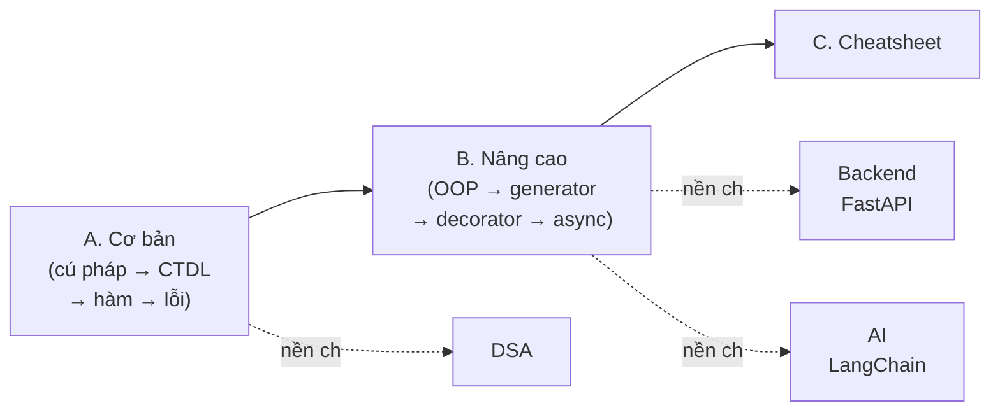

# MOC: Python

> Ngôn ngữ nền tảng cho **DSA, Backend (FastAPI) và AI (LangChain/LangGraph)** trong khắp vault.
> Nguồn tham khảo: Python Official Docs, *Fluent Python* (Luciano Ramalho), lộ trình phỏng vấn fresher.
> ✅ 20 note · 3 cụm.

## Cụm A — Python Cơ bản

| # | Note | Nội dung | Trạng thái |
|---|------|----------|------------|
| 1 | [[01-Tong-quan-Python\|Tổng quan Python]] | Interpreter, CPython, bytecode, dynamic + strong typing, PEP 8, Zen | ✅ |
| 2 | [[02-Bien-va-Kieu-du-lieu\|Biến & Kiểu dữ liệu]] | int/float/str/bool/None, mutable vs immutable, gán = tham chiếu | ✅ |
| 3 | [[03-Toan-tu-va-Bieu-thuc\|Toán tử & Biểu thức]] | số học/so sánh/logic, `is` vs `==`, `in`, truthy/falsy | ✅ |
| 4 | [[04-List-Tuple-Dict-Set\|List · Tuple · Dict · Set]] ⭐ | So sánh sâu 4 CTDL + `array`/`numpy` — câu hỏi PV kinh điển | ✅ |
| 5 | [[05-String-va-Format\|String & f-string]] | immutable, slicing, method, f-string format | ✅ |
| 6 | [[06-Dieu-khien-luong\|Điều khiển luồng]] | if/elif/else, for + range, while, break/continue, for-else | ✅ |
| 7 | [[07-Ham\|Hàm]] | `*args`/`**kwargs`, default, return, scope LEGB, lambda | ✅ |
| 8 | [[08-Comprehension-va-Generator-expression\|Comprehension & Generator expr]] | list/dict/set comprehension, generator expression lazy | ✅ |
| 9 | [[09-Module-Package-pip-venv\|Module · Package · pip · venv]] | import, `__name__`, package, pip, virtual environment | ✅ |
| 10 | [[10-Xu-ly-ngoai-le\|Xử lý ngoại lệ]] | try/except/else/finally, cây Exception, raise | ✅ |
| 11 | [[11-File-IO-va-with\|File I/O & with]] | open mode, context manager đọc/ghi file | ✅ |

## Cụm B — Python Nâng cao

| # | Note | Nội dung | Trạng thái |
|---|------|----------|------------|
| 12 | [[12-OOP\|OOP]] | class/self, instance vs class attr, kế thừa, đa hình, dunder, @property | ✅ |
| 13 | [[13-Iterator-va-Generator\|Iterator & Generator]] | iter/next, yield, lazy evaluation, generator vs list | ✅ |
| 14 | [[14-Decorator\|Decorator]] | closure, @, functools.wraps, use case log/cache/auth | ✅ |
| 15 | [[15-Functional-va-Context-manager\|Functional & Context manager]] | map/filter/reduce, lambda; tự viết context manager | ✅ |
| 16 | [[16-Type-hints-va-typing\|Type hints & typing]] | Optional/List/Dict/Union, vì sao FastAPI/Pydantic cần | ✅ |
| 17 | [[17-Async-asyncio\|Async]] | asyncio, async/await, coroutine, event loop — cầu nối FastAPI | ✅ |
| 18 | [[18-Internals-GIL-GC\|Internals]] | GIL, reference counting + GC, copy vs deepcopy, bẫy mutable default | ✅ |
| 19 | [[19-Thu-vien-chuan\|Thư viện chuẩn]] | collections, itertools, functools, dataclasses, enum | ✅ |

## Cụm C — Tra cứu

| # | Note | Nội dung | Trạng thái |
|---|------|----------|------------|
| 20 | [[20-Python-Cheatsheet\|Python Cheatsheet]] | Bảng so sánh CTDL · cú pháp nhanh · bẫy phỏng vấn · glossary | ✅ |

## Lộ trình học

## Liên quan
- [[../00-MOC-Foundations|MOC: Foundations]]
- [[../01-DSA/00-MOC-DSA|MOC: DSA]] — code minh họa đều bằng Python
