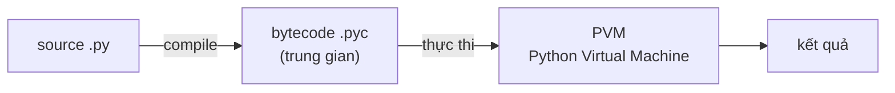

# Tổng quan Python

> [!summary] TL;DR
> Python là ngôn ngữ **thông dịch (interpreted)**, **dynamic typing** (kiểu gán lúc chạy) nhưng **strong typing** (không tự ép kiểu bừa), đa mô hình (thủ tục/OOP/hàm). Code `.py` được dịch ra **bytecode `.pyc`** rồi chạy trên **Python Virtual Machine** — bản hiện thực phổ biến nhất là **CPython** (viết bằng C). Cú pháp dùng **thụt lề (indentation)** thay cho `{}`. Quy ước viết code chuẩn là **PEP 8**. Triết lý ngôn ngữ tóm trong **Zen of Python** (`import this`).

---

## 1. Python chạy thế nào? (interpreted vs compiled)

Khác C/C++ biên dịch thẳng ra mã máy, Python đi qua 2 bước:



- **Bước 1 — compile:** trình thông dịch dịch `.py` → **bytecode** (lệnh trung gian, độc lập nền tảng), cache trong thư mục `__pycache__/`.
- **Bước 2 — interpret:** **PVM** đọc từng bytecode và thực thi.

> [!info] CPython là gì?
> **CPython** = bản hiện thực Python tham chiếu, viết bằng **C** (cái bạn tải ở python.org). Còn có **PyPy** (JIT, nhanh hơn), **Jython** (chạy trên JVM), **IronPython** (.NET). Khi nói "Python" mọi người mặc định CPython.

---

## 2. Dynamic typing vs Strong typing

Hai trục dễ nhầm — phỏng vấn rất hay hỏi:

| Trục | Python | Nghĩa |
|------|--------|-------|
| **Dynamic typing** | ✅ | Kiểu gắn với **giá trị**, xác định **lúc chạy**; biến không khai báo kiểu, có thể đổi kiểu: `x = 5` rồi `x = "hi"` |
| **Strong typing** | ✅ | **Không tự ép kiểu** vô lý: `"3" + 5` → **TypeError** (khác JavaScript ra `"35"`) |

> [!question] Phỏng vấn: "Python là static hay dynamic, weak hay strong typed?"
> **Dynamic + strong.** *Dynamic* = không cần khai báo kiểu, kiểm tra kiểu lúc chạy. *Strong* = không ngầm ép kiểu kiểu nguy hiểm như JS/PHP. Đừng nhầm "dynamic" với "weak" — đó là 2 trục khác nhau.

---

## 3. Thụt lề thay cho dấu ngoặc

Python dùng **indentation (thụt lề)** để xác định khối lệnh — không có `{}`:

```python
def greet(name):
    if name:                # khối if bắt đầu bằng thụt lề
        print(f"Hi {name}")
    else:
        print("Hi stranger")
```

Quy ước: **4 dấu cách** mỗi cấp (không trộn tab/space → `IndentationError`/`TabError`).

---

## 4. PEP 8 & Zen of Python

- **PEP 8** = style guide chính thức: `snake_case` cho biến/hàm, `PascalCase` cho class, `UPPER_CASE` cho hằng, dòng ≤ 79 ký tự, import đầu file. Công cụ: `black` (format), `flake8`/`ruff` (lint).
- **Zen of Python** (`import this`): "Readability counts", "Explicit is better than implicit", "There should be one obvious way to do it" — kim chỉ nam thiết kế.

```
★ Insight ─────────────────────────────────────
• Bytecode .pyc KHÔNG phải mã máy — vẫn cần PVM để chạy. Đó là lý do
  Python "chậm hơn C" nhưng "chạy đâu cũng được" (portable).
• "Dynamic" ≠ "weak". Python kiểm tra kiểu nghiêm (strong) — lỗi kiểu
  nổ ngay thay vì âm thầm cho kết quả sai như JS.
• PEP 8 không bắt buộc chạy được, nhưng đi làm/PV người ta đánh giá
  code qua nó. Dùng black/ruff để khỏi tranh cãi style.
─────────────────────────────────────────────────
```

---

## Tự kiểm tra

1. Python là interpreted hay compiled? Mô tả 2 bước từ `.py` đến kết quả.
2. CPython khác PyPy ở điểm gì?
3. "Dynamic typing" và "strong typing" — Python thuộc loại nào, khác nhau ra sao?
4. `"3" + 5` trong Python ra gì? Vì sao?

---

## Liên quan
- [[02-Bien-va-Kieu-du-lieu]] — kiểu dữ liệu & mutable/immutable
- [[18-Internals-GIL-GC]] — PVM, GIL, garbage collection
- [[../01-DSA/00-MOC-DSA|MOC DSA]] — nơi Python được dùng minh họa thuật toán
