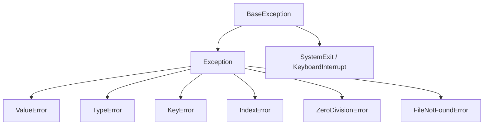

# Xử lý ngoại lệ (Exceptions)

> [!summary] TL;DR
> Lỗi lúc chạy được biểu diễn bằng **exception object**. Bắt và xử lý bằng **`try / except`**, kèm tùy chọn **`else`** (chạy khi *không* lỗi) và **`finally`** (luôn chạy, dù lỗi hay không — dùng dọn dẹp). Exception tạo thành **cây kế thừa** (gốc `BaseException` → `Exception` → các loại cụ thể). Chủ động ném lỗi bằng **`raise`**. Nguyên tắc: **bắt cụ thể, đừng nuốt lỗi trống** (`except:` trơn là phản mẫu).

---

## 1. try / except / else / finally

```python
try:
    x = int(input())
    result = 10 / x
except ValueError:                 # bắt loại cụ thể
    print("Không phải số")
except ZeroDivisionError as e:     # giữ object lỗi qua 'as'
    print(f"Chia 0: {e}")
else:
    print(f"OK: {result}")         # chạy khi KHÔNG có exception
finally:
    print("Luôn chạy")             # dọn dẹp, dù lỗi hay không
```

| Khối | Khi nào chạy |
|------|--------------|
| `try` | code có thể lỗi |
| `except` | khi có lỗi **khớp loại** |
| `else` | khi `try` **không** lỗi |
| `finally` | **luôn luôn** (cleanup: đóng file, release lock) |

---

## 2. Cây kế thừa Exception



- Bắt `Exception` bắt được hầu hết lỗi thường — nhưng **không** bắt `SystemExit`/`KeyboardInterrupt` (đó là lý do nên bắt `Exception`, không phải `BaseException`).
- Bắt loại **cụ thể trước**, chung sau.

> [!warning] Phản mẫu: nuốt lỗi
> ```python
> try:
>     risky()
> except:          # ❌ bắt MỌI thứ, kể cả Ctrl-C
>     pass         # ❌ nuốt lỗi im lặng → bug ẩn
> ```
> Luôn bắt **loại cụ thể** và **xử lý/ghi log**, đừng `pass` trống.

---

## 3. raise & custom exception

```python
def withdraw(balance, amount):
    if amount > balance:
        raise ValueError("Số dư không đủ")   # chủ động ném
    return balance - amount

# tự định nghĩa loại lỗi riêng (kế thừa Exception):
class InsufficientFunds(Exception):
    pass

raise InsufficientFunds("hết tiền")

# ném lại kèm ngữ cảnh:
try:
    ...
except KeyError as e:
    raise RuntimeError("Thiếu config") from e   # giữ chuỗi nguyên nhân
```

> [!question] Phỏng vấn: "`finally` để làm gì? Khác `else`?"
> `finally` **luôn chạy** dù có lỗi hay không, kể cả khi `return` trong `try` — dùng để **dọn dẹp** (đóng file, nhả tài nguyên). `else` chỉ chạy khi `try` **không** ném exception. Ngày nay đóng tài nguyên hay dùng **`with`** thay `finally` → [[11-File-IO-va-with]].

```
★ Insight ─────────────────────────────────────
• Python theo triết lý EAFP ("Easier to Ask Forgiveness than
  Permission"): cứ thử rồi bắt lỗi, thay vì kiểm tra trước (LBYL).
  Vd: thử dict[key] rồi bắt KeyError thay vì if key in dict.
• "except: pass" là một trong các phản mẫu nguy hiểm nhất — nó giấu
  bug và nuốt cả Ctrl-C. Luôn bắt cụ thể + log.
• finally chạy NGAY CẢ khi có return trong try — nền tảng cho cleanup
  đáng tin cậy (và là cái 'with' tự động hoá).
─────────────────────────────────────────────────
```

---

## Tự kiểm tra

1. Thứ tự & vai trò 4 khối try/except/else/finally?
2. Vì sao nên bắt `Exception` thay vì `BaseException` hay `except:` trơn?
3. `raise ... from e` để làm gì?
4. EAFP là gì, khác LBYL ra sao?

---

## Liên quan
- [[11-File-IO-va-with]] — `with` thay `finally` để đóng tài nguyên
- [[07-Ham]] — ném lỗi để báo điều kiện sai trong hàm
