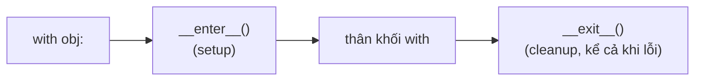

# Functional & Context manager

> [!summary] TL;DR
> **Lập trình hàm**: `map` (biến đổi mỗi phần tử), `filter` (giữ phần tử thỏa điều kiện), `functools.reduce` (gộp về 1 giá trị), thường kết hợp **lambda**. Trong Python, **comprehension thường rõ hơn `map`/`filter`**. **Context manager** = object dùng với `with`, định nghĩa **`__enter__`** (lúc vào) và **`__exit__`** (lúc ra, kể cả khi lỗi) — cơ chế đứng sau `with open(...)`. Viết nhanh context manager bằng decorator **`@contextlib.contextmanager`** + `yield`.

---

## 1. map / filter / reduce

```python
nums = [1, 2, 3, 4]

list(map(lambda x: x*2, nums))          # [2,4,6,8]   — biến đổi
list(filter(lambda x: x%2==0, nums))    # [2,4]       — lọc

from functools import reduce
reduce(lambda acc, x: acc + x, nums, 0) # 10          — gộp về 1 giá trị
```

| Hàm | Vai trò | Comprehension tương đương |
|-----|---------|---------------------------|
| `map(f, it)` | áp f lên từng phần tử | `[f(x) for x in it]` |
| `filter(p, it)` | giữ phần tử p(x) đúng | `[x for x in it if p(x)]` |
| `reduce(f, it)` | gộp dồn về 1 giá trị | (không có; dùng loop/`sum`) |

> [!tip] Pythonic: ưu tiên comprehension
> `map`/`filter` trả iterator (lazy) nhưng thường **kém rõ hơn comprehension**. Cộng đồng Python khuyên dùng comprehension; `reduce` chỉ dùng khi thật cần gộp tùy biến (cộng/nhân thì `sum`/`math.prod`).

---

## 2. Context manager là gì

`with` cần một object có **`__enter__`** và **`__exit__`**:

```python
class Timer:
    def __enter__(self):                 # chạy khi VÀO with
        import time
        self.t0 = time.perf_counter()
        return self                      # giá trị gán cho 'as'
    def __exit__(self, exc_type, exc_val, tb):   # chạy khi RA (cả khi lỗi)
        import time
        print(f"{time.perf_counter()-self.t0:.4f}s")
        return False                     # False = không nuốt exception

with Timer():
    sum(range(1_000_000))
# tự in thời gian khi rời khối
```



- `__exit__` nhận thông tin exception (nếu có). Trả `True` để **nuốt** lỗi, `False`/`None` để **cho lỗi lan ra**.

---

## 3. `@contextmanager` — viết nhanh

Khỏi viết class, dùng generator 1 `yield`:

```python
from contextlib import contextmanager

@contextmanager
def opened(path):
    f = open(path, encoding="utf-8")
    try:
        yield f               # phần trước yield = __enter__; giá trị yield = 'as'
    finally:
        f.close()             # phần sau yield = __exit__ (cleanup)

with opened("data.txt") as f:
    print(f.read())
```

> [!question] Phỏng vấn: "Context manager là gì? `with` chạy gì dưới nắp?"
> Là object định nghĩa **`__enter__`** (setup, chạy khi vào `with`, trả giá trị cho `as`) và **`__exit__`** (cleanup, chạy khi rời khối — **kể cả khi có exception**). `with obj as x:` ≈ gọi `obj.__enter__()` gán cho `x`, chạy thân, rồi luôn gọi `obj.__exit__()`. Dùng đảm bảo dọn tài nguyên (file, lock, DB connection, transaction). Viết nhanh bằng `@contextmanager` + `yield`.

```
★ Insight ─────────────────────────────────────
• map/filter là 'di sản' lập trình hàm; Python thiên về comprehension
  vì dễ đọc hơn. Biết cả hai, nhưng viết comprehension khi review.
• Context manager = cặp setup/teardown đảm bảo. __exit__ chạy DÙ có
  lỗi → đây là điều khiến 'with' an toàn hơn mở/đóng thủ công.
• @contextmanager + yield: phần TRƯỚC yield là enter, phần SAU (trong
  finally) là exit. Một generator đóng vai cả 2 nửa.
─────────────────────────────────────────────────
```

---

## Tự kiểm tra

1. `map`, `filter`, `reduce` mỗi cái làm gì? Comprehension thay được cái nào?
2. Vì sao cộng đồng Python ưa comprehension hơn map/filter?
3. Context manager cần 2 method nào? Mỗi cái chạy lúc nào?
4. `@contextmanager`: phần trước/sau `yield` đóng vai gì?

---

## Liên quan
- [[11-File-IO-va-with]] — `with open(...)` là context manager kinh điển
- [[07-Ham]] — lambda, hàm first-class cho map/filter/reduce
- [[08-Comprehension-va-Generator-expression]] — thay thế map/filter
