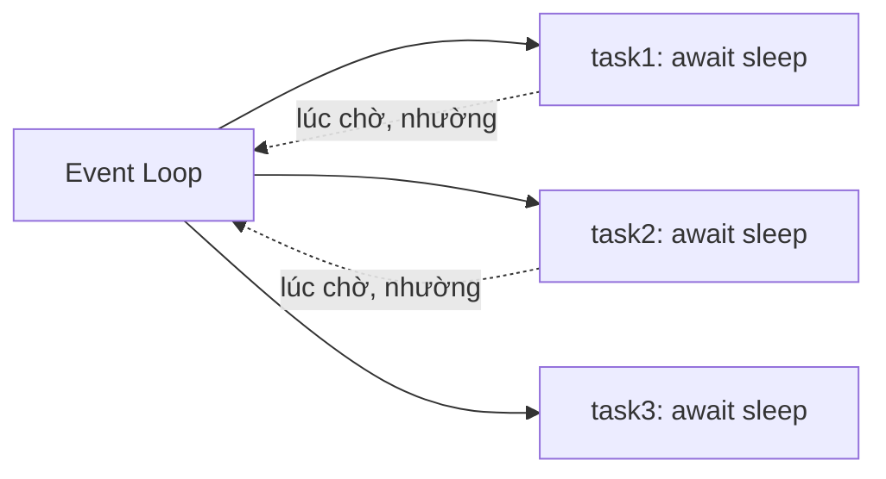

# Async (asyncio)

> [!summary] TL;DR
> **`async`/`await`** cho phép viết code **bất đồng bộ** đơn luồng: khi gặp tác vụ **I/O chờ** (gọi API, query DB, đọc file mạng), thay vì đứng chặn, chương trình **nhường CPU** cho tác vụ khác. Hàm `async def` tạo **coroutine** — chạy bởi **event loop** (`asyncio.run`). `await` "dừng chờ" một coroutine/awaitable mà không block luồng. Async **chỉ nhanh cho I/O-bound** (nhiều việc chờ), **không** giúp CPU-bound (do **GIL** → [[18-Internals-GIL-GC]]). Đây là nền của **FastAPI**.

---

## 1. Vấn đề: I/O chờ làm lãng phí thời gian

```python
# đồng bộ: 3 request × 1s = 3s (đứng chờ tuần tự)
def fetch_all():
    a = fetch("url1")     # chờ 1s
    b = fetch("url2")     # chờ 1s
    c = fetch("url3")     # chờ 1s
```

Lúc "chờ mạng", CPU **rảnh nhưng bị block**. Async tận dụng khoảng chờ đó.

---

## 2. async / await / event loop

```python
import asyncio

async def fetch(url):              # coroutine
    print(f"bắt đầu {url}")
    await asyncio.sleep(1)         # giả lập I/O — NHƯỜNG quyền lúc chờ
    print(f"xong {url}")
    return url

async def main():
    # chạy 3 coroutine ĐỒNG THỜI:
    results = await asyncio.gather(
        fetch("url1"), fetch("url2"), fetch("url3")
    )
    return results                 # ~1s tổng (không phải 3s)

asyncio.run(main())                # khởi động event loop
```



- `async def` → **coroutine** (gọi không chạy ngay, phải `await` hoặc đưa vào loop).
- `await x` → tạm dừng coroutine hiện tại, để event loop chạy việc khác, tới khi `x` xong.
- `asyncio.gather(...)` → chạy nhiều coroutine **đồng thời** (concurrency).

---

## 3. ⭐ Concurrency vs Parallelism

| | Async (asyncio) | Threading | Multiprocessing |
|---|-----------------|-----------|-----------------|
| Mô hình | 1 luồng, nhường lúc chờ | nhiều luồng | nhiều **tiến trình** |
| Hợp với | **I/O-bound** | I/O-bound | **CPU-bound** |
| Vượt GIL? | không (1 luồng) | không (GIL) | ✅ (mỗi process 1 GIL) |
| Chi phí | nhẹ nhất | trung bình | nặng (process riêng) |

> [!question] Phỏng vấn: "Async có làm code chạy song song nhanh hơn cho tính toán nặng không?"
> **Không.** Async là **concurrency đơn luồng** — chỉ thắng khi có nhiều **I/O chờ** (mạng, DB), vì nó tận dụng lúc chờ để làm việc khác. Với **CPU-bound** (tính toán nặng), async vô ích và **GIL** chặn threading thực sự song song → phải dùng **multiprocessing**. Quy tắc: **I/O-bound → async/threading; CPU-bound → multiprocessing.**

---

## 4. Liên hệ FastAPI

```python
@app.get("/users/{id}")
async def get_user(id: int):
    user = await db.fetch_user(id)     # await query DB, không block server
    return user
```

Một server async xử lý **hàng nghìn kết nối chờ I/O** trên ít luồng — lý do FastAPI/Node nhanh cho API.

```
★ Insight ─────────────────────────────────────
• async KHÔNG phải 'nhanh hơn' — nó là 'không đứng chờ vô ích'. Lợi
  ích đến từ chồng lấn thời gian CHỜ I/O, không từ thêm CPU.
• Coroutine họ hàng với generator: cả hai 'tạm dừng được'. await ~
  như yield điểm nhường. Vì thế chương 13 là bước đệm tự nhiên.
• Nhầm async với song song là lỗi kinh điển. Nhớ: I/O-bound → async;
  CPU-bound → multiprocessing (vì GIL).
─────────────────────────────────────────────────
```

---

## Tự kiểm tra

1. `async def` tạo ra gì? `await` làm gì khi gặp tác vụ I/O?
2. Async hợp với I/O-bound hay CPU-bound? Vì sao?
3. Phân biệt asyncio vs threading vs multiprocessing theo GIL.
4. `asyncio.gather` khác gọi `await` từng cái lần lượt thế nào?

---

## Liên quan
- [[18-Internals-GIL-GC]] — GIL: vì sao threading không song song thật
- [[13-Iterator-va-Generator]] — coroutine họ hàng generator (tạm dừng)
- [[../../02-Backend/00-MOC-Backend|MOC Backend]] — FastAPI dùng async
