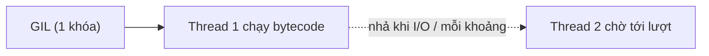

# Internals — GIL, GC, copy

> [!summary] TL;DR
> **GIL (Global Interpreter Lock)** = một khóa toàn cục trong CPython chỉ cho **một luồng chạy bytecode tại một thời điểm** → threading **không** chạy song song cho CPU-bound (nhưng vẫn ổn cho I/O). Bộ nhớ quản lý bằng **reference counting** (mỗi object đếm số tham chiếu, về 0 thì giải phóng) + **garbage collector** dọn **tham chiếu vòng (cycle)**. **`copy` nông (shallow)** chép vỏ ngoài, dùng chung object lồng bên trong; **`deepcopy` sâu** chép đệ quy toàn bộ. Hiểu các điểm này giải thích bẫy mutable default & aliasing ở [[02-Bien-va-Kieu-du-lieu]].

---

## 1. GIL — Global Interpreter Lock



- CPython dùng GIL để bảo vệ reference counting khỏi race condition → **đơn giản & nhanh cho code đơn luồng**, nhưng **chặn song song thật** giữa các thread.
- **Hệ quả:**
  - **CPU-bound** (tính toán) + threading → **không** nhanh hơn (các thread giành GIL). Dùng **multiprocessing** (mỗi process có GIL riêng).
  - **I/O-bound** + threading/async → vẫn tốt vì GIL được **nhả khi chờ I/O**.

> [!question] Phỏng vấn: "GIL là gì? Ảnh hưởng thế nào?"
> GIL là khóa toàn cục của CPython, đảm bảo **chỉ một luồng thực thi bytecode tại một thời điểm**. Hệ quả: đa luồng **không tăng tốc tác vụ CPU-bound** (phải dùng multiprocessing), nhưng **không cản tác vụ I/O-bound** (GIL nhả lúc chờ). Đây là lý do "async/threading cho I/O, multiprocessing cho CPU" → [[17-Async-asyncio]].

---

## 2. Quản lý bộ nhớ: reference counting + GC

```python
import sys
a = []
b = a
sys.getrefcount(a)     # số tham chiếu tới list (gồm cả tham chiếu tạm)
```

- **Reference counting:** mỗi object giữ bộ đếm; gán thêm tên → +1, xóa tên/ra khỏi scope → −1; về **0** thì giải phóng **ngay**.
- **Vấn đề cycle:** `a.x = b; b.x = a` → đếm không bao giờ về 0. **Garbage collector** (module `gc`) phát hiện & dọn các **vòng tham chiếu** này định kỳ.

---

## 3. ⭐ copy nông vs deepcopy

```python
import copy
original = [[1, 2], [3, 4]]

shallow = copy.copy(original)        # hoặc original[:] / list(original)
deep    = copy.deepcopy(original)

original[0].append(99)
shallow                              # [[1,2,99],[3,4]]  ← bị ảnh hưởng!
deep                                 # [[1,2],[3,4]]     ← độc lập hoàn toàn
```

| | Shallow copy | Deep copy |
|---|--------------|-----------|
| Chép | **vỏ ngoài**; object lồng **dùng chung** | **toàn bộ** đệ quy, độc lập |
| Hàm | `copy.copy`, `[:]`, `list(x)`, `dict(x)` | `copy.deepcopy` |
| Khi nào | 1 tầng, hoặc phần tử immutable | có **cấu trúc lồng mutable** |

> Đây cũng là gốc của bẫy **mutable default argument** ở [[07-Ham]]: default list dùng chung vì không hề được copy.

```
★ Insight ─────────────────────────────────────
• GIL là 'đánh đổi thiết kế': hi sinh song song đa luồng để có quản
  lý bộ nhớ đơn giản & C-extension dễ viết. Nhớ quy tắc I/O↔CPU.
• Reference counting giải phóng NGAY khi count=0 (khác Java đợi GC) —
  GC chỉ để dọn vòng tham chiếu mà refcount bỏ sót.
• Shallow copy chép 'cái khay', không chép 'món trên khay'. Lồng
  mutable → cần deepcopy, nếu không sửa bản này thấy ở bản kia.
─────────────────────────────────────────────────
```

---

## Tự kiểm tra

1. GIL là gì? Vì sao threading không tăng tốc CPU-bound?
2. Reference counting hoạt động ra sao? GC giải quyết vấn đề gì còn sót?
3. Shallow vs deep copy — khác nhau với list lồng list thế nào?
4. Liên hệ deepcopy với bẫy mutable default argument.

---

## Liên quan
- [[17-Async-asyncio]] — GIL & lựa chọn async/threading/multiprocessing
- [[02-Bien-va-Kieu-du-lieu]] — tham chiếu, mutable/immutable
- [[07-Ham]] — bẫy mutable default argument (gốc từ aliasing)
