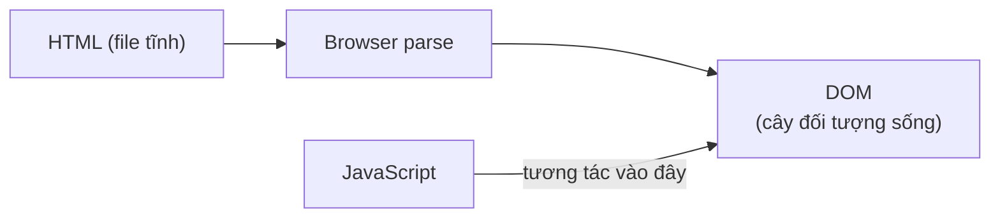

# DOM Tree và Node Types

> [!summary] TL;DR
> DOM (Document Object Model) là biểu diễn dạng cây của trang HTML — browser tạo ra khi load trang. JavaScript tương tác với DOM để làm trang dynamic. Có 4 loại node chính: Element (1), Text (3), Attribute (2), Comment (8).

---

## 1. Khái niệm

### DOM là gì?

**DOM = Document Object Model** — một API chuẩn của browser, biến HTML thành **cây đối tượng** mà JavaScript có thể đọc và thay đổi.



Ba khái niệm cần phân biệt:

| Khái niệm | Vai trò | Thay đổi khi JS chạy? |
|-----------|---------|----------------------|
| **HTML** | Xương sống tĩnh — cấu trúc ban đầu | ❌ Không |
| **DOM** | Biểu diễn sống của trang | ✅ Có |
| **JavaScript** | Ngôn ngữ tương tác với DOM | — |

> [!tip] HTML vs DOM trong DevTools
> Khi bạn mở DevTools > Elements, bạn đang xem **DOM hiện tại**, không phải file HTML gốc. JS có thể thêm/xóa element khỏi DOM mà file HTML không hề thay đổi. Refresh trang → DOM reset về HTML gốc.

### Cấu trúc cây DOM

```html
<!DOCTYPE html>
<html>
  <head><title>My Page</title></head>
  <body>
    <h1>Hello</h1>
    <p class="intro">World</p>
    
  </body>
</html>
```

DOM tree:
```text
Document
└── html (Element node)
    ├── head (Element node)
    │   └── title (Element node)
    │       └── "My Page" (Text node)
    └── body (Element node)
        ├── h1 (Element node)
        │   └── "Hello" (Text node)
        ├── p.intro (Element node)
        │   └── "World" (Text node)
        └── img (Element node)
```

---

## 2. Các loại Node

| Node Type | nodeType | Ví dụ |
|-----------|----------|-------|
| **Element node** | 1 | `<div>`, `<p>`, `` |
| **Attribute node** | 2 | `class="nav"`, `href="#"` |
| **Text node** | 3 | Văn bản bên trong tag |
| **Comment node** | 8 | `<!-- ghi chú -->` |
| Document node | 9 | `document` object |

> [!warning] Text node thường bị quên
> Khoảng trắng và ký tự xuống dòng giữa các tag cũng là **Text node**! Đây là lý do `parentNode.firstChild` đôi khi trả về `"\n  "` thay vì element. Dùng `firstElementChild` để chỉ lấy Element node.

```
★ Insight ─────────────────────────────────────
• "DOM là cây SỐNG, HTML là văn bản TĨNH" là phân biệt nền tảng cho mọi thứ phía
  sau: JS sửa DOM → trang đổi NGAY nhưng file .html không đổi; refresh → DOM dựng
  lại từ HTML gốc, mọi thay đổi JS biến mất. Hiểu điều này thì không bao giờ thắc
  mắc "sao sửa bằng JS mà view-source vẫn như cũ".
• Nhớ cặp đối ngẫu Node vs Element: childNodes/firstChild/nextSibling thấy MỌI
  node (kể cả Text khoảng trắng, Comment) — dễ dính "\n  "; children/
  firstElementChild/nextElementSibling chỉ thấy Element. 90% trường hợp bạn muốn
  bản "Element" — đây là bug kinh điển khi duyệt DOM.
─────────────────────────────────────────────────
```

### Kiểm tra nodeType trong DevTools Console

```javascript
// Click vào element trong DevTools Elements panel → $0 = element đó
$0.nodeType          // 1 = Element node
$0.firstChild        // Thường là Text node (khoảng trắng!)
$0.firstElementChild // Element node đầu tiên — dùng cái này
$0.nodeName          // "DIV", "P", "#text", "#comment"...
```

---

## 3. Ví dụ thực tế

### Ví dụ 1: Khám phá DOM tree bằng JavaScript

```html
<!DOCTYPE html>
<html lang="vi">
<head>
  <meta charset="UTF-8">
  <title>DOM Explorer</title>
</head>
<body>
  <div id="container">
    <h2>Tiêu đề</h2>
    <p class="desc">Đoạn văn bản</p>
    <!-- Đây là comment -->
  </div>

  <script>
    const container = document.getElementById('container');

    console.log('nodeType:', container.nodeType);  // 1 (Element)
    console.log('nodeName:', container.nodeName);  // "DIV"

    // Duyệt childNodes — kể cả Text và Comment
    console.log('--- childNodes (tất cả) ---');
    container.childNodes.forEach(node => {
      const types = { 1: 'Element', 3: 'Text', 8: 'Comment' };
      const typeName = types[node.nodeType] || 'Khác';
      const val = (node.nodeValue || '').trim();
      console.log(`[${typeName}] "${node.nodeName}" value="${val}"`);
    });

    // Chỉ lấy Element children
    console.log('--- children (chỉ Element) ---');
    Array.from(container.children).forEach(el => {
      console.log(`<${el.tagName.toLowerCase()}> class="${el.className}"`);
    });
  </script>
</body>
</html>
```

### Ví dụ 2: Đếm node types trong trang thực

```javascript
// Dán vào DevTools Console của bất kỳ trang nào
let counts = { Element: 0, Text: 0, Comment: 0 };
function countNodes(node) {
  if (node.nodeType === 1) counts.Element++;
  else if (node.nodeType === 3) counts.Text++;
  else if (node.nodeType === 8) counts.Comment++;
  node.childNodes.forEach(countNodes);
}
countNodes(document.body);
console.table(counts);
// Thử trên Google.com — bạn sẽ thấy hàng trăm Text nodes!
```

---

## 4. Pitfalls thường gặp

> [!warning] Pitfall 1: Script chạy trước DOM load xong
> Nếu `<script>` trong `<head>`, DOM chưa sẵn sàng khi script chạy → `getElementById` trả về `null`.
>
> **Fix:** Đặt script cuối `<body>`, hoặc dùng `DOMContentLoaded`:
> ```javascript
> document.addEventListener('DOMContentLoaded', () => {
>   // DOM đã sẵn sàng — code an toàn ở đây
> });
> ```

> [!warning] Pitfall 2: `childNodes` trả về cả Text nodes
> ```javascript
> // HTML: <ul>\n  <li>A</li>\n  <li>B</li>\n</ul>
> list.childNodes.length; // 5: text + li + text + li + text
> list.children.length;   // 2: chỉ li + li — dùng cái này!
> ```

---

## 5. Phỏng vấn thường gặp

**Q1: DOM là gì? Khác gì với HTML?**

> HTML là file văn bản tĩnh. DOM là **cây đối tượng sống** mà browser tạo ra từ HTML. JavaScript tương tác với DOM — khi JS thêm/xóa/sửa element, trang cập nhật ngay lập tức nhưng file HTML gốc không thay đổi.

**Q2: Có bao nhiêu loại node trong DOM? Phân biệt thế nào?**

> Phổ biến: **Element** (nodeType=1) cho HTML tags, **Text** (3) cho nội dung văn bản, **Comment** (8) cho chú thích. Kiểm tra bằng `.nodeType` hoặc `.nodeName`.

**Q3: Tại sao `document.getElementById()` trả về `null`?**

> Hai nguyên nhân phổ biến: (1) Script chạy trước DOM load — dùng `DOMContentLoaded`; (2) `id` viết sai (case-sensitive).

---

## 6. Bài tập thực hành

**Bài 1:** Tạo HTML lồng nhau. Viết JS log toàn bộ `childNodes` của `<body>`, phân loại Element/Text/Comment kèm giá trị.

**Bài 2:** Dùng DevTools Console đếm tổng Element và Text nodes trong `document.body` của trang Google.com. Giải thích tại sao số Text nodes lại nhiều hơn bạn nghĩ.

---

## 7. Liên kết

- [[02-Selecting-DOM-Elements]] — Cách chọn element từ DOM
- [[03-Traversing-DOM]] — Duyệt parent/child/sibling
- [[04-Modifying-DOM-Elements]] — Thay đổi content và style
- [[06-Event-Handling]] — Thêm tương tác vào DOM
