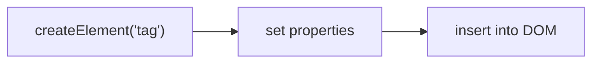

# Creating, Adding & Managing Nodes

> [!summary] TL;DR
> Tạo element bằng `createElement` → set nội dung bằng `textContent` → chèn vào DOM bằng `appendChild`/`insertBefore`/`prepend`/`append`. Quản lý: `cloneNode(true)`, `replaceChild`, `removeChild`/`.remove()`. Constructors tắt: `new Option()` cho select, `new Image()` cho img.

> [!tip] 🎯 Hiểu trong 30 giây
> Quy trình **thêm phần tử mới vào trang** gồm 3 bước, như *làm một món đồ rồi đặt vào nhà*:
> 1. **Tạo** thẻ: `const li = document.createElement('li')`.
> 2. **Đổ nội dung** vào: `li.textContent = 'Xin chào'` (dùng `textContent` cho an toàn).
> 3. **Gắn vào** cây DOM: `ul.appendChild(li)` (thêm vào cuối), hoặc `prepend` (đầu), `insertBefore` (trước một node).
>
> Bước 3 mới là lúc phần tử *hiện lên màn hình* — tạo xong mà chưa gắn thì chưa thấy gì. Xóa thì `el.remove()`. Mẹo hiệu năng: thêm nhiều node thì gom vào `DocumentFragment` rồi gắn *một lần* (xem [[13-DOM-Performance]]).

---

## 1. Khái niệm

Workflow tạo element mới:


Element tạo ra bằng `createElement` **không tự xuất hiện trên trang** — phải chèn vào DOM bằng append/insert methods.

```
★ Insight ─────────────────────────────────────
• Luôn là 2 BƯỚC tách rời: (1) tạo + cấu hình element "ngoài cây" (createElement,
  set textContent/class), (2) gắn vào DOM (append/insertBefore). Bug phổ biến
  nhất là quên bước 2 → "code chạy không lỗi mà chẳng thấy gì". Lợi thế của tách
  bước: cấu hình xong xuôi mới chèn → trình duyệt chỉ reflow đúng 1 lần.
• Chèn N phần tử trong vòng lặp = N lần reflow (tính lại layout) → giật. Gom vào
  DocumentFragment ("túi" ngoài cây) rồi append 1 lần → 1 reflow. Đây chính là
  ý tưởng nền của Virtual DOM trong React: gom thay đổi, áp dụng một lượt. Xem
  [[13-DOM-Performance]].
─────────────────────────────────────────────────
```

---

## 2. Cú pháp & Methods

### 2.1 Tạo element

```javascript
// createElement — tạo element bất kỳ
const p = document.createElement('p');
p.textContent = 'Đây là đoạn văn mới';
p.id = 'newParagraph';
p.classList.add('intro');
p.style.color = 'blue';

// Constructors tắt cho element phổ biến:

// new Option(text, value) — cho <select>
const opt = new Option('Marketing', 'marketing');
// new Option(text, value, defaultSelected, selected)
document.getElementById('deptSelect').appendChild(opt);

// new Image(width, height) — cho 
const img = new Image(200, 150);
img.src = 'photo.jpg';
img.alt = 'Employee photo';
```

### 2.2 Chèn vào DOM

```javascript
const list = document.getElementById('taskList');
const newItem = document.createElement('li');
newItem.textContent = 'Nhiệm vụ mới';

// appendChild — thêm vào CUỐI parent
list.appendChild(newItem);

// insertBefore(newNode, referenceNode) — chèn TRƯỚC referenceNode
const firstItem = list.firstElementChild;
list.insertBefore(newItem, firstItem); // thêm vào đầu

// prepend / append (modern — ES2017)
list.prepend(newItem);           // thêm vào đầu
list.append(newItem);            // thêm vào cuối
list.append('Văn bản thuần');    // append cả text node

// insertAdjacentElement — chèn relative đến element
list.insertAdjacentElement('beforebegin', newItem); // trước list
list.insertAdjacentElement('afterend', newItem);    // sau list
list.insertAdjacentElement('afterbegin', newItem);  // đầu trong list
list.insertAdjacentElement('beforeend', newItem);   // cuối trong list (giống append)
```

### 2.3 Clone node

```javascript
const list = document.getElementById('taskList');

// cloneNode(true) — clone element VÀ tất cả children
const clone = list.firstElementChild.cloneNode(true);
clone.textContent = 'Nhiệm vụ cloned'; // override content
list.appendChild(clone); // vẫn phải append!

// cloneNode(false) — clone chỉ element, không có children
const emptyClone = list.firstElementChild.cloneNode(false);
```

### 2.4 Replace & Remove

```javascript
const announcements = document.getElementById('announcements');

// replaceChild(newChild, oldChild) — thay thế child
const newAnnouncement = document.createElement('p');
newAnnouncement.textContent = 'Văn phòng mới khai trương tháng tới';
const oldAnnouncement = document.getElementById('announcementText');
announcements.replaceChild(newAnnouncement, oldAnnouncement);

// removeChild — xóa child khỏi parent
if (announcements.firstElementChild) {
  announcements.removeChild(announcements.firstElementChild);
}

// .remove() — modern, xóa element trực tiếp (không cần parent)
document.getElementById('oldBanner')?.remove();
```

---

## 3. Ví dụ thực tế

### Ví dụ 1: Todo List — thêm/xóa/ưu tiên

```html
<!DOCTYPE html>
<html lang="vi">
<head>
  <meta charset="UTF-8"><title>Todo List</title>
  <style>
    #todoList li { padding: 8px; border: 1px solid #ddd; margin: 4px; cursor: pointer; }
    #todoList li:hover { background: #f0f0f0; }
  </style>
</head>
<body>
  <input id="newTaskInput" type="text" placeholder="Nhiệm vụ mới...">
  <button id="addTaskBtn">Thêm</button>
  <button id="removeFirstBtn">Xóa đầu</button>
  <button id="prioritizeLastBtn">Ưu tiên cuối</button>
  <ul id="todoList">
    <li>Đọc tài liệu DOM</li>
    <li>Làm bài tập</li>
  </ul>

  <script>
    document.addEventListener('DOMContentLoaded', () => {
      const input     = document.getElementById('newTaskInput');
      const addBtn    = document.getElementById('addTaskBtn');
      const removeBtn = document.getElementById('removeFirstBtn');
      const priBtn    = document.getElementById('prioritizeLastBtn');
      const todoList  = document.getElementById('todoList');

      // Thêm nhiệm vụ mới
      addBtn.addEventListener('click', () => {
        const task = input.value.trim();
        if (!task) return;

        const li = document.createElement('li');
        li.textContent = task; // textContent — an toàn với user input
        todoList.appendChild(li);
        input.value = '';
        input.focus();
      });

      // Xóa nhiệm vụ đầu tiên
      removeBtn.addEventListener('click', () => {
        const first = todoList.firstElementChild;
        if (first) first.remove();
      });

      // Đưa nhiệm vụ cuối lên đầu
      priBtn.addEventListener('click', () => {
        const children = todoList.children;
        if (children.length < 2) return;
        const last = todoList.lastElementChild;
        todoList.insertBefore(last, todoList.firstElementChild);
      });
    });
  </script>
</body>
</html>
```

### Ví dụ 2: Populate dropdown từ data

```javascript
// Điền options vào <select> từ mảng dữ liệu
function populateSelect(selectId, options) {
  const select = document.getElementById(selectId);
  select.textContent = ''; // xóa options cũ (tránh dùng innerHTML)

  // Thêm placeholder
  const placeholder = new Option('-- Chọn --', '');
  placeholder.disabled = true;
  placeholder.selected = true;
  select.appendChild(placeholder);

  // Thêm options từ data
  options.forEach(({ label, value }) => {
    select.appendChild(new Option(label, value));
  });
}

populateSelect('deptSelect', [
  { label: 'Kỹ thuật', value: 'engineering' },
  { label: 'Marketing', value: 'marketing' },
  { label: 'Kế toán', value: 'accounting' },
]);
```

---

## 4. Pitfalls thường gặp

> [!warning] Pitfall 1: Quên append vào DOM
> `createElement` tạo element "trong không khí" — không hiện trên trang cho đến khi append:
> ```javascript
> const p = document.createElement('p');
> p.textContent = 'Không thấy gì';  // tạo xong nhưng chưa append
> // Fix:
> document.body.appendChild(p);     // bây giờ mới hiện
> ```

> [!warning] Pitfall 2: `removeChild` cần đúng parent
> ```javascript
> // Lỗi: NotFoundError nếu item không phải direct child của list
> list.removeChild(someNestedElement);
>
> // Fix: dùng .remove() trực tiếp trên element
> someNestedElement.remove();
>
> // Hoặc dùng đúng parent:
> someNestedElement.parentElement.removeChild(someNestedElement);
> ```

> [!tip] Performance: DocumentFragment
> Khi thêm nhiều element cùng lúc, dùng `DocumentFragment` để chỉ trigger reflow 1 lần:
> ```javascript
> const fragment = document.createDocumentFragment();
> items.forEach(item => {
>   const li = document.createElement('li');
>   li.textContent = item.name;
>   fragment.appendChild(li);    // không trigger reflow
> });
> list.appendChild(fragment);   // 1 lần reflow duy nhất
> ```

---

## 5. Phỏng vấn thường gặp

> [!example] 🗣️ Trả lời mẫu (nói thành lời) — "Vì sao dùng `DocumentFragment` khi thêm nhiều element?"
> *"Vì mỗi lần chèn node trực tiếp vào DOM đang hiển thị có thể khiến trình duyệt phải reflow và repaint, làm chậm khi số lượng lớn. DocumentFragment là một vùng chứa tạm nằm ngoài cây hiển thị, em tạo và append hết các node vào fragment đó trước, rồi chỉ append fragment vào DOM một lần. Như vậy chỉ tốn một lần cập nhật layout thay vì hàng trăm lần, render danh sách lớn mượt hơn hẳn. Ngoài ra em cũng lưu lại tham chiếu phần tử cha thay vì tìm lại trong vòng lặp để đỡ tốn."*

> [!note] 🧠 Mẹo nhớ
> **Tạo (`createElement`) → đổ nội dung (`textContent`) → gắn (`appendChild`).** Thêm nhiều → **gom vào `DocumentFragment` rồi gắn 1 lần** (giảm reflow). `cloneNode(true)` = deep nhưng **không** copy listener.

**Q1: Khác nhau giữa `appendChild` và `append`?**

> `appendChild(node)` — chỉ nhận Node object, trả về node đã thêm. `append(nodeOrString, ...)` — nhận nhiều Node hoặc string, không trả về gì. `append` hiện đại hơn và linh hoạt hơn. Tương tự: `prepend` vs `insertBefore(node, firstChild)`.

**Q2: `cloneNode(true)` vs `cloneNode(false)`?**

> `true` — clone element và toàn bộ children (deep clone). `false` — clone chỉ element, không có children (shallow). **Lưu ý: event listeners không được clone** — phải attach lại sau khi clone.

**Q3: Tại sao nên dùng `DocumentFragment` khi thêm nhiều elements?**

> Mỗi lần append vào DOM trigger browser **reflow** (tính toán lại layout). `DocumentFragment` là "bộ nhớ đệm" không thuộc DOM — thêm tất cả elements vào đó trước, rồi append fragment vào DOM 1 lần — chỉ 1 reflow.

---

## 6. Bài tập thực hành

**Bài 1:** Tạo shopping cart: form nhập tên + giá sản phẩm, nút "Thêm" tạo list item mới, nút "Xóa" trên mỗi item, tổng giá tự cập nhật.

**Bài 2:** Viết `createTable(data, columns)` — nhận mảng objects và array tên cột, tạo `<table>` với `thead`/`tbody` và append vào `#tableContainer`.

---

## 7. Liên kết

- [[02-Selecting-DOM-Elements]] — Select element parent trước khi append
- [[04-Modifying-DOM-Elements]] — Set content/attribute trên element mới tạo
- [[06-Event-Handling]] — Gắn events vào elements mới tạo
- [[08-List-Table-Rendering]] — Render list và table từ data array
