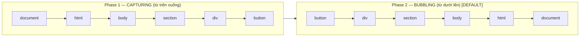

# Event Propagation & Delegation

> [!summary] TL;DR
> Event propagation (sự lan truyền sự kiện) có 2 pha: **Bubbling** (nổi bọt — mặc định: sự kiện "nổi" từ phần tử bị click *lên dần* các phần tử cha tới gốc) và **Capturing** (bắt giữ — ngược lại: từ gốc *đi xuống* phần tử bị click). `stopPropagation()` = chặn sự lan truyền đó. **Event Delegation** (ủy quyền sự kiện) = gắn **1 listener duy nhất** ở phần tử cha, rồi dùng `e.target` (phần tử thực bị click) + `closest()` để biết click vào item nào — nhẹ và tiện hơn nhiều so với gắn listener riêng cho từng item.

> [!tip] 🎯 Hiểu trong 30 giây
> Khi bạn bấm vào một nút nằm trong nhiều lớp thẻ lồng nhau, sự kiện click không chỉ "ở lại" cái nút — nó **nổi bọt (bubbling) lan lên** từng thẻ cha: nút → div → section → ... lên tới gốc. Ví von: thả viên sỏi xuống đáy ly, **bọt khí nổi dần lên mặt nước**. Vì thế thẻ cha (cũng có `onClick`) cũng bị kích hoạt theo.
> - Muốn **chặn việc lan lên** đó → `e.stopPropagation()` (dừng nổi bọt tại chỗ).
> - Muốn **chặn hành vi mặc định** của trình duyệt (link nhảy trang, form reload) → `e.preventDefault()`. *(Hai cái khác nhau, đừng lẫn.)*
>
> **Event Delegation = "tận dụng" bubbling:** thay vì gắn 1000 listener cho 1000 `<li>`, ta gắn **đúng 1 listener** ở thẻ cha `<ul>`; click ở `<li>` nào sẽ nổi lên `<ul>`, ta hỏi `e.target` để biết là cái nào. Lợi: **nhẹ bộ nhớ** + **tự áp dụng cho item thêm vào sau** (listener gắn trực tiếp lên item cũ thì "mù" với item mới).

---

## 1. Khái niệm

### Event Propagation — Hai pha

Khi click vào `<button>` bên trong `<div>` bên trong `<section>`, event không chỉ xảy ra ở button — nó **lan truyền**:



`addEventListener(event, fn)` mặc định là **bubbling** (phase 2). Truyền `true` làm tham số thứ 3 để bắt capturing.

```
★ Insight ─────────────────────────────────────
• Event Delegation KHÔNG phải kỹ thuật riêng — nó chỉ là "cưỡi lên" bubbling:
  vì click ở <li> tự nổi lên <ul>, ta đặt 1 listener ở <ul> rồi hỏi e.target là
  ai. Hiểu bubbling = tự suy ra được delegation, không cần học thuộc tách rời.
• Delegation thắng ở 2 điểm khó thay thế: (1) 1 listener thay vì N → nhẹ bộ nhớ
  với list dài; (2) tự động áp dụng cho item THÊM SAU khi page load — listener
  gắn trực tiếp lên item cũ thì "mù" với item mới. Đây là lý do framework (React)
  cũng gắn 1 listener ở gốc thay vì mỗi phần tử một cái.
─────────────────────────────────────────────────
```

---

## 2. Cú pháp

### 2.1 Bubbling — mặc định

```javascript
const btn         = document.getElementById('btn');
const innerDiv    = document.getElementById('innerDiv');
const outerDiv    = document.getElementById('outerDiv');

btn.addEventListener('click',      () => console.log('Button clicked'));
innerDiv.addEventListener('click', () => console.log('Inner div clicked'));
outerDiv.addEventListener('click', () => console.log('Outer div clicked'));

// Click button → log theo thứ tự:
// "Button clicked" → "Inner div clicked" → "Outer div clicked"
// (bubbles up)
```

### 2.2 Capturing — truyền `true`

```javascript
btn.addEventListener('click',      () => console.log('Button'), true);
innerDiv.addEventListener('click', () => console.log('Inner'), true);
outerDiv.addEventListener('click', () => console.log('Outer'), true);

// Click button → log theo thứ tự:
// "Outer" → "Inner" → "Button"
// (captures down)
```

### 2.3 stopPropagation()

```javascript
btn.addEventListener('click', (e) => {
  console.log('Button clicked');
  e.stopPropagation(); // dừng tại đây — không bubble lên div
});

innerDiv.addEventListener('click', () => {
  console.log('Inner div — không bao giờ chạy nếu click vào button');
});
```

### 2.4 preventDefault()

```javascript
// Ngăn hành vi mặc định của browser
document.getElementById('resourceLink').addEventListener('click', (e) => {
  e.preventDefault(); // không navigate đến href
  console.log('Link clicked nhưng không navigate');
});

document.getElementById('myForm').addEventListener('submit', (e) => {
  e.preventDefault(); // không reload trang
  console.log('Form submitted — xử lý bằng JS');
  // Gọi API, validate...
});
```

### 2.5 Event Delegation

```javascript
// Thay vì gắn listener trên từng <li> (không efficient):
// document.querySelectorAll('li').forEach(li => li.addEventListener('click', ...))

// Gắn 1 listener trên parent
const agendaList = document.getElementById('agendaList');

agendaList.addEventListener('click', (e) => {
  // e.target = element thực sự được click
  if (e.target.tagName === 'LI') {
    e.target.remove(); // xóa item được click
  }
});

// Với closest() — xử lý click vào element con bên trong li
agendaList.addEventListener('click', (e) => {
  const item = e.target.closest('li');
  if (!item) return; // click vào gap, không phải li
  item.classList.toggle('done');
});
```

---

## 3. Ví dụ thực tế

### Ví dụ 1: Bubbling demo trực quan

```html
<!DOCTYPE html>
<html lang="vi">
<head>
  <meta charset="UTF-8"><title>Event Propagation</title>
  <style>
    .outer { background: #ffcccc; padding: 30px; cursor: pointer; }
    .inner { background: #ccffcc; padding: 20px; }
    button { padding: 10px 20px; }
    #log   { margin-top: 10px; font-family: monospace; }
  </style>
</head>
<body>
  <div class="outer" id="outer">
    Outer div
    <div class="inner" id="inner">
      Inner div
      <button id="btn">Button</button>
    </div>
  </div>
  <div id="log"></div>
  <button onclick="document.getElementById('log').textContent=''">Clear</button>

  <script>
    const log = document.getElementById('log');
    function addLog(msg) {
      log.textContent += msg + '\n';
    }

    // Bubbling (mặc định)
    document.getElementById('btn').addEventListener('click', () => addLog('▶ Button'));
    document.getElementById('inner').addEventListener('click', () => addLog('▶ Inner div'));
    document.getElementById('outer').addEventListener('click', () => addLog('▶ Outer div'));

    // Click nút → thấy thứ tự bubble từ trong ra ngoài
  </script>
</body>
</html>
```

### Ví dụ 2: Event Delegation — Dynamic Todo

```html
<!DOCTYPE html>
<html lang="vi">
<head>
  <meta charset="UTF-8"><title>Event Delegation</title>
  <style>
    .todo-item { display: flex; align-items: center; gap: 8px; padding: 8px; border: 1px solid #ddd; margin: 4px; }
    .todo-item.done span { text-decoration: line-through; color: #999; }
  </style>
</head>
<body>
  <input id="newTodo" type="text" placeholder="Nhiệm vụ mới...">
  <button id="addBtn">Thêm</button>

  <ul id="todoList"></ul>

  <script>
    document.addEventListener('DOMContentLoaded', () => {
      const list   = document.getElementById('todoList');
      const input  = document.getElementById('newTodo');
      const addBtn = document.getElementById('addBtn');

      // Thêm item
      function addTodo(text) {
        const li = document.createElement('li');
        li.className = 'todo-item';

        const checkbox = document.createElement('input');
        checkbox.type = 'checkbox';
        checkbox.className = 'todo-check';

        const span = document.createElement('span');
        span.textContent = text; // textContent — an toàn

        const delBtn = document.createElement('button');
        delBtn.textContent = 'Xóa';
        delBtn.className = 'btn-delete';

        li.append(checkbox, span, delBtn);
        list.appendChild(li);
      }

      addBtn.addEventListener('click', () => {
        const text = input.value.trim();
        if (!text) return;
        addTodo(text);
        input.value = '';
      });

      // EVENT DELEGATION — 1 listener cho toàn bộ list
      list.addEventListener('click', (e) => {
        const item = e.target.closest('.todo-item');
        if (!item) return;

        // Click checkbox → toggle done
        if (e.target.classList.contains('todo-check')) {
          item.classList.toggle('done');
        }

        // Click nút xóa
        if (e.target.classList.contains('btn-delete')) {
          item.remove();
        }
      });

      // Seed data
      ['Đọc tài liệu', 'Làm bài tập', 'Review PR'].forEach(addTodo);
    });
  </script>
</body>
</html>
```

---

## 4. Pitfalls thường gặp

> [!warning] Pitfall 1: Không hiểu tại sao parent cũng fire event
> Click vào `<button>` trong `<div>` → `div.onclick` cũng chạy vì **bubbling**. Nếu chỉ muốn button handle event, dùng `e.stopPropagation()` hoặc kiểm tra `if (e.target === btn)`.

> [!warning] Pitfall 2: Event delegation với dynamic children
> Nếu thêm element vào DOM sau khi page load, listener gắn trực tiếp trên element cũ không hoạt động với element mới. **Event delegation trên parent** xử lý được cả elements tạo ra sau:
> ```javascript
> // Không tốt — chỉ hoạt động với items hiện có
> document.querySelectorAll('.item').forEach(item => item.addEventListener('click', fn));
>
> // Tốt — hoạt động với items thêm sau
> document.getElementById('list').addEventListener('click', (e) => {
>   if (e.target.closest('.item')) fn(e);
> });
> ```

> [!tip] e.target.closest() trong delegation
> `e.target` có thể là element con (icon, span) bên trong item bạn quan tâm. `e.target.closest('.item')` leo lên tìm wrapper — xử lý được click mọi nơi trong item.

---

## 5. Phỏng vấn thường gặp

> [!example] 🗣️ Trả lời mẫu (nói thành lời) — "Event Bubbling là gì? Button trong div, cả hai có onClick, làm sao click button KHÔNG kích hoạt div?"
> *"Event bubbling là hiện tượng khi một sự kiện xảy ra ở phần tử con, nó nổi bọt lan dần lên các phần tử cha cho tới gốc. Nên nếu button nằm trong div và cả hai cùng có onClick, khi em bấm button thì handler của button chạy trước, rồi sự kiện nổi lên làm handler của div cũng chạy theo. Để click button mà không kích hoạt div, em gọi `e.stopPropagation()` ngay trong handler của button — nó chặn sự kiện nổi lên cha. Trong React thì cũng tương tự, gọi `e.stopPropagation()` trong onClick của button. Lưu ý phân biệt với `preventDefault` là chặn hành vi mặc định của trình duyệt chứ không phải chặn lan truyền."*

> [!example] 🗣️ Trả lời mẫu — "Render 1000 item: vì sao dùng Event Delegation thay vì gắn 1000 onClick?"
> *"Vì gắn 1000 listener tốn bộ nhớ và chậm, lại không tự áp dụng cho item thêm vào sau. Event delegation tận dụng bubbling: em chỉ gắn một listener ở phần tử cha như cái ul, click ở li bất kỳ sẽ nổi lên ul, em đọc `e.target` để biết item nào được click, thường kèm `e.target.closest('li')` để bắt cả khi click vào phần tử con bên trong item. Như vậy chỉ một listener phục vụ cả nghìn item, nhẹ hơn nhiều, và những item được thêm động sau khi tải trang cũng tự hoạt động vì listener nằm ở cha."*

> [!note] 🧠 Mẹo nhớ
> **Bubbling = sự kiện nổi bọt từ con LÊN cha.** Chặn nổi → **`stopPropagation()`**; chặn hành vi mặc định trình duyệt → **`preventDefault()`**. **Delegation = 1 listener ở cha + `e.target`** → nhẹ + áp được item thêm sau.

**Q1: Event Bubbling là gì? Làm thế nào dừng nó?**

> Bubbling = event lan truyền từ target element lên các ancestor trong DOM tree. Dừng bằng `e.stopPropagation()` — event không bubble lên parent nữa. Tuy nhiên, dùng cẩn thận vì có thể break event delegation của component khác.

**Q2: Event Delegation là gì? Lợi ích?**

> Thay vì gắn listener riêng từng item, gắn **1 listener trên parent** và dùng `e.target` để xác định item nào được click. Lợi ích: (1) ít listeners = ít memory, (2) hoạt động với elements thêm dynamically sau page load, (3) code gọn hơn cho lists dài.

**Q3: `e.preventDefault()` vs `e.stopPropagation()` — khác nhau?**

> `preventDefault()` — ngăn **hành vi mặc định** của browser (navigate link, reload form, checkbox toggle). `stopPropagation()` — ngăn **event lan truyền** lên/xuống DOM tree. Hai cái độc lập — có thể dùng một hoặc cả hai.

---

## 6. Bài tập thực hành

**Bài 1:** Tạo nested `<div>` 3 cấp, mỗi cấp có màu khác nhau và click listener. Click vào div trong cùng và quan sát thứ tự bubbling. Sau đó thêm `stopPropagation()` ở cấp 2 và kiểm tra lại.

**Bài 2:** Xây dựng shopping cart dùng event delegation: list sản phẩm, mỗi item có nút "+", "-", "Xóa". Chỉ dùng **1 listener** trên container để handle tất cả 3 loại nút.

---

## 7. Liên kết

- [[06-Event-Handling]] — addEventListener cơ bản
- [[03-Traversing-DOM]] — closest() để tìm element trong delegation
- [[10-Form-Validation]] — preventDefault() trong form submit
- [[09-Fetch-API]] — Gọi API sau khi prevent default
