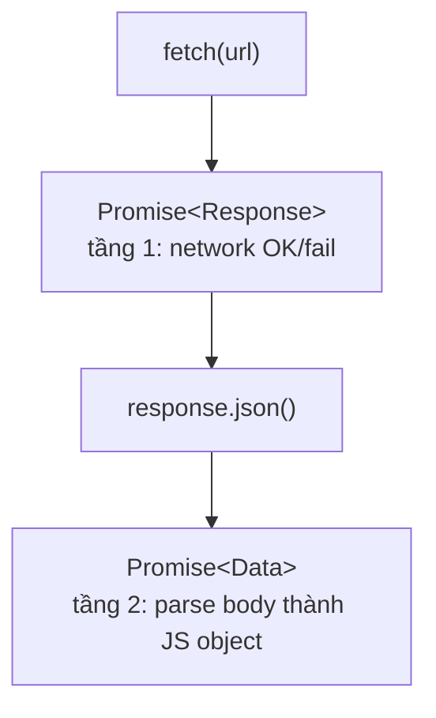

# Fetch API

> [!summary] TL;DR
> `fetch(url)` trả về **Promise 2 tầng** (2 lần phải đợi): tầng 1 trả về `Response` (chỉ cho biết *gửi request thành công về mặt mạng*, kèm mã trạng thái), tầng 2 gọi `.json()` mới đọc & chuyển body thành dữ liệu JS thật. **Quan trọng:** lỗi HTTP 4xx/5xx (404, 500...) **KHÔNG** rơi vào `.catch()` — `fetch` vẫn coi là "thành công" vì server *có* trả lời; phải **tự kiểm tra `response.ok`**. Dùng `async/await` cho dễ đọc hơn chuỗi `.then()`.

> [!tip] 🎯 Hiểu trong 30 giây
> `fetch` là cách hiện đại để **gọi API lấy dữ liệu**. Hai điều người mới hay vấp:
> 1. **Phải đợi 2 lần:** `const res = await fetch(url)` mới chỉ lấy được "phong bì" (trạng thái + headers); muốn lấy "lá thư" (dữ liệu thật) phải `await res.json()` lần nữa.
> 2. **`fetch` KHÔNG tự coi 404/500 là lỗi.** Với nó, "thành công" = *server có trả lời* — dù trả lời là "404 Không tìm thấy". Nó chỉ nhảy vào `catch` khi **không gửi nổi request** (mất mạng, DNS hỏng, bị CORS chặn). → Bạn **phải tự** kiểm tra `if (!res.ok) throw ...` trước khi đọc dữ liệu, nếu không sẽ âm thầm parse nhầm body lỗi. (Đây là khác biệt lớn so với thư viện `axios` — axios tự ném lỗi ở 4xx/5xx.)

---

## 1. Khái niệm

### Tại sao cần Fetch API?

Trước Fetch API, ta dùng `XMLHttpRequest` (XHR) — cú pháp phức tạp với nhiều callback lồng nhau. Fetch API (ES2015+) cung cấp interface dựa trên Promise, gọn và dễ đọc hơn nhiều.



### Lỗi HTTP vs Lỗi Network

| Loại lỗi | fetch() phản ứng thế nào |
|---|---|
| Network error (mất mạng, DNS fail) | Reject → vào `.catch()` |
| HTTP 200 OK | Resolve → `response.ok = true` |
| HTTP 404 Not Found | Resolve → `response.ok = false` |
| HTTP 500 Server Error | Resolve → `response.ok = false` |

> [!warning] Pitfall cốt lõi
> `fetch` chỉ reject khi **không thể gửi request** (mất kết nối). HTTP 4xx/5xx vẫn resolve — bạn phải tự kiểm tra `response.ok` hoặc `response.status`.

```
★ Insight ─────────────────────────────────────
• Mô hình lỗi của fetch trái trực giác: "404 vẫn coi là THÀNH CÔNG" vì với fetch,
  "thành công" = server có TRẢ LỜI (dù trả lời là lỗi). Chỉ khi không gửi nổi
  request (mất mạng, DNS, CORS chặn) mới reject. Hệ quả: KHÔNG check response.ok
  = âm thầm gọi .json() trên body lỗi → bug khó tìm. Đây là khác biệt số 1 so với axios (axios tự ném lỗi ở 4xx/5xx).
• Hai await không phải dư thừa: await thứ nhất chờ HEADERS về (biết status), body
  vẫn đang stream; await thứ hai (.json()) mới đọc + parse hết body. Tách 2 bước
  cho phép quyết định SỚM (vd thấy 401 thì bỏ, khỏi tốn công parse). Nền tảng
  Promise/async xem [[04-Promise]] và [[05-Async-Await]].
─────────────────────────────────────────────────
```

---

## 2. Cú pháp

### 2.1 Fetch cơ bản với `.then()`

```javascript
fetch('https://jsonplaceholder.typicode.com/users/1')
  .then(response => {
    if (!response.ok) {
      throw new Error('HTTP ' + response.status);
    }
    return response.json(); // trả về Promise<data>
  })
  .then(data => {
    console.log(data.name); // "Leanne Graham"
  })
  .catch(error => {
    console.error('Lỗi:', error.message);
  });
```

### 2.2 Fetch với async/await (dễ đọc hơn)

```javascript
async function getUser(id) {
  try {
    const response = await fetch(`https://jsonplaceholder.typicode.com/users/${id}`);

    if (!response.ok) {
      throw new Error(`HTTP error: ${response.status}`);
    }

    const data = await response.json();
    return data;
  } catch (error) {
    console.error('Lỗi khi lấy user:', error.message);
    return null;
  }
}

getUser(1).then(user => {
  if (user) console.log(user.name);
});
```

### 2.3 POST request

```javascript
async function createPost(title, body) {
  const response = await fetch('https://jsonplaceholder.typicode.com/posts', {
    method: 'POST',
    headers: { 'Content-Type': 'application/json' },
    body: JSON.stringify({ title, body, userId: 1 }),
  });

  if (!response.ok) throw new Error('POST thất bại: ' + response.status);
  return response.json();
}
```

### 2.4 Fetch và render vào DOM

```javascript
async function loadAndRenderUsers() {
  const statusEl = document.getElementById('status');
  const listEl   = document.getElementById('userList');

  statusEl.textContent = 'Đang tải...';

  try {
    const response = await fetch('https://jsonplaceholder.typicode.com/users');
    if (!response.ok) throw new Error('Không lấy được dữ liệu');

    const users    = await response.json();
    const fragment = document.createDocumentFragment();

    users.forEach(user => {
      const li       = document.createElement('li');
      const strong   = document.createElement('strong');
      strong.textContent = user.name;

      const small       = document.createElement('small');
      small.textContent = ' — ' + user.email;

      li.append(strong, small);
      fragment.appendChild(li);
    });

    listEl.replaceChildren(fragment);
    statusEl.textContent = `Tải xong ${users.length} người dùng.`;
  } catch (err) {
    statusEl.textContent = 'Lỗi: ' + err.message;
  }
}

document.addEventListener('DOMContentLoaded', loadAndRenderUsers);
```

### 2.5 Render dữ liệu vào bảng

```javascript
async function loadAndRenderTable(url, tableId) {
  const table = document.getElementById(tableId);

  try {
    const res  = await fetch(url);
    if (!res.ok) throw new Error('HTTP ' + res.status);
    const data = await res.json();

    if (!data.length) return;

    // Header từ keys
    const thead  = table.createTHead();
    const hRow   = thead.insertRow();
    Object.keys(data[0]).forEach(key => {
      const th       = document.createElement('th');
      th.textContent = key;
      hRow.appendChild(th);
    });

    // Rows
    const tbody = table.createTBody();
    data.forEach(item => {
      const row = tbody.insertRow(-1);
      Object.values(item).forEach(val => {
        const cell       = row.insertCell(-1);
        cell.textContent = val ?? '—';
      });
    });
  } catch (err) {
    const row  = table.insertRow();
    const cell = row.insertCell();
    cell.textContent = 'Lỗi tải dữ liệu: ' + err.message;
    cell.colSpan = 99;
  }
}
```

---

## 3. Ví dụ thực tế

### Ví dụ 1: Search GitHub users

```html
<!DOCTYPE html>
<html lang="vi">
<head>
  <meta charset="UTF-8"><title>GitHub User Search</title>
  <style>
    .card { border: 1px solid #ddd; padding: 16px; margin: 8px 0; border-radius: 8px; display: flex; gap: 12px; align-items: center; }
    img  { border-radius: 50%; width: 64px; height: 64px; }
    #status { color: #666; font-style: italic; }
    #error  { color: #e74c3c; }
  </style>
</head>
<body>
  <input id="searchInput" type="text" placeholder="Nhập GitHub username...">
  <button id="searchBtn">Tìm</button>
  <div id="status"></div>
  <div id="error"></div>
  <div id="result"></div>

  <script>
    const searchBtn = document.getElementById('searchBtn');
    const input     = document.getElementById('searchInput');
    const status    = document.getElementById('status');
    const errorEl   = document.getElementById('error');
    const result    = document.getElementById('result');

    searchBtn.addEventListener('click', async () => {
      const username = input.value.trim();
      if (!username) return;

      status.textContent  = 'Đang tìm kiếm...';
      errorEl.textContent = '';
      result.replaceChildren();
      searchBtn.disabled = true;

      try {
        const res  = await fetch(`https://api.github.com/users/${username}`);

        if (res.status === 404) throw new Error(`Không tìm thấy user "${username}"`);
        if (!res.ok)            throw new Error('Lỗi API: ' + res.status);

        const user  = await res.json();
        status.textContent = '';

        const card = document.createElement('div');
        card.className = 'card';

        const avatar   = document.createElement('img');
        avatar.src     = user.avatar_url;
        avatar.alt     = user.login;

        const info     = document.createElement('div');
        const name     = document.createElement('h3');
        name.textContent = user.name || user.login;

        const bio      = document.createElement('p');
        bio.textContent = user.bio || 'Không có bio.';

        const link     = document.createElement('a');
        link.href      = user.html_url;
        link.textContent = 'Xem trên GitHub';
        link.target    = '_blank';
        link.rel       = 'noopener noreferrer';

        info.append(name, bio, link);
        card.append(avatar, info);
        result.appendChild(card);
      } catch (err) {
        status.textContent  = '';
        errorEl.textContent = err.message;
      } finally {
        searchBtn.disabled = false;
      }
    });
  </script>
</body>
</html>
```

### Ví dụ 2: Fetch + render bảng posts

```html
<!DOCTYPE html>
<html lang="vi">
<head>
  <meta charset="UTF-8"><title>Posts Table</title>
  <style>
    table { border-collapse: collapse; width: 100%; }
    th, td { border: 1px solid #ccc; padding: 8px; }
    th { background: #3498db; color: white; }
    #loadBtn { padding: 8px 16px; margin-bottom: 12px; }
    #status { color: #555; }
  </style>
</head>
<body>
  <button id="loadBtn">Tải Posts</button>
  <div id="status"></div>
  <table id="postsTable"></table>

  <script>
    document.getElementById('loadBtn').addEventListener('click', async () => {
      const status = document.getElementById('status');
      const table  = document.getElementById('postsTable');
      status.textContent = 'Đang tải...';
      table.replaceChildren();

      try {
        const res   = await fetch('https://jsonplaceholder.typicode.com/posts?_limit=10');
        if (!res.ok) throw new Error('HTTP ' + res.status);
        const posts = await res.json();

        const thead = table.createTHead();
        const hRow  = thead.insertRow();
        ['ID', 'User ID', 'Tiêu đề', 'Nội dung'].forEach(h => {
          const th       = document.createElement('th');
          th.textContent = h;
          hRow.appendChild(th);
        });

        const tbody = table.createTBody();
        posts.forEach(post => {
          const row = tbody.insertRow(-1);
          [post.id, post.userId, post.title, post.body.slice(0, 60) + '...'].forEach(val => {
            const cell       = row.insertCell(-1);
            cell.textContent = val;
          });
        });

        status.textContent = `Hiển thị ${posts.length} posts.`;
      } catch (err) {
        status.textContent = 'Lỗi: ' + err.message;
      }
    });
  </script>
</body>
</html>
```

---

## 4. Pitfalls thường gặp

> [!warning] Pitfall 1: Không kiểm tra `response.ok`
> `fetch` chỉ reject khi mạng lỗi. HTTP 404 hoặc 500 vẫn resolve bình thường — nếu không kiểm tra `response.ok` hay `response.status`, bạn sẽ gọi `response.json()` trên error body và không biết request thất bại.

> [!warning] Pitfall 2: Quên `await response.json()`
> `response.json()` trả về Promise — nếu không `await`, bạn nhận được Promise object, không phải data. Luôn `await` hoặc `.then()` cả 2 tầng.

> [!tip] Dùng `finally` để reset UI state
> Button "đang tải" hay spinner nên được reset trong `finally` — nó chạy dù thành công hay thất bại, tránh UI bị kẹt ở trạng thái loading khi có lỗi.

> [!tip] CORS
> Fetch bị giới hạn bởi Same-Origin Policy. Gọi API khác domain cần server đó set `Access-Control-Allow-Origin`. Khi dev local, dùng proxy hoặc mock server nếu gặp CORS error.

---

## 5. Phỏng vấn thường gặp

> [!example] 🗣️ Trả lời mẫu (nói thành lời) — "Backend trả 404/500, khối `catch` trong try/catch có bắt được không? Vì sao?"
> *"Mặc định là không bắt được. `fetch` chỉ reject, tức rơi vào catch, khi không gửi được request — ví dụ mất mạng, lỗi DNS, hoặc bị CORS chặn. Còn khi server có trả lời, kể cả với mã 404 hay 500, thì `fetch` vẫn coi là thành công và resolve bình thường, nên catch không chạy. Lý do là với fetch, thành công nghĩa là có nhận được phản hồi từ server, chứ không quan tâm nội dung phản hồi là tốt hay lỗi. Vì vậy em phải tự kiểm tra `response.ok` hoặc `response.status`, nếu không ok thì throw một error để nó rơi vào catch; nếu quên bước này thì em sẽ vô tình gọi `.json()` trên body lỗi và bug rất khó tìm. Thư viện axios thì khác, nó tự ném lỗi cho 4xx và 5xx."*

> [!note] 🧠 Mẹo nhớ
> **`fetch` đợi 2 lần: `await fetch` (phong bì) → `await res.json()` (lá thư).** **404/500 KHÔNG vào catch** (server có trả lời = "thành công") → phải tự `if (!res.ok) throw`. Chỉ lỗi mạng/DNS/CORS mới vào catch.

**Q1: Giải thích tại sao `fetch` có 2 `await`?**

> `fetch(url)` trả về Promise resolve thành `Response` — chỉ có headers, chưa có body. Body được stream riêng. `response.json()` đọc stream body và parse — cũng trả về Promise. Nên cần 2 `await`: một cho network, một cho body parsing.

**Q2: Khi nào `fetch` throw error? Cách xử lý HTTP 4xx/5xx?**

> `fetch` chỉ reject khi network error (mất mạng, DNS fail, CORS blocked). HTTP 404/500 không reject — resolve với `response.ok = false`. Xử lý bằng cách tự check: `if (!response.ok) throw new Error(response.status)` trước khi gọi `.json()`.

**Q3: `fetch` vs `XMLHttpRequest` — dùng cái nào?**

> Dùng `fetch` cho code mới: syntax Promise-based gọn hơn, hỗ trợ `async/await`, không cần callback hell. XHR vẫn tồn tại vì có tính năng như `onprogress` (upload progress) và cancel dễ hơn, nhưng với dự án hiện đại thì `fetch` + `AbortController` đã đủ.

---

## 6. Bài tập thực hành

**Bài 1:** Fetch danh sách 10 users từ `https://jsonplaceholder.typicode.com/users`, render thành cards (avatar initials, tên, email). Thêm loading state và error message.

**Bài 2:** Tạo form tìm kiếm sản phẩm: nhập tên → fetch `https://dummyjson.com/products/search?q={query}` → render kết quả vào bảng. Xử lý 3 trạng thái: loading, success, error.

---

## 7. Liên kết

- [[08-List-Table-Rendering]] — Render dữ liệu vào list/table
- [[10-Form-Validation]] — Submit form và gọi API
- [[07-Event-Propagation-Delegation]] — preventDefault() khi submit
- [[06-Event-Handling]] — addEventListener, DOMContentLoaded
