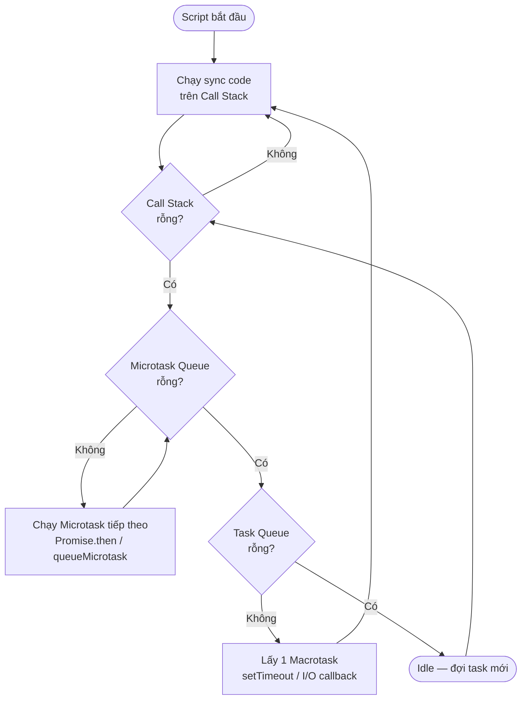
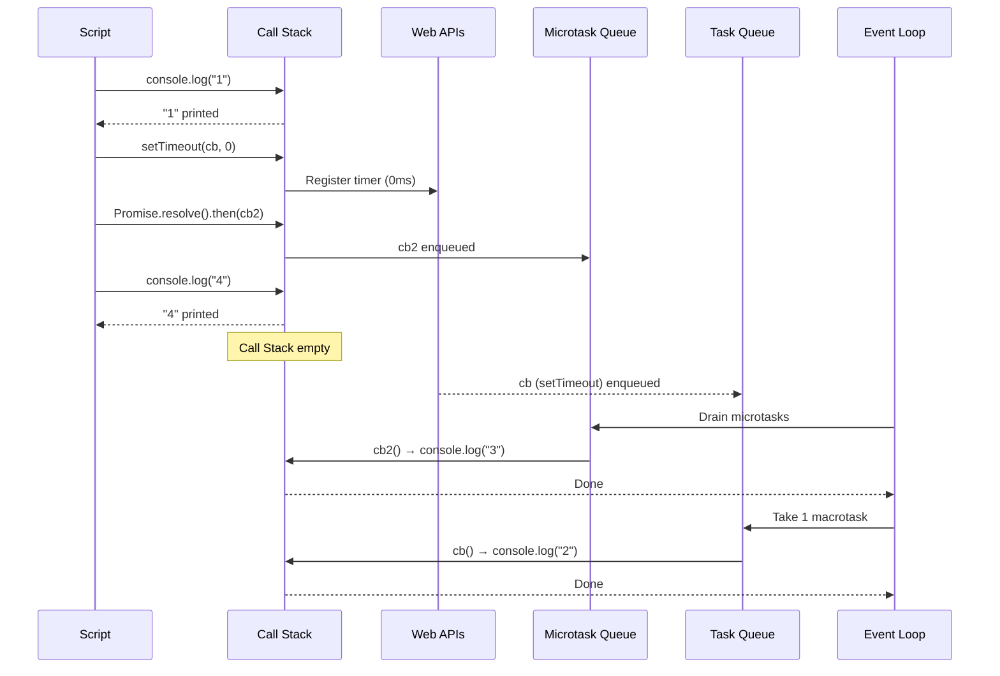

# Event Loop

> [!summary] TL;DR
> Event Loop là cơ chế giúp JS single-threaded có thể xử lý async. **Call Stack** chạy code sync. **Web APIs** xử lý async ops (timer, fetch). Khi xong, callback vào **Microtask Queue** (Promise.then) hoặc **Task Queue** (setTimeout). **Event Loop** liên tục kiểm tra: Stack rỗng? → drain hết Microtask Queue → lấy 1 task từ Task Queue. **Microtask luôn ưu tiên cao hơn Macrotask.**

---

## 1. Khái niệm

### Các thành phần

| Thành phần | Vai trò | Ví dụ |
|---|---|---|
| **Call Stack** | Nơi code đang chạy (LIFO) | Function calls, sync code |
| **Memory Heap** | Lưu objects/variables | `const obj = {}` |
| **Web APIs** | Xử lý async ops (C++ thread) | `setTimeout`, `fetch`, DOM events |
| **Task Queue** (Macrotask) | Hàng đợi cho async callbacks | `setTimeout`, `setInterval`, I/O |
| **Microtask Queue** | Hàng đợi ưu tiên cao | `Promise.then/catch`, `queueMicrotask` |
| **Event Loop** | Vòng lặp điều phối | Liên tục chuyển tasks lên Stack |

### Thuật toán Event Loop

```text
LOOP:
  1. Chạy hết sync code trong Call Stack
  2. Drain Microtask Queue (chạy HẾT microtasks — bao gồm cả những cái mới thêm vào)
  3. Lấy 1 Macrotask từ Task Queue → chạy
  4. Sau mỗi Macrotask → quay lại drain Microtask Queue
  5. Nếu cả 2 queue rỗng → đợi (idle)
  6. GOTO LOOP
```

> [!warning] Microtask Queue ưu tiên tuyệt đối
> Event Loop drain **toàn bộ** Microtask Queue trước khi lấy Macrotask tiếp theo. Nếu microtask tạo ra microtask mới → microtask mới cũng được chạy ngay. Có thể starvation nếu vô tình tạo infinite microtask loop.

---

## 2. Sơ đồ Event Loop

### Sơ đồ thuật toán



### Ví dụ minh họa thứ tự thực thi



---

## 3. Cú pháp / API

### 3.1 Phân tích thứ tự thực thi

```javascript
console.log('1 - sync');

setTimeout(() => {
  console.log('2 - macrotask (setTimeout 0ms)');
}, 0);

Promise.resolve()
  .then(() => console.log('3 - microtask (Promise.then)'));

queueMicrotask(() => console.log('4 - microtask (queueMicrotask)'));

console.log('5 - sync');

// Output:
// 1 - sync
// 5 - sync
// 3 - microtask (Promise.then)
// 4 - microtask (queueMicrotask)
// 2 - macrotask (setTimeout 0ms)
```

**Giải thích:**
1. `'1 - sync'` → Call Stack ngay
2. `setTimeout` → đăng ký với Web APIs
3. `Promise.resolve().then(...)` → `.then` callback vào Microtask Queue
4. `queueMicrotask(...)` → vào Microtask Queue
5. `'5 - sync'` → Call Stack ngay
6. Stack rỗng → drain Microtask Queue: `'3'` rồi `'4'`
7. Lấy 1 Macrotask: `'2'`

### 3.2 setTimeout(fn, 0) không có nghĩa là "ngay lập tức"

```javascript
setTimeout(() => console.log('A'), 0); // Macrotask
Promise.resolve().then(() => console.log('B')); // Microtask
console.log('C'); // Sync

// Output: C → B → A
// "setTimeout 0" không có nghĩa là 0ms thực tế:
// - Delay tối thiểu của browser thường là 4ms (HTML spec)
// - Và luôn sau tất cả microtasks hiện tại
```

### 3.3 Microtask được drain HẾT trước macrotask tiếp theo

```javascript
function chainMicrotasks(n) {
  if (n <= 0) return;
  Promise.resolve().then(() => {
    console.log(`Microtask ${n}`);
    chainMicrotasks(n - 1); // tạo microtask mới ngay trong microtask!
  });
}

setTimeout(() => console.log('Macrotask'), 0);
chainMicrotasks(3);
console.log('Sync');

// Output:
// Sync
// Microtask 3
// Microtask 2
// Microtask 1
// Macrotask   ← chỉ chạy SAU KHI tất cả microtask xong
```

### 3.4 Rendering và Event Loop

```javascript
// Browser không render frame mới khi Call Stack có code
// → Blocking sync code ngăn cản animation/re-paint

// Animation tốt: requestAnimationFrame (Macrotask đặc biệt)
function animate(timestamp) {
  // cập nhật DOM
  requestAnimationFrame(animate); // đăng ký frame tiếp
}
requestAnimationFrame(animate);

// Blocking animation tệ:
// while(true) {} → freeze hoàn toàn
```

---

## 4. Ví dụ minh họa

### Ví dụ 1: Async/Await và Event Loop

```javascript
async function asyncFunc() {
  console.log('A - sync trong async fn');

  await Promise.resolve(); // yield: tạm dừng async fn, enqueue phần còn lại vào Microtask Queue

  console.log('C - sau await (Microtask)');
}

console.log('1 - sync trước');
asyncFunc();
console.log('B - sync sau asyncFunc()');

// Output:
// 1 - sync trước
// A - sync trong async fn
// B - sync sau asyncFunc()
// C - sau await (Microtask)
```

**Giải thích:** `await` là syntactic sugar cho `.then()`. Khi gặp `await`, hàm async "tạm dừng" và trả điều khiển về caller — phần còn lại sau `await` được schedule như microtask.

### Ví dụ 2: Phân tích thứ tự phức tạp

```javascript
console.log('start');

setTimeout(() => console.log('setTimeout 1'), 0);

new Promise((resolve) => {
  console.log('Promise constructor (sync!)');
  resolve();
}).then(() => {
  console.log('Promise.then 1');
  return Promise.resolve();
}).then(() => {
  console.log('Promise.then 2');
});

setTimeout(() => console.log('setTimeout 2'), 0);

console.log('end');

// Output:
// start
// Promise constructor (sync!)   ← constructor chạy sync!
// end
// Promise.then 1                ← microtask
// Promise.then 2                ← microtask (thêm vào sau .then 1)
// setTimeout 1                  ← macrotask
// setTimeout 2                  ← macrotask
```

---

## 5. Pitfalls / Bẫy thường gặp

> [!warning] Pitfall 1: Promise constructor chạy SYNC
> ```javascript
> new Promise((resolve) => {
>   console.log('này chạy NGAY — sync!'); // không phải async!
>   resolve();
> });
> ```
> Chỉ callback trong `.then()` / `.catch()` mới async (microtask).

> [!warning] Pitfall 2: Blocking Event Loop với heavy computation
> Nếu một function chạy 500ms sync trên Call Stack → browser không thể render, xử lý events trong 500ms đó. Fix: chia nhỏ task với `setTimeout(chunk, 0)` hoặc dùng **Web Worker** cho CPU-intensive tasks.

> [!warning] Pitfall 3: Nhầm `setTimeout(fn, 0)` = "chạy ngay"
> `setTimeout(fn, 0)` đặt callback vào Task Queue (Macrotask) — chỉ chạy sau khi tất cả sync code và microtasks hiện tại đã xong. "0ms" là delay tối thiểu yêu cầu, không phải "thực thi ngay lập tức".

> [!tip] Công cụ học Event Loop trực quan
> Dùng **Loupe** (loupe.latentflip.com) hoặc **JS Visualizer 9000** (jsv9000.app) để xem trực tiếp Call Stack, Web APIs, và Queues chuyển động khi code chạy.

---

## 6. Câu hỏi phỏng vấn thường gặp

**Q1: Event Loop là gì? Mô tả cách nó hoạt động.**

> Event Loop là vòng lặp liên tục kiểm tra: nếu **Call Stack rỗng**, nó sẽ (1) drain toàn bộ **Microtask Queue** (Promise.then, queueMicrotask), rồi (2) lấy **1 task** từ **Task Queue** (setTimeout, I/O) đưa lên Call Stack thực thi. Cơ chế này cho phép JS single-threaded xử lý async operations mà không block UI thread — Web APIs xử lý async ops bên ngoài JS engine, rồi đẩy callbacks vào queues khi xong.

**Q2: Phân biệt Microtask và Macrotask. Cái nào ưu tiên hơn?**

> **Microtask** (Promise.then, queueMicrotask, MutationObserver): ưu tiên cao hơn, được drain **toàn bộ** trước khi Event Loop lấy macrotask tiếp theo.
> **Macrotask** (setTimeout, setInterval, I/O, requestAnimationFrame): ưu tiên thấp hơn, mỗi lần Event Loop chỉ xử lý **1** task.
> **Quy tắc:** Sync → Microtask Queue (all) → 1 Macrotask → Microtask Queue (all) → ...

**Q3: Tại sao `Promise.then` chạy trước `setTimeout(fn, 0)`?**

> `Promise.then` callback được enqueue vào **Microtask Queue**, còn `setTimeout` callback vào **Task Queue (Macrotask)**. Sau khi sync code xong, Event Loop drain **toàn bộ** Microtask Queue trước, rồi mới lấy 1 task từ Task Queue. Do đó `Promise.then` luôn chạy trước `setTimeout(fn, 0)` dù cả hai đều "không delay".

---

## 7. Bài tập tự luyện

- [ ] **Bài 1:** Dự đoán thứ tự output trước khi chạy:
  ```javascript
  console.log('A');
  setTimeout(() => console.log('B'), 0);
  Promise.resolve().then(() => console.log('C'));
  setTimeout(() => console.log('D'), 0);
  Promise.resolve().then(() => {
    console.log('E');
    Promise.resolve().then(() => console.log('F'));
  });
  console.log('G');
  // Kiểm tra: chạy trong browser console
  ```

- [ ] **Bài 2:** Giải thích tại sao đoạn code này không block UI dù có vòng lặp lớn:
  ```javascript
  function processChunks(data, chunkSize = 1000) {
    let index = 0;
    function processNext() {
      const end = Math.min(index + chunkSize, data.length);
      for (let i = index; i < end; i++) { /* process data[i] */ }
      index = end;
      if (index < data.length) setTimeout(processNext, 0);
    }
    processNext();
  }
  ```

---

## 8. Liên kết

- [[01-Async-Overview]] — Tổng quan async: tại sao cần, 3 patterns
- [[03-Callback-va-Callback-Hell]] — Callback: pattern cũ và vấn đề
- [[04-Promise]] — Promise microtask và chaining
- [[05-Async-Await]] — await và mối quan hệ với Event Loop
