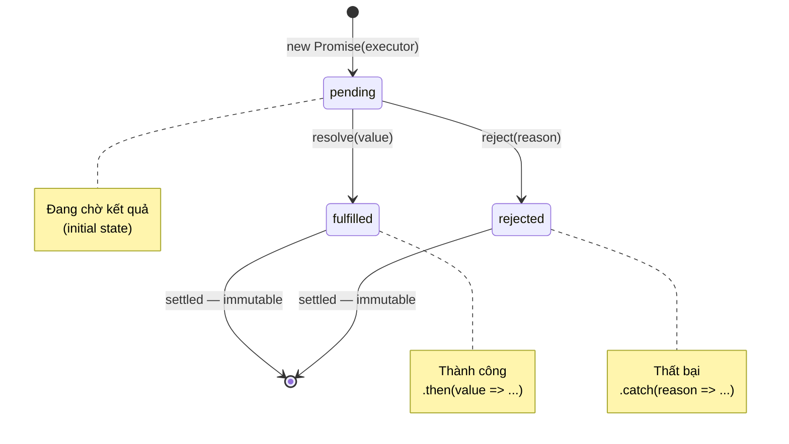

# Promise

> [!summary] TL;DR
> **Promise** là object đại diện cho một giá trị **chưa có** nhưng sẽ có trong tương lai (hoặc thất bại). 3 trạng thái: **pending → fulfilled / rejected** (không thể quay lại). Dùng `.then()` xử lý thành công, `.catch()` xử lý lỗi, `.finally()` chạy dù kết quả nào. **Promise.all** parallel + fail-fast, **Promise.allSettled** chờ hết không fail-fast, **Promise.race** lấy cái xong đầu tiên, **Promise.any** lấy cái fulfilled đầu tiên.

---

## 1. Khái niệm

### Promise State Machine



**Tính chất quan trọng:**
- Khi đã **settled** (fulfilled hoặc rejected), Promise **không thể** chuyển trạng thái
- `resolve()` hoặc `reject()` lần thứ 2 trở đi bị ignore hoàn toàn
- Callbacks trong `.then/.catch` luôn là **async** (Microtask Queue)

### Tại sao Promise tốt hơn Callback?

| Vấn đề | Callback | Promise |
|---|---|---|
| Chaining | Pyramid of Doom | `.then().then()` flat |
| Error handling | `if(err)` mỗi cấp | `.catch()` một chỗ |
| Gọi callback nhiều lần | Có thể xảy ra | Không thể (settled once) |
| Composability | Khó | `Promise.all/race/any` |
| Inversion of control | Trao quyền cho callee | Kiểm soát bởi Promise spec |

---

## 2. Cú pháp / API

### 2.1 Tạo Promise

```javascript
const promise = new Promise((resolve, reject) => {
  // executor chạy SYNC ngay lập tức!
  console.log('Executor chạy ngay');

  setTimeout(() => {
    const success = Math.random() > 0.5;
    if (success) {
      resolve({ id: 1, name: 'Alice' }); // fulfilled với value
    } else {
      reject(new Error('Không tìm thấy user')); // rejected với reason
    }
  }, 500);
});

console.log('Sau new Promise'); // chạy trước executor xong
// Output: "Executor chạy ngay" → "Sau new Promise" → (0.5s sau) fulfilled/rejected
```

### 2.2 `.then()`, `.catch()`, `.finally()`

```javascript
const fetchUser = (id) => new Promise((res, rej) => {
  setTimeout(() => id > 0 ? res({ id, name: 'Alice' }) : rej(new Error('Not found')), 300);
});

fetchUser(1)
  .then(user => {
    console.log('Thành công:', user.name);
    return user.name.toUpperCase(); // giá trị return trở thành input của .then kế tiếp
  })
  .then(upperName => {
    console.log('Uppercase:', upperName); // "ALICE"
  })
  .catch(err => {
    console.error('Lỗi:', err.message); // bắt lỗi từ BẤT KỲ bước nào trong chain
  })
  .finally(() => {
    console.log('Xong rồi!'); // chạy dù thành công hay thất bại
  });
```

### 2.3 Promise Chaining

```javascript
// Mỗi .then trả về Promise mới — chain dựa trên return value
const getUser    = id     => fetch(`/api/users/${id}`).then(r => r.json());
const getProfile = userId => fetch(`/api/profiles/${userId}`).then(r => r.json());
const getPosts   = userId => fetch(`/api/posts?user=${userId}`).then(r => r.json());

// Sequential chain (output trước là input sau)
getUser(1)
  .then(user    => getProfile(user.id))   // return Promise → chain tiếp
  .then(profile => getPosts(profile.userId))
  .then(posts   => console.log(posts.length, 'posts'))
  .catch(err    => console.error('Pipeline failed:', err));

// Nếu .then trả về giá trị thường (non-Promise) → wrap thành resolved Promise
fetchUser(1)
  .then(user => user.name)                 // return string → Promise<string>
  .then(name => name.toUpperCase())        // vẫn chain được
  .then(upper => console.log(upper));      // "ALICE"
```

### 2.4 Error Propagation trong Chain

```javascript
// Lỗi "bubble up" qua chain đến .catch gần nhất
getUser(1)
  .then(user    => { throw new Error('Step 2 fail'); }) // ném lỗi
  .then(data    => console.log('KHÔNG CHẠY'))           // bị skip
  .then(data    => console.log('KHÔNG CHẠY'))           // bị skip
  .catch(err    => {
    console.error('Bắt được:', err.message);            // "Step 2 fail"
    // return giá trị bình thường → tiếp tục chain
    return 'fallback value';
  })
  .then(val     => console.log('Recovered:', val));     // "Recovered: fallback value"
```

### 2.5 Static Methods

#### `Promise.all` — Parallel, fail-fast

```javascript
// Tất cả fulfill → trả array kết quả
// 1 reject → ngay lập tức reject với error đó (các promise khác vẫn chạy nhưng kết quả bị ignore)
const [user, profile, posts] = await Promise.all([
  getUser(1),
  getProfile(1),
  getPosts(1),
]);
console.log(user.name, profile.bio, posts.length);
// Nếu 1 trong 3 fail → .catch() bắt được ngay
```

#### `Promise.allSettled` — Parallel, không fail-fast (ES2020)

```javascript
// Chờ TẤT CẢ settle (dù success hay fail)
const results = await Promise.allSettled([
  getUser(1),
  getProfile(999),  // giả sử fail
  getPosts(1),
]);

results.forEach(result => {
  if (result.status === 'fulfilled') {
    console.log('OK:', result.value);
  } else {
    console.error('FAIL:', result.reason.message);
  }
});
// Phù hợp khi muốn xử lý từng kết quả riêng lẻ, không để 1 fail block cả batch
```

#### `Promise.race` — Lấy cái nào settle trước

```javascript
// Cái nào fulfill/reject trước → kết quả đó (không phân biệt success/fail)
const timeout = (ms) => new Promise((_, reject) =>
  setTimeout(() => reject(new Error(`Timeout after ${ms}ms`)), ms)
);

// Pattern: timeout wrapper cho fetch
const result = await Promise.race([
  fetch('/api/slow-endpoint').then(r => r.json()),
  timeout(5000), // fail sau 5 giây nếu API chậm
]);
```

#### `Promise.any` — Lấy cái fulfilled đầu tiên (ES2021)

```javascript
// Cái nào FULFILLED trước → kết quả đó (bỏ qua rejected)
// Nếu TẤT CẢ reject → AggregateError
const fastestServer = await Promise.any([
  fetch('https://server1.com/data').then(r => r.json()),
  fetch('https://server2.com/data').then(r => r.json()),
  fetch('https://server3.com/data').then(r => r.json()),
]);
// Pattern: dùng nhiều mirror servers, lấy cái respond trước
```

---

## 3. Ví dụ minh họa

### Ví dụ 1: Fetch với Promise chain đầy đủ

```javascript
function fetchWithRetry(url, retries = 3) {
  return fetch(url)
    .then(response => {
      if (!response.ok) throw new Error(`HTTP ${response.status}`);
      return response.json();
    })
    .catch(err => {
      if (retries > 0) {
        console.warn(`Retry (${retries} left):`, err.message);
        return fetchWithRetry(url, retries - 1); // recursive retry
      }
      throw err; // hết retry → rethrow
    });
}

fetchWithRetry('/api/users/1')
  .then(data  => console.log('User:', data))
  .catch(err  => console.error('All retries failed:', err.message))
  .finally(() => console.log('Request complete'));
```

### Ví dụ 2: Batch processing với Promise.allSettled

```javascript
async function processUsers(userIds) {
  const results = await Promise.allSettled(
    userIds.map(id =>
      fetch(`/api/users/${id}`)
        .then(r => { if (!r.ok) throw new Error(`User ${id} not found`); return r.json(); })
    )
  );

  const successful = results
    .filter(r => r.status === 'fulfilled')
    .map(r => r.value);

  const failed = results
    .filter(r => r.status === 'rejected')
    .map(r => r.reason.message);

  console.log(`${successful.length} OK, ${failed.length} failed`);
  if (failed.length) console.warn('Failed:', failed);
  return successful;
}

processUsers([1, 2, 999, 4, 5]);
// "4 OK, 1 failed"
// "Failed: ["User 999 not found"]"
```

---

## 4. Pitfalls / Bẫy thường gặp

> [!warning] Pitfall 1: Quên return trong `.then()` — chain bị đứt
> ```javascript
> getUser(1)
>   .then(user => {
>     getProfile(user.id); // Quên return! → chain tiếp nhận undefined
>   })
>   .then(profile => console.log(profile)); // undefined, không phải profile!
> ```
> Luôn `return` khi muốn chain giá trị hoặc Promise sang bước tiếp.

> [!warning] Pitfall 2: Không handle lỗi trong Promise chain
> Promise rejected mà không có `.catch()` → **UnhandledPromiseRejection** — crash trong Node.js, silent fail trong browser (nhưng devtools vẫn cảnh báo). Luôn thêm `.catch()` ở cuối chain hoặc dùng `try/catch` với async/await.

> [!warning] Pitfall 3: `Promise.all` với array rỗng
> `await Promise.all([])` → resolve ngay với `[]`. Đây là hành vi đúng — cần lưu ý trong điều kiện tạo array động.

> [!tip] `Promise.resolve()` và `Promise.reject()` static
> `Promise.resolve(value)` tạo Promise đã fulfilled với `value`. `Promise.reject(err)` tạo Promise đã rejected. Thường dùng trong testing và tạo chain từ giá trị sync.

---

## 5. Câu hỏi phỏng vấn thường gặp

**Q1: Promise có mấy trạng thái? Có thể chuyển ngược trạng thái không?**

> Promise có 3 trạng thái: **pending** (đang chờ), **fulfilled** (thành công, có value), **rejected** (thất bại, có reason). Khi đã **settled** (fulfilled hoặc rejected), trạng thái **không thể thay đổi** — các lần `resolve()`/`reject()` tiếp theo bị ignore. Tính chất immutable này đảm bảo `.then()` callback chỉ được gọi đúng 1 lần.

**Q2: Promise.all vs Promise.allSettled — dùng khi nào?**

> `Promise.all`: khi cần **TẤT CẢ** thành công — 1 fail là fail-fast ngay, các promise khác vẫn chạy nhưng kết quả bị bỏ. Dùng khi: các tác vụ phụ thuộc nhau, hoặc tất cả phải thành công mới có nghĩa (ví dụ: load user + profile để hiển thị trang).
> `Promise.allSettled`: chờ **TẤT CẢ** settle dù success hay fail. Dùng khi: muốn biết kết quả của từng operation riêng lẻ, không để 1 fail block batch (ví dụ: gửi email cho 1000 user — 1 cái fail không nên block cả 999 cái còn lại).

**Q3: Giải thích Promise chaining. Lỗi lan truyền qua chain thế nào?**

> Mỗi `.then()` trả về **Promise mới**. Nếu callback return: (1) giá trị thường → Promise resolved với giá trị đó; (2) Promise → chain tiếp theo đợi Promise đó settle; (3) throw Error → Promise mới rejected. Lỗi "bubble up" qua chain — skip tất cả `.then()` cho đến khi gặp `.catch()`. Sau `.catch()` return giá trị, chain tiếp tục bình thường.

---

## 6. Bài tập tự luyện

- [ ] **Bài 1:** Viết function `fetchWithTimeout(url, timeout)` dùng `Promise.race` để abort fetch nếu quá `timeout` milliseconds. Return data nếu fetch thành công trước timeout, throw Error nếu timeout.

- [ ] **Bài 2:** Viết `parallelLimit(tasks, limit)` — chạy array các async functions với tối đa `limit` tasks chạy song song cùng lúc (tương tự `p-limit` library). Dùng `Promise.all` và `Promise.allSettled`.

---

## 7. Liên kết

- [[02-Event-Loop]] — Promise.then là Microtask, không phải Macrotask
- [[03-Callback-va-Callback-Hell]] — Tại sao Promise thay thế callback chaining
- [[05-Async-Await]] — async/await là syntactic sugar trên Promise
- [[../02-DOM-Event/09-Fetch-API|Fetch API]] — Promise trong thực tế với HTTP
