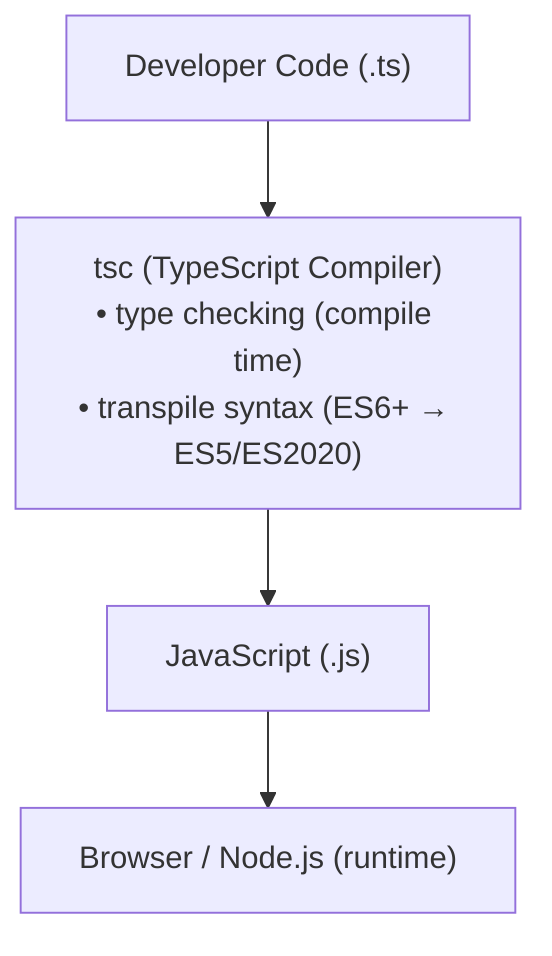

# TypeScript: Tổng quan & Cài đặt

> [!summary] TL;DR
> TypeScript là **typed superset của JavaScript** — mọi code JS hợp lệ đều là TS hợp lệ. TS thêm **static type system** giúp bắt lỗi lúc compile thay vì runtime. Compiler `tsc` transpile `.ts` → `.js`. **Type inference** tự suy ra type từ context — không cần annotate mọi thứ. `tsconfig.json` với `strict: true` là cấu hình khuyến nghị.

> [!tip] 🎯 Hiểu trong 30 giây
> **TypeScript = JavaScript + "khai báo kiểu dữ liệu".** Nó là *superset* (tập cha) — mọi code JS đều là TS hợp lệ, bạn chỉ thêm phần ghi rõ "biến này là số, hàm này trả về chuỗi". Lợi ích: lỗi kiểu (vd cộng số với chữ, gọi sai tên thuộc tính) bị **bắt ngay lúc gõ code/biên dịch** (*compile-time*) thay vì để người dùng gặp lỗi lúc chạy (*runtime*); cộng thêm IDE gợi ý code chuẩn hơn.
> - Trình duyệt/Node **không hiểu TS** → phải **biên dịch** (`tsc`) ra JS thường trước khi chạy. Tức TS chỉ "đứng gác" lúc code, chạy thật vẫn là JS.
> - **Type inference** = TS *tự đoán* kiểu từ ngữ cảnh (`let x = 5` → tự hiểu `number`), nên không phải ghi kiểu cho mọi thứ. Bật `strict: true` để TS bắt lỗi chặt nhất.

---

## 1. Khái niệm

### TypeScript là gì?

**TypeScript** = JavaScript + Static Type System + Modern JS features.



**Lợi ích cốt lõi:**
- **Catch errors sớm** — type error được phát hiện lúc code, không phải lúc user dùng
- **Better IDE support** — autocomplete, refactoring, go-to-definition chính xác hơn
- **Self-documenting code** — type annotations giải thích dữ liệu expect gì
- **Safer refactoring** — đổi tên function → compiler chỉ ra tất cả chỗ cần sửa

```
★ Insight ─────────────────────────────────────
• Điều dễ hiểu sai nhất: type bị XÓA SẠCH khi compile — runtime không còn dấu
  vết. Nghĩa là TS bảo vệ bạn lúc VIẾT code, KHÔNG bảo vệ lúc CHẠY. Dữ liệu từ
  API/localStorage/input vẫn phải validate thủ công (hoặc Zod) — `as User` chỉ
  là lời hứa với compiler, không phải kiểm tra thật. Đây là bẫy fresher kinh điển.
• `strict: true` mới là "linh hồn" của TS, đặc biệt strictNullChecks: nó buộc
  bạn xử lý null/undefined RÕ RÀNG → diệt tận gốc lỗi "cannot read property of
  undefined". Tắt strict ≈ dùng JS có chú thích, mất 80% giá trị. Và ưu tiên
  `unknown` thay `any` khi chưa biết kiểu — unknown bắt phải narrow trước khi dùng.
─────────────────────────────────────────────────
```

### TypeScript vs JavaScript

| Đặc điểm | JavaScript | TypeScript |
|---|---|---|
| Type system | Dynamic (runtime) | Static (compile time) |
| Chạy trực tiếp | ✅ Browser/Node | ❌ Cần compile sang JS |
| Error detection | Runtime | Compile time |
| `null`/`undefined` safety | Không | ✅ (với `strict`) |
| Generics | Không | ✅ |
| Enums / Decorators | Không | ✅ |

---

## 2. Cú pháp / API

### 2.1 Cài đặt và compile

```bash
# Cài TypeScript global
npm install -g typescript
tsc --version    # kiểm tra version

# Hoặc dùng npx (không cần install global)
npx tsc --version

# Compile một file
tsc hello.ts             # output: hello.js
tsc hello.ts --watch     # watch mode — tự compile khi file thay đổi

# Khởi tạo project TS
npm init -y
npm install --save-dev typescript
npx tsc --init           # tạo tsconfig.json
```

### 2.2 tsconfig.json cơ bản

```json
{
  "compilerOptions": {
    "target": "ES2020",           
    "module": "commonjs",         
    "lib": ["ES2020", "DOM"],     
    "outDir": "./dist",           
    "rootDir": "./src",           
    "strict": true,               
    "esModuleInterop": true,      
    "skipLibCheck": true,         
    "forceConsistentCasingInFileNames": true
  },
  "include": ["src/**/*"],
  "exclude": ["node_modules", "dist"]
}
```

**Options quan trọng trong `strict`:**
- `strictNullChecks` — `null`/`undefined` không compatible với types khác
- `noImplicitAny` — biến phải có type rõ ràng, không được ngầm là `any`
- `strictFunctionTypes` — kiểm tra function type contravariance
- `strictPropertyInitialization` — class property phải init trong constructor

### 2.3 Type Annotation cơ bản

```typescript
// Variable annotations
let name:   string  = 'Alice';
let age:    number  = 25;
let active: boolean = true;

// Type Inference — TS tự suy ra, KHÔNG cần annotate mọi thứ
let name2   = 'Alice'; // inferred: string
let age2    = 25;      // inferred: number
let active2 = true;    // inferred: boolean

// TS báo lỗi ngay trong IDE:
let count: number = 10;
// count = 'hello'; // Error: Type 'string' is not assignable to type 'number'

// Function annotation
function greet(name: string): string {
  return `Hello, ${name}!`;
}

// Arrow function
const add = (a: number, b: number): number => a + b;

// Object type — inline
const user: { id: number; name: string } = { id: 1, name: 'Alice' };
```

### 2.4 Setup với Vite + React (TypeScript template)

```bash
# Tạo React + TS project nhanh nhất
npm create vite@latest my-app -- --template react-ts
cd my-app && npm install && npm run dev
```

```tsx
// src/components/Greeting.tsx
interface GreetingProps {
  name: string;
  age?: number;      // optional prop
}

function Greeting({ name, age = 0 }: GreetingProps) {
  return (
    <div>
      <p>Hello, {name}!</p>
      {age > 0 && <p>Age: {age}</p>}
    </div>
  );
}

export default Greeting;
```

### 2.5 ts-node — chạy TS trực tiếp (development)

```bash
npm install --save-dev ts-node
npx ts-node src/index.ts    # chạy TS trực tiếp, không cần compile trước

# Node.js 22+ hỗ trợ chạy TS native (experimental):
node --experimental-strip-types index.ts
```

---

## 3. Ví dụ minh họa

### Ví dụ 1: Lỗi được bắt ở compile time

```typescript
// Không có TypeScript — lỗi chỉ xuất hiện khi chạy
function getUserName(user: any) {
  return user.name.toUpperCase();
}
// getUserName(null) → Runtime error: Cannot read properties of null

// Với TypeScript + interface — lỗi bắt được ngay khi gõ
interface User {
  id:   number;
  name: string;
}

function getUserNameSafe(user: User): string {
  return user.name.toUpperCase();
}

// getUserNameSafe(null);
// Error: Argument of type 'null' is not assignable to parameter of type 'User'
// ↑ IDE show lỗi ngay, không cần chạy code
```

### Ví dụ 2: Type inference giảm boilerplate

```typescript
// TS đủ thông minh để infer — không cần annotate mọi thứ
const users = [
  { id: 1, name: 'Alice', role: 'admin' as const },
  { id: 2, name: 'Bob',   role: 'user'  as const },
];
// Inferred: { id: number; name: string; role: "admin" | "user" }[]

const names  = users.map(u => u.name);  // inferred: string[]
const admins = users.filter(u => u.role === 'admin');

// IDE biết tất cả props — autocomplete hoàn hảo
console.log(admins[0].name); // TypeScript biết đây là string

// Chỉ annotate khi inference không đủ mạnh
const cache: Map<string, number> = new Map(); // cần annotate type params
cache.set('views', 42);

const status: 'active' | 'inactive' = 'active';
// Không annotate → inferred là string (rộng hơn mong muốn)
```

---

## 4. Pitfalls / Bẫy thường gặp

> [!warning] Pitfall 1: Tắt `strict` để tránh lỗi — mất phần lớn giá trị của TS
> Nhiều người mới bắt đầu đặt `strict: false` để code nhanh hơn. Điều này làm TS gần như vô dụng — mất `strictNullChecks`, mất `noImplicitAny`. Luôn giữ `strict: true`; học cách fix lỗi type thay vì disable.

> [!warning] Pitfall 2: Lạm dụng `any` — "type escape hatch"
> `any` tắt hoàn toàn type checking. `const x: any = {}; x.foo.bar.baz` — không lỗi compile, crash runtime. Dùng `unknown` thay vì `any` khi không biết type — `unknown` buộc phải narrow trước khi dùng.

> [!tip] TypeScript không ảnh hưởng runtime behavior
> TS compile thành JS thuần — mọi type annotation bị **xóa hoàn toàn** khi compile. TS không thêm runtime type check, không thay đổi behavior của JS. Validation dữ liệu từ API vẫn phải làm thủ công (hoặc dùng Zod, Valibot).

---

## 5. Câu hỏi phỏng vấn thường gặp

> [!example] 🗣️ Trả lời mẫu (nói thành lời) — "TypeScript khác JavaScript thế nào, vì sao dùng?"
> *"TypeScript là một superset có kiểu của JavaScript, nghĩa là mọi code JS hợp lệ đều là TS hợp lệ, và nó thêm hệ thống kiểu tĩnh. Lợi ích lớn nhất là bắt lỗi kiểu ngay lúc compile hoặc lúc đang gõ code thay vì để lỗi xảy ra lúc runtime, ví dụ truyền nhầm kiểu tham số hay gõ sai tên thuộc tính. Ngoài ra IDE hỗ trợ tốt hơn nhiều, autocomplete và refactor an toàn, và bản thân type annotation cũng là tài liệu mô tả dữ liệu. Về runtime thì TypeScript được biên dịch ra JavaScript thuần nên trình duyệt và Node không biết TS tồn tại; nó chỉ giúp ở khâu phát triển."*

> [!note] 🧠 Mẹo nhớ
> **TS = JS + kiểu, bắt lỗi lúc CODE (compile-time) thay vì lúc CHẠY (runtime).** Phải **biên dịch ra JS** mới chạy. `strict: true`.

**Q1: TypeScript khác gì JavaScript? Tại sao dùng TypeScript?**

> TypeScript là **typed superset của JavaScript** — mọi JS valid là TS valid. TS thêm **static type system** giúp: (1) catch type errors lúc compile/code, không phải runtime; (2) IDE support tốt hơn (autocomplete, safe refactoring); (3) code tự document — type annotations mô tả dữ liệu expect. Runtime: TS compile thành JS thuần, browser/Node không biết TS tồn tại.

**Q2: Type inference là gì? Khi nào cần explicit annotation?**

> **Type inference** = TypeScript tự suy ra type từ context — `const n = 42` → inferred `number`. Cần explicit annotation khi: (1) biến khai báo mà chưa gán `let x: string`; (2) function params (TS không thể infer input); (3) muốn type hẹp hơn inference `const s: 'active' | 'inactive'`; (4) `Map<K,V>`, `Set<T>`, generic containers.

**Q3: `strict: true` trong tsconfig bật những gì?**

> `strict: true` là shorthand bật nhóm flags: `strictNullChecks` (null/undefined phải handle riêng), `noImplicitAny` (không `any` ngầm), `strictFunctionTypes`, `strictPropertyInitialization`, `strictBindCallApply`. Khuyến nghị luôn bật — catch nhiều bug class hơn.

---

## 6. Bài tập tự luyện

- [ ] **Bài 1:** Tạo project TypeScript mới với `tsc --init`. Sửa tsconfig để có `strict: true`, `target: "ES2020"`, `outDir: "./dist"`. Viết `src/hello.ts` có function `greet(name: string): string`, compile và chạy output JS.

- [ ] **Bài 2:** Chuyển đổi đoạn JS sau sang TypeScript (thêm type annotations, fix potential runtime errors):
  ```javascript
  function processOrder(order) {
    const total = order.items.reduce((sum, item) => sum + item.price * item.qty, 0);
    return { orderId: order.id, total, discount: order.discount || 0 };
  }
  ```

---

## 7. Liên kết

- [[02-Basic-Types]] — Tất cả primitive và special types trong TS
- [[03-Type-Combination-Union-Intersection]] — Union, intersection, utility types
- [[06-Classes-va-Interface]] — Class và interface trong TS
- [[../03-Advanced-JavaScript/11-ES6-Class|ES6 Class]] — Class JS trước khi có TS
