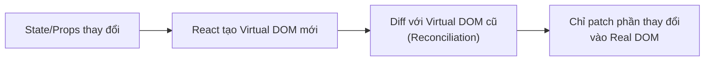
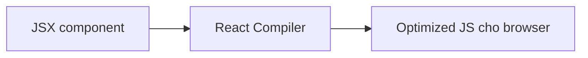

# React: Tổng quan

> [!summary] TL;DR
> **React** là một **library** (thư viện — tập hàm/công cụ bạn gọi khi cần, khác **framework** là bộ khung lo sẵn nhiều thứ và "gọi ngược" code bạn) của Facebook, mã nguồn mở từ 2013, dùng để dựng **giao diện (UI) bằng các component** (khối UI tái dùng được như mảnh lego). Cơ chế: JSX → React Elements (mô tả UI) → **Virtual DOM** (bản sao giao diện bằng JS, nhẹ) → **diff** (so sánh bản cũ và mới) với DOM thật → chỉ cập nhật đúng phần thay đổi. Khởi tạo: `npm create vite@latest my-app -- --template react`. **React 19** có React Compiler tự tối ưu, giảm nhu cầu dùng `useMemo`/`useCallback` thủ công.

> [!tip] 🎯 Hiểu trong 30 giây
> React là **thư viện** giúp bạn xây giao diện bằng các **"khối lego" tái dùng được** gọi là *component*. Thay vì tự tay ra lệnh sửa từng chỗ trên trang (Vanilla JS: *"tìm thẻ này, đổi chữ kia"* — gọi là *imperative*), với React bạn chỉ **mô tả "giao diện nên trông thế nào ứng với dữ liệu hiện tại"**, còn việc cập nhật màn hình để React lo (gọi là *declarative*).
>
> **Virtual DOM** — cơ chế giúp React nhanh: sửa DOM thật (màn hình) rất tốn kém. React giữ **một bản sao giao diện bằng JavaScript** (nhẹ). Khi dữ liệu đổi, nó dựng bản sao mới, **so sánh (diff) với bản cũ**, rồi **chỉ sửa đúng phần khác biệt** lên màn hình thật — thay vì vẽ lại cả trang. Ví von: thay vì *xây lại cả căn nhà*, nó *so bản thiết kế cũ–mới và chỉ sơn lại bức tường đã đổi*.
>
> **Một câu chốt hay bị hỏi:** React là **library** (chỉ lo phần View), không phải framework — routing, state toàn cục, SSR phải tự lắp thêm (React Router, Redux/Zustand, Next.js).

---

## 1. Khái niệm

### React là gì?

React là **JavaScript library** để build user interfaces, ra đời tại Facebook (2013), open source từ đó. Hiện được dùng bởi Netflix, Airbnb, Microsoft, PayPal.

**Library vs Framework:**
- **Library**: React chỉ lo phần View — bạn tự chọn routing, state management, data fetching
- **Framework**: Angular/Next.js đã tích hợp sẵn router, DI, HTTP client, ...

### Virtual DOM

React không update real DOM trực tiếp mà dùng **Virtual DOM** — cây object JS mô tả UI:



Lợi ích: tránh re-render không cần thiết, DOM operations tốn kém nhất được tối thiểu hóa.

```
★ Insight ─────────────────────────────────────
• Virtual DOM giải đúng bài toán bạn đã thấy ở DOM thủ công: thao tác DOM thật =
  reflow tốn kém. React "gom" thay đổi vào cây JS, diff, rồi patch MỘT lần phần
  khác biệt — cùng tinh thần DocumentFragment ([[13-DOM-Performance]]) nhưng tự
  động hoá. Đây là lý do React "declarative": bạn mô tả UI THEO state, React lo phần "làm sao update DOM".
• "Library, không phải framework" là câu trả lời phỏng vấn quan trọng: React chỉ
  lo View → bạn TỰ LẮP routing (React Router), state toàn cục (Redux/Zustand),
  data fetching, SSR (Next.js). Một luật xuyên suốt: data chảy XUỐNG qua props,
  sự kiện chảy LÊN qua callback props ("one-way data flow").
─────────────────────────────────────────────────
```

### React Compiler (React 19)

React 19 ra mắt **React Compiler** (code name "React Forget") — tự động tối ưu hóa code tại compile time, loại bỏ nhu cầu dùng `useMemo`/`useCallback` thủ công:


> Giống compiled language — compiler hiểu khi nào cần re-render.

---

## 2. Cú pháp / API

### 2.1 Khởi tạo project với Vite

```bash
# Tạo project React (Vite template)
npm create vite@latest my-app -- --template react

# Di chuyển vào project và chạy
cd my-app
npm install
npm run dev   # → http://localhost:5173
```

**Cấu trúc project:**

```text
my-app/
├── index.html          # entry HTML — có <div id="root">
├── vite.config.js
├── package.json
└── src/
    ├── main.jsx        # entry point — ReactDOM.createRoot + render
    ├── App.jsx         # root component
    └── assets/
```

### 2.2 Entry point

```jsx
// src/main.jsx
import { createRoot } from 'react-dom/client';
import App from './App.jsx';
import './index.css';

// Tìm <div id="root"> trong index.html, inject component App vào đó
createRoot(document.getElementById('root')).render(<App />);
```

### 2.3 Component đầu tiên

```jsx
// src/App.jsx
function App() {
  return (
    <div>
      <h1>Hello React!</h1>
    </div>
  );
}

export default App;
```

### 2.4 React createElement (under the hood)

JSX là cú pháp sugar — compiler chuyển về `React.createElement`:

```jsx
// JSX — developer viết:
const element = <h1 className="title">Hello</h1>;

// Sau khi biên dịch — JavaScript thực chạy:
const element = React.createElement('h1', { className: 'title' }, 'Hello');
// → { type: 'h1', props: { className: 'title', children: 'Hello' } }
```

### 2.5 React Developer Tools

Cài extension **React Developer Tools** (Chrome/Firefox):
- Tab **Components**: xem component tree, props, state hiện tại
- Tab **Profiler**: đo performance, phát hiện slow renders

---

## 3. Ví dụ minh họa

### Ví dụ 1: App đơn giản với component lồng nhau

```jsx
// Header component
function Header({ title }) {
  return (
    <header>
      <h1>{title}</h1>
    </header>
  );
}

// Main component
function Main({ items }) {
  return (
    <main>
      <ul>
        {items.map((item, i) => (
          <li key={i}>{item}</li>
        ))}
      </ul>
    </main>
  );
}

// Root App
function App() {
  const menuItems = ['Pho', 'Bun bo', 'Com tam'];
  return (
    <>
      <Header title="My Restaurant" />
      <Main items={menuItems} />
    </>
  );
}

export default App;
```

### Ví dụ 2: Flow dữ liệu trong React

```text
App (root)
├── state: { user, theme, ... }          ← state tập trung ở trên cao
├── Header (props: user.name)            ← nhận data qua props
├── Sidebar (props: theme)
└── Main
    └── ProductList (props: products)    ← tiếp tục pass down
        └── ProductCard (props: product)
```

Nguyên tắc: **data flows down** (props), **events flow up** (callback props).

---

## 4. Pitfalls / Bẫy thường gặp

> [!warning] Pitfall 1: React là library, không phải framework
> React chỉ handle UI layer. Cần routing → thêm React Router. Cần state management phức tạp → Redux/Zustand/Context. Cần SSR/SSG → Next.js. Đừng nhầm React với Next.js khi trả lời phỏng vấn.

> [!warning] Pitfall 2: `import React from 'react'` không còn bắt buộc
> Từ React 17+, không cần import React để dùng JSX nữa (JSX Transform tự động). Chỉ import khi cần dùng `React.memo`, `React.lazy`, v.v.

> [!tip] Virtual DOM ≠ Shadow DOM
> **Virtual DOM** là khái niệm của React — cây object JS. **Shadow DOM** là Web standard để encapsulate DOM trong Web Components. Hai khái niệm hoàn toàn khác nhau.

---

## 5. Câu hỏi phỏng vấn thường gặp

> [!example] 🗣️ Trả lời mẫu (nói thành lời) — "Virtual DOM giúp tăng hiệu năng thế nào so với thao tác Real DOM?"
> *"Thao tác trực tiếp lên Real DOM rất tốn kém vì mỗi lần đổi thường gây trình duyệt tính lại layout và vẽ lại. Virtual DOM là một bản sao giao diện bằng JavaScript object, rất nhẹ. Khi state hay props đổi, React không sửa thẳng màn hình mà dựng một cây Virtual DOM mới, đem so sánh với cây cũ bằng thuật toán diffing để tìm ra đúng những chỗ khác biệt, bước này gọi là reconciliation, rồi chỉ patch đúng phần đó lên Real DOM. Nhờ vậy nó gom nhiều thay đổi lại và giảm tối đa số lần đụng vào DOM thật, thay vì với Vanilla JS mình hay vô tình cập nhật cả cụm hoặc cập nhật lặp gây chậm. Ngoài ra React còn cho code declarative, mình mô tả UI theo dữ liệu chứ không ra lệnh từng bước."*

> [!note] 🧠 Mẹo nhớ
> **React = lego component + declarative (mô tả, không ra lệnh).** Virtual DOM = **bản sao JS → diff → chỉ patch phần đổi** (sơn lại tường đã đổi, không xây lại nhà). React là **library**, không phải framework.

**Q1: React là gì? Tại sao dùng React thay vì Vanilla JS?**

> React là **JavaScript library** để build UI theo kiến trúc **component**. So với Vanilla JS: (1) **Component reuse** — viết 1 lần, dùng nhiều nơi. (2) **Declarative** — mô tả UI "nên trông như thế nào", React lo update DOM. (3) **Virtual DOM** — diff và chỉ patch những gì thay đổi, hiệu quả hơn DOM manipulation thủ công. (4) **Ecosystem** lớn: React Router, Redux, Next.js, React Native. Nhược điểm: learning curve với JSX/hooks, cần thêm thư viện cho routing/state.

**Q2: Virtual DOM là gì? Reconciliation là gì?**

> **Virtual DOM** là biểu diễn lightweight của Real DOM dưới dạng JS object. Khi state/props thay đổi: (1) React tạo **cây Virtual DOM mới**. (2) **Diffing**: so sánh với cây cũ, tìm ra sự khác biệt (O(n) nhờ heuristics). (3) **Reconciliation**: chỉ update những DOM nodes thực sự thay đổi. Lợi ích: tránh layout thrashing, batch multiple updates, hiệu suất tốt hơn.

**Q3: React library vs React framework (Next.js) khác nhau thế nào?**

> **React (library)**: chỉ handle UI, bạn tự chọn routing/state/SSR, dùng Vite để bundle. **Next.js (framework)**: bao gồm React + file-based routing, SSR/SSG, API routes, Image optimization, caching. Khi nào dùng Next.js: cần SEO, performance tốt nhất, full-stack app. Khi nào dùng Vite+React: SPA đơn giản, CRA replacement, học cơ bản.

---

## 6. Bài tập tự luyện

- [ ] **Bài 1:** Khởi tạo project Vite+React, xóa code mặc định, tạo component `Header` nhận prop `title` và hiển thị trong `<h1>`. Render từ `App`.

- [ ] **Bài 2:** Cài React Developer Tools. Mở Components tab, inspect cây component của một trang React bất kỳ (ví dụ react.dev). Mô tả những gì bạn thấy.

---

## 7. Liên kết

- [[02-Component-va-Props]] — Component anatomy và cách truyền props
- [[03-State-voi-useState]] — useState hook, quản lý state
- [[../03-Advanced-JavaScript/11-ES6-Class|ES6 Class]] — class syntax (legacy React class components)
- [[../04-Async-JavaScript/01-Async-Overview|Async Overview]] — cần cho data fetching trong React
