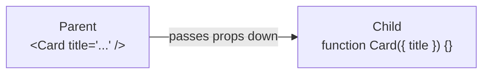

# React: Component & Props

> [!summary] TL;DR
> **Component** là một hàm trả về JSX — viên gạch xây nên app React (building block). **Props** (properties = thuộc tính) là dữ liệu truyền từ component cha (parent) xuống con (child), viết giống thuộc tính HTML nhưng giá trị là JS. Props **read-only** (chỉ đọc): con **không được sửa** props nhận vào. Thường **destructuring** (tháo gói) props ngay ở tham số: `function Card({ title, count })`. **`children`** là prop đặc biệt = phần JSX đặt *giữa* cặp thẻ `<Card>...</Card>`. Tên component viết **PascalCase** (Hoa chữ đầu mỗi từ); viết thường thì React tưởng là thẻ HTML.

> [!tip] 🎯 Hiểu trong 30 giây
> **Component = một hàm nhận "nguyên liệu" và trả về "giao diện".** Giống công thức nấu ăn: đưa nguyên liệu khác nhau (props) ra món khác nhau. `<UserCard name="Alice" />` chính là *gọi hàm* `UserCard` với `name = "Alice"`.
>
> **Props = "nguyên liệu cha đưa cho con".** Quy tắc vàng: **props chỉ đọc, con không được sửa** — vì dữ liệu trong React **chảy một chiều từ trên xuống** (one-way data flow). Con muốn báo cho cha "tôi vừa được click" thì cha phải đưa kèm *một hàm callback* (vd `onAddToCart`), con gọi hàm đó — **dữ liệu xuống bằng props, sự kiện lên bằng callback.**
>
> **2 điều dễ quên mà hay bị bắt lỗi:**
> - Tên component **phải viết Hoa** (`<Card>`); viết thường (`<card>`) React tưởng là thẻ HTML → không hiện gì.
> - **`children`** là prop đặc biệt = phần JSX bạn đặt *giữa* cặp thẻ `<Card>...</Card>` → dùng để làm khung bọc (Card, Modal, Layout).

---

## 1. Khái niệm

### Component là gì?

Component là **function JavaScript trả về JSX** — mô tả một phần UI:

```jsx
// Đây là một React component
function Greeting() {
  return <h1>Hello World!</h1>;
}

// Dùng như HTML tag trong JSX (phân biệt bởi PascalCase)
function App() {
  return <Greeting />;
}
```

**Nguyên tắc:**
- Tên component **phải viết hoa chữ đầu** (PascalCase) — `<greeting />` là HTML tag, `<Greeting />` là React component
- Mỗi component nên có **single responsibility** — làm một việc rõ ràng
- Component là **reusable** — dùng lại ở nhiều nơi

### Props là gì?

**Props** (properties) là cách truyền dữ liệu từ parent component xuống child component:



Props giống như **function arguments** — mỗi lần render component với props khác nhau → kết quả khác nhau.

```
★ Insight ─────────────────────────────────────
• Mô hình đúng: component = HÀM nhận props (input) → trả JSX (output), thuần và
  dự đoán được. Vì là input nên props READ-ONLY — child muốn "đổi" thì gọi
  callback do parent truyền xuống (sự kiện chảy lên). Đây chính là "one-way data
  flow" làm React dễ debug: nhìn props là biết vì sao UI ra như vậy.
• PascalCase KHÔNG phải quy ước thẩm mỹ — JSX dịch thẻ THƯỜNG (`<button>`) thành
  chuỗi "button" (HTML), thẻ HOA (`<Button>`) thành tham chiếu BIẾN component.
  Viết thường tên component → React tưởng là HTML tag, render rỗng. `children`
  là prop đặc biệt = JSX đặt giữa cặp thẻ, nền tảng cho Card/Modal/Layout.
─────────────────────────────────────────────────
```

---

## 2. Cú pháp / API

### 2.1 Truyền và nhận Props cơ bản

```jsx
// Parent truyền props qua attributes
function App() {
  return (
    <UserCard
      name="Alice"
      age={25}
      isAdmin={true}
      role="developer"
    />
  );
}

// Child nhận qua tham số props (object)
function UserCard(props) {
  console.log(props); // { name: 'Alice', age: 25, isAdmin: true, role: 'developer' }
  return (
    <div>
      <h2>{props.name}</h2>
      <p>Age: {props.age}</p>
      {props.isAdmin && <span>Admin</span>}
    </div>
  );
}
```

### 2.2 Destructuring Props (cách viết phổ biến)

```jsx
// Destructuring trong parameter — clean hơn nhiều
function UserCard({ name, age, isAdmin, role = 'user' }) {
  // Lưu ý: role = 'user' là default value nếu không truyền
  return (
    <div>
      <h2>{name}</h2>
      <p>Age: {age} — Role: {role}</p>
      {isAdmin && <span>Admin</span>}
    </div>
  );
}

// Dùng spread để forward all props
function Wrapper({ children, ...rest }) {
  return <div className="wrapper" {...rest}>{children}</div>;
}
```

### 2.3 Children Prop

```jsx
// children là JSX lồng bên trong component tags
function Card({ title, children }) {
  return (
    <div className="card">
      <h3>{title}</h3>
      <div className="card-body">
        {children}  {/* render bất cứ thứ gì được đặt bên trong <Card>...</Card> */}
      </div>
    </div>
  );
}

// Sử dụng — đặt nội dung bên trong tags
function App() {
  return (
    <Card title="User Info">
      <p>Name: Alice</p>
      <p>Email: alice@example.com</p>
      <button>Edit</button>
    </Card>
  );
}
// children = <p>Name: Alice</p><p>Email...</p><button>Edit</button>
```

### 2.4 Props với các kiểu dữ liệu khác nhau

```jsx
function Demo() {
  const user = { id: 1, name: 'Alice' };
  const tags = ['react', 'typescript'];

  return (
    <>
      {/* String: dùng dấu "" */}
      <Input type="email" placeholder="Enter email" />

      {/* Number: dùng {} */}
      <Grid columns={3} gap={16} />

      {/* Boolean: true = chỉ cần tên prop, false = phải viết ={false} */}
      <Button disabled />           {/* disabled={true} */}
      <Button disabled={false} />   {/* tường minh */}

      {/* Object và Array: dùng {} */}
      <UserProfile user={user} tags={tags} />

      {/* Function (event handler) */}
      <Button onClick={() => console.log('clicked')}>Click me</Button>

      {/* JSX expression */}
      <Tooltip content={<span>Help text</span>}>
        <button>?</button>
      </Tooltip>
    </>
  );
}
```

### 2.5 Props là Read-Only

```jsx
// SAIT — props là immutable
function BadComponent(props) {
  props.name = 'Bob'; // LỖI: không được thay đổi props
  // TypeError hoặc React sẽ throw warning
}

// ĐÚNG — nếu cần "state" dựa trên props, dùng useState hoặc derive
function GoodComponent({ initialName }) {
  // Chỉ đọc từ props, derive giá trị mới
  const displayName = initialName.toUpperCase();
  return <h1>{displayName}</h1>;
}
```

### 2.6 Component Composition

```jsx
// Pattern: compose từ các component nhỏ
function Avatar({ src, alt, size = 40 }) {
  return ;
}

function Badge({ count }) {
  if (count === 0) return null;
  return <span className="badge">{count > 99 ? '99+' : count}</span>;
}

function UserButton({ user, notificationCount }) {
  return (
    <button className="user-btn">
      <Avatar src={user.avatar} alt={user.name} size={32} />
      <span>{user.name}</span>
      <Badge count={notificationCount} />
    </button>
  );
}
```

---

## 3. Ví dụ minh họa

### Ví dụ 1: Product card với đầy đủ props

```jsx
// Kiểu dữ liệu product
// { id, name, price, imageUrl, inStock, rating }

function StarRating({ value, max = 5 }) {
  return (
    <div className="stars">
      {Array.from({ length: max }, (_, i) => (
        <span key={i} className={i < value ? 'filled' : 'empty'}>★</span>
      ))}
    </div>
  );
}

function PriceTag({ price, currency = 'USD' }) {
  return (
    <strong>
      {new Intl.NumberFormat('en-US', { style: 'currency', currency }).format(price)}
    </strong>
  );
}

function ProductCard({ product, onAddToCart }) {
  const { id, name, price, imageUrl, inStock, rating } = product;

  return (
    <div className={`product-card ${!inStock ? 'out-of-stock' : ''}`}>
      
      <h3>{name}</h3>
      <StarRating value={rating} />
      <PriceTag price={price} />
      {inStock ? (
        <button onClick={() => onAddToCart(id)}>Add to Cart</button>
      ) : (
        <p>Out of Stock</p>
      )}
    </div>
  );
}

// Dùng trong App
function App() {
  const product = {
    id: 1, name: 'Headphones',
    price: 99.99, imageUrl: '/img/hp.jpg',
    inStock: true, rating: 4,
  };

  return (
    <ProductCard
      product={product}
      onAddToCart={(id) => console.log('Added:', id)}
    />
  );
}
```

### Ví dụ 2: Layout component với children

```jsx
function PageLayout({ title, sidebar, children }) {
  return (
    <div className="page">
      <header className="page-header">
        <h1>{title}</h1>
      </header>
      <div className="page-body">
        <aside className="sidebar">{sidebar}</aside>
        <main className="main-content">{children}</main>
      </div>
    </div>
  );
}

function App() {
  return (
    <PageLayout
      title="Dashboard"
      sidebar={<nav><a href="/">Home</a><a href="/users">Users</a></nav>}
    >
      <h2>Welcome back!</h2>
      <p>Here is your activity summary.</p>
    </PageLayout>
  );
}
```

---

## 4. Pitfalls / Bẫy thường gặp

> [!warning] Pitfall 1: PascalCase cho component, lowercase cho HTML tag
> `<button>` → HTML button element. `<Button>` → React Button component. Nếu đặt tên component lowercase (`function button()`), React sẽ render nó như HTML tag và không biết đó là component. **Luôn dùng PascalCase cho tên component**.

> [!warning] Pitfall 2: Props không phải reactive — chỉ là snapshot
> Mỗi lần render, component nhận một "snapshot" của props tại thời điểm đó. Nếu parent re-render với props mới, component sẽ re-render với props mới đó. Nhưng không cần dùng `useEffect` để "watch" props thay đổi — React tự re-render.

> [!tip] Khi nào nên tách component mới?
> Tách component khi: (1) Có logic UI tái sử dụng được. (2) Component trở nên quá dài (> ~100 lines). (3) Một phần UI cần state riêng. Đừng tách quá sớm — "premature componentization" làm code khó theo dõi.

---

## 5. Câu hỏi phỏng vấn thường gặp

> [!example] 🗣️ Trả lời mẫu (nói thành lời) — "Props là gì, vì sao read-only?"
> *"Props là dữ liệu cha truyền xuống con, giống như tham số của một hàm. Props read-only vì React theo mô hình dữ liệu một chiều: dữ liệu chỉ chảy từ cha xuống con. Nếu con tự sửa props thì luồng dữ liệu thành hai chiều, rất khó lần ra ai đổi dữ liệu khi nào, mất tính dự đoán. Khi con cần thay đổi dữ liệu, nó không sửa props mà gọi một hàm callback do cha truyền xuống — cha mới là nơi giữ state và cập nhật, gọi là lifting state up. Nhờ vậy nhìn vào props là biết vì sao UI hiển thị như thế, debug dễ hơn nhiều."*

> [!note] 🧠 Mẹo nhớ
> **Component = hàm: nguyên liệu (props) → giao diện (JSX).** **Dữ liệu xuống bằng props, sự kiện lên bằng callback.** **Props chỉ đọc.** Tên component **viết Hoa**; `children` = phần lồng giữa cặp thẻ.

**Q1: Component trong React là gì? Phân biệt function component và class component.**

> **Component** là building block của React app — một function/class trả về JSX mô tả UI. **Function component** (hiện đại): function JS bình thường nhận props và trả về JSX, có thể dùng Hooks. **Class component** (legacy): class extends `React.Component`, dùng `render()` method, có lifecycle methods. Từ React 16.8+ (Hooks), function component là cách được recommend — class component vẫn hoạt động nhưng không dùng cho code mới.

**Q2: Props là gì? Tại sao props là read-only?**

> **Props** là object chứa dữ liệu truyền từ parent xuống child. Props là **read-only** vì React theo paradigm **unidirectional data flow** (dữ liệu chỉ chảy một chiều từ trên xuống). Nếu child muốn "thay đổi" data, nó không sửa props trực tiếp mà gọi một callback function được truyền qua props (pattern này là lifting state up). Điều này giúp predictable data flow và dễ debug.

**Q3: `children` prop là gì?**

> `children` là prop đặc biệt chứa **JSX content được đặt bên trong component tags**. Ví dụ: `<Card><p>Hello</p></Card>` → trong `Card`, `props.children` = `<p>Hello</p>`. Dùng để tạo **wrapper/layout components** linh hoạt (Card, Modal, Layout, Tooltip). Có thể destructure như mọi prop khác: `function Card({ title, children }) {}`.

---

## 6. Bài tập tự luyện

- [ ] **Bài 1:** Tạo component `Badge({ text, variant })` — variant có thể là `'success'`, `'warning'`, `'error'`, mỗi variant có màu sắc khác nhau. Tạo component `TagList({ tags: string[] })` render nhiều Badge.

- [ ] **Bài 2:** Tạo layout component `Modal({ isOpen, title, onClose, children })`. Khi `isOpen = false`, return `null`. Khi `isOpen = true`, hiển thị overlay và card với title, children, và nút Close gọi `onClose`.

---

## 7. Liên kết

- [[01-React-Overview]] — React là gì, Vite setup
- [[03-State-voi-useState]] — useState hook — khi nào dùng state thay vì props
- [[04-JSX-List-Conditional-Rendering]] — JSX rules, `.map()` với list
- [[11-Context-API]] — Khi props drilling quá nhiều cấp — dùng Context
