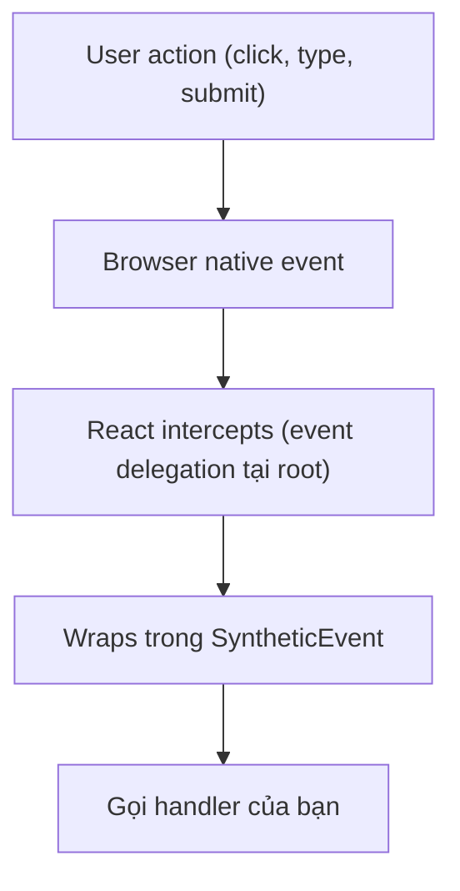

# React: Event Handling

> [!summary] TL;DR
> React dùng **SyntheticEvent** — wrapper chuẩn hóa browser events, cross-browser consistent. Event handlers viết theo **camelCase**: `onClick`, `onChange`, `onSubmit`, `onKeyDown`. Truyền **function reference**, không call ngay: `onClick={handleClick}` ✅ vs `onClick={handleClick()}` ❌ (gọi ngay khi render). Để truyền argument: dùng **arrow function wrapper** `onClick={() => handleClick(id)}`. `e.preventDefault()` để ngăn default behavior (form submit, link navigation).

---

## 1. Khái niệm

### SyntheticEvent

React wrap browser native events trong **SyntheticEvent** — object chuẩn hóa với cùng API trên mọi browser:



SyntheticEvent có đủ properties quen thuộc: `target`, `currentTarget`, `preventDefault()`, `stopPropagation()`, `type`, `nativeEvent`.

```
★ Insight ─────────────────────────────────────
• Lỗi số 1 của người mới: `onClick={fn()}` GỌI hàm lúc render rồi gán kết quả
  (thường undefined) cho onClick. Phải truyền THAM CHIẾU `onClick={fn}`, hoặc gói
  `onClick={() => fn(id)}` khi cần truyền tham số. Nhớ: prop nhận một HÀM, không
  phải kết quả của hàm.
• SyntheticEvent chính là event delegation của vanilla ([[../02-DOM-Event/07-Event-Propagation-Delegation]])
  được React tự động hoá: React KHÔNG gắn listener lên từng phần tử mà gắn 1 cái
  ở gốc rồi định tuyến → nhẹ dù render ngàn item. Cùng cặp khái niệm target (nơi
  bị click) vs currentTarget (nơi gắn handler) bạn đã học ở DOM.
─────────────────────────────────────────────────
```

---

## 2. Cú pháp / API

### 2.1 Basic Event Handlers

```jsx
function EventBasics() {
  // Named handler — recommend cho logic phức tạp
  const handleClick = (e) => {
    console.log('Clicked!', e.type); // 'click'
    console.log('Target:', e.target.tagName); // 'BUTTON'
  };

  return (
    <div>
      {/* Truyền function REFERENCE — không gọi ngay */}
      <button onClick={handleClick}>Click me</button>

      {/* Inline arrow function — OK cho logic đơn giản */}
      <button onClick={() => alert('Hello!')}>Alert</button>

      {/* SAI — gọi ngay khi render, không phải khi click */}
      {/* <button onClick={handleClick()}>Wrong</button> */}
    </div>
  );
}
```

### 2.2 Common Event Types

```jsx
function EventTypes() {
  return (
    <div>
      {/* Mouse events */}
      <button
        onClick={e => console.log('click', e.button)}       // 0=left, 1=mid, 2=right
        onDoubleClick={() => console.log('double click')}
        onMouseEnter={() => console.log('mouse enter')}
        onMouseLeave={() => console.log('mouse leave')}
        onContextMenu={e => { e.preventDefault(); console.log('right click'); }}
      >
        Mouse Events
      </button>

      {/* Keyboard events */}
      <input
        onKeyDown={e => {
          if (e.key === 'Enter') console.log('Enter pressed');
          if (e.key === 'Escape') console.log('Escape pressed');
          if (e.ctrlKey && e.key === 's') {
            e.preventDefault();
            console.log('Ctrl+S');
          }
        }}
        onKeyUp={e => console.log('key up:', e.key)}
      />

      {/* Focus events */}
      <input
        onFocus={() => console.log('focused')}
        onBlur={e => console.log('blurred, value:', e.target.value)}
      />

      {/* Form events */}
      <form onSubmit={e => { e.preventDefault(); console.log('submitted'); }}>
        <input onChange={e => console.log('change:', e.target.value)} />
        <button type="submit">Submit</button>
      </form>
    </div>
  );
}
```

### 2.3 Truyền Arguments đến Handler

```jsx
function ItemList({ items }) {
  // Khi cần truyền argument: dùng arrow function wrapper
  const handleDelete = (id, name) => {
    if (window.confirm(`Delete "${name}"?`)) {
      console.log('Deleting:', id);
    }
  };

  const handleEdit = (id) => {
    console.log('Editing:', id);
  };

  return (
    <ul>
      {items.map(item => (
        <li key={item.id}>
          {item.name}
          {/* Arrow function wrapper để truyền args */}
          <button onClick={() => handleEdit(item.id)}>Edit</button>
          <button onClick={() => handleDelete(item.id, item.name)}>Delete</button>

          {/* Cũng có thể dùng data attributes */}
          <button
            data-id={item.id}
            onClick={e => console.log(e.currentTarget.dataset.id)}
          >
            Info
          </button>
        </li>
      ))}
    </ul>
  );
}
```

### 2.4 `e.preventDefault()` và `e.stopPropagation()`

```jsx
function PreventDefaults() {
  const handleLinkClick = (e) => {
    e.preventDefault(); // Ngăn navigation
    console.log('Link clicked but not navigated');
  };

  const handleFormSubmit = (e) => {
    e.preventDefault(); // Ngăn page reload
    const formData = new FormData(e.target);
    console.log('Email:', formData.get('email'));
  };

  return (
    <div>
      {/* preventDefault cho link */}
      <a href="https://example.com" onClick={handleLinkClick}>
        Click (won't navigate)
      </a>

      {/* preventDefault cho form */}
      <form onSubmit={handleFormSubmit}>
        <input name="email" type="email" />
        <button type="submit">Submit</button>
      </form>
    </div>
  );
}

// stopPropagation — ngăn event bubble lên parent
function BubbleExample() {
  return (
    <div onClick={() => console.log('div clicked')}>
      <button
        onClick={e => {
          e.stopPropagation(); // Ngăn event bubble lên div
          console.log('button clicked only');
        }}
      >
        Click (no bubble)
      </button>
    </div>
  );
}
```

### 2.5 Event Handler với State

```jsx
function LikeButton() {
  const [liked, setLiked] = useState(false);
  const [count, setCount] = useState(0);

  const handleLike = () => {
    setLiked(prev => !prev);
    setCount(prev => liked ? prev - 1 : prev + 1);
  };

  return (
    <button
      onClick={handleLike}
      className={liked ? 'liked' : ''}
      aria-pressed={liked}
    >
      {liked ? '❤️' : '🤍'} {count}
    </button>
  );
}
```

### 2.6 Synthetic Events và `e.target` vs `e.currentTarget`

```jsx
function TargetDemo() {
  // e.target — element thực sự được click (có thể là child)
  // e.currentTarget — element có event listener gắn vào
  const handleDivClick = (e) => {
    console.log('target:', e.target.tagName);          // phần tử được click (span, button, ...)
    console.log('currentTarget:', e.currentTarget.tagName); // div (element có onClick)
  };

  return (
    <div onClick={handleDivClick}>
      <span>Click span</span>
      <button>Click button</button>
      {/* Dù click span hay button, currentTarget vẫn là div */}
    </div>
  );
}

// onChange — input, select, textarea
function InputDemo() {
  const [value, setValue] = useState('');

  return (
    <div>
      <input
        type="text"
        value={value}
        onChange={e => setValue(e.target.value)}  // e.target.value là giá trị input
      />
      <select onChange={e => console.log(e.target.value)}>
        <option value="a">Option A</option>
        <option value="b">Option B</option>
      </select>
      <input
        type="checkbox"
        onChange={e => console.log(e.target.checked)} // checkbox dùng .checked
      />
    </div>
  );
}
```

---

## 3. Ví dụ minh họa

### Ví dụ 1: Interactive button group

```jsx
function ButtonGroup({ options, value, onChange }) {
  return (
    <div role="group" className="btn-group">
      {options.map(option => (
        <button
          key={option.value}
          className={`btn ${value === option.value ? 'btn-active' : ''}`}
          onClick={() => onChange(option.value)}
          aria-pressed={value === option.value}
        >
          {option.label}
        </button>
      ))}
    </div>
  );
}

function App() {
  const [size, setSize] = useState('medium');

  return (
    <ButtonGroup
      options={[
        { value: 'small',  label: 'S' },
        { value: 'medium', label: 'M' },
        { value: 'large',  label: 'L' },
      ]}
      value={size}
      onChange={setSize}
    />
  );
}
```

### Ví dụ 2: Keyboard shortcut handler

```jsx
function SearchBox({ onSearch }) {
  const [query, setQuery] = useState('');

  const handleKeyDown = (e) => {
    switch (e.key) {
      case 'Enter':
        if (query.trim()) onSearch(query.trim());
        break;
      case 'Escape':
        setQuery('');
        break;
      case 'ArrowUp':
        e.preventDefault(); // Ngăn cursor về đầu input
        console.log('navigate up in suggestions');
        break;
    }
  };

  return (
    <div className="search-box">
      <input
        type="search"
        value={query}
        onChange={e => setQuery(e.target.value)}
        onKeyDown={handleKeyDown}
        placeholder="Search... (Enter to search, Esc to clear)"
      />
      {query && (
        <button
          onClick={() => setQuery('')}
          aria-label="Clear search"
        >
          ✕
        </button>
      )}
    </div>
  );
}
```

---

## 4. Pitfalls / Bẫy thường gặp

> [!warning] Pitfall 1: `onClick={handleClick()}` — gọi hàm ngay khi render
> `onClick={handleClick()}` gọi `handleClick` **ngay lúc render** và gán return value cho onClick. Nếu handleClick return void → `onClick={undefined}` → không có gì xảy ra khi click. **Luôn truyền function reference** `onClick={handleClick}` hoặc wrap `onClick={() => handleClick(arg)}`.

> [!warning] Pitfall 2: SyntheticEvent bị "nullified" trong async code (React 16 trở về trước)
> Từ React 17+, event pooling đã bị loại bỏ — bạn có thể access `e.target.value` trong async callback. Nếu support React 16, phải gọi `e.persist()` hoặc lưu vào biến: `const value = e.target.value` trước khi async.

> [!tip] Event delegation — React attach 1 listener, không nhiều
> React không gắn listener trực tiếp lên từng DOM element. Thay vào đó, React gắn **1 event listener** tại root (`#root` hoặc `document`). Khi event xảy ra, React tự định tuyến đến đúng handler. Đây là lý do performance tốt ngay cả khi render hàng ngàn items.

---

## 5. Câu hỏi phỏng vấn thường gặp

**Q1: SyntheticEvent trong React là gì?**

> **SyntheticEvent** là React wrapper xung quanh browser native event — chuẩn hóa API để nhất quán trên mọi browser. Có cùng interface với native event (`preventDefault()`, `stopPropagation()`, `target`, `currentTarget`, v.v.). React dùng **event delegation**: gắn 1 listener tại root thay vì mỗi element, sau đó route đến đúng handler — hiệu quả hơn.

**Q2: Phân biệt `e.preventDefault()` và `e.stopPropagation()`.**

> **`e.preventDefault()`**: ngăn **default browser behavior** của event — form submit không reload page, link click không navigate, drag không di chuyển file. **`e.stopPropagation()`**: ngăn event **bubble lên parent elements** — click vào button trong div có onClick → chỉ button handler chạy, div handler không chạy. Hai method độc lập, có thể gọi cả hai cùng lúc nếu cần.

**Q3: Tại sao `onClick={doSomething()}` là sai?**

> `onClick={doSomething()}` **gọi `doSomething` ngay khi component render**, không phải khi click. Return value của `doSomething` (thường là `undefined`) được assign cho `onClick` prop — dẫn đến không có handler khi click. Đúng phải là: `onClick={doSomething}` (truyền reference) hoặc `onClick={() => doSomething(arg)}` (khi cần truyền argument).

---

## 6. Bài tập tự luyện

- [ ] **Bài 1:** Tạo component `DragDropList({ items })` — mỗi item có nút "Move Up" và "Move Down". Click "Move Up" → swap với item phía trên (nếu không phải item đầu tiên). State là array.

- [ ] **Bài 2:** Tạo `HotkeyListener` component — lắng nghe `Ctrl+K` (open search), `Escape` (close), `/` (focus search input). Hiển thị modal khi search open. Dùng `document.addEventListener` trong `useEffect` (hint cho bài useEffect).

---

## 7. Liên kết

- [[03-State-voi-useState]] — Event handlers thường gọi state setters
- [[04-JSX-List-Conditional-Rendering]] — JSX event handler syntax
- [[06-Form-Handling]] — onSubmit, onChange cho form controls
- [[08-useEffect-Hook]] — Gắn event listener ngoài JSX (keyboard shortcut, resize, scroll)
