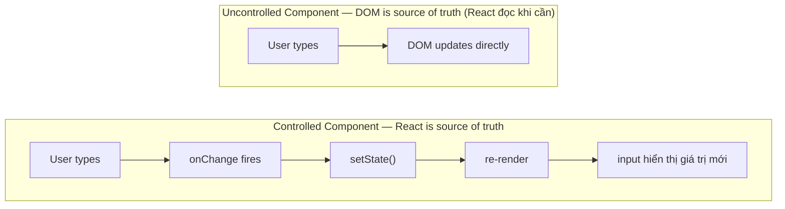

# React: Form Handling

> [!summary] TL;DR
> **Controlled component** (component "có kiểm soát"): giá trị ô input do React state nắm giữ — `value={state}` đi kèm `onChange={setState}` (mỗi lần gõ là cập nhật state). **Uncontrolled component** (component "không kiểm soát"): để DOM tự giữ giá trị, khi cần mới đọc qua `useRef`. Controlled là cách "thuận React" (React-idiomatic) — cho phép **suy ra UI từ state** (derive: bật/tắt nút, đếm ký tự) và **validate ngay khi gõ** (real-time). Uncontrolled hợp cho `<input type="file">` hoặc khi ghép với thư viện không phải React. Khi submit form phải gọi `e.preventDefault()` để **ngăn trình duyệt tải lại trang** (hành vi mặc định).

> [!tip] 🎯 Hiểu trong 30 giây
> Câu hỏi cốt lõi: **"Ai là người giữ giá trị thật của ô input?"**
> - **Controlled = React giữ.** Mỗi lần gõ phím, `onChange` cập nhật state, rồi state đổ ngược lại vào `value`. React luôn biết ô input đang chứa gì → **validate ngay khi gõ**, bật/tắt nút, đếm ký tự dễ dàng. (`value` và `onChange` phải đi *thành cặp*.)
> - **Uncontrolled = DOM tự giữ.** React không theo dõi từng phím; chỉ khi cần (lúc submit) mới "thò tay" vào DOM đọc qua `useRef`. Ví von: controlled như *bạn ghi lại từng chữ khách đọc*; uncontrolled như *để khách tự viết vào giấy, lúc nộp mới đọc*.
>
> **Mặc định dùng Controlled** vì hợp với React và cho **validate real-time**. Uncontrolled chỉ dùng khi *bắt buộc*: `<input type="file">`, hoặc tích hợp thư viện ngoài.
>
> **Đừng quên `e.preventDefault()`** trong `onSubmit` — nếu không, trình duyệt **tải lại trang** theo mặc định, mất hết.

---

## 1. Khái niệm

### Controlled vs Uncontrolled



```
★ Insight ─────────────────────────────────────
• Câu hỏi quyết định: AI là "nguồn chân lý" của giá trị ô input? Controlled =
  React state (value + onChange luôn ĐI CẶP — thiếu onChange thì input thành
  read-only + warning). Uncontrolled = DOM tự giữ, React đọc qua ref khi cần
  (bắt buộc cho `<input type=file>`). Mặc định controlled vì nó cho validate
  realtime + derive UI (disable nút, đếm ký tự) từ state.
• Bẫy "controlled↔uncontrolled switch": khởi tạo state input là `undefined` rồi
  gán string sau → React cảnh báo & hành vi lạ. Luôn khởi tạo `useState('')`.
  Form nhiều ô → 1 state object + 1 handler chung dùng `[e.target.name]` (nhờ
  computed property, [[../03-Advanced-JavaScript/07-ES6-Enhanced-Object-Literals]]).
─────────────────────────────────────────────────
```

**Khi nào dùng gì:**
- **Controlled**: validation real-time, derive UI từ input (search filter, character count), submit handler cần access values ngay
- **Uncontrolled**: file input (`<input type="file">`), integrate với thư viện non-React, performance critical form với nhiều fields

---

## 2. Cú pháp / API

### 2.1 Controlled Input

```jsx
function ControlledForm() {
  const [name, setName] = useState('');
  const [email, setEmail] = useState('');

  const handleSubmit = (e) => {
    e.preventDefault(); // QUAN TRỌNG: ngăn page reload
    console.log({ name, email });
  };

  return (
    <form onSubmit={handleSubmit}>
      <div>
        <label htmlFor="name">Name:</label>
        <input
          id="name"
          type="text"
          value={name}                      // value controlled by state
          onChange={e => setName(e.target.value)} // update state on every keystroke
        />
      </div>

      <div>
        <label htmlFor="email">Email:</label>
        <input
          id="email"
          type="email"
          value={email}
          onChange={e => setEmail(e.target.value)}
        />
      </div>

      <button type="submit" disabled={!name || !email}>
        Submit
      </button>
    </form>
  );
}
```

### 2.2 Multiple Inputs với một state object

```jsx
function RegistrationForm() {
  const [form, setForm] = useState({
    name: '', email: '', password: '', role: 'user', agree: false,
  });

  // Generic handler dùng name attribute
  const handleChange = (e) => {
    const { name, value, type, checked } = e.target;
    setForm(prev => ({
      ...prev,
      [name]: type === 'checkbox' ? checked : value,
    }));
  };

  const handleSubmit = (e) => {
    e.preventDefault();
    console.log('Form data:', form);
  };

  return (
    <form onSubmit={handleSubmit}>
      <input name="name"     value={form.name}     onChange={handleChange} placeholder="Name" />
      <input name="email"    type="email" value={form.email}    onChange={handleChange} placeholder="Email" />
      <input name="password" type="password" value={form.password} onChange={handleChange} placeholder="Password" />

      <select name="role" value={form.role} onChange={handleChange}>
        <option value="user">User</option>
        <option value="admin">Admin</option>
      </select>

      <label>
        <input name="agree" type="checkbox" checked={form.agree} onChange={handleChange} />
        I agree to terms
      </label>

      <button type="submit" disabled={!form.agree}>Register</button>
    </form>
  );
}
```

### 2.3 Uncontrolled Component với useRef

```jsx
import { useRef } from 'react';

function UncontrolledForm() {
  const nameRef   = useRef(null);
  const emailRef  = useRef(null);

  const handleSubmit = (e) => {
    e.preventDefault();
    // Đọc value chỉ khi submit — không re-render mỗi keystroke
    console.log({
      name:  nameRef.current.value,
      email: emailRef.current.value,
    });
  };

  return (
    <form onSubmit={handleSubmit}>
      <input ref={nameRef}  name="name"  type="text"  placeholder="Name" />
      <input ref={emailRef} name="email" type="email" placeholder="Email" />
      <button type="submit">Submit</button>
    </form>
  );
}

// File input — PHẢI dùng uncontrolled
function FileUpload() {
  const fileRef = useRef(null);

  const handleUpload = () => {
    const file = fileRef.current.files[0];
    if (file) {
      console.log('File:', file.name, file.size);
    }
  };

  return (
    <div>
      <input ref={fileRef} type="file" accept="image/*" />
      <button onClick={handleUpload}>Upload</button>
    </div>
  );
}
```

### 2.4 Form Validation

```jsx
function ValidatedForm() {
  const [form, setForm] = useState({ email: '', password: '' });
  const [errors, setErrors] = useState({});
  const [touched, setTouched] = useState({});

  const validate = (values) => {
    const errs = {};
    if (!values.email) {
      errs.email = 'Email là bắt buộc';
    } else if (!/^[^\s@]+@[^\s@]+\.[^\s@]+$/.test(values.email)) {
      errs.email = 'Email không hợp lệ';
    }
    if (!values.password) {
      errs.password = 'Password là bắt buộc';
    } else if (values.password.length < 8) {
      errs.password = 'Password phải tối thiểu 8 ký tự';
    }
    return errs;
  };

  const handleChange = (e) => {
    const { name, value } = e.target;
    const newForm = { ...form, [name]: value };
    setForm(newForm);
    if (touched[name]) {
      setErrors(validate(newForm)); // Revalidate khi đang sửa
    }
  };

  const handleBlur = (e) => {
    const { name } = e.target;
    setTouched(prev => ({ ...prev, [name]: true }));
    setErrors(validate(form));
  };

  const handleSubmit = (e) => {
    e.preventDefault();
    const errs = validate(form);
    if (Object.keys(errs).length > 0) {
      setErrors(errs);
      setTouched({ email: true, password: true });
      return;
    }
    console.log('Valid form data:', form);
  };

  const isValid = Object.keys(validate(form)).length === 0;

  return (
    <form onSubmit={handleSubmit} noValidate>
      <div>
        <input
          name="email" type="email" value={form.email}
          onChange={handleChange} onBlur={handleBlur}
          aria-invalid={!!errors.email}
          placeholder="Email"
        />
        {touched.email && errors.email && (
          <p className="error">{errors.email}</p>
        )}
      </div>

      <div>
        <input
          name="password" type="password" value={form.password}
          onChange={handleChange} onBlur={handleBlur}
          aria-invalid={!!errors.password}
          placeholder="Password"
        />
        {touched.password && errors.password && (
          <p className="error">{errors.password}</p>
        )}
      </div>

      <button type="submit" disabled={!isValid}>Login</button>
    </form>
  );
}
```

### 2.5 Custom useForm Hook

```jsx
// Tách logic form vào custom hook để tái sử dụng
function useForm(initialValues, validationFn) {
  const [values, setValues] = useState(initialValues);
  const [errors, setErrors] = useState({});
  const [isSubmitting, setIsSubmitting] = useState(false);

  const handleChange = (e) => {
    const { name, value, type, checked } = e.target;
    setValues(prev => ({
      ...prev,
      [name]: type === 'checkbox' ? checked : value,
    }));
  };

  const handleSubmit = (onSubmit) => async (e) => {
    e.preventDefault();
    const validationErrors = validationFn ? validationFn(values) : {};
    if (Object.keys(validationErrors).length > 0) {
      setErrors(validationErrors);
      return;
    }
    setIsSubmitting(true);
    try {
      await onSubmit(values);
    } finally {
      setIsSubmitting(false);
    }
  };

  const reset = () => {
    setValues(initialValues);
    setErrors({});
  };

  return { values, errors, isSubmitting, handleChange, handleSubmit, reset };
}

// Sử dụng custom hook
function LoginForm() {
  const { values, errors, isSubmitting, handleChange, handleSubmit } = useForm(
    { email: '', password: '' },
    (vals) => {
      const errs = {};
      if (!vals.email) errs.email = 'Required';
      if (!vals.password) errs.password = 'Required';
      return errs;
    }
  );

  const onSubmit = handleSubmit(async (data) => {
    await fetch('/api/login', { method: 'POST', body: JSON.stringify(data) });
  });

  return (
    <form onSubmit={onSubmit}>
      <input name="email" value={values.email} onChange={handleChange} />
      {errors.email && <p>{errors.email}</p>}
      <input name="password" type="password" value={values.password} onChange={handleChange} />
      {errors.password && <p>{errors.password}</p>}
      <button type="submit" disabled={isSubmitting}>
        {isSubmitting ? 'Loading...' : 'Login'}
      </button>
    </form>
  );
}
```

---

## 3. Ví dụ minh họa

### Ví dụ: Multi-step form

```jsx
function MultiStepForm() {
  const [step, setStep] = useState(1);
  const [form, setForm] = useState({
    name: '', email: '',          // Step 1
    password: '', confirm: '',    // Step 2
    plan: 'free',                 // Step 3
  });

  const updateField = (name, value) =>
    setForm(prev => ({ ...prev, [name]: value }));

  const next = () => setStep(prev => Math.min(prev + 1, 3));
  const prev = () => setStep(prev => Math.max(prev - 1, 1));

  return (
    <div>
      <div className="steps">
        {[1, 2, 3].map(s => (
          <span key={s} className={s === step ? 'active' : s < step ? 'done' : ''}>
            Step {s}
          </span>
        ))}
      </div>

      {step === 1 && (
        <div>
          <input placeholder="Name" value={form.name}
            onChange={e => updateField('name', e.target.value)} />
          <input placeholder="Email" value={form.email}
            onChange={e => updateField('email', e.target.value)} />
          <button onClick={next} disabled={!form.name || !form.email}>Next</button>
        </div>
      )}

      {step === 2 && (
        <div>
          <input type="password" placeholder="Password" value={form.password}
            onChange={e => updateField('password', e.target.value)} />
          <input type="password" placeholder="Confirm" value={form.confirm}
            onChange={e => updateField('confirm', e.target.value)} />
          <button onClick={prev}>Back</button>
          <button onClick={next}
            disabled={!form.password || form.password !== form.confirm}>
            Next
          </button>
        </div>
      )}

      {step === 3 && (
        <div>
          {['free', 'pro', 'enterprise'].map(plan => (
            <label key={plan}>
              <input type="radio" name="plan" value={plan}
                checked={form.plan === plan}
                onChange={e => updateField('plan', e.target.value)} />
              {plan}
            </label>
          ))}
          <button onClick={prev}>Back</button>
          <button onClick={() => console.log('Submit:', form)}>Submit</button>
        </div>
      )}
    </div>
  );
}
```

---

## 4. Pitfalls / Bẫy thường gặp

> [!warning] Pitfall 1: Input `value` không có `onChange` → readonly + warning
> `<input value={someState} />` không có `onChange` → React warning "You provided a value prop without onChange handler" và input trở thành **read-only**. Phải có cả hai: `value` + `onChange`. Nếu muốn default value (không controlled), dùng `defaultValue` thay `value`.

> [!warning] Pitfall 2: `value={undefined}` chuyển input từ controlled sang uncontrolled
> Nếu state ban đầu là `undefined` và sau đó thành string → React throw warning về switching controlled/uncontrolled. Luôn khởi tạo state với empty string: `useState('')` thay vì `useState(undefined)`.

> [!tip] Textarea trong React khác HTML
> HTML: `<textarea>content here</textarea>`. React: `<textarea value={text} onChange={...} />` — giống như input, value là prop, không phải children. Tương tự, `<select value={selected} onChange={...}>` thay vì dùng `selected` attribute trên `<option>`.

---

## 5. Câu hỏi phỏng vấn thường gặp

> [!example] 🗣️ Trả lời mẫu (nói thành lời) — "Controlled vs Uncontrolled, cái nào dễ validate real-time?"
> *"Controlled component là ô input mà giá trị do React state nắm giữ: em gắn `value` bằng state và `onChange` cập nhật state sau mỗi lần gõ, nên React luôn biết nội dung hiện tại. Uncontrolled thì để DOM tự giữ giá trị, khi cần em đọc qua useRef, thường là lúc submit. Để validate ngay khi người dùng đang gõ thì controlled dễ hơn hẳn, vì mỗi keystroke đã chạy qua state nên em kiểm tra và hiện lỗi tức thì, bật tắt nút submit, đếm ký tự đều được. Uncontrolled không có điểm móc theo từng phím nên khó validate real-time, em chủ yếu dùng nó cho input file vì file input bắt buộc uncontrolled, hoặc khi tích hợp thư viện ngoài. Một lưu ý là controlled phải có cả value và onChange, và nên khởi tạo state bằng chuỗi rỗng để tránh cảnh báo chuyển controlled/uncontrolled."*

> [!example] 🗣️ Trả lời mẫu — "Xử lý các trạng thái UI khi submit (loading/success/error), tránh double-submit?"
> *"Em quản ba trạng thái: loading, success, error. Khi bấm submit em set `isSubmitting = true` và disable nút ngay để chặn bấm hai lần, đổi chữ nút thành Đang gửi. Gọi API trong try/catch: thành công thì hiện thông báo success và thường reset form; lỗi thì bắt trong catch và hiển thị message lỗi cho người dùng; còn trong finally em set lại `isSubmitting = false` để mở nút. Việc disable nút theo `isSubmitting` chính là cách tránh double-submit hiệu quả nhất, kèm theo có thể chặn submit khi form chưa hợp lệ."*

> [!note] 🧠 Mẹo nhớ
> **"Ai giữ giá trị?" Controlled = React (value + onChange, validate real-time) · Uncontrolled = DOM (useRef, bắt buộc cho file).** Submit luôn **`e.preventDefault()`** + **disable nút theo `isSubmitting`** để chống double-submit.

**Q1: Controlled component là gì? Tại sao React recommend dùng?**

> **Controlled component** là input có `value` prop được điều khiển bởi React state và `onChange` handler để update state. React là "single source of truth". **Uncontrolled**: DOM tự quản lý value, dùng `ref` để đọc. React recommend controlled vì: (1) validation real-time dễ hơn, (2) instant access value trong handler, (3) dễ derive UI từ form state (disable button, live preview), (4) consistent với React philosophy.

**Q2: Tại sao cần `e.preventDefault()` trong form submit?**

> Khi form submit, browser mặc định sẽ **reload page** (HTTP GET/POST request). Trong React SPA, ta muốn xử lý form data bằng JS (gọi API, update state) mà không reload. `e.preventDefault()` ngăn hành vi default đó. Tương tự dùng cho `<a href>` khi muốn handle navigation bằng React Router.

**Q3: `useRef` khác `useState` thế nào khi dùng cho form?**

> `useState`: mỗi lần set → **re-render** component — phù hợp để sync UI với value. `useRef`: `.current` thay đổi không trigger re-render — phù hợp để đọc value khi submit mà không cần re-render mỗi keystroke. `useRef` cũng dùng để focus element: `ref.current.focus()`. Cho form phức tạp với nhiều fields, controlled component với state object là cách thông thường hơn.

---

## 6. Bài tập tự luyện

- [ ] **Bài 1:** Tạo form "Add Todo" có input text + button Submit. Validation: không được để trống, tối thiểu 3 ký tự. Khi valid submit → add vào danh sách todos, clear input. Show error message khi invalid.

- [ ] **Bài 2:** Tạo `useForm` custom hook với signature `useForm(initialValues)` trả về `{ values, handleChange, handleSubmit, reset }`. Demo với login form (email, password).

---

## 7. Liên kết

- [[03-State-voi-useState]] — State quản lý controlled form values
- [[05-Event-Handling]] — onChange, onSubmit event handlers
- [[04-JSX-List-Conditional-Rendering]] — Conditional rendering cho validation errors
