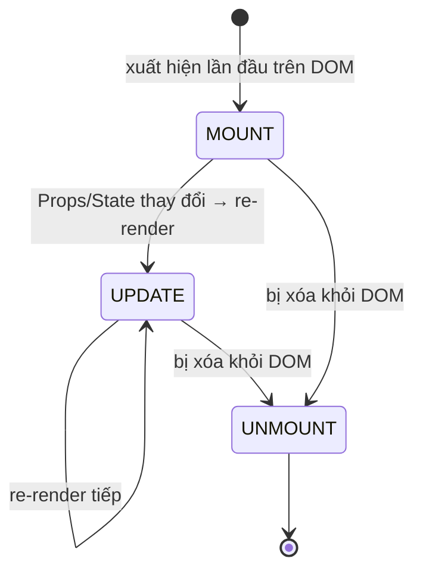

# React: Side Effect & Lifecycle

> [!summary] TL;DR
> **Side effect** (tác dụng phụ) = mọi việc component làm *ngoài* việc trả về JSX: gọi API lấy dữ liệu, đăng ký lắng nghe sự kiện (subscriptions), sửa DOM trực tiếp, đặt timer. **Lifecycle** (vòng đời) = các giai đoạn một component đi qua: **Mount** (sinh ra, xuất hiện trên màn hình) → **Update** (cập nhật khi props/state đổi) → **Unmount** (biến mất khỏi màn hình). Class component (kiểu cũ) dùng các "lifecycle method" riêng (`componentDidMount`, `componentDidUpdate`, `componentWillUnmount`); function component (kiểu mới) dùng **một hook duy nhất `useEffect`** lo cả 3 giai đoạn.

> [!tip] 🎯 Hiểu trong 30 giây
> Một component lý tưởng chỉ làm đúng một việc: **nhận dữ liệu → trả ra giao diện** (gọi là *pure* — thuần khiết, cùng đầu vào luôn ra cùng kết quả, không gây ảnh hưởng bên ngoài). Nhưng app thật cần làm thêm những việc "ngoài lề" như gọi API, đặt hẹn giờ, nghe sự kiện cuộn chuột — đó là **side effect**, và chúng phải để trong `useEffect`, **không** viết thẳng giữa thân component.
>
> **Lifecycle (vòng đời)** = đời một component: *sinh ra* (mount) → *cập nhật* (update) → *biến mất* (unmount). Ngày xưa (class) mỗi giai đoạn có một hàm riêng; nay chỉ cần **`useEffect`**:
> - `useEffect(fn, [])` ↔ lúc *mount*.
> - `useEffect(fn, [x])` ↔ chạy lại khi *x đổi* (update).
> - `return () => {...}` trong effect ↔ dọn dẹp lúc *unmount*.
>
> **Mẹo tư duy hiện đại:** đừng nghĩ "mount/update/unmount" nữa, hãy nghĩ *"đồng bộ việc này với các giá trị này, và dọn dẹp khi chúng đổi hoặc component mất đi"*.

---

## 1. Khái niệm

### Side Effect là gì?

**Side effect** = bất kỳ action nào **bên ngoài React render cycle**:

```text
Không phải side effect (pure render):
  Props/State vào → JSX ra → React update DOM

Side effects (cần useEffect):
  - Fetch data từ API
  - Subscribe WebSocket / EventEmitter
  - Gắn event listener (document.addEventListener)
  - Manipulate DOM trực tiếp
  - Set document.title
  - Timer (setTimeout, setInterval)
  - Logging, analytics
```

React yêu cầu: component function phải là **pure** (render phải deterministic, không side effects). Side effects chỉ được chạy trong `useEffect`.

```
★ Insight ─────────────────────────────────────
• Gốc rễ mọi quy tắc: render phải THUẦN (cùng props/state → cùng JSX, 0 tác dụng
  phụ) để React tự do gọi lại nhiều lần (StrictMode gọi 2 lần để bắt lỗi). Vì vậy
  mọi thứ "chạm thế giới ngoài" (fetch, listener, timer, document.title) phải đẩy
  vào useEffect — chạy SAU khi DOM update, không làm bẩn render.
• useEffect GỘP 3 lifecycle cũ vào một mô hình: [deps] quyết định "chạy lại khi
  nào" (mount = []; update = [deps]), còn return cleanup = componentWillUnmount.
  Đừng nghĩ theo "mount/update/unmount" nữa — nghĩ theo "ĐỒNG BỘ effect với
  những giá trị này, và DỌN DẸP khi chúng đổi hoặc component biến mất".
─────────────────────────────────────────────────
```

### Component Lifecycle



---

## 2. Cú pháp / API

### 2.1 Class Component Lifecycle (Legacy — cần biết để đọc code cũ)

```jsx
import { Component } from 'react';

class DataFetcher extends Component {
  // Initial state
  state = { data: null, loading: true, error: null };

  // Chạy SAU KHI component mount lần đầu
  // ✅ Đây là nơi fetch data, setup subscriptions
  componentDidMount() {
    fetch('/api/data')
      .then(r => r.json())
      .then(data => this.setState({ data, loading: false }))
      .catch(error => this.setState({ error, loading: false }));
  }

  // Chạy SAU KHI component update (props hoặc state thay đổi)
  // prevProps, prevState để compare
  componentDidUpdate(prevProps, prevState) {
    if (prevProps.userId !== this.props.userId) {
      // userId đổi → re-fetch
      this.fetchUser(this.props.userId);
    }
  }

  // Chạy TRƯỚC KHI component unmount
  // ✅ Đây là nơi cleanup: clear timers, unsubscribe, cancel requests
  componentWillUnmount() {
    clearInterval(this.timerId);
    this.subscription?.unsubscribe();
  }

  render() {
    const { data, loading, error } = this.state;
    if (loading) return <p>Loading...</p>;
    if (error)   return <p>Error: {error.message}</p>;
    return <div>{JSON.stringify(data)}</div>;
  }
}
```

### 2.2 Mapping Class Lifecycle → useEffect

```jsx
import { useState, useEffect } from 'react';

// componentDidMount (chạy 1 lần sau mount)
// → useEffect(fn, [])
useEffect(() => {
  console.log('Component mounted');
}, []); // [] = empty dependency array = chỉ chạy 1 lần

// componentDidUpdate khi `userId` thay đổi
// → useEffect(fn, [userId])
useEffect(() => {
  fetchUser(userId);
}, [userId]); // Chạy lại khi userId thay đổi

// componentWillUnmount (cleanup)
// → return cleanup function từ useEffect
useEffect(() => {
  const timer = setInterval(() => console.log('tick'), 1000);
  return () => clearInterval(timer); // cleanup khi unmount
}, []);

// componentDidMount + componentDidUpdate (mọi render)
// → useEffect(fn) — không có dependency array
useEffect(() => {
  console.log('After every render');
}); // Không có deps = chạy sau mỗi render
```

**Mapping table:**

| Class Lifecycle | Hook Equivalent | Khi nào chạy |
|---|---|---|
| `componentDidMount` | `useEffect(fn, [])` | 1 lần sau mount |
| `componentDidUpdate` | `useEffect(fn, [deps])` | Khi deps thay đổi |
| `componentWillUnmount` | `return () => {}` trong effect | Trước khi unmount |
| `shouldComponentUpdate` | `React.memo` | Trước khi re-render |

### 2.3 Function Component với Lifecycle tương đương

```jsx
function UserProfile({ userId }) {
  const [user, setUser] = useState(null);
  const [loading, setLoading] = useState(true);

  // componentDidMount + componentDidUpdate (khi userId thay đổi)
  useEffect(() => {
    setLoading(true);

    const controller = new AbortController();

    fetch(`/api/users/${userId}`, { signal: controller.signal })
      .then(r => r.json())
      .then(data => {
        setUser(data);
        setLoading(false);
      })
      .catch(err => {
        if (err.name !== 'AbortError') {
          console.error(err);
          setLoading(false);
        }
      });

    // componentWillUnmount equivalent — cancel inflight request
    return () => controller.abort();
  }, [userId]); // Re-run khi userId thay đổi

  if (loading) return <p>Loading...</p>;
  if (!user)   return <p>Not found</p>;
  return <h1>{user.name}</h1>;
}
```

### 2.4 Ví dụ các side effects phổ biến

```jsx
// 1. Document title
function PageTitle({ title }) {
  useEffect(() => {
    const prev = document.title;
    document.title = title;
    return () => { document.title = prev; }; // restore on unmount
  }, [title]);

  return null; // không render gì
}

// 2. Window resize listener
function WindowSize() {
  const [size, setSize] = useState({
    width: window.innerWidth,
    height: window.innerHeight,
  });

  useEffect(() => {
    const handleResize = () =>
      setSize({ width: window.innerWidth, height: window.innerHeight });

    window.addEventListener('resize', handleResize);
    return () => window.removeEventListener('resize', handleResize); // cleanup
  }, []); // empty deps = setup 1 lần

  return <p>{size.width}×{size.height}</p>;
}

// 3. Interval / timer
function Countdown({ from }) {
  const [count, setCount] = useState(from);

  useEffect(() => {
    if (count === 0) return;
    const timer = setTimeout(() => setCount(prev => prev - 1), 1000);
    return () => clearTimeout(timer); // clear pending timeout on re-run
  }, [count]);

  return <h1>{count === 0 ? 'Done!' : count}</h1>;
}
```

---

## 3. Ví dụ minh họa

### Ví dụ 1: Online status indicator

```jsx
function OnlineStatus() {
  const [isOnline, setIsOnline] = useState(navigator.onLine);

  useEffect(() => {
    const handleOnline  = () => setIsOnline(true);
    const handleOffline = () => setIsOnline(false);

    window.addEventListener('online',  handleOnline);
    window.addEventListener('offline', handleOffline);

    // Cleanup — xóa listeners khi component unmount
    return () => {
      window.removeEventListener('online',  handleOnline);
      window.removeEventListener('offline', handleOffline);
    };
  }, []); // [] = setup 1 lần, cleanup 1 lần

  return (
    <span className={isOnline ? 'status-online' : 'status-offline'}>
      {isOnline ? '🟢 Online' : '🔴 Offline'}
    </span>
  );
}
```

### Ví dụ 2: Custom hook cho side effects

```jsx
// Tách side effect vào custom hook — reusable
function useDocumentTitle(title) {
  useEffect(() => {
    const prev = document.title;
    document.title = title;
    return () => { document.title = prev; };
  }, [title]);
}

function useEventListener(event, handler, element = window) {
  useEffect(() => {
    element.addEventListener(event, handler);
    return () => element.removeEventListener(event, handler);
  }, [event, handler, element]);
}

// Sử dụng trong component
function SearchPage() {
  const [query, setQuery] = useState('');

  useDocumentTitle(query ? `Search: ${query}` : 'Search');

  useEventListener('keydown', (e) => {
    if (e.key === '/') {
      document.getElementById('search-input')?.focus();
    }
  });

  return <input id="search-input" value={query} onChange={e => setQuery(e.target.value)} />;
}
```

---

## 4. Pitfalls / Bẫy thường gặp

> [!warning] Pitfall 1: Không cleanup event listeners → memory leak
> Nếu gắn `window.addEventListener` trong `useEffect` mà không `removeEventListener` trong cleanup → mỗi lần component mount lại gắn thêm 1 listener. Sau nhiều mount/unmount, có hàng chục listeners chạy song song → memory leak, bugs khó debug. **Luôn cleanup** những gì bạn setup.

> [!warning] Pitfall 2: `componentWillMount` / `componentWillUpdate` deprecated
> Trong class components, `componentWillMount`, `componentWillReceiveProps`, `componentWillUpdate` đã bị **deprecated** từ React 16.3 và sẽ bị xóa. Cần chuyển sang `getDerivedStateFromProps` (static) hoặc `componentDidMount` + `componentDidUpdate`.

> [!tip] Rule: Không side effect trong render function
> React có thể gọi render function nhiều lần (Strict Mode gọi 2 lần trong dev). Side effect trong render → duplicated, inconsistent behavior. Mọi side effect → `useEffect`. Data derivation (filter, transform) trong render là OK vì pure.

---

## 5. Câu hỏi phỏng vấn thường gặp

> [!example] 🗣️ Trả lời mẫu (nói thành lời) — "Side effect là gì, vì sao phải xử lý riêng?"
> *"Side effect là những việc component tương tác với thế giới bên ngoài chu trình render, ví dụ gọi API, đăng ký lắng nghe sự kiện, sửa DOM trực tiếp, đặt timer hay đổi document.title. React yêu cầu phần render phải thuần khiết, tức cùng props và state thì luôn ra cùng JSX và không gây tác dụng phụ, vì React có thể gọi render nhiều lần, ở chế độ Strict Mode còn gọi hai lần để bắt lỗi. Nếu đặt side effect ngay trong render thì sẽ bị chạy lặp, ví dụ fetch hai lần hoặc gắn trùng listener gây rò rỉ. Vì vậy mọi side effect phải đặt trong useEffect, nó chạy sau khi DOM đã cập nhật và mình kiểm soát được chạy lại khi nào qua mảng dependency, cùng với cleanup để dọn dẹp."*

> [!example] 🗣️ Trả lời mẫu — "Map các lifecycle của class sang hooks?"
> *"componentDidMount tương đương useEffect với mảng rỗng, chạy một lần sau khi mount. componentDidUpdate tương đương useEffect với mảng dependency, chạy lại khi giá trị trong đó đổi. componentWillUnmount tương đương hàm cleanup mình return bên trong useEffect. Còn shouldComponentUpdate để chặn re-render thì nay dùng React.memo. Điểm hay là thay vì ba method riêng, hooks gộp lại trong một useEffect, tư duy chuyển từ giai đoạn vòng đời sang đồng bộ effect với dữ liệu."*

> [!note] 🧠 Mẹo nhớ
> **Render phải THUẦN → mọi việc "ngoài lề" (fetch/timer/listener) cho vào `useEffect`.** Lifecycle map: **mount = `[]` · update = `[deps]` · unmount = `return cleanup`.** Setup gì → cleanup nấy (không thì leak).

**Q1: Side effect trong React là gì? Tại sao phải xử lý đặc biệt?**

> **Side effect** là mọi operation tương tác với thế giới bên ngoài render cycle: fetch API, subscribe events, manipulate DOM trực tiếp, timer. React render phải **pure** — cùng input phải luôn cho cùng output, không có ảnh hưởng phụ. Nếu side effect trong render: React có thể render nhiều lần → duplicate fetch, memory leak. `useEffect` tách side effects ra khỏi render, chạy sau khi DOM update.

**Q2: Liệt kê các lifecycle methods của class component và tương đương trong hooks.**

> **Mount**: `componentDidMount` → `useEffect(fn, [])`. **Update**: `componentDidUpdate(prevProps, prevState)` → `useEffect(fn, [deps])`. **Unmount**: `componentWillUnmount` → `return () => cleanup` từ `useEffect`. **Memo**: `shouldComponentUpdate` → `React.memo` + `useMemo`. Hooks đơn giản hóa: thay vì 3 lifecycle methods riêng, 1 `useEffect` handle cả 3 qua dependency array và cleanup function.

**Q3: Khi nào cần cleanup trong useEffect?**

> Cleanup cần khi effect **tạo ra resource cần giải phóng**: (1) `addEventListener` → remove. (2) `setInterval`/`setTimeout` → clear. (3) fetch request → abort (AbortController). (4) WebSocket/subscription → unsubscribe. Không cleanup → **memory leak**: resource tồn tại sau khi component đã unmount, có thể call `setState` trên unmounted component → warning và potential bugs.

---

## 6. Bài tập tự luyện

- [ ] **Bài 1:** Tạo hook `useLocalStorage(key, defaultValue)` — sync state với localStorage. Khi state thay đổi → `localStorage.setItem`. Khi mount → đọc từ `localStorage.getItem` (init state).

- [ ] **Bài 2:** Tạo component `ClickOutside({ children, onClickOutside })` — detect khi user click bên ngoài component và gọi `onClickOutside`. Dùng `useRef` + `useEffect` để gắn document click listener.

---

## 7. Liên kết

- [[08-useEffect-Hook]] — Chi tiết cú pháp và patterns của useEffect
- [[03-State-voi-useState]] — State cùng với lifecycle/effects
- [[02-Component-va-Props]] — Component tree, mount/unmount
