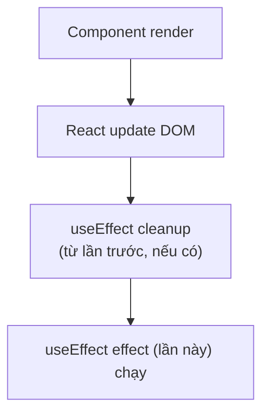

# React: useEffect Hook

> [!summary] TL;DR
> `useEffect(effect, deps?)` dùng để chạy **side effect** (việc "ngoài lề" đụng tới thế giới ngoài React: gọi API, đặt timer, lắng nghe sự kiện) *sau khi* React đã vẽ xong DOM. **3 chế độ** theo mảng dependency (deps = danh sách "phụ thuộc, đổi thì chạy lại"): không có mảng → chạy sau **mỗi** lần render; `[]` → chỉ chạy 1 lần lúc **mount** (component sinh ra); `[deps]` → chạy lại khi giá trị trong deps đổi. **Cleanup** (dọn dẹp) = hàm `return` bên trong effect — chạy *trước* lần effect kế tiếp và khi component **unmount** (biến mất); dùng để gỡ timer/listener (quên là rò rỉ bộ nhớ). **Data fetching** (lấy dữ liệu): nên dùng `AbortController` để **hủy request đang dở** (inflight) khi deps đổi, tránh race condition. **Mảng deps** phải liệt kê đủ mọi giá trị "động" (reactive — props/state) mà effect dùng; rule ESLint `exhaustive-deps` giúp bắt thiếu sót này.

> [!tip] 🎯 Hiểu trong 30 giây
> **`useEffect` = "sau khi vẽ xong màn hình, làm thêm việc này" — dành cho việc đụng tới thế giới bên ngoài React** (gọi API, đặt timer, lắng nghe scroll, đổi `document.title`). Component bình thường chỉ nên "tính ra giao diện"; mấy việc *phụ* (side effect) thì nhét vào `useEffect`.
>
> **Cái `[...]` cuối (dependency array) = "chạy lại khi nào":**
> - `useEffect(fn)` *(không có mảng)* → chạy **sau MỖI lần render** (hiếm dùng, dễ loạn).
> - `useEffect(fn, [])` → chạy **đúng 1 lần** lúc component sinh ra (mount).
> - `useEffect(fn, [a, b])` → chạy lại **mỗi khi a hoặc b đổi**.
>
> **Cleanup (hàm `return` trong effect) = "dọn dẹp trước khi chạy lại / trước khi component biến mất"** — dùng để `clearInterval`, gỡ event listener, hủy request. Quên dọn → **rò rỉ bộ nhớ** (timer/listener cứ chồng chất).
>
> **⚠️ Bẫy KINH ĐIỂN ra thi — Infinite Loop:** nếu trong effect bạn `setState`, mà state đó lại nằm trong deps (hoặc bạn để deps là một object/hàm tạo mới mỗi render, hoặc quên hẳn mảng deps) → effect chạy → setState → re-render → effect lại chạy → ... **lặp vô hạn, treo trình duyệt.** (Xem trả lời mẫu ở mục Phỏng vấn.)

---

## 1. Khái niệm

### useEffect Flow



Thứ tự quan trọng: effect chạy **sau** khi DOM đã update — không block browser paint.

```
★ Insight ─────────────────────────────────────
• deps array KHÔNG phải "điều kiện chạy" tuỳ hứng — nó là DANH SÁCH thứ effect
  phụ thuộc để đồng bộ. Thiếu một biến reactive → stale closure (effect ôm giá
  trị cũ mãi). Vì vậy đừng tắt ESLint exhaustive-deps; nếu deps phình do object/
  function literal (tạo mới mỗi render → vòng lặp vô tận) thì useMemo/useCallback
  hoặc tách primitive, đừng xoá deps.
• Cleanup chạy TRƯỚC mỗi lần effect tiếp theo, không chỉ lúc unmount — đó là vì
  sao AbortController/clearInterval đặt trong cleanup ngăn được race condition
  (request cũ ghi đè mới). Và bẫy tư duy lớn: KHÔNG phải mọi "sau render" đều cần
  effect — dữ liệu phái sinh thì tính thẳng trong render (`const x = items.filter`),
  effect chỉ để ĐỒNG BỘ với hệ thống ngoài.
─────────────────────────────────────────────────
```

---

## 2. Cú pháp / API

### 2.1 Ba Dependency Modes

```jsx
// Mode 1: Không có deps array — chạy sau EVERY render
useEffect(() => {
  console.log('After every render');
});

// Mode 2: Empty deps [] — chạy 1 lần sau MOUNT
useEffect(() => {
  console.log('Mounted — chạy 1 lần');
  return () => console.log('Unmounted'); // cleanup
}, []);

// Mode 3: Specific deps — chạy khi deps thay đổi
useEffect(() => {
  console.log('userId changed:', userId);
  fetchUser(userId);
}, [userId]); // chạy khi mount VÀ khi userId thay đổi
```

### 2.2 Cleanup Function

```jsx
function Timer() {
  const [seconds, setSeconds] = useState(0);

  useEffect(() => {
    // Setup: tạo interval
    const id = setInterval(() => {
      setSeconds(prev => prev + 1);
    }, 1000);

    // Cleanup: clear interval
    // Chạy: (1) trước khi effect chạy lại, (2) khi unmount
    return () => clearInterval(id);
  }, []); // [] = chỉ setup 1 lần

  return <p>Elapsed: {seconds}s</p>;
}

// Cleanup chạy TRƯỚC khi effect tiếp theo — ví dụ với deps
function SearchResults({ query }) {
  const [results, setResults] = useState([]);

  useEffect(() => {
    // Lần 1: query = 'react' → effect chạy, setup fetch
    // User đổi query → cleanup từ lần 1 chạy (cancel fetch cũ)
    //                   → effect mới chạy với query mới

    const controller = new AbortController();

    fetch(`/api/search?q=${encodeURIComponent(query)}`, {
      signal: controller.signal,
    })
      .then(r => r.json())
      .then(data => setResults(data))
      .catch(err => {
        if (err.name !== 'AbortError') console.error(err);
      });

    return () => controller.abort(); // cancel inflight request
  }, [query]);

  return <ul>{results.map(r => <li key={r.id}>{r.name}</li>)}</ul>;
}
```

### 2.3 Data Fetching Pattern

```jsx
function UserProfile({ userId }) {
  const [state, setState] = useState({
    user:    null,
    loading: true,
    error:   null,
  });

  useEffect(() => {
    // Reset khi userId thay đổi
    setState({ user: null, loading: true, error: null });

    const controller = new AbortController();

    const fetchUser = async () => {
      try {
        const res = await fetch(`/api/users/${userId}`, {
          signal: controller.signal,
        });
        if (!res.ok) throw new Error(`HTTP ${res.status}`);
        const user = await res.json();
        setState({ user, loading: false, error: null });
      } catch (err) {
        if (err.name === 'AbortError') return; // ignore cancel
        setState({ user: null, loading: false, error: err.message });
      }
    };

    fetchUser();

    return () => controller.abort();
  }, [userId]);

  const { user, loading, error } = state;
  if (loading) return <p>Loading...</p>;
  if (error)   return <p>Error: {error}</p>;
  if (!user)   return null;

  return (
    <div>
      <h1>{user.name}</h1>
      <p>{user.email}</p>
    </div>
  );
}
```

### 2.4 Dependency Array Rules

```jsx
// Rule: Phải include TẤT CẢ reactive values dùng trong effect
// Reactive values = props, state, variables derived từ chúng

function Example({ userId, filter }) {
  const [data, setData] = useState(null);

  // SAIT — thiếu filter trong deps
  // ESLint exhaustive-deps sẽ warn
  useEffect(() => {
    fetchData(userId, filter); // dùng filter nhưng không khai báo
  }, [userId]); // filter không có → effect không chạy lại khi filter đổi

  // ĐÚNG
  useEffect(() => {
    fetchData(userId, filter);
  }, [userId, filter]); // đầy đủ deps

  return null;
}

// Function trong deps — cần useCallback hoặc define trong effect
function BadDeps({ userId }) {
  // SAI — fetchUser tạo mới mỗi render → effect chạy mỗi render
  const fetchUser = () => fetch(`/api/users/${userId}`);
  useEffect(() => { fetchUser(); }, [fetchUser]); // infinite loop!

  // ĐÚNG option 1 — define inside effect
  useEffect(() => {
    const fetchUser = () => fetch(`/api/users/${userId}`);
    fetchUser();
  }, [userId]);

  // ĐÚNG option 2 — useCallback
  const stableFetch = useCallback(() => fetch(`/api/users/${userId}`), [userId]);
  useEffect(() => { stableFetch(); }, [stableFetch]);
}
```

### 2.5 Multiple useEffect — một component có thể có nhiều

```jsx
function Dashboard({ userId, theme }) {
  const [user, setUser]       = useState(null);
  const [metrics, setMetrics] = useState(null);

  // Effect 1: fetch user khi userId thay đổi
  useEffect(() => {
    fetch(`/api/users/${userId}`).then(r => r.json()).then(setUser);
  }, [userId]);

  // Effect 2: fetch metrics (độc lập với user)
  useEffect(() => {
    const id = setInterval(() => {
      fetch('/api/metrics').then(r => r.json()).then(setMetrics);
    }, 5000);
    return () => clearInterval(id);
  }, []);

  // Effect 3: document title theo theme
  useEffect(() => {
    document.body.className = theme;
    return () => { document.body.className = ''; };
  }, [theme]);

  // Mỗi effect độc lập → dễ read và maintain
  return <div>...</div>;
}
```

### 2.6 Strict Mode — Effect chạy 2 lần trong dev

```jsx
// React StrictMode gọi effect 2 lần trong development (mount → cleanup → mount)
// để giúp phát hiện side effects không được cleanup đúng

// Component của bạn sẽ thấy log 2 lần trong dev — bình thường
// Nếu cleanup đúng, behavior vẫn correct
useEffect(() => {
  const conn = connectToDatabase(); // mount
  return () => conn.disconnect();   // cleanup
  // Strict: connect → disconnect → connect
  // Production: connect (chỉ 1 lần)
}, []);
```

---

## 3. Ví dụ minh họa

### Ví dụ 1: Custom data fetching hook

```jsx
function useFetch(url) {
  const [data, setData]     = useState(null);
  const [loading, setLoading] = useState(true);
  const [error, setError]   = useState(null);

  useEffect(() => {
    if (!url) return;

    let isMounted = true;
    setLoading(true);
    setError(null);

    const controller = new AbortController();

    fetch(url, { signal: controller.signal })
      .then(res => {
        if (!res.ok) throw new Error(`HTTP ${res.status}`);
        return res.json();
      })
      .then(json => {
        if (isMounted) {
          setData(json);
          setLoading(false);
        }
      })
      .catch(err => {
        if (isMounted && err.name !== 'AbortError') {
          setError(err.message);
          setLoading(false);
        }
      });

    return () => {
      isMounted = false;
      controller.abort();
    };
  }, [url]);

  return { data, loading, error };
}

// Sử dụng
function ProductList() {
  const { data: products, loading, error } = useFetch('/api/products');

  if (loading) return <p>Loading products...</p>;
  if (error)   return <p>Error: {error}</p>;

  return (
    <ul>
      {products?.map(p => <li key={p.id}>{p.name}</li>)}
    </ul>
  );
}
```

### Ví dụ 2: Scroll position tracker

```jsx
function useScrollPosition() {
  const [scrollY, setScrollY] = useState(0);

  useEffect(() => {
    const handleScroll = () => setScrollY(window.scrollY);

    window.addEventListener('scroll', handleScroll, { passive: true });
    return () => window.removeEventListener('scroll', handleScroll);
  }, []); // setup 1 lần

  return scrollY;
}

function StickyHeader() {
  const scrollY = useScrollPosition();
  const isSticky = scrollY > 80;

  return (
    <header className={isSticky ? 'header-sticky' : 'header-normal'}>
      <nav>My App</nav>
    </header>
  );
}
```

---

## 4. Pitfalls / Bẫy thường gặp

> [!warning] Pitfall 1: Thiếu dependency → stale closure
> Effect dùng `userId` nhưng deps chỉ là `[]` → effect capture `userId` tại thời điểm mount và **không bao giờ cập nhật** khi `userId` thay đổi. Gọi là **stale closure**. ESLint `react-hooks/exhaustive-deps` rule phát hiện lỗi này. Không nên disable rule này trừ khi có lý do rất cụ thể.

> [!warning] Pitfall 2: Object/Array trong deps → infinite loop
> ```jsx
> useEffect(() => { fetchData(config); }, [config]); // config = {}
> // config là object literal → tạo reference MỚI mỗi render
> // Mỗi render deps thay đổi → effect chạy → setState → re-render → infinite!
> ```
> Fix: dùng `useMemo` cho object deps, hoặc destructure primitive values: `}, [config.url, config.method]`.

> [!tip] `useEffect` không phải cho mọi "sau khi render" logic
> Không cần `useEffect` để derive state từ props/state — làm trong render trực tiếp: `const filtered = items.filter(...)`. Không cần `useEffect` để update state dựa trên props change — dùng key prop để reset, hoặc tính toán trong render. `useEffect` chỉ cho **external system synchronization**.

---

## 5. Câu hỏi phỏng vấn thường gặp

> [!example] 🗣️ Trả lời mẫu (nói thành lời) — "Một kịch bản useEffect/useState gây Infinite Loop?"
> *"Kịch bản kinh điển là gọi setState ngay trong useEffect mà không kiểm soát dependency. Ví dụ em viết `useEffect(() => { setCount(count + 1); })` mà quên mảng dependency: effect chạy sau mỗi render, mà nó lại setState nên gây re-render, render xong effect lại chạy tiếp, thành vòng lặp vô hạn treo trình duyệt. Một biến thể tinh vi hơn là để dependency là một object hoặc function tạo mới mỗi lần render, ví dụ `useEffect(() => {...}, [config])` với `config = {}` viết thẳng trong component — mỗi render `config` là object mới khác địa chỉ nên React tưởng dependency đổi, chạy lại liên tục. Cách phòng: khai báo đúng và đủ dependency, nếu cập nhật state dựa trên state cũ thì dùng updater `setCount(prev => prev + 1)` để không phải thêm count vào deps, và với object/function thì bọc useMemo/useCallback hoặc tách giá trị nguyên thủy ra. Em cũng không tắt rule exhaustive-deps của ESLint vì nó cảnh báo đúng mấy lỗi này."*
>
> ```jsx
> // ❌ Infinite loop: setState chạy mỗi render, không có deps
> useEffect(() => { setCount(count + 1); });
> // ❌ Infinite loop: object literal tạo mới mỗi render → deps "luôn đổi"
> useEffect(() => { fetchData(config); }, [config]); // const config = {}
> // ✅ chỉ chạy 1 lần, hoặc khi userId đổi
> useEffect(() => { fetchData(userId); }, [userId]);
> ```

> [!example] 🗣️ Trả lời mẫu — "Cleanup chạy khi nào? Quên cleanup gây memory leak ra sao?"
> *"Hàm cleanup là hàm mình return bên trong useEffect. Nó chạy hai thời điểm: trước khi effect chạy lại lần kế tiếp, và khi component unmount. Công dụng là dọn những thứ effect đã tạo. Ví dụ em `setInterval` hoặc `addEventListener('scroll')` trong effect mà quên clearInterval / removeEventListener trong cleanup, thì mỗi lần component mount lại sẽ tạo thêm một interval/listener mới mà cái cũ không bị gỡ, chúng tích tụ dần gây rò rỉ bộ nhớ và có thể chạy callback trên component đã biến mất. Nên hễ effect 'mở' cái gì thì cleanup phải 'đóng' cái đó."*

> [!note] 🧠 Mẹo nhớ
> **useEffect = "vẽ xong rồi làm việc ngoài lề".** Deps: **không mảng = mọi render · `[]` = 1 lần · `[x]` = khi x đổi.** **setState trong effect + deps sai = Infinite Loop.** **Effect mở gì → cleanup đóng nấy** (không thì leak).

**Q1: Giải thích 3 modes của dependency array trong useEffect.**

> **Không có deps** (`useEffect(fn)`): chạy sau **mỗi render** — hiếm khi dùng, gây performance issue. **Empty array** (`useEffect(fn, [])`): chạy **1 lần sau mount** — tương đương `componentDidMount`. **Specific deps** (`useEffect(fn, [a, b])`): chạy sau **mount và mỗi khi a hoặc b thay đổi** — tương đương `componentDidMount + componentDidUpdate` có điều kiện. Cleanup function return từ effect chạy **trước lần effect tiếp theo** và khi **unmount**.

**Q2: Tại sao cần AbortController khi fetch trong useEffect?**

> Khi deps thay đổi (ví dụ `userId`) trước khi fetch hoàn thành: **không có AbortController** → fetch cũ vẫn tiếp tục, khi resolve sẽ call `setState` → **race condition** (kết quả của request cũ ghi đè request mới). **AbortController**: cleanup function cancel request cũ trước khi request mới bắt đầu. Ngoài ra, nếu component unmount trong khi fetch → không cancel → `setState` trên unmounted component → warning.

**Q3: Stale closure trong useEffect là gì?**

> **Stale closure** xảy ra khi effect capture một giá trị tại thời điểm effect được tạo và **không cập nhật** khi giá trị đó thay đổi. Ví dụ: `useEffect(() => { console.log(count); }, [])` — `count` luôn là `0` (giá trị lúc mount), ngay cả khi count thay đổi. Fix: thêm `count` vào deps array. Hoặc dùng function updater: `setCount(prev => prev + 1)` không cần `count` trong deps.

---

## 6. Bài tập tự luyện

- [ ] **Bài 1:** Viết hook `useDebounce(value, delay)` — trả về debounced value, chỉ update sau `delay` ms kể từ lần cuối `value` thay đổi. Dùng trong search component: chỉ fetch khi user ngừng gõ.

- [ ] **Bài 2:** Viết hook `useInterval(callback, delay)` — chạy `callback` mỗi `delay` ms. Khi `delay = null`, dừng interval. Test: component đếm số giây, nút Pause set delay về null.

---

## 7. Liên kết

- [[07-Side-Effect-va-Lifecycle]] — Lifecycle concept, class lifecycle methods
- [[03-State-voi-useState]] — State thường dùng cùng useEffect
- [[02-Component-va-Props]] — Props trong dependency array
