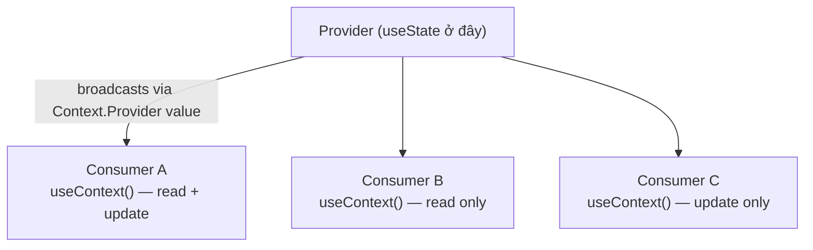

# React: Context với useState

> [!summary] TL;DR
> Pattern **Context + useState**: đặt `useState` trong Provider component, truyền `[state, setState]` qua Context value. Components con dùng `useContext` để đọc state và trigger updates — không cần prop drilling. Export **custom hook** (`useMyContext`) thay vì raw context để encapsulate logic và add validation. Best for: global UI state đơn giản (theme, user preferences, auth status) với ít transitions.

---

## 1. Khái niệm

### Pattern: Context + useState



Khi `setState` được gọi từ bất kỳ consumer nào → `useState` update → Provider re-render → Context value mới → tất cả consumers re-render.

```
★ Insight ─────────────────────────────────────
• Đây là "công thức state toàn cục" gọn nhất: state SỐNG trong Provider (useState),
  Context chỉ PHÁT nó xuống. Nhớ phân vai: useState giữ dữ liệu, Context vận chuyển
  ([[11-Context-API]]). Hợp cho dữ liệu ít đổi & đơn giản (theme, prefs, auth).
• Cái giá lặp lại: `value={{...}}` literal = reference mới mỗi render → mọi
  consumer re-render. useMemo cho value + useCallback cho hàm để ổn định. Khi state
  thành object phức tạp với nhiều "action" liên quan (add/remove/update/reset) →
  đã đến lúc nâng lên useReducer ([[13-Context-voi-useReducer]]) cho dễ test & gọn.
─────────────────────────────────────────────────
```

---

## 2. Cú pháp / API

### 2.1 Pattern cơ bản

```jsx
// contexts/ThemeContext.jsx
import { createContext, useContext, useState } from 'react';

// 1. Tạo context với default value (dùng khi không có Provider)
const ThemeContext = createContext({
  theme:       'light',
  setTheme:    () => {},
  toggleTheme: () => {},
});

// 2. Provider component — chứa state
export function ThemeProvider({ children }) {
  const [theme, setTheme] = useState('light');

  const toggleTheme = () => setTheme(prev => prev === 'light' ? 'dark' : 'light');

  // value object — spread vào context
  const value = { theme, setTheme, toggleTheme };

  return (
    <ThemeContext.Provider value={value}>
      {children}
    </ThemeContext.Provider>
  );
}

// 3. Custom hook — wrap useContext + error boundary
export function useTheme() {
  const context = useContext(ThemeContext);
  if (!context) {
    throw new Error('useTheme must be used within ThemeProvider');
  }
  return context;
}
```

### 2.2 Memoize Context Value (tối ưu re-renders)

```jsx
import { createContext, useContext, useState, useMemo, useCallback } from 'react';

const ThemeContext = createContext(null);

export function ThemeProvider({ children }) {
  const [theme, setTheme] = useState('light');

  // useCallback — stable reference cho functions
  const toggleTheme = useCallback(
    () => setTheme(prev => prev === 'light' ? 'dark' : 'light'),
    []
  );

  const setLightTheme = useCallback(() => setTheme('light'), []);
  const setDarkTheme  = useCallback(() => setTheme('dark'),  []);

  // useMemo — chỉ tạo value object mới khi theme thay đổi
  const value = useMemo(
    () => ({ theme, toggleTheme, setLightTheme, setDarkTheme }),
    [theme, toggleTheme, setLightTheme, setDarkTheme]
  );

  return (
    <ThemeContext.Provider value={value}>
      {children}
    </ThemeContext.Provider>
  );
}

export const useTheme = () => {
  const ctx = useContext(ThemeContext);
  if (!ctx) throw new Error('useTheme must be within ThemeProvider');
  return ctx;
};
```

### 2.3 Ví dụ hoàn chỉnh: User Preferences Context

```jsx
// contexts/PreferencesContext.jsx
import { createContext, useContext, useState, useEffect } from 'react';

const defaultPrefs = {
  theme:    'light',
  language: 'en',
  fontSize: 'medium',
};

const PreferencesContext = createContext(null);

export function PreferencesProvider({ children }) {
  // Persist preferences trong localStorage
  const [preferences, setPreferences] = useState(() => {
    try {
      const saved = localStorage.getItem('user-preferences');
      return saved ? JSON.parse(saved) : defaultPrefs;
    } catch {
      return defaultPrefs;
    }
  });

  // Sync to localStorage khi preferences thay đổi
  useEffect(() => {
    localStorage.setItem('user-preferences', JSON.stringify(preferences));
  }, [preferences]);

  // Granular update functions
  const updatePreference = (key, value) => {
    setPreferences(prev => ({ ...prev, [key]: value }));
  };

  const resetPreferences = () => setPreferences(defaultPrefs);

  const value = {
    preferences,
    updatePreference,
    resetPreferences,
    // Convenience shortcuts
    theme:    preferences.theme,
    language: preferences.language,
  };

  return (
    <PreferencesContext.Provider value={value}>
      {children}
    </PreferencesContext.Provider>
  );
}

export function usePreferences() {
  const ctx = useContext(PreferencesContext);
  if (!ctx) throw new Error('usePreferences must be within PreferencesProvider');
  return ctx;
}
```

### 2.4 Sử dụng trong Components

```jsx
// App.jsx
import { PreferencesProvider } from './contexts/PreferencesContext';

function App() {
  return (
    <PreferencesProvider>
      <SettingsPage />
      <ContentArea />
    </PreferencesProvider>
  );
}

// SettingsPage.jsx — đọc và cập nhật preferences
function SettingsPage() {
  const { preferences, updatePreference, resetPreferences } = usePreferences();

  return (
    <div>
      <h2>Settings</h2>

      <label>
        Theme:
        <select
          value={preferences.theme}
          onChange={e => updatePreference('theme', e.target.value)}
        >
          <option value="light">Light</option>
          <option value="dark">Dark</option>
        </select>
      </label>

      <label>
        Language:
        <select
          value={preferences.language}
          onChange={e => updatePreference('language', e.target.value)}
        >
          <option value="en">English</option>
          <option value="vi">Tiếng Việt</option>
        </select>
      </label>

      <button onClick={resetPreferences}>Reset to Defaults</button>
    </div>
  );
}

// ContentArea.jsx — chỉ đọc theme
function ContentArea() {
  const { theme } = usePreferences();
  return (
    <main className={`content content-${theme}`}>
      Main Content
    </main>
  );
}
```

### 2.5 Multiple useState trong Provider

```jsx
// Nhiều state values trong cùng 1 Provider
const AppContext = createContext(null);

function AppProvider({ children }) {
  const [user,          setUser]          = useState(null);
  const [notifications, setNotifications] = useState([]);
  const [sidebarOpen,   setSidebarOpen]   = useState(true);

  const addNotification = (msg) => {
    const n = { id: Date.now(), message: msg };
    setNotifications(prev => [...prev, n]);
    setTimeout(() => {
      setNotifications(prev => prev.filter(x => x.id !== n.id));
    }, 4000);
  };

  return (
    <AppContext.Provider value={{
      user, setUser,
      notifications, addNotification,
      sidebarOpen, setSidebarOpen,
    }}>
      {children}
    </AppContext.Provider>
  );
}
```

---

## 3. Ví dụ minh họa

### Ví dụ: Shopping Cart Context với useState

```jsx
// contexts/CartContext.jsx
import { createContext, useContext, useState } from 'react';

const CartContext = createContext(null);

export function CartProvider({ children }) {
  const [items, setItems] = useState([]);

  const addItem = (product) => {
    setItems(prev => {
      const existing = prev.find(item => item.id === product.id);
      if (existing) {
        return prev.map(item =>
          item.id === product.id ? { ...item, qty: item.qty + 1 } : item
        );
      }
      return [...prev, { ...product, qty: 1 }];
    });
  };

  const removeItem = (id) => {
    setItems(prev => prev.filter(item => item.id !== id));
  };

  const updateQty = (id, qty) => {
    if (qty <= 0) return removeItem(id);
    setItems(prev => prev.map(item =>
      item.id === id ? { ...item, qty } : item
    ));
  };

  const clearCart = () => setItems([]);

  // Derived values
  const totalItems = items.reduce((sum, item) => sum + item.qty, 0);
  const totalPrice = items.reduce((sum, item) => sum + item.price * item.qty, 0);

  return (
    <CartContext.Provider value={{
      items, totalItems, totalPrice,
      addItem, removeItem, updateQty, clearCart,
    }}>
      {children}
    </CartContext.Provider>
  );
}

export const useCart = () => {
  const ctx = useContext(CartContext);
  if (!ctx) throw new Error('useCart must be within CartProvider');
  return ctx;
};

// CartIcon.jsx — chỉ cần totalItems
function CartIcon() {
  const { totalItems } = useCart();
  return (
    <div className="cart-icon">
      🛒
      {totalItems > 0 && <span className="badge">{totalItems}</span>}
    </div>
  );
}

// ProductCard.jsx — chỉ cần addItem
function ProductCard({ product }) {
  const { addItem } = useCart();
  return (
    <div>
      <h3>{product.name}</h3>
      <button onClick={() => addItem(product)}>Add to Cart</button>
    </div>
  );
}
```

---

## 4. Pitfalls / Bẫy thường gặp

> [!warning] Pitfall 1: Value object literal gây re-renders không cần thiết
> `value={{ user, logout }}` — object literal tạo **reference mới mỗi render** → mọi consumer re-render dù `user` không đổi. Fix: `useMemo(() => ({ user, logout }), [user, logout])`. Hoặc tách thành 2 context: `UserContext` (read) + `UserActionsContext` (functions stable).

> [!warning] Pitfall 2: Quá nhiều state trong một Provider
> Provider lớn với nhiều state → khi bất kỳ state nào thay đổi → tất cả consumers re-render. Tách thành nhiều Providers nhỏ theo domain: `AuthProvider`, `ThemeProvider`, `CartProvider` — mỗi consumer chỉ re-render khi context nó dùng thay đổi.

> [!tip] Lazy initial state với localStorage
> `useState(() => JSON.parse(localStorage.getItem('key') ?? 'null'))` — function initializer chỉ chạy 1 lần lúc mount, không phải mỗi render. Cần try/catch vì localStorage.getItem có thể throw (trong private browsing, storage full).

---

## 5. Câu hỏi phỏng vấn thường gặp

**Q1: Pattern Context + useState dùng khi nào?**

> Khi cần **global state đơn giản** được nhiều components đọc/cập nhật mà không muốn prop drilling. Phù hợp: theme (light/dark), locale, auth user, UI state (sidebar open/close), notification system. Không phù hợp: state thay đổi rất thường xuyên (animation, real-time), cần middleware/devtools → dùng Zustand/Redux Toolkit.

**Q2: Tại sao export custom hook thay vì export Context trực tiếp?**

> Custom hook `useMyContext()` wrap `useContext(Context)` + add error handling `if (!ctx) throw Error(...)`. Lợi ích: (1) consumer không cần biết context object, chỉ cần import hook; (2) throw meaningful error nếu dùng ngoài Provider; (3) có thể thêm transformation logic trong hook mà không ảnh hưởng API; (4) dễ mock trong tests.

**Q3: useMemo và useCallback trong Provider có cần thiết không?**

> Chỉ cần khi có **performance issue thực sự**. Nếu consumers dùng `React.memo` và value object thay đổi reference mỗi render → `React.memo` không có tác dụng → thêm `useMemo` cho value. Nhưng đừng premature optimize — chỉ thêm khi profiling cho thấy vấn đề. Cho apps nhỏ/medium, object literal đơn giản thường là OK.

---

## 6. Bài tập tự luyện

- [ ] **Bài 1:** Tạo `WishlistContext` với `items` (array), `addToWishlist(product)`, `removeFromWishlist(id)`, `isInWishlist(id)`. Persist sang `localStorage`. Tạo component `WishlistButton({ product })` dùng `useWishlist()`.

- [ ] **Bài 2:** Tạo `ModalContext` — state `{ isOpen, content, title }`. Functions: `openModal({ title, content })`, `closeModal()`. Render `<Modal>` trong Provider. Bất kỳ component nào có thể gọi `openModal()` từ `useModal()`.

---

## 7. Liên kết

- [[11-Context-API]] — Context API concepts cơ bản
- [[13-Context-voi-useReducer]] — Nâng cấp lên useReducer khi logic phức tạp hơn
- [[03-State-voi-useState]] — useState fundamentals
- [[08-useEffect-Hook]] — useEffect trong Provider (sync with localStorage)
