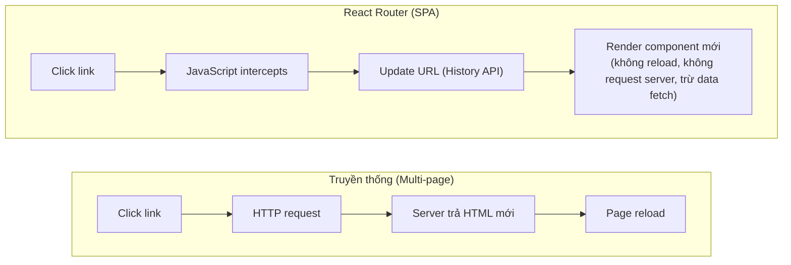

# React Router v6

> [!summary] TL;DR
> **React Router v6**: `<BrowserRouter>` wrap app, `<Routes>` chứa tất cả route, `<Route path="..." element={<Component />}>`. **Nested routes** với `<Outlet>` — parent layout render, children render vào vị trí `<Outlet>`. **Hooks**: `useParams()` (URL params), `useNavigate()` (programmatic navigation), `useLocation()` (current path). **Protected routes**: component wrapper check auth, render `<Navigate to="/login">` nếu không authorized. **`lazy()`** + `<Suspense>`: code splitting tự động.

> [!tip] 🎯 Hiểu trong 30 giây
> Trang web thường: bấm link → tải lại **cả trang** từ server (chậm, chớp trắng). React Router làm **SPA**: bấm link → JS **chỉ đổi URL và thay component**, không tải lại trang → mượt và **giữ nguyên state**. Nó "giả lập" điều hướng bằng History API của trình duyệt.
>
> **Vài câu hỏi đề hay xoáy vào:**
> - **`<Link to>` vs `<a href>`:** `<a href>` **tải lại cả trang** → mất hết React state; `<Link>` chặn việc đó, chỉ đổi component. → Trong app **luôn dùng `<Link>`**; chỉ dùng `<a>` cho link *ra ngoài* app.
> - **Dynamic routing** (`/employee/1`, `/employee/2`): khai báo route `path="/employee/:id"`, rồi trong component lấy id bằng hook **`const { id } = useParams()`**.
> - **Trang 404 bắt-tất-cả:** đặt `<Route path="*" element={<NotFound/>} />` ở cuối — `*` khớp mọi URL không trùng route nào ở trên.
> - **`<Outlet>`** = "ô trống" trong layout cha để route con render vào (dùng chung navbar/sidebar). **`lazy()` + `<Suspense>`** = chia nhỏ code theo trang, tải tới đâu nạp tới đó → trang đầu nhẹ.

---

## 1. Khái niệm

### Client-side Routing

React Router cho phép **Single Page Application (SPA)** — navigation không reload page:



```
★ Insight ─────────────────────────────────────
• SPA routing là "giả lập điều hướng" bằng History API: URL đổi, JS đổi component,
  KHÔNG tải lại trang → giữ nguyên React state. Vì vậy phải dùng `<Link>`/navigate
  (chặn reload) chứ KHÔNG `<a href>` (reload, mất state). `<a>` chỉ cho link RA
  NGOÀI app.
• Hai ý tưởng nâng cao đáng nhớ: (1) `<Outlet>` = chỗ trống trong layout cha để
  route con render vào → chia sẻ navbar/sidebar cho cả nhóm route mà không lặp.
  (2) `lazy(() => import())` + `<Suspense>` = CODE SPLITTING: mỗi trang tách thành
  chunk, chỉ tải khi điều hướng tới → bundle đầu nhỏ, tải nhanh. Liên hệ Core Web
  Vitals/LCP ở [[../01-HTML-CSS/12-SEO-Co-Ban]].
─────────────────────────────────────────────────
```

**v5 → v6 Breaking Changes quan trọng:**
- `<Switch>` → `<Routes>`
- `component={Comp}` → `element={<Comp />}`
- `useHistory()` → `useNavigate()`
- `exact` prop không còn cần thiết (v6 exact by default)

---

## 2. Cú pháp / API

### 2.1 Setup cơ bản

```bash
npm install react-router-dom
```

```jsx
// main.jsx — wrap toàn bộ app trong BrowserRouter
import { BrowserRouter } from 'react-router-dom';
import App from './App';

createRoot(document.getElementById('root')).render(
  <BrowserRouter>
    <App />
  </BrowserRouter>
);
```

```jsx
// App.jsx — định nghĩa routes
import { Routes, Route } from 'react-router-dom';
import Home        from './pages/Home';
import About       from './pages/About';
import UserProfile from './pages/UserProfile';
import NotFound    from './pages/NotFound';

function App() {
  return (
    <Routes>
      <Route path="/"          element={<Home />} />
      <Route path="/about"     element={<About />} />
      <Route path="/users/:id" element={<UserProfile />} />
      <Route path="*"          element={<NotFound />} />  {/* catch-all */}
    </Routes>
  );
}
```

### 2.2 Link và NavLink

```jsx
import { Link, NavLink } from 'react-router-dom';

function Navbar() {
  return (
    <nav>
      {/* Link — basic navigation, không reload page */}
      <Link to="/">Home</Link>
      <Link to="/about">About</Link>
      <Link to="/contact">Contact</Link>

      {/* NavLink — tự động thêm class 'active' khi route match */}
      <NavLink
        to="/dashboard"
        className={({ isActive }) => isActive ? 'nav-link active' : 'nav-link'}
      >
        Dashboard
      </NavLink>

      {/* NavLink với style */}
      <NavLink
        to="/settings"
        style={({ isActive }) => ({
          color: isActive ? '#0066cc' : 'inherit',
          fontWeight: isActive ? 'bold' : 'normal',
        })}
      >
        Settings
      </NavLink>
    </nav>
  );
}
```

### 2.3 URL Parameters với useParams

```jsx
import { useParams } from 'react-router-dom';

// Route: <Route path="/users/:userId" element={<UserProfile />} />
// URL: /users/42 → userId = '42'

function UserProfile() {
  const { userId } = useParams(); // userId là string

  return (
    <div>
      <h1>User #{userId}</h1>
    </div>
  );
}

// Multiple params
// Route: <Route path="/blog/:category/:slug" element={<BlogPost />} />
// URL: /blog/react/hooks-guide
function BlogPost() {
  const { category, slug } = useParams();
  return <h1>{category}: {slug}</h1>;
}

// Data fetching với useParams
function UserDetails() {
  const { id } = useParams();
  const [user, setUser] = useState(null);

  useEffect(() => {
    fetch(`/api/users/${id}`)
      .then(r => r.json())
      .then(setUser);
  }, [id]); // Re-fetch khi id thay đổi

  return user ? <h1>{user.name}</h1> : <p>Loading...</p>;
}
```

### 2.4 Programmatic Navigation với useNavigate

```jsx
import { useNavigate } from 'react-router-dom';

function LoginForm() {
  const navigate = useNavigate();
  const [email, setEmail] = useState('');

  const handleLogin = async (e) => {
    e.preventDefault();
    const result = await login({ email });
    if (result.success) {
      navigate('/dashboard');           // navigate forward
    }
  };

  return (
    <form onSubmit={handleLogin}>
      <input value={email} onChange={e => setEmail(e.target.value)} />
      <button type="submit">Login</button>
    </form>
  );
}

// navigate options
function NavigateExamples() {
  const navigate = useNavigate();

  return (
    <div>
      <button onClick={() => navigate('/home')}>            Go Home</button>
      <button onClick={() => navigate(-1)}>                 Go Back</button>
      <button onClick={() => navigate(1)}>                  Go Forward</button>
      <button onClick={() => navigate('/login', { replace: true })}>  {/* replace history, not push */}
        Login (replace)
      </button>
      <button onClick={() => navigate('/checkout', { state: { from: '/cart' } })}>
        Checkout (with state)
      </button>
    </div>
  );
}
```

### 2.5 Nested Routes với Outlet

```jsx
// Layout component — shared UI cho group of routes
import { Outlet, NavLink } from 'react-router-dom';

function DashboardLayout() {
  return (
    <div className="dashboard">
      <aside>
        <nav>
          <NavLink to="/dashboard">Overview</NavLink>
          <NavLink to="/dashboard/users">Users</NavLink>
          <NavLink to="/dashboard/settings">Settings</NavLink>
        </nav>
      </aside>
      <main>
        <Outlet />  {/* Children routes render ở đây */}
      </main>
    </div>
  );
}

// App.jsx — cấu hình nested routes
function App() {
  return (
    <Routes>
      <Route path="/" element={<Home />} />

      {/* Parent route với layout */}
      <Route path="/dashboard" element={<DashboardLayout />}>
        {/* index route — hiển thị khi path = "/dashboard" chính xác */}
        <Route index element={<DashboardOverview />} />
        <Route path="users"    element={<UserList />} />
        <Route path="users/:id" element={<UserDetail />} />
        <Route path="settings" element={<Settings />} />
      </Route>

      <Route path="*" element={<NotFound />} />
    </Routes>
  );
}

// URL paths:
// /dashboard         → DashboardLayout + DashboardOverview
// /dashboard/users   → DashboardLayout + UserList
// /dashboard/users/5 → DashboardLayout + UserDetail (id=5)
// /dashboard/settings → DashboardLayout + Settings
```

### 2.6 Protected Routes

```jsx
import { Navigate, useLocation } from 'react-router-dom';
import { useAuth } from './contexts/AuthContext';

// Wrapper component kiểm tra authentication
function ProtectedRoute({ children }) {
  const { isLoggedIn } = useAuth();
  const location = useLocation(); // nhớ current URL để redirect về sau khi login

  if (!isLoggedIn) {
    // Navigate thay thế component render — người dùng thấy /login
    // state: lưu từ đâu redirect để sau login navigate về đó
    return <Navigate to="/login" state={{ from: location }} replace />;
  }

  return children;
}

// Sử dụng trong Routes
function App() {
  return (
    <Routes>
      <Route path="/"      element={<Home />} />
      <Route path="/login" element={<Login />} />

      {/* Wrap trong ProtectedRoute */}
      <Route
        path="/dashboard"
        element={
          <ProtectedRoute>
            <DashboardLayout />
          </ProtectedRoute>
        }
      >
        <Route index element={<Overview />} />
        <Route path="settings" element={<Settings />} />
      </Route>
    </Routes>
  );
}

// Login page — redirect về origin sau khi login thành công
function LoginPage() {
  const navigate  = useNavigate();
  const location  = useLocation();
  const { login } = useAuth();

  const from = location.state?.from?.pathname ?? '/dashboard';

  const handleLogin = async (credentials) => {
    await login(credentials);
    navigate(from, { replace: true }); // về trang cũ
  };

  return <LoginForm onSubmit={handleLogin} />;
}
```

### 2.7 Lazy Loading Routes

```jsx
import { lazy, Suspense } from 'react';
import { Routes, Route } from 'react-router-dom';

// lazy() — dynamic import — Vite tự tách thành chunk riêng
const Home       = lazy(() => import('./pages/Home'));
const Dashboard  = lazy(() => import('./pages/Dashboard'));
const UserList   = lazy(() => import('./pages/users/UserList'));
const UserDetail = lazy(() => import('./pages/users/UserDetail'));
const Settings   = lazy(() => import('./pages/Settings'));

function LoadingFallback() {
  return (
    <div className="page-loading">
      <div className="spinner" />
      <p>Loading...</p>
    </div>
  );
}

function App() {
  return (
    // Suspense bắt buộc khi dùng lazy() — hiển thị fallback khi đang load
    <Suspense fallback={<LoadingFallback />}>
      <Routes>
        <Route path="/"              element={<Home />} />
        <Route path="/dashboard"     element={<Dashboard />} />
        <Route path="/users"         element={<UserList />} />
        <Route path="/users/:id"     element={<UserDetail />} />
        <Route path="/settings"      element={<Settings />} />
      </Routes>
    </Suspense>
  );
}
// Bundle sẽ được tách: main.js + home.chunk.js + dashboard.chunk.js + ...
// Mỗi chunk chỉ load khi user navigate đến route đó
```

### 2.8 useLocation và Query Params

```jsx
import { useLocation, useSearchParams } from 'react-router-dom';

// useLocation — current URL info
function CurrentRoute() {
  const location = useLocation();
  // { pathname: '/users', search: '?page=2&sort=name', hash: '#top', state: {...} }
  return <p>Current path: {location.pathname}</p>;
}

// useSearchParams — query string management
function UserListPage() {
  const [searchParams, setSearchParams] = useSearchParams();

  const page   = Number(searchParams.get('page') ?? 1);
  const sort   = searchParams.get('sort') ?? 'name';
  const filter = searchParams.get('filter') ?? '';

  return (
    <div>
      <input
        value={filter}
        onChange={e => setSearchParams(prev => {
          prev.set('filter', e.target.value);
          prev.set('page', '1'); // reset page khi filter thay đổi
          return prev;
        })}
        placeholder="Filter..."
      />

      <select
        value={sort}
        onChange={e => setSearchParams({ sort: e.target.value, page: '1' })}
      >
        <option value="name">Name</option>
        <option value="date">Date</option>
      </select>

      <UserList page={page} sort={sort} filter={filter} />

      <button onClick={() => setSearchParams({ page: String(page + 1), sort, filter })}>
        Next Page
      </button>
    </div>
  );
}
```

---

## 3. Ví dụ minh họa

### Ví dụ: Full app routing với auth, layout, lazy

```jsx
// App.jsx
import { lazy, Suspense } from 'react';
import { Routes, Route, Navigate } from 'react-router-dom';
import { useAuth } from './contexts/AuthContext';
import Spinner from './components/Spinner';
import PublicLayout from './layouts/PublicLayout';
import DashboardLayout from './layouts/DashboardLayout';

// Lazy-loaded page components
const Home     = lazy(() => import('./pages/Home'));
const Login    = lazy(() => import('./pages/Login'));
const Overview = lazy(() => import('./pages/dashboard/Overview'));
const Products = lazy(() => import('./pages/dashboard/Products'));
const Profile  = lazy(() => import('./pages/dashboard/Profile'));

function RequireAuth({ children }) {
  const { user } = useAuth();
  const loc      = useLocation();
  if (!user) return <Navigate to="/login" state={{ from: loc }} replace />;
  return children;
}

function App() {
  return (
    <Suspense fallback={<Spinner fullPage />}>
      <Routes>
        {/* Public routes với PublicLayout */}
        <Route element={<PublicLayout />}>
          <Route path="/"      element={<Home />} />
          <Route path="/login" element={<Login />} />
        </Route>

        {/* Protected routes với DashboardLayout */}
        <Route
          path="/dashboard"
          element={<RequireAuth><DashboardLayout /></RequireAuth>}
        >
          <Route index element={<Overview />} />
          <Route path="products" element={<Products />} />
          <Route path="profile"  element={<Profile />} />
        </Route>

        {/* Catch-all redirect */}
        <Route path="*" element={<Navigate to="/" replace />} />
      </Routes>
    </Suspense>
  );
}
```

---

## 4. Pitfalls / Bẫy thường gặp

> [!warning] Pitfall 1: Dùng `<a href>` thay `<Link>` gây page reload
> `<a href="/about">` trigger full page reload — mất toàn bộ React state. Luôn dùng `<Link to="/about">` trong React Router. Exception: link ra ngoài app (external URL) → dùng `<a>` bình thường.

> [!warning] Pitfall 2: Route path trong v6 là exact by default
> Trong v5, `/` match mọi path → cần `exact`. Trong v6, `/` chỉ match `/` chính xác → không cần `exact`. Khi nào cần non-exact matching: dùng `/*` pattern.

> [!tip] Index route vs path=""
> `<Route index element={<Overview />} />` (không có path) = default child route khi parent path match exactly. Tương đương `<Route path="" element={<Overview />} />`. Dùng `index` là idiomatic trong v6.

---

## 5. Câu hỏi phỏng vấn thường gặp

> [!example] 🗣️ Trả lời mẫu (nói thành lời) — "`<Link>` khác `<a href>` thế nào?"
> *"Khác nhau ở chỗ tải lại trang. Thẻ `<a href>` là điều hướng truyền thống: trình duyệt gửi request mới và tải lại toàn bộ trang, nên app React khởi động lại từ đầu và mất hết state hiện tại. Còn `<Link>` của React Router chặn hành vi mặc định đó, chỉ cập nhật URL bằng History API rồi render component tương ứng mà không reload, nên nhanh hơn và giữ nguyên state, đúng tinh thần SPA. Vì vậy trong nội bộ app em luôn dùng `<Link>`, chỉ dùng `<a>` khi trỏ ra một website bên ngoài."*

> [!example] 🗣️ Trả lời mẫu — "Tạo dynamic route `/employee/1` và lấy id ra sao? Trang 404 bắt mọi URL?"
> *"Em khai báo route với tham số động bằng dấu hai chấm: `path='/employee/:id'`. Khi người dùng vào `/employee/1`, bên trong component em lấy giá trị bằng hook useParams: `const { id } = useParams()`, id là chuỗi '1', rồi thường dùng nó trong useEffect để fetch dữ liệu, nhớ đưa id vào dependency để khi id đổi thì fetch lại. Còn trang 404 bắt tất cả thì em đặt một route với path dấu sao `path='*'` ở cuối danh sách Routes, nó khớp mọi URL không trùng route nào phía trên, em render component NotFound hoặc điều hướng về trang chủ."*

> [!note] 🧠 Mẹo nhớ
> **`<Link>` = không reload, giữ state; `<a>` = reload, mất state (chỉ dùng link ra ngoài).** Dynamic: **`:id` + `useParams()`.** 404: **`path="*"` ở cuối.** `<Outlet>` = ô cho route con; `lazy`+`Suspense` = code splitting.

**Q1: React Router v6 thay đổi gì so với v5?**

> Thay đổi chính: (1) `<Switch>` → `<Routes>` — v6 routes exclusive by default, không cần `exact`. (2) `component={Comp}` → `element={<Comp />}` — element là JSX, không phải component reference. (3) `useHistory()` → `useNavigate()`. (4) Nested routes với `<Outlet>` pattern rõ ràng hơn. (5) Relative paths trong nested routes. (6) `<Navigate>` component thay `<Redirect>`.

**Q2: Outlet là gì? Khi nào dùng?**

> `<Outlet>` là placeholder trong **parent/layout route** — nơi children routes được render. Dùng khi muốn **shared layout** cho một nhóm routes (Dashboard layout với sidebar, navbar; Admin layout khác Public layout). Cấu trúc: parent route có `element={<LayoutWithOutlet />}`, children routes được render vào vị trí `<Outlet />` trong layout.

**Q3: Lazy loading routes trong React Router — tại sao cần?**

> `lazy(() => import('./Page'))` cho phép **code splitting**: thay vì load toàn bộ JS upfront, mỗi lazy route được tách thành chunk riêng và chỉ load khi user navigate đến. Lợi ích: (1) **Initial bundle nhỏ hơn** → faster first load. (2) User chỉ download code của pages họ visit. Cần bọc trong `<Suspense fallback={<Loading />}>` để handle loading state. Vite tự động tách bundle khi dùng dynamic `import()`.

---

## 6. Bài tập tự luyện

- [ ] **Bài 1:** Tạo app với 4 routes: `/` (Home), `/products` (list), `/products/:id` (detail), `/about`. Dùng shared layout với Navbar (Link components). Product detail fetch từ public API `https://fakestoreapi.com/products/:id` dùng useParams + useEffect.

- [ ] **Bài 2:** Implement protected route: nếu user chưa login (`localStorage.getItem('token')` null) → redirect về `/login` với state `{ from: location }`. Login page sau khi "login" (set localStorage) → navigate về `from` hoặc `/dashboard`.

---

## 7. Liên kết

- [[01-React-Overview]] — React SPA, Vite setup
- [[08-useEffect-Hook]] — Data fetching khi useParams thay đổi
- [[11-Context-API]] — AuthContext dùng với protected routes
- [[03-State-voi-useState]] — State trong routed components
