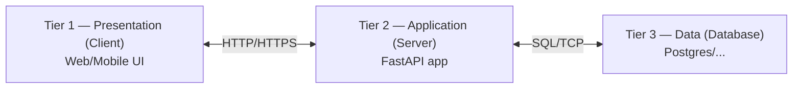
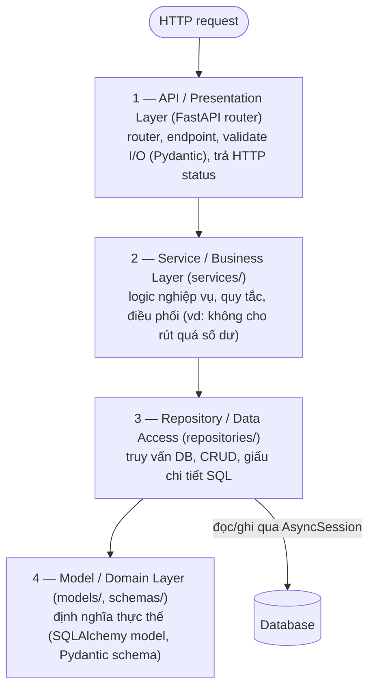
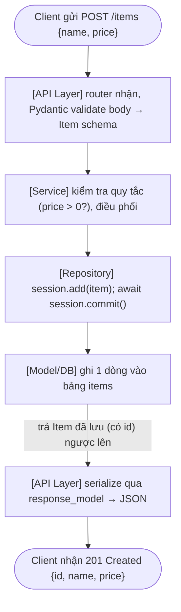

# FastAPI Overview, Backend Architecture & Async Foundation

> [!summary] TL;DR
> Một backend không phải "một cục code" — nó được tổ chức theo **tầng (tier)** và **lớp (layer)**. **Tier** = ranh giới *triển khai vật lý* (Client – Server – Database, có thể nằm trên các máy khác nhau); **Layer** = phân tách *logic trong code* cùng một process (API → Service → Repository → Model). Hai khái niệm này **khác nhau**, recruiter rất hay bắt lỗi.
>
> **FastAPI** là web framework Python chạy trên chuẩn **ASGI** (async), nhờ đó hỗ trợ `async/await`, WebSocket và streaming — những thứ chuẩn cũ **WSGI** (Flask/Django sync) không làm tốt. **Async giúp tăng thông lượng cho tác vụ I/O-bound** (chờ DB, chờ API, chờ mạng) bằng cách "nhường CPU" khi đang chờ, chứ **không** tăng tốc tác vụ CPU-bound (tính toán nặng — cái đó cần `multiprocessing`).

---

## 1. Kiến trúc Backend: Tier, Layer & Component

> Đây chính là câu phỏng vấn kinh điển: *"Backend có bao nhiêu tầng, bao nhiêu lớp, bao nhiêu thành phần?"*. Mấu chốt để trả lời tốt là **phân biệt rạch ròi 3 khái niệm** dưới đây — đừng gộp chung.

### 1.1. Tier (tầng triển khai) — góc nhìn "vật lý"

**Tier** là cách chia hệ thống theo **ranh giới triển khai/process** — mỗi tier *có thể* chạy trên máy/server khác nhau, giao tiếp qua mạng. Mô hình kinh điển là **3-tier**:



| Tier | Tên gọi | Vai trò | Ví dụ |
|---|---|---|---|
| **1** | Presentation / Client | Hiển thị, nhận thao tác người dùng | Browser, React app, mobile app |
| **2** | Application / Logic | Xử lý nghiệp vụ, điều phối | **FastAPI server** |
| **3** | Data | Lưu trữ bền vững | PostgreSQL, Redis, S3 |

> [!note] Vì sao "tier" quan trọng?
> Vì mỗi tier triển khai độc lập → **scale độc lập** (thêm server app mà không đụng DB), **bảo mật theo lớp** (DB không expose ra Internet, chỉ app truy cập được). "Backend" mà recruiter nói thường = **Tier 2 (Application)**.

### 1.2. Layer (lớp logic) — góc nhìn "code"

Bên trong **một tier** (cụ thể là Tier 2 — FastAPI app), code lại được chia thành các **layer** để tách trách nhiệm. Đây là kiến trúc **N-layer** (thường gặp 4 lớp):



> [!warning] Sửa hay nhầm: lớp nào "chạm" database?
> **Repository** mới là lớp *duy nhất* nói chuyện với DB (mở session, chạy SQL). **Model/Domain** chỉ *định nghĩa* thực thể để Repository dùng map dòng ↔ object — nó **không** nằm "giữa Repository và DB". Vẽ `Repository → Model → Database` là sai luồng (Model không tự ghi xuống DB); đúng phải là `Repository → Database`, còn Model được Repository *tham chiếu*.

| Layer | Trách nhiệm | Thành phần trong FastAPI |
|---|---|---|
| **API / Presentation** | Nhận request, validate, gọi service, trả response | `@app.get(...)`, `APIRouter`, Pydantic `response_model` |
| **Service / Business** | Quy tắc nghiệp vụ, điều phối nhiều repo, transaction | Hàm/class trong `services/` |
| **Repository / Data Access** | Đọc/ghi DB, đóng gói truy vấn | Class trong `repositories/`, dùng `AsyncSession` |
| **Model / Domain** | Cấu trúc dữ liệu & ràng buộc | SQLAlchemy `Mapped` model, Pydantic `BaseModel` |

> [!tip] Quy tắc vàng: phụ thuộc một chiều, đi xuống
> API → Service → Repository → Model. **Lớp trên gọi lớp dưới, không ngược lại.** Endpoint *không* được viết SQL trực tiếp; nghiệp vụ *không* nằm trong router. Nhờ vậy đổi DB chỉ sửa Repository, đổi quy tắc chỉ sửa Service — không vỡ chỗ khác.

### 1.3. Tier ≠ Layer — bảng phân biệt (recruiter hay vặn)

| Tiêu chí | **Tier (tầng)** | **Layer (lớp)** |
|---|---|---|
| Bản chất | Ranh giới **triển khai/process** | Ranh giới **logic trong code** |
| Vị trí vật lý | Có thể ở **máy khác nhau** | Thường **cùng 1 process** |
| Giao tiếp | Qua **mạng** (HTTP, TCP) | Qua **lời gọi hàm** trong RAM |
| Ví dụ | Client / Server / Database | API / Service / Repository / Model |
| Mục tiêu | Scale & bảo mật & triển khai | Tách trách nhiệm & dễ bảo trì |

```
★ Insight ─────────────────────────────────────
• Mẹo trả lời phỏng vấn: khi bị hỏi "bao nhiêu tầng/lớp", ĐỪNG đọc một con số.
  Hãy nói: "Tùy góc nhìn — về TRIỂN KHAI là 3-tier (Client–Server–DB); về CODE
  trong server là N-layer, thường 4 lớp API→Service→Repository→Model". Trả lời
  như vậy cho thấy bạn hiểu bản chất chứ không học vẹt.
• "Thành phần (component)" = các khối cụ thể bên trong: router, dependency, model,
  schema, service, repository, middleware, config, server (Uvicorn). Component là
  đơn vị NHỎ HƠN layer — nhiều component hợp thành một layer.
─────────────────────────────────────────────────
```

### 1.4. Vòng đời một HTTP request đi xuyên các lớp



---

## 2. Tầng phục vụ (Serving Stack): ASGI, Server, Framework, Event Loop

Khi nói "FastAPI chạy như thế nào", đây là **stack runtime** thực sự xử lý request (khác với layer code ở mục 1):

| Tầng | Vai trò | Ví dụ cụ thể |
|---|---|---|
| **ASGI** | *Chuẩn giao tiếp* async giữa server và framework | Async Server Gateway Interface |
| **Server** | Quản lý kết nối mạng, nhận/gửi byte | **Uvicorn**, Hypercorn |
| **Framework** | Routing + business logic | **FastAPI** (trên nền Starlette) |
| **Event Loop** | Lập lịch các tác vụ async | `asyncio` (hoặc **uvloop**) |

### 2.1. ASGI vs WSGI — vì sao FastAPI "async được"

**WSGI** (Web Server Gateway Interface) là chuẩn cũ, **đồng bộ**: mỗi request chiếm trọn một thread cho tới khi xong. **ASGI** là chuẩn mới, **bất đồng bộ**, hỗ trợ kết nối sống lâu (WebSocket) và streaming.

| Đặc điểm | **WSGI** | **ASGI** |
|---|---|---|
| Mô hình đồng thời | Thread/process | **Event loop async** |
| Streaming | Hạn chế | **Native** (gốc) |
| WebSocket | ❌ Không | ✅ Có |
| Framework điển hình | Flask, Django (cổ điển) | **FastAPI**, Starlette |

> [!note] FastAPI ngồi ở đâu?
> FastAPI là **framework** (ASGI app). Nó **không tự lắng nghe cổng mạng** — bạn cần một **ASGI server** như **Uvicorn** để chạy nó. Uvicorn nhận TCP, gọi vào app FastAPI qua giao thức ASGI, app trả response, Uvicorn gửi về client.

---

## 3. Sync vs Async — dùng khi nào?

> Đây là câu phỏng vấn thứ hai bạn từng bị hỏi: *"Sync khác async như nào, dùng khi nào?"*. Phần này trả lời đầy đủ.

### 3.1. Vấn đề: I/O làm CPU "ngồi chơi"

Trong code **đồng bộ (sync)**, khi gặp tác vụ I/O (gọi DB, gọi API, đọc file), thread bị **block** — đứng chờ, CPU không làm gì khác:

```python
import time

def download_data_sync(task_id):
    print(f"[{task_id}] Start I/O task -> CPU BLOCKED")
    time.sleep(2)          # block CẢ thread, CPU ngồi không
    print(f"[{task_id}] Done!")

for i in range(1, 4):
    download_data_sync(i)
# Total Sync Time: ~6.01s  (3 tác vụ × 2s, chạy lần lượt)
```

Code **bất đồng bộ (async)**: khi gặp `await`, coroutine **nhường CPU** cho việc khác, quay lại khi I/O xong:

```python
import asyncio

async def download_data_async(task_id):
    print(f"[{task_id}] Start I/O task -> YIELD CPU")
    await asyncio.sleep(2)   # tạm dừng hàm này, GIẢI PHÓNG CPU
    print(f"[{task_id}] Done!")

async def main():
    await asyncio.gather(           # chạy 3 tác vụ "đồng thời"
        download_data_async(1),
        download_data_async(2),
        download_data_async(3),
    )

asyncio.run(main())
# Total Async Time: ~2.00s  (3 tác vụ chờ CHỒNG lên nhau)
```

> [!example] Kết quả: 6.01s → 2.00s
> 3 tác vụ chờ 2s. Sync làm tuần tự = 6s. Async cho cả 3 cùng "chờ" một lúc = 2s. **Async không làm I/O nhanh hơn — nó tận dụng thời gian chờ để làm việc khác.**

### 3.2. Concurrency vs Parallelism (đừng nhầm)

| Khái niệm | Ý nghĩa | Công cụ Python |
|---|---|---|
| **Concurrency** (đồng thời) | Nhiều task **xen kẽ** tiến triển trên **1 CPU** | `asyncio` |
| **Parallelism** (song song) | Nhiều task chạy **thật sự cùng lúc** trên **nhiều CPU** | `multiprocessing` |
| **Hybrid** | Kết hợp cả hai | `async` + worker pool |

> Async dùng **concurrency**, không phải parallelism. Một event loop chạy trên **một thread** — nó chỉ tạo *ảo giác* "cùng lúc" bằng cách nhảy qua lại giữa các task mỗi khi có `await`.

### 3.3. Event Loop, Coroutine, Task, Future — bộ tứ async

**Event Loop** là "trái tim" của async — một vòng lặp lập lịch:

```python
while True:
    check I/O events      # có I/O nào xong chưa?
    resume ready tasks    # task nào sẵn sàng → chạy tiếp
    suspend waiting tasks # task nào đang chờ → tạm treo
```

| Khái niệm | Là gì |
|---|---|
| **Coroutine** | Hàm `async def` — **có thể tạm dừng & chạy tiếp** (`await` để nhường quyền) |
| **Await** | "Tạm dừng coroutine này đến khi việc được chờ xong, trong lúc đó loop chạy việc khác" |
| **Future** | Chỗ giữ chỗ (placeholder) cho **kết quả sẽ đến sau** (pending → result/exception) |
| **Task** | Một coroutine **đã được lên lịch** chạy trên event loop (`asyncio.create_task`) |

```python
# Chạy đồng thời bằng task tường minh
task1 = asyncio.create_task(fetch1())   # lên lịch ngay
task2 = asyncio.create_task(fetch2())
await task1                              # chờ kết quả
await task2
```

### 3.4. Khi nào dùng async, khi nào dùng sync?

| Loại tác vụ | Đặc điểm | Nên dùng |
|---|---|---|
| **I/O-bound** | Chờ DB, gọi API ngoài, đọc/ghi file, gọi LLM | ✅ **Async** (lợi lớn) |
| **CPU-bound** | Tính toán nặng, xử lý ảnh, ML inference local | ❌ Async vô dụng → **`multiprocessing`** / worker pool |
| **Đơn giản, script ngắn** | Không cần đồng thời | Sync cho gọn |

> [!warning] Sai lầm chí mạng: chặn event loop
> Trong một endpoint `async def`, **đừng gọi hàm sync chặn** (`time.sleep()`, truy vấn DB blocking, tính toán nặng). Một lệnh block sẽ **đóng băng toàn bộ event loop** → mọi request khác bị treo theo. Tác vụ nặng CPU phải đẩy ra `run_in_executor` / process pool. Backend AI gọi LLM (I/O-bound) chính là use-case async lý tưởng.

```
★ Insight ─────────────────────────────────────
• Async KHÔNG = nhanh hơn. Async = THÔNG LƯỢNG (throughput) cao hơn cho I/O. Một
  request lẻ vẫn mất đúng từng đó thời gian chờ DB; cái lợi là trong lúc chờ,
  server phục vụ được hàng trăm request khác thay vì đứng im.
• "async def" mà bên trong toàn lệnh sync blocking thì còn TỆ HƠN sync thuần,
  vì bạn vừa mất tính đồng thời, vừa gánh overhead của event loop.
─────────────────────────────────────────────────
```

### 3.5. Lỗi async thường gặp & cách debug

| Lỗi | Triệu chứng | Cách sửa |
|---|---|---|
| `coroutine never awaited` | Gọi `foo()` mà quên `await` → không chạy | `await foo()` hoặc `asyncio.create_task(foo())` |
| Exception bị "nuốt" | Task lỗi nhưng im lặng | `await` task để lỗi nổi lên; bật `asyncio.run(main(), debug=True)` |
| Event loop bị block | Cả app treo | Không gọi lệnh sync nặng trong coroutine |

Công cụ: `asyncio.all_tasks()`, `asyncio.current_task()`, `debug=True`.

---

## 4. FastAPI — ứng dụng đầu tiên

```python
from fastapi import FastAPI
from pydantic import BaseModel, Field

app = FastAPI()                       # tạo ASGI app

class Item(BaseModel):                # Model/schema (Layer 4)
    name: str = Field(..., min_length=3, max_length=50)
    price: float = Field(..., gt=0)   # ràng buộc: > 0
    in_stock: bool = True

@app.get("/")                         # API Layer: định nghĩa route
async def read_root():
    return {"Hello": "World"}

@app.post("/items/")
async def create_item(item: Item):    # FastAPI tự validate body theo Item
    return {"received": item}
```

Chạy app:

```sh
fastapi dev main.py          # chế độ dev (auto-reload)
# hoặc
uvicorn main:app --host 127.0.0.1 --port 8000
```

> [!tip] FastAPI tặng miễn phí những gì?
> - **Validation tự động** từ type hint + Pydantic (sai kiểu → trả 422 kèm chi tiết lỗi).
> - **Tài liệu API tự sinh** theo chuẩn **OpenAPI**: mở `/docs` (Swagger UI) hoặc `/redoc` để thử API ngay trên trình duyệt.
> - **Serialization** request/response tự động (Python object ⇄ JSON).

---

## 5. Q&A phỏng vấn

> [!question] 1. Backend có bao nhiêu tầng, bao nhiêu lớp, bao nhiêu thành phần?
> Tùy **góc nhìn**:
> - **Triển khai (tier):** kinh điển **3-tier** — Presentation (Client) / Application (Server) / Data (Database). Mỗi tier có thể ở máy khác nhau, giao tiếp qua mạng → scale & bảo mật độc lập.
> - **Code trong server (layer):** thường **N-layer 4 lớp** — API/Presentation → Service/Business → Repository/Data-Access → Model/Domain. Lớp trên gọi lớp dưới, một chiều.
> - **Thành phần (component):** router, dependency, schema/model, service, repository, middleware, config, ASGI server (Uvicorn)...
>
> Mấu chốt: **Tier là ranh giới triển khai (qua mạng); Layer là ranh giới logic trong code (qua lời gọi hàm).** Đừng đọc một con số khô khan.

> [!question] 2. Sync khác async như thế nào? Dùng khi nào?
> - **Sync:** gặp I/O thì **block** thread, CPU ngồi chờ → các việc khác phải xếp hàng.
> - **Async:** gặp `await` thì **nhường CPU** cho việc khác, quay lại khi I/O xong → một thread phục vụ nhiều việc xen kẽ (concurrency).
> - **Dùng async khi I/O-bound** (DB, API ngoài, gọi LLM, file/mạng). **Không dùng async cho CPU-bound** (tính toán nặng → `multiprocessing`).
> - Câu chốt ăn điểm: *"Async tăng throughput cho I/O bằng cách tận dụng thời gian chờ, chứ không làm từng tác vụ chạy nhanh hơn."*

> [!question] 3. Tại sao FastAPI nhanh và hỗ trợ async, còn Flask cổ điển thì không?
> Vì FastAPI chạy trên chuẩn **ASGI** (async, hỗ trợ event loop, WebSocket, streaming native), còn Flask cổ điển chạy **WSGI** (mỗi request chiếm 1 thread, không có async gốc). FastAPI + Uvicorn + (uvloop) tận dụng concurrency cho I/O nên throughput cao.

> [!question] 4. Concurrency và Parallelism khác nhau ra sao?
> **Concurrency** = nhiều task **xen kẽ** trên 1 CPU (asyncio) — ảo giác "cùng lúc". **Parallelism** = nhiều task chạy **thật sự song song** trên nhiều CPU (multiprocessing). Async là concurrency, không phải parallelism.

> [!question] 5. Event loop là gì? Coroutine, Task, Future khác nhau?
> **Event loop** = bộ lập lịch async: kiểm tra I/O, chạy tiếp task sẵn sàng, treo task đang chờ. **Coroutine** = hàm `async def` có thể tạm dừng. **Task** = coroutine đã được lên lịch chạy trên loop. **Future** = chỗ giữ chỗ cho kết quả sẽ đến sau.

> [!question] 6. Điều gì xảy ra nếu gọi `time.sleep(5)` trong một endpoint `async def`?
> `time.sleep` là lệnh **sync blocking** → nó **đóng băng cả event loop** trong 5 giây, **mọi request khác bị treo theo**. Phải dùng `await asyncio.sleep(5)`, hoặc đẩy tác vụ blocking ra `run_in_executor`/thread-pool.

---

## 6. Bài tập tự luyện

1. **Vẽ kiến trúc:** vẽ sơ đồ một app FastAPI quản lý "todo" theo 4 layer (API/Service/Repository/Model) và chỉ ra request `POST /todos` đi qua từng lớp nào.
2. **Đo sync vs async:** viết 2 hàm tải dữ liệu giả (`sleep 2s` × 5 lần) bản sync và bản async (`gather`), in thời gian chạy và giải thích chênh lệch.
3. **Bẫy block:** tạo endpoint `async def` có `time.sleep(5)`, mở 3 tab gọi cùng lúc, quan sát chúng bị tuần tự hóa. Sửa bằng `asyncio.sleep` và quan sát lại.
4. **Phân loại:** với mỗi tác vụ sau, nói I/O-bound hay CPU-bound và nên sync/async: (a) gọi OpenAI API, (b) resize 1000 ảnh, (c) truy vấn Postgres, (d) tính số nguyên tố thứ 1 triệu.

---

## 7. Liên quan
- [[03-Pydantic-Data-Modeling]] — Model/schema layer (validate dữ liệu)
- [[04-SQLAlchemy-Database]] — Repository/Data-access layer (async DB)
- [[07-CRUD-Repository-Pattern]] — hiện thực rõ N-layer
- [[14-Streaming-Foundations]] — ASGI streaming, WebSocket (vì sao cần async)
- [[00-MOC-Backend|MOC: Backend]]
