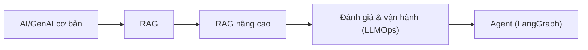

# MOC: AI — RAG, LangChain & LangGraph

> 🎯 **Trọng tâm kỳ thi FresherAI.** 4 module Level 2, mỗi module có Final Exam (Theory + Practical Coding).
> Stack: Python · LangChain · LangGraph · AWS Bedrock (xem [[../05-Cloud/01-AWS-Bedrock/00-MOC-AWS-Bedrock|Cloud/AWS]]).
> ✅ Đã viết nội dung — 18 note across 4 section.

## Các section

| # | Section | Module | MOC | Trạng thái |
|---|---------|--------|-----|------------|
| 1 | AI Fundamentals & RAG | `L2_AI_AIF` | [[01-AI-Fundamentals-RAG/00-MOC-AI-Fundamentals-RAG\|MOC]] | ✅ 5 note |
| 2 | RAG & Optimization | `L2_AI_RAGO` | [[02-RAG-Optimization/00-MOC-RAG-Optimization\|MOC]] | ✅ 5 note |
| 3 | LLMOps & Evaluation | `L2_AI_LLMO` | [[03-LLMOps-Evaluation/00-MOC-LLMOps-Evaluation\|MOC]] | ✅ 3 note |
| 4 | LangGraph & Agentic AI | `L2_AI_LGAA` | [[04-LangGraph-Agentic/00-MOC-LangGraph-Agentic\|MOC]] | ✅ 5 note |

## Lộ trình gợi ý

## Liên quan
- [[../05-Cloud/00-MOC-Cloud|MOC: Cloud]] — Bedrock, S3 Vectors
- [[../00-INDEX|🏠 Index tổng]]
