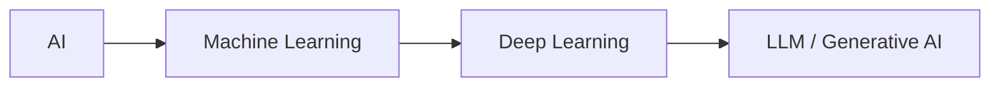
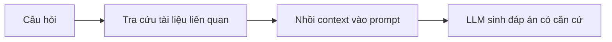

# Introduction to AI & Generative AI

> [!summary] TL;DR
> **AI** là ngành tạo ra hệ thống làm được việc cần trí tuệ con người (reasoning, problem-solving, learning). **Discriminative AI** phân tích & dự đoán; **Generative AI** *tạo ra nội dung mới* (text, ảnh, code, nhạc) — "động cơ" chính là **LLM** (Large Language Model). LLM có 3 điểm mù lớn: **knowledge cutoff** (chỉ biết dữ liệu lúc train), **hallucination** (bịa thông tin đầy tự tin), và **không có dữ liệu private**. **RAG** ra đời để vá 3 lỗ hổng này mà không cần retrain tốn kém.

---

## 1. Khái niệm

### AI là gì?

AI (Artificial Intelligence) là một nhánh của khoa học máy tính, mục tiêu tạo ra hệ thống làm được các tác vụ vốn cần trí tuệ con người:

- **Reasoning** — ra quyết định dựa trên dữ liệu.
- **Problem-solving** — tìm lời giải cho vấn đề phức tạp.
- **Learning** — cải thiện hiệu năng theo thời gian qua kinh nghiệm.

### Phân tầng khái niệm (cần nhớ cho thi)


> Quan hệ **bao hàm**: AI ⊃ ML ⊃ DL ⊃ LLM (mỗi tầng là tập con của tầng trước).

| Tầng | Ý nghĩa |
|------|---------|
| **AI** | Khái niệm rộng nhất — mọi hệ thống "thông minh". |
| **Machine Learning (ML)** | Học pattern từ dữ liệu thay vì lập trình rule cứng. |
| **Deep Learning (DL)** | ML dùng mạng neural nhiều lớp. |
| **LLM** | Mô hình DL khổng lồ train trên text để hiểu & sinh ngôn ngữ. |

---

## 2. Discriminative AI vs Generative AI

| Tiêu chí | Discriminative (truyền thống) | Generative |
|----------|-------------------------------|------------|
| Mục tiêu | Phân tích, phân loại, **dự đoán** | **Tạo ra nội dung mới** |
| Câu hỏi điển hình | "Email này có phải spam không?" | "Viết giúp tôi một email." |
| Output | Nhãn / xác suất | Text, ảnh, code, nhạc… |

**Generative AI** đi xa hơn một bước: không chỉ phân tích mà *sinh* ra content chưa từng tồn tại. Động cơ đằng sau thường là **LLM** — train trên dataset khổng lồ để hiểu và sinh ngôn ngữ giống người.

### Năng lực chính của LLM

1. **Text Generation** — viết essay, email, truyện.
2. **Summarization** — cô đọng bài dài thành ý chính.
3. **Translation** — dịch giữa các ngôn ngữ.
4. **Coding Assistance** — viết & debug code.

---

## 3. Giới hạn của LLM (rất hay hỏi)

LLM mạnh nhưng có "điểm mù" cố hữu:

- **Knowledge Cutoff** — chỉ biết những gì có trong dữ liệu huấn luyện; không biết sự kiện xảy ra sau đó.
- **Hallucination** — phát biểu sai sự thật một cách **đầy tự tin**.
- **Lack of Private Data** — không truy cập được tài liệu nội bộ công ty hay tin tức mới nhất.

> [!note] Vì sao không "train lại" cho hết lỗi?
> Retrain/fine-tune một LLM rất tốn kém (GPU, dữ liệu, thời gian) và phải lặp lại mỗi khi dữ liệu thay đổi. RAG giải quyết vấn đề mà **không đụng tới trọng số mô hình**.

---

## 4. Vá lỗ hổng bằng RAG

**RAG (Retrieval-Augmented Generation)** cho phép mô hình "tra cứu" thông tin từ nguồn ngoài *trước khi* sinh câu trả lời → đảm bảo câu trả lời được **grounded** (neo) vào dữ liệu thực tế, cập nhật, hoặc private.



→ Chi tiết cơ chế xem [[02-RAG-Theoretical-Foundations]] và [[03-Modern-RAG-Architecture]].

---

## 5. ML cơ bản: Overfitting & Underfitting (rất hay hỏi)

Khi train một mô hình ML, mục tiêu là **generalization** — *học được quy luật chung* để đoán đúng trên dữ liệu **chưa từng thấy**, không phải học thuộc lòng dữ liệu cũ. Hai cách "trật" mục tiêu này:

| | **Overfitting** (học vẹt / quá khớp) | **Underfitting** (học hời hợt / chưa khớp) |
|---|---|---|
| Hiện tượng | Học **thuộc lòng** cả nhiễu trong dữ liệu train | Mô hình **quá đơn giản**, chưa bắt được quy luật |
| Train accuracy | **Rất cao** | Thấp |
| Test accuracy (dữ liệu mới) | **Thấp** (tụt mạnh so với train) | Thấp |
| Ví von | Học sinh **học tủ** đúng đề cũ, gặp đề mới là tịt | Học sinh **lười**, đề nào cũng làm sai |
| Nguyên nhân | Mô hình quá phức tạp / train quá lâu / **thiếu dữ liệu** | Mô hình quá yếu / train chưa đủ / thiếu feature |

> [!note] Dấu hiệu nhận biết overfitting
> **Khoảng cách lớn giữa train và test/validation**: train đẹp (vd 99%) nhưng test tệ (vd 70%). Tức mô hình *nhớ* dữ liệu chứ không *hiểu* quy luật. Underfitting thì **cả hai đều tệ**.

> [!tip] Cách chống overfitting (nêu được vài cái là ăn điểm)
> - **Nhiều dữ liệu hơn** / **data augmentation** (tăng cường dữ liệu).
> - **Regularization** (L1/L2 — phạt trọng số quá lớn), **Dropout** (ngẫu nhiên tắt bớt neuron khi train).
> - **Early stopping** (dừng train khi validation bắt đầu tệ đi).
> - **Cross-validation** (chia dữ liệu nhiều lần để đánh giá khách quan), giảm độ phức tạp mô hình.

```
★ Insight ─────────────────────────────────────
• Đây là bài toán "bias–variance tradeoff": Underfitting = bias cao (định kiến,
  mô hình quá cứng). Overfitting = variance cao (nhạy quá với từng mẫu train).
  Mục tiêu là điểm cân bằng — tổng quát tốt mà không học vẹt.
• Liên hệ GenAI: fine-tune một LLM trên dataset nhỏ rất DỄ overfit (model "nhại"
  vài ví dụ, mất khả năng tổng quát). Đây là một lý do nữa hay chọn RAG thay
  fine-tune khi chỉ cần BƠM KIẾN THỨC chứ không đổi hành vi.
─────────────────────────────────────────────────
```

> [!note] 🧠 Mẹo nhớ
> **Over**fit = học **quá** kỹ (thuộc cả nhiễu) → train cao, test thấp (chênh lệch lớn). **Under**fit = học **chưa** tới → cả train lẫn test đều thấp. Overfit chống bằng: thêm data, regularization/dropout, early stopping.

---

## 6. Pitfalls / Bẫy thường gặp

> [!warning] Nhầm "Generative AI" = "AI"
> Generative AI chỉ là một nhánh con. Nhiều bài toán doanh nghiệp vẫn dùng Discriminative AI (phân loại, dự đoán) hiệu quả & rẻ hơn nhiều.

> [!warning] Hallucination ≠ bug có thể "tắt"
> Hallucination là hệ quả bản chất của cách LLM sinh token theo xác suất. RAG + citation **giảm** chứ không **xoá** hoàn toàn — luôn cần grounding & kiểm chứng.

---

## 7. Câu hỏi phỏng vấn thường gặp

**Q1: Phân biệt Discriminative AI và Generative AI?**
> Discriminative học ranh giới giữa các lớp để **phân loại/dự đoán** (vd spam detection). Generative học phân phối dữ liệu để **sinh ra mẫu mới** (vd viết text, sinh ảnh). LLM là Generative.

**Q2: 3 giới hạn cốt lõi của LLM là gì? RAG giải quyết chúng ra sao?**
> (1) Knowledge cutoff, (2) Hallucination, (3) Không có private data. RAG nạp dữ liệu ngoài (mới/nội bộ) vào context lúc inference → mô hình trả lời dựa trên dữ liệu thật mà không cần retrain.

**Q3: Tại sao dùng RAG thay vì fine-tune?**
> RAG rẻ, linh hoạt, cập nhật dữ liệu tức thì (chỉ cần update vector store), không cần GPU train. Fine-tune phù hợp khi cần thay đổi *hành vi/văn phong* mô hình, không phải để bơm kiến thức cập nhật.

**Q4: Overfitting là gì? Làm sao phát hiện và khắc phục?**
> Overfitting = mô hình **học thuộc** dữ liệu train (cả nhiễu) nên đoán tệ trên dữ liệu mới. **Phát hiện:** train accuracy cao nhưng test/validation thấp (chênh lệch lớn). **Khắc phục:** thêm dữ liệu/augmentation, regularization (L1/L2), dropout, early stopping, cross-validation, giảm độ phức tạp. (Ngược lại là **underfitting** — cả train lẫn test đều thấp do mô hình quá đơn giản.)

---

## 8. Bài tập tự luyện

- [ ] **Bài 1:** Liệt kê 3 use-case ở công ty bạn phù hợp với Generative AI và 3 use-case phù hợp Discriminative AI hơn. Giải thích.
- [ ] **Bài 2:** Cho 1 câu hỏi mà LLM thuần (không RAG) chắc chắn trả lời sai do knowledge cutoff. Giải thích RAG sẽ sửa thế nào.
- [ ] **Bài 3:** Cho một mô hình có train accuracy 98% nhưng test accuracy 65%. Chẩn đoán hiện tượng và đề xuất 3 cách khắc phục.

---

## 9. Liên kết

- [[02-RAG-Theoretical-Foundations]] — vì sao & nguồn gốc RAG
- [[03-Modern-RAG-Architecture]] — kiến trúc RAG 3 phase
- [[00-MOC-AI-Fundamentals-RAG|MOC: AI Fundamentals & RAG]]
