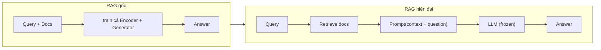

# RAG Theoretical Foundations

> [!summary] TL;DR
> **RAG** = Retrieval-Augmented Generation, lần đầu công bố trong paper của **Patrick Lewis & cộng sự (FAIR, 2020)**. Ý tưởng: kết hợp **Parametric Memory** (kiến thức nằm trong trọng số mô hình) với **Non-Parametric Memory** (kho tri thức ngoài dạng vector index). **RAG gốc (2020)** train end-to-end (đổi trọng số). **RAG hiện đại** giữ nguyên trọng số LLM, chỉ "Retrieve and Prompt" dựa trên **In-Context Learning** → linh hoạt, rẻ, dễ áp dụng cho dữ liệu private.

---

## 1. Vấn đề: vì sao cần RAG?

LLM (ChatGPT, Gemini, Claude, Llama…) khái quát & suy luận tốt, nhưng vẫn vướng:

- Kiến thức bị giới hạn ở thời điểm train (**knowledge cutoff**).
- **Hallucination** khi gặp câu hỏi ngoài vùng kiến thức.
- Thiếu kiến thức về **dữ liệu doanh nghiệp private**.

RAG cho LLM truy cập nguồn dữ liệu ngoài **không cần fine-tune/retrain tốn kém**.

---

## 2. Bảng thuật ngữ (Glossary — học thuộc cho thi)

| Thuật ngữ | Ý nghĩa |
|-----------|---------|
| **Hallucination** | Mô hình sinh thông tin sai/bịa nhưng giọng điệu rất tự tin. |
| **Knowledge Cutoff** | Mốc thời gian dữ liệu huấn luyện; mô hình không biết sự kiện sau đó. |
| **Fine-tuning** | Train thêm mô hình pre-trained trên dataset chuyên biệt để **cập nhật trọng số**. |
| **In-Context Learning** | LLM học & làm task dựa trên ví dụ/ngữ cảnh trong prompt, **không update tham số**. |
| **Vector Embeddings** | Biểu diễn dữ liệu (text, ảnh) thành vector số thực trong không gian n chiều. |
| **Semantic Search** | Tìm kiếm dựa trên **độ tương đồng ngữ nghĩa**, không chỉ khớp từ khoá. |
| **Chunking** | Cắt văn bản dài thành đoạn ngắn để tối ưu encoding & vừa context window. |
| **Context Window** | Số token tối đa LLM nhận & xử lý trong 1 prompt. |
| **Grounding** | "Neo" câu trả lời vào dữ liệu thực để đảm bảo tính xác thực. |

### Glossary mở rộng (tra cứu nhanh — gom từ cả 4 môn AI)

**Nhóm Model & Sinh text**

| Thuật ngữ | Ý nghĩa |
|-----------|---------|
| **Token** | Đơn vị text LLM xử lý (≈ một mẩu từ). Tính chi phí & context window theo token. |
| **Temperature** | Tham số điều chỉnh độ "ngẫu nhiên" khi sinh: thấp (0–0.3) = ổn định/lặp lại; cao = sáng tạo/đa dạng. |
| **Top-p / Top-k sampling** | Chiến lược chọn token tiếp theo: top-p (nucleus) lấy nhóm token có tổng xác suất ≤ p; top-k lấy k token xác suất cao nhất. |
| **Prompt** | Toàn bộ input đưa vào LLM (chỉ thị + context + câu hỏi). |
| **System / User / Assistant message** | 3 vai trong chat: system (chỉ thị nền), user (người dùng), assistant (model). |

**Nhóm Prompting**

| Thuật ngữ | Ý nghĩa |
|-----------|---------|
| **Zero-shot** | Ra lệnh không kèm ví dụ mẫu. |
| **Few-shot** | Kèm 1–n ví dụ mẫu để model học format/style. |
| **Chain-of-Thought (CoT)** | Bắt model suy luận từng bước trước khi kết luận. |
| **Role / Persona prompting** | Gán vai cho model để định hướng văn phong/chuyên môn. |

**Nhóm Retrieval**

| Thuật ngữ | Ý nghĩa |
|-----------|---------|
| **Dense Retrieval** | Tìm theo vector ngữ nghĩa. |
| **Sparse Retrieval** | Tìm theo từ khoá thống kê (BM25, TF-IDF). |
| **BM25 / TF-IDF** | Thuật toán xếp hạng theo tần suất từ khoá; mạnh với tên riêng/thuật ngữ. |
| **Hybrid Search** | Kết hợp Dense + Sparse. |
| **RRF (Reciprocal Rank Fusion)** | Gộp kết quả nhiều luồng theo **rank** (k≈60), không dùng score thô. |
| **ANN / HNSW** | Approximate Nearest Neighbor — tìm vector gần đúng nhanh; HNSW là thuật toán phổ biến. |
| **Cosine Similarity** | Đo góc giữa 2 vector (1 = giống hệt hướng). |
| **MMR (Maximal Marginal Relevance)** | Cân bằng liên quan + đa dạng kết quả. |
| **Multi-Query** | Dùng LLM sinh nhiều biến thể câu hỏi rồi gộp kết quả. |
| **HyDE** | Sinh câu trả lời giả định, dùng vector của nó để search. |
| **Bi-Encoder** | Mã hoá hỏi & doc thành 2 vector riêng → nhanh (dùng ở retrieval). |
| **Cross-Encoder** | Đưa cặp (hỏi, doc) cùng lúc vào model → chính xác (dùng ở re-rank). |
| **Re-ranking** | Chấm lại thứ tự candidate bằng model mạnh hơn. |
| **Parent-Child (Small-to-Big)** | Search trên chunk con nhỏ, trả chunk cha lớn cho LLM. |

**Nhóm Generation & Context**

| Thuật ngữ | Ý nghĩa |
|-----------|---------|
| **Context Stuffing** | Nhồi toàn bộ Top-K vào prompt. |
| **Lost in the Middle** | LLM bỏ quên thông tin ở giữa prompt; khắc phục bằng reordering U-shape. |
| **Context Compression** | Tóm tắt context trước khi feed LLM chính. |
| **Citation / Attribution** | Trả lời kèm trích dẫn nguồn (ID tài liệu). |

**Nhóm Framework & Agent**

| Thuật ngữ | Ý nghĩa |
|-----------|---------|
| **Chain** | Chuỗi bước xử lý cố định (LangChain LCEL, tuyến tính). |
| **Runnable / LCEL** | Interface chuẩn của LangChain; ghép bằng `|` thành chain. |
| **Agent** | LLM tự điều phối hành động qua tool theo vòng Reason→Act→Observe. |
| **ReAct** | Reason + Act — mẫu agent suy luận xen kẽ hành động. |
| **Tool / Function Calling** | Khả năng LLM gọi hàm/công cụ ngoài. |
| **LangGraph** | Framework mô hình hoá luồng thành **đồ thị có chu trình + state** (cho agent/multi-agent/HITL). |

> 📎 Chi tiết từng khái niệm xem [[03-Modern-RAG-Architecture]], [[04-LangChain-Framework-Core]], [[05-Building-RAG-Agent]] và các môn 2–4.

---

## 3. Nguồn gốc lý thuyết

Khái niệm RAG được công bố chính thức trong paper **"Retrieval-Augmented Generation for Knowledge-Intensive NLP Tasks"** — Patrick Lewis et al., Facebook AI Research (FAIR), **2020** ([arXiv:2005.11401](https://arxiv.org/abs/2005.11401)).

RAG được định nghĩa là **mô hình xác suất lai (hybrid)** kết hợp hai loại bộ nhớ:

- **Parametric Memory** — kiến thức *ngầm* lưu trong trọng số của mô hình sinh (Pre-trained Seq2Seq Transformer). Trong paper, tác giả dùng **BART** làm Generator.
- **Non-Parametric Memory** — kiến thức *tường minh* bên ngoài: một **dense vector index** chứa các đoạn text Wikipedia, truy cập qua **Neural Retriever** (kiến trúc Dense Passage Retriever - DPR).

> Cơ chế RAG gốc: Generator (BART) dùng input **kết hợp** với các *latent documents* mà Retriever tìm được để sinh text. Toàn bộ kiến trúc được **fine-tune end-to-end** — cập nhật trọng số cho cả Query Encoder lẫn Generator.

---

## 4. Bước chuyển sang In-Context RAG (cốt lõi)

Tuy tên gọi "RAG" giữ nguyên, **tư duy triển khai đã thay đổi căn bản**:

| | **RAG gốc (2020)** | **RAG hiện đại (nay)** |
|---|---|---|
| Nền tảng | Fine-tuning | **In-Context Learning** |
| Trọng số LLM | **Thay đổi** khi train | **Giữ nguyên (frozen)** |
| Quy trình | Train chung retriever + generator | **"Retrieve and Prompt"** |
| Chi phí | Cao (cần train) | Thấp, linh hoạt |
| Dữ liệu private | Khó | Dễ áp dụng |

→ RAG hiện đại: giữ nguyên trọng số LLM, **chỉ tối ưu khâu lấy dữ liệu** rồi nhồi vào prompt cho mô hình xử lý. Đây là lý do RAG trở thành chuẩn cho ứng dụng AI production.



---

## 5. Bảo mật & phân quyền: RBAC trong RAG (hay hỏi ở câu production)

**Vấn đề:** một vector store thường chứa tài liệu của **nhiều người/nhiều phòng** (HR, Tài chính, từng khách hàng — multi-tenant). Nếu retrieval kéo về **bất kỳ** chunk gần nghĩa, một nhân viên thường có thể vô tình nhận được nội dung **bảng lương** hay tài liệu mật của phòng khác → **rò rỉ dữ liệu**. Đáng sợ hơn vector thuần: kẻ xấu chỉ cần hỏi khéo là LLM "tóm tắt" giúp tài liệu lẽ ra họ không được xem.

**Cách đúng — lọc quyền NGAY ở bước retrieval bằng metadata (pre-filtering):** lúc index, gắn cho mỗi chunk metadata quyền truy cập (`tenant_id`, `department`, `allowed_roles`, `owner_id`). Khi truy vấn, **luôn kèm filter theo danh tính người đang hỏi** để VectorDB chỉ trả về chunk họ được phép:

```python
# Lọc quyền tại nguồn: chỉ search trong tài liệu user được phép xem
retriever = vectorstore.as_retriever(
    search_kwargs={
        "k": 5,
        "filter": {                     # metadata filter — chạy CÙNG vector search
            "tenant_id": current_user.tenant_id,
            "department": {"$in": current_user.allowed_departments},
        },
    }
)
```

> [!warning] Đừng lọc quyền SAU khi đã đưa vào LLM
> Nếu retrieve hết rồi mới nhờ LLM "đừng nói phần mật" → **không an toàn**: dữ liệu mật đã nằm trong prompt, LLM có thể lộ (qua [[../04-LangGraph-Agentic/03-Tool-Calling-Tavily|prompt injection]]). **Phân quyền phải xảy ra TRƯỚC retrieval** (pre-filter ở DB), không phải post-filter ở model. Đây là **least-privilege** áp cho RAG.

```
★ Insight ─────────────────────────────────────
• RBAC trong RAG = bài toán an ninh, không phải bài toán độ chính xác. Quy tắc:
  "user thấy gì ở UI thì RAG được retrieve đúng bấy nhiêu" — quyền ở tầng dữ
  liệu (metadata filter), không ủy thác cho LLM tự kiểm duyệt.
• Ngoài filter, còn cần index RIÊNG hoặc namespace theo tenant cho dữ liệu cực
  nhạy, vì chung một index vẫn có rủi ro cấu hình filter sai là lộ hết.
─────────────────────────────────────────────────
```

---

## 6. Pitfalls / Bẫy thường gặp

> [!warning] Nhầm RAG hiện đại với fine-tuning
> RAG hiện đại **không đổi trọng số** mô hình. Nếu ai nói "RAG là train lại model trên dữ liệu công ty" → đó là fine-tuning, không phải RAG hiện đại.

> [!warning] In-Context Learning bị giới hạn bởi context window
> Vì nhồi dữ liệu vào prompt, lượng context bị chặn bởi context window của LLM → bắt buộc phải chunking + retrieval tốt thay vì nhồi tất cả.

---

## 7. Câu hỏi phỏng vấn thường gặp

**Q1: Parametric vs Non-Parametric Memory?**
> Parametric = kiến thức ngầm trong trọng số mô hình (học lúc train). Non-Parametric = kho tri thức ngoài tường minh (vector index), tra cứu được, cập nhật được mà không retrain.

**Q2: RAG gốc (2020) khác RAG hiện đại thế nào?**
> RAG gốc fine-tune end-to-end (đổi trọng số retriever + generator). RAG hiện đại giữ LLM frozen, chỉ "retrieve and prompt" dựa trên in-context learning → rẻ, linh hoạt.

**Q3: In-Context Learning là gì?**
> Khả năng LLM học & thực hiện task chỉ dựa vào ngữ cảnh/ví dụ trong prompt, **không cập nhật tham số**. Là nền tảng của RAG hiện đại.

**Q4: Làm sao để user này không truy cập được tài liệu của user/phòng khác trong RAG?**
> Phân quyền (RBAC) **ngay ở bước retrieval** bằng **metadata filtering**: index gắn `tenant_id`/`department`/`allowed_roles` cho từng chunk, truy vấn luôn kèm filter theo danh tính người hỏi → VectorDB chỉ trả chunk họ được phép. **Tuyệt đối không** retrieve hết rồi nhờ LLM "tự đừng nói" — dữ liệu mật đã vào prompt là có thể lộ. Dữ liệu cực nhạy nên tách index/namespace riêng. Nguyên tắc: quyền nằm ở tầng dữ liệu, không ủy thác cho model.

---

## 8. Bài tập tự luyện

- [ ] **Bài 1:** Vẽ sơ đồ so sánh luồng dữ liệu RAG gốc vs RAG hiện đại, chỉ rõ chỗ nào trọng số thay đổi/không.
- [ ] **Bài 2:** Giải thích bằng ví dụ thực tế khi nào nên fine-tune thay vì RAG.
- [ ] **Bài 3:** Thiết kế metadata RBAC cho vector store đa phòng ban; viết `search_kwargs` filter để user phòng Sales chỉ search được tài liệu Sales + tài liệu public.

---

## 9. Liên kết

- [[01-Introduction-AI-GenAI]] — vì sao LLM cần RAG
- [[03-Modern-RAG-Architecture]] — 3 phase Indexing/Retrieval/Generation
- [[04-LangChain-Framework-Core]] — công cụ hiện thực RAG
- [[00-MOC-AI-Fundamentals-RAG|MOC: AI Fundamentals & RAG]]
