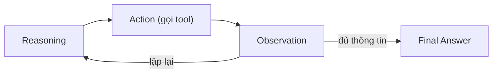
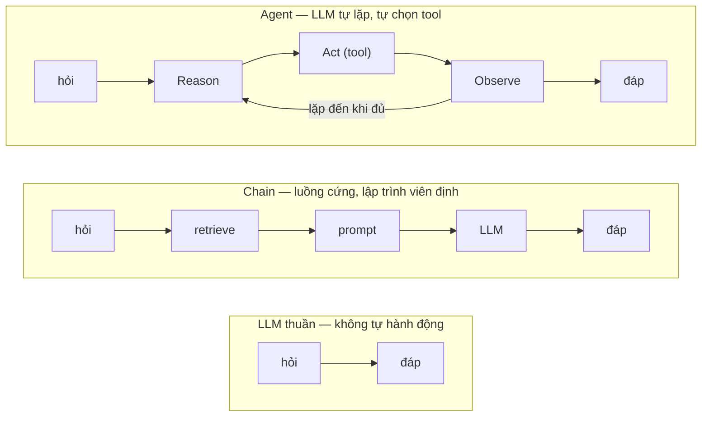
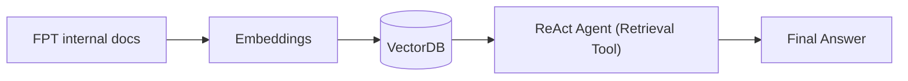

# Building RAG Agent Using LangChain

> [!summary] TL;DR
> **ReAct (Reason + Act) Agent**: LLM không chỉ *suy nghĩ* mà còn *hành động* qua **tools**, chạy vòng lặp **Reasoning → Action → Observation**. Trong RAG, ta biến `retriever` thành một **tool** để agent tự quyết khi nào cần tra cứu VectorDB. Project mẫu: hệ thống QA tự động về **chính sách nội bộ FPT** — pipeline `docs → embeddings → VectorDB → ReAct Agent (retrieval tool) → final answer`.

---

## 1. ReAct Agent là gì?

**ReAct = Reason + Act.** Mô hình giúp LLM vừa suy luận vừa thực hiện hành động cụ thể qua **tools**.

- **Cơ chế hoạt động** — vòng lặp:



- **Flexibility**: là nền tảng để dựng hệ thống Agent phức tạp (Deep Agents), xử lý task nhiều bước thông minh.

```
★ Insight ─────────────────────────────────────
• Khác RAG "chain" cứng (luôn retrieve rồi trả lời), ReAct agent TỰ QUYẾT có
  cần retrieve không, retrieve mấy lần, với query nào → linh hoạt hơn.
• "Observation" là kết quả tool trả về, được nạp lại vào context để LLM suy
  luận bước kế tiếp — đó là vòng lặp đặc trưng của agent.
• Đây là cầu nối sang môn LangGraph: LangGraph cho phép kiểm soát vòng lặp này
  bằng graph có state, thay vì để agent tự do hoàn toàn.
─────────────────────────────────────────────────
```

---

## 2. ⭐ Phân biệt: LLM thuần vs Chain vs Agent (hay hỏi)

Đây là 3 mức độ "tự chủ" tăng dần — phỏng vấn rất hay yêu cầu phân biệt:

| Tiêu chí | **LLM thuần** | **Chain (LCEL)** | **Agent** |
|----------|---------------|------------------|-----------|
| Cách chạy | 1 lần: input → output | Chuỗi bước **cố định**, tuyến tính | **Vòng lặp động** Reason→Act→Observe |
| Ai quyết định luồng? | — | **Lập trình viên** định nghĩa sẵn | **LLM tự quyết** bước kế tiếp |
| Dùng tool? | ❌ | Chỉ những bước được cắm sẵn | ✅ Tự chọn tool & số lần gọi |
| Số bước | 1 | Cố định, biết trước | **Không biết trước** (đến khi đủ thông tin) |
| Truy cập dữ liệu ngoài | ❌ (chỉ kiến thức train) | Có nếu có bước retrieval | Có, **chủ động** gọi khi cần |
| Phù hợp | Hỏi-đáp đơn giản | Pipeline xác định (RAG cố định) | Task nhiều bước, cần suy luận & công cụ |



> [!note] Liên hệ LangChain vs LangGraph
> Chain (tuyến tính) hợp với LangChain LCEL. Agent (vòng lặp + điều kiện + state) biểu diễn tự nhiên bằng **LangGraph (đồ thị có chu trình)**. Xem [[04-LangChain-Framework-Core#8. ⭐ LangChain (tuyến tính) vs LangGraph (đồ thị) — RẤT hay hỏi|so sánh LangChain vs LangGraph]].

> [!tip] Trả lời gọn khi bị hỏi "Agent khác LLM ở đâu?"
> "LLM thuần chỉ sinh text 1 lượt từ kiến thức đã train. **Agent** bọc LLM trong một **vòng lặp có tool**: LLM *suy luận* xem cần làm gì, *gọi tool* (vd retrieval, search, calculator), *quan sát* kết quả, rồi lặp lại đến khi đủ dữ kiện trả lời — tức là LLM **tự điều phối hành động**, không chỉ trả lời."

---

## 3. Project thực hành: RAG Agent cho Chính sách FPT

**Mục tiêu:** xây hệ thống tự động hỏi-đáp về quy định & chính sách nội bộ FPT.

### Quy trình triển khai

1. **Input Data** — thu thập tài liệu chính sách, hướng dẫn nội bộ FPT.
2. **Vector Database** — biến text thành embeddings, lưu vào VectorDB để retrieval.
3. **Retrieval System** — semantic search lấy các đoạn liên quan nhất (Context).
4. **Tích hợp ReAct Agent**:
   - Agent nhận câu hỏi từ user.
   - Dùng **`retriever` tool** để tìm thông tin trong VectorDB.
   - Tổng hợp và trả lời dựa trên dữ liệu thật từ policy công ty.

### Pipeline



> 📓 Notebook tham khảo gốc: `0_create_agent.ipynb` (langchain-ai/deep-agents-from-scratch).

---

## 4. Pitfalls / Bẫy thường gặp

> [!warning] Agent gọi tool vô hạn
> Vòng Reason→Act→Observe có thể lặp mãi nếu không đặt giới hạn (max iterations / recursion limit). Luôn cấu hình ngưỡng dừng.

> [!warning] Mô tả tool kém → agent không biết khi nào dùng
> LLM chọn tool dựa trên **docstring/description**. Mô tả `retriever` tool rõ ràng ("dùng để tra cứu chính sách nội bộ FPT") thì agent mới gọi đúng lúc.

> [!warning] Không grounding → agent vẫn hallucinate
> Có tool retrieval không đảm bảo agent dùng nó. Cần prompt buộc trả lời dựa trên context lấy được + citation.

---

## 5. Câu hỏi phỏng vấn thường gặp

**Q1: ReAct Agent là gì? Vòng lặp gồm những bước nào?**
> Reason + Act: LLM suy luận rồi hành động qua tools theo vòng **Reasoning → Action → Observation**, lặp đến khi đủ thông tin trả lời.

**Q2: RAG chain thường khác RAG agent thế nào?**
> Chain: luồng cứng (luôn retrieve → generate). Agent: tự quyết có/khi nào/bao nhiêu lần retrieve, dùng tool nào → linh hoạt cho task nhiều bước.

**Q3: Vì sao biến retriever thành "tool"?**
> Để agent chủ động gọi khi cần dữ liệu ngoài, kết hợp được với các tool khác (search web, calculator…) trong cùng vòng suy luận.

---

## 6. Bài tập tự luyện

- [ ] **Bài 1:** Dựng RAG agent đơn giản với 1 retriever tool trên bộ tài liệu policy mẫu; đặt max iterations và quan sát log Reason/Act/Observation.
- [ ] **Bài 2:** Thêm tool thứ 2 (vd calculator hoặc web search) và viết câu hỏi buộc agent phối hợp 2 tool.
- [ ] **Bài 3:** So sánh câu trả lời của RAG chain cứng vs RAG agent trên cùng 5 câu hỏi.

---

## 7. Liên kết

- [[04-LangChain-Framework-Core]] — retriever & các component dùng làm tool
- [[03-Modern-RAG-Architecture]] — phần Generation & citation
- [[../04-LangGraph-Agentic/00-MOC-LangGraph-Agentic|MOC: LangGraph & Agentic AI]] — kiểm soát vòng lặp agent bằng graph
- [[00-MOC-AI-Fundamentals-RAG|MOC: AI Fundamentals & RAG]]
