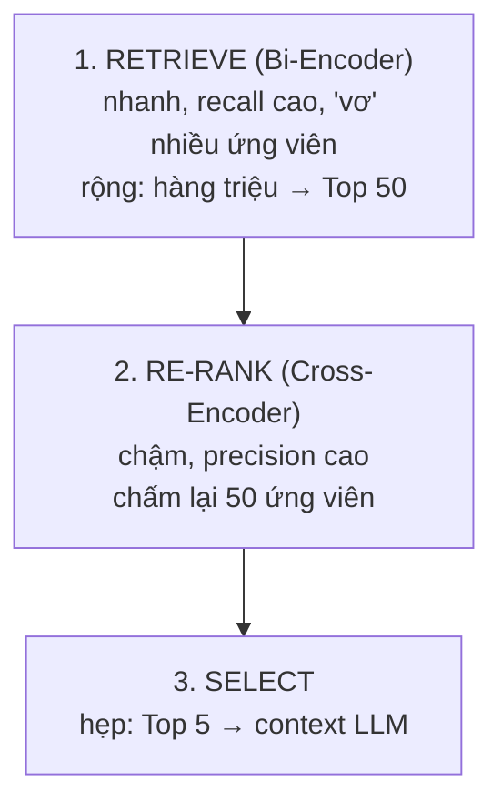

# Post-Retrieval Processing (Re-ranking & MMR)

> [!summary] TL;DR
> Top-K từ Retrieval **chưa tối ưu** để feed thẳng LLM: embedding ưu tiên tốc độ nên hy sinh độ hiểu sâu, và kết quả có **nhiễu** (khớp từ khoá nhưng lệch ý). **Re-ranking** = bước lọc cuối "đọc kỹ" tập nhỏ ứng viên. **Cross-Encoder** (đọc cặp hỏi+doc *cùng lúc* qua Self-Attention) chính xác hơn hẳn **Bi-Encoder** (mã hoá riêng rẽ) nhưng chậm → dùng theo **Funnel** (rộng→hẹp): Bi-Encoder lấy Top 50 → Cross-Encoder chấm lại → Top 5. **MMR** giải bài toán khác: cân bằng **liên quan** ↔ **đa dạng**, tránh trả về 5 đoạn gần trùng nhau.

---

## 1. Vì sao cần xử lý sau Retrieval?

Sau Indexing + Retrieval ta có Top-K, nhưng thường chưa đủ tốt vì 2 lý do:

1. **Limited Semantic Accuracy** — embedding model tối ưu **tốc độ** trên dữ liệu lớn → buộc phải đánh đổi khả năng hiểu quan hệ ngữ nghĩa phức tạp giữa hỏi và văn bản.
2. **Information Noise** — tài liệu tìm được có thể chứa nhiều từ khoá khớp nhưng **lệch ngữ cảnh / sai ý thật** → đưa thông tin sai cho LLM.

→ **Re-ranking = bộ lọc bước cuối**: chấp nhận tốn thêm chút thời gian để "đọc kỹ" một tập nhỏ ứng viên (vd 50 docs) và chọn ra tinh hoa (vd 5 docs) cho LLM.

---

## 2. ⭐ Bi-Encoder vs Cross-Encoder

| | **Bi-Encoder** (dùng ở Retrieval) | **Cross-Encoder** (dùng ở Re-rank) |
|---|---|---|
| Cách xử lý | Mã hoá hỏi & doc **riêng rẽ** → 2 vector → tính khoảng cách | Nối (hỏi + doc) thành **1 chuỗi**, đưa vào model **cùng lúc** |
| Cơ chế | Tính độ gần 2 vector độc lập | **Full Self-Attention**: xét tương tác từng từ của hỏi với từng từ của doc |
| Ưu điểm | **Nhanh**, vector doc **tính trước** được (pre-compute) | **Chính xác cao**, hiểu nuance, phủ định, logic phức tạp |
| Nhược điểm | Mất thông tin tương tác chi tiết giữa các từ | **Rất chậm**, tốn tài nguyên, **không** quét được toàn DB |

> [!example] Sức mạnh Cross-Encoder — query "Python không ăn gì?"
> - **Bi-Encoder:** có thể trả tài liệu chứa từ khoá "Python", "ăn", "thức ăn" như "Cách cho trăn Python ăn chuột" — **bắt sai ý** vì chỉ tóm từ khoá.
> - **Cross-Encoder:** đọc đồng thời hỏi+doc → nhận ra cấu trúc phủ định "không ăn" và ngữ cảnh sinh học → xếp cao tài liệu "Trăn Python có thể nhịn ăn hàng tháng...".

```
★ Insight ─────────────────────────────────────
• Lý do gốc Cross-Encoder chính xác hơn: Bi-Encoder "nén" mỗi văn bản thành 1
  vector cố định TRƯỚC khi thấy câu hỏi → mọi tương tác chi tiết đã mất. Cross-
  Encoder để hỏi & doc "nói chuyện" qua attention NÊN bắt được phủ định, đại từ,
  logic. Cái giá: không pre-compute được → phải chạy mỗi cặp lúc query.
• Vì vậy không ai dùng Cross-Encoder để search toàn DB (hàng triệu cặp) — chỉ
  dùng để chấm lại vài chục ứng viên.
─────────────────────────────────────────────────
```

### Funnel Strategy (cái phễu rộng → hẹp)

Vì Cross-Encoder chậm, **không** áp lên toàn bộ dữ liệu. Quy trình chuẩn:



1. **Retrieve** — Bi-Encoder lấy nhanh Top 50 từ hàng triệu docs (ưu tiên **recall**).
2. **Re-rank** — Cross-Encoder chấm lại 50 docs đó (ưu tiên **precision**).
3. **Select** — lấy Top 5 điểm cao nhất đưa vào context LLM.

---

## 3. MMR — Maximal Marginal Relevance

Đôi khi "tìm tài liệu giống nhất" **không** phải tốt nhất. Hỏi *"Tiểu sử Steve Jobs"* mà chỉ dựa vào similarity → có thể trả 5 đoạn gần như y hệt, đều nói "sáng lập Apple 1976" → **lãng phí context window**, không thêm thông tin mới.

**MMR cân bằng 2 yếu tố:**
- **Relevance** — tài liệu phải liên quan câu hỏi.
- **Diversity** — tài liệu phải **khác** những cái đã chọn trước đó.

**Nguyên lý:**
1. Chọn doc giống câu hỏi nhất.
2. Chọn doc tiếp theo sao cho **vừa giống câu hỏi** **vừa ít giống** doc đã chọn ở bước 1.
3. Lặp đến đủ Top-K.

$$ MMR = \arg\max_{d_i \in D \setminus S} \big[\lambda \cdot Sim_1(d_i, q) - (1-\lambda)\cdot \max_{d_j \in S} Sim_2(d_i, d_j)\big] $$

- `λ` (thường **0.5**) — λ nhỏ hơn → ưu tiên **đa dạng** nhiều hơn; λ lớn → ưu tiên **liên quan**.

> [!example] MMR — query "Tính năng xe VinFast VF8"
> **Không MMR:** Doc1 "động cơ 402 mã lực", Doc2 "công suất 300kW (≈402 mã lực)", Doc3 "tăng tốc ấn tượng" → **lặp lại** toàn về động cơ.
> **Có MMR:** Doc1 "động cơ 402 mã lực" (giống câu hỏi nhất) → Doc2 "hệ thống ADAS cảnh báo chệch làn" (khác Doc1) → Doc3 "bảo hành pin 10 năm" (khác cả 2) → LLM đủ dữ liệu trả lời toàn diện: động cơ, an toàn, hậu mãi.

---

## 4. Cross-Encoder vs MMR — chọn cái nào?

| Mục tiêu | Dùng |
|---|---|
| Cần câu trả lời **cực chính xác** cho câu hỏi khó (phủ định, logic) | **Cross-Encoder** |
| Cần câu trả lời **bao quát nhiều khía cạnh**, tránh trùng lặp | **MMR** |

> Hai kỹ thuật **không loại trừ nhau**: có thể Cross-Encoder chấm điểm rồi MMR chọn tập đa dạng từ các ứng viên điểm cao.

---

## 5. Pitfalls / Bẫy thường gặp

> [!warning] Dùng Cross-Encoder để retrieve toàn DB
> Sai kinh điển — Cross-Encoder không pre-compute được, chạy mỗi cặp lúc query → bất khả thi với hàng triệu docs. Nó chỉ dành cho **re-rank tập nhỏ**.

> [!warning] Funnel có "độ rộng" quá hẹp
> Nếu Bi-Encoder chỉ lấy Top 5 rồi mới re-rank, Cross-Encoder hết "đất" để cứu các doc tốt bị xếp hạng 20–40. Lấy Top 50–100 ở bước retrieve mới phát huy re-rank.

> [!warning] MMR λ quá thấp → trả về tài liệu lạc đề
> Ưu tiên đa dạng quá mức có thể chọn doc khác nhau nhưng **kém liên quan**. λ=0.5 là điểm khởi đầu cân bằng.

---

## 6. Câu hỏi phỏng vấn thường gặp

**Q1: Vì sao cần re-ranking khi đã có retrieval?**
> Embedding (Bi-Encoder) tối ưu tốc độ nên hiểu ngữ nghĩa hạn chế và kết quả có nhiễu. Re-ranking dùng model mạnh hơn (Cross-Encoder) "đọc kỹ" tập nhỏ ứng viên để lọc ra tinh hoa cho LLM.

**Q2: Bi-Encoder vs Cross-Encoder?**
> Bi-Encoder mã hoá hỏi & doc riêng rẽ thành 2 vector → nhanh, pre-compute được, dùng ở retrieval. Cross-Encoder nối câu hỏi và docs thành 1 chuỗi, full self-attention → chính xác (bắt phủ định/logic) nhưng chậm, dùng ở re-rank.

**Q3: Funnel strategy là gì?**
> Phễu rộng→hẹp: Bi-Encoder lấy nhanh Top 50 (recall) → Cross-Encoder chấm lại (precision) → chọn Top 5 cho LLM. Cân bằng tốc độ và độ chính xác.

**Q4: MMR giải quyết vấn đề gì?**
> Tránh trả về các tài liệu gần trùng nhau (lãng phí context, không thêm thông tin). MMR cân bằng relevance và diversity qua tham số λ.

**Q5: Khi nào dùng Cross-Encoder, khi nào MMR?**
> Cross-Encoder khi cần độ chính xác cao cho câu hỏi khó. MMR khi cần câu trả lời bao quát nhiều khía cạnh, tránh lặp. Có thể kết hợp cả hai.

---

## 7. Bài tập tự luyện

- [ ] **Bài 1:** Dựng pipeline funnel: vector retriever lấy Top 50 → CrossEncoder (sentence-transformers) re-rank → Top 5. So sánh top-5 trước/sau re-rank.
- [ ] **Bài 2:** Tạo câu hỏi có **phủ định** và quan sát Cross-Encoder sửa thứ hạng so với Bi-Encoder.
- [ ] **Bài 3:** Bật MMR (λ=0.3, 0.5, 0.7) trên một câu hỏi "tổng quan sản phẩm X" → quan sát độ đa dạng kết quả.

---

## 8. Liên kết

- [[03-Query-Transformation]] — tối ưu phía truy vấn (đối xứng với post-retrieval ở phía kết quả)
- [[01-Advanced-Indexing]] — Bi-Encoder gắn với HNSW ở bước retrieve
- [[05-GraphRAG-Implementation]] — hướng tiếp cận retrieval hoàn toàn khác (graph)
- [[../01-AI-Fundamentals-RAG/03-Modern-RAG-Architecture]] — funnel & re-rank trong phase Retrieval
- [[00-MOC-RAG-Optimization|MOC: RAG & Optimization]]
