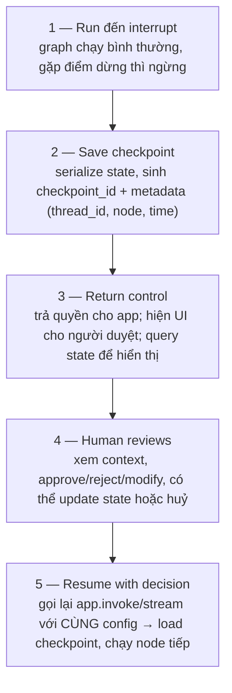

# Human-in-the-Loop & Persistence

> [!summary] TL;DR
> **HITL** = chèn người vào vòng cho các quyết định **rủi ro cao / cần tuân thủ**: thao tác không thể hoàn tác, tài chính, y tế, pháp lý, deploy code. LangGraph làm bằng **interrupt** — `interrupt_before` / `interrupt_after` tạm dừng đồ thị tại node định trước, **lưu checkpoint**, trả quyền cho ứng dụng để người duyệt, rồi **resume** bằng cùng `config`. Interrupt **bắt buộc có checkpointer**. **Persistence** = lưu state qua các lần chạy để nhớ multi-turn, hồi phục sau lỗi, audit, time-travel. 3 checkpointer: **MemorySaver** (RAM, dev), **SqliteSaver** (file, app nhỏ), **PostgresSaver** (production, phân tán). Mỗi hội thoại tách biệt bằng **`thread_id`**. Memory chia 2 tầng: **short-term** (checkpointer, theo thread) + **long-term** (DB/vector ngoài, theo user).

---

## 1. Vì sao cần Human-in-the-Loop?

| Lý do | Ví dụ |
|---|---|
| **Quyết định rủi ro cao** | Xoá dữ liệu, đổi cấu hình hệ thống, **thao tác không hoàn tác được** |
| **Hệ quả tài chính** | Chuyển tiền, thanh toán, hoàn tiền lớn |
| **Hệ quả pháp lý** | Hành động vi phạm luật/điều khoản |
| **Quality control** | Chống hallucination, đúng brand voice, bắt lỗi trước khi publish |
| **Compliance** | GDPR/HIPAA/SOC2/PCI-DSS; **audit trail** ai duyệt cái gì khi nào |
| **User feedback** | Sửa lỗi, cá nhân hoá, xây niềm tin |

**Use cases:** duyệt nội dung trước khi đăng, giao dịch tài chính lớn, chẩn đoán y tế (bác sĩ duyệt), rà soát hợp đồng, deploy production (senior dev duyệt).

```
★ Insight ─────────────────────────────────────
• HITL không phải "tắt tự động hoá" mà là "tự động hoá CÓ ĐIỂM DỪNG". Nối thẳng
  với safe vs sensitive tools ở [[04-Multi-Agent-Collaboration]]: chỉ chèn dừng
  trước thao tác GHI/NGUY HIỂM, để thao tác đọc vẫn chạy mượt.
• Điều khiến HITL khả thi trong LangGraph là CHECKPOINTER: state được lưu lại
  nên có thể dừng "vô thời hạn" (chờ người duyệt cả ngày) rồi resume đúng chỗ —
  không cần giữ process chạy liên tục.
─────────────────────────────────────────────────
```

---

## 2. ⭐ Interrupts trong LangGraph

**3 năng lực:** (1) **Pause** tại điểm định trước, **giữ nguyên state**; (2) **Wait** cho input người (blocking, có thể timeout, validate input); (3) **Resume** từ checkpoint — khôi phục đúng state, chạy tiếp node sau, có thể **cập nhật state trước khi resume**.

### Thêm interrupt (cần checkpointer)

```python
memory = MemorySaver()
app = workflow.compile(
    checkpointer=memory,                      # BẮT BUỘC cho interrupt
    interrupt_before=["approval_node"],       # dừng TRƯỚC khi vào node này
    interrupt_after=["generate_content"],     # dừng SAU khi node này chạy
)
```

```python
# Interrupt có điều kiện (chỉ dừng khi đáng):
def check_needs_approval(state):
    return "approval_node" if state["amount"] > 10000 else "auto_process"
workflow.add_conditional_edges("process_transaction", check_needs_approval)
```

### Luồng thực thi 5 bước



> [!example] Mẫu approve giao dịch
> Graph chạy → tới `interrupt_before=["approval_node"]` thì dừng & lưu checkpoint → app hiện "Duyệt chuyển 50tr?" → người bấm Approve → `app.update_state(config, {"approved": True})` rồi `app.invoke(None, config)` → graph resume, thực hiện giao dịch.

---

## 3. Vì sao cần Persistence?

| Nhu cầu | Lợi ích |
|---|---|
| **Workflow chạy dài** | Quy trình nhiều ngày (chuỗi duyệt), async, scheduled — không cần giữ process chạy |
| **Resume sau lỗi** | Server restart/deploy/OOM/network fail không mất tiến độ đã làm |
| **Audit trail** | Theo dõi mọi quyết định & thay đổi state (compliance, debug, analytics) |
| **Multi-session** | Nhớ ngữ cảnh qua các phiên; long-term memory; logout/login không mất context |

---

## 4. ⭐ Các Checkpointer Saver

| Saver | Lưu ở | Bền vững | Concurrency | Dùng cho |
|---|---|---|---|---|
| **MemorySaver** | RAM | ❌ mất khi restart | 1 process | Dev, test, demo |
| **SqliteSaver** | File `.db` | ✅ (file) | Hạn chế | App nhỏ, POC, single-server |
| **PostgresSaver** | PostgreSQL | ✅ (ACID) | **Cao, phân tán** | **Production**, HA |
| **Custom** | Redis/Mongo/S3... | tuỳ | tuỳ | Yêu cầu đặc biệt (extend `BaseCheckpointSaver`) |

```python
# Dev
from langgraph.checkpoint.memory import MemorySaver
app = workflow.compile(checkpointer=MemorySaver())

# App nhỏ
from langgraph.checkpoint.sqlite import SqliteSaver
with SqliteSaver.from_conn_string("checkpoints.db") as cp:
    app = workflow.compile(checkpointer=cp)

# Production (kèm connection pool)
from langgraph.checkpoint.postgres import PostgresSaver
from psycopg_pool import ConnectionPool
pool = ConnectionPool(conn_string, min_size=5, max_size=20)
app = workflow.compile(checkpointer=PostgresSaver(pool))
```

```
★ Insight ─────────────────────────────────────
• Tiến triển MemorySaver → SQLite → Postgres giống đúng tiến triển dev→prod của
  bất kỳ DB nào: nhanh-nhưng-bay-hơi → bền-nhưng-đơn-lẻ → phân-tán-ACID.
  Quy tắc nhớ: "MemorySaver cho dev, PostgresSaver cho production".
• Checkpoint lưu STATE DELTA theo cấu trúc cha-con (parent_checkpoint_id) → tạo
  thành CÂY lịch sử → cho phép time-travel & replay (xem §6). Schema SQLite có
  bảng `checkpoints` (BLOB state) + `writes` (theo dõi cập nhật từng channel).
─────────────────────────────────────────────────
```

---

## 5. Thread Management

`thread_id` tách biệt mỗi hội thoại — state thread này không ảnh hưởng thread kia (an toàn concurrent, không race condition).

```python
config = {"configurable": {"thread_id": f"user-{user_id}-session-{session_id}"}}

app.invoke(initial_input, config)      # tạo thread mới
app.invoke(follow_up_input, config)    # tiếp tục CÙNG thread (nhớ lượt trước)
history = app.get_state_history(config) # liệt kê mọi checkpoint của thread
checkpointer.delete_thread(thread_id)  # xoá thread
```

---

## 6. State Updates & Checkpoint History (Time-travel)

### Cập nhật state thủ công

```python
app.update_state(config, {"approved": True})                  # merge vào state
app.update_state(config, {"status": "reviewed"}, as_node="human_review")  # giả lập node đã chạy
```

> `as_node` hữu ích để: sửa thủ công, **skip node**, test path cụ thể, cứu workflow bị kẹt. Ví dụ skip approval:
> ```python
> if app.get_state(config).next == ("approval",):
>     app.update_state(config, {"approved": True}, as_node="approval")
> ```

### Lịch sử & replay (time-travel debugging)

```python
for cp in app.get_state_history(config):
    print(cp.config["configurable"]["checkpoint_id"], cp.values, cp.next)

# Replay TỪ một checkpoint cụ thể:
specific = {"configurable": {"thread_id": "conv-123", "checkpoint_id": "abc123"}}
for event in app.stream(None, specific):   # None = không thêm input mới, chỉ chạy lại
    print(event)
```

Cấu trúc một checkpoint: `config` (thread_id, checkpoint_id) · `values` (state hiện tại) · `next` (node sắp chạy) · `metadata` (step, writes) · `parent_config` (checkpoint trước).

---

## 7. ⭐ Memory Patterns — Short-term vs Long-term

| | **Short-term (Checkpointer)** | **Long-term (External)** |
|---|---|---|
| Lưu gì | Hội thoại hiện tại, task context, biến tạm | User preferences, tóm tắt hội thoại cũ, profile, pattern học được |
| Lưu ở đâu | Trong checkpoint (theo `thread_id`) | DB/vector store riêng (theo `user_id`) |
| Vòng đời | Ephemeral, theo thread, mất khi xoá thread | Bền, xuyên thread/phiên |
| Tốc độ | Nhanh (gần như RAM/DB checkpoint) | Cần truy vấn ngoài (vd vector search) |

```python
class UserMemory:                          # long-term qua vector store
    def remember(self, content, metadata):
        self.vector_store.add(embedding=get_embedding(content), content=content,
                              metadata={**metadata, "user_id": self.user_id})
    def recall(self, query, k=5):
        return self.vector_store.search(get_embedding(query),
                                        filter={"user_id": self.user_id}, k=k)
```

```
★ Insight ─────────────────────────────────────
• Short-term = "trí nhớ làm việc" trong một phiên (checkpointer lo tự động).
  Long-term = "trí nhớ dài hạn" xuyên phiên (bạn TỰ xây bằng vector store + RAG).
  Long-term memory thực chất là RAG ([[../01-AI-Fundamentals-RAG/00-MOC-AI-Fundamentals-RAG]])
  áp vào lịch sử người dùng: embed hội thoại cũ → recall khi liên quan.
• Đừng nhồi tất cả vào short-term: lịch sử dài làm phình context window & tốn
  token. Tóm tắt/đẩy phần cũ sang long-term, chỉ giữ vài lượt gần nhất.
─────────────────────────────────────────────────
```

---

## 8. Pitfalls / Bẫy thường gặp

> [!warning] Dùng interrupt mà quên checkpointer
> `interrupt_before/after` **bắt buộc** compile với checkpointer. Thiếu → không có chỗ lưu state để dừng/resume → lỗi.

> [!warning] MemorySaver trong production
> Mất sạch state khi restart/deploy, không phân tán. Production phải SqliteSaver (nhỏ) hoặc PostgresSaver (chuẩn).

> [!warning] Resume sai config
> Resume phải dùng **cùng `thread_id`** (và checkpoint_id nếu replay điểm cụ thể). Sai thread → load nhầm/không thấy checkpoint.

> [!warning] Nhồi mọi thứ vào short-term memory
> Hội thoại dài phình context, tốn token, dễ vượt giới hạn. Tách long-term ra ngoài, trim/summarize phần cũ.

> [!warning] Interrupt mọi thao tác
> Bắt người duyệt cả thao tác đọc → phiền, mất tự động hoá. Chỉ interrupt thao tác sensitive (xem safe vs sensitive ở [[04-Multi-Agent-Collaboration]]).

---

## 9. Câu hỏi phỏng vấn thường gặp

**Q1: Khi nào cần Human-in-the-Loop?**
> Quyết định rủi ro cao/không hoàn tác được (tài chính, y tế, pháp lý, deploy), cần quality control (chống hallucination, brand), và tuân thủ (GDPR/HIPAA, audit trail). Chỉ chèn ở thao tác nhạy cảm, không phải mọi bước.

**Q2: Interrupt trong LangGraph hoạt động thế nào?**
> `interrupt_before/after` (hoặc conditional) tạm dừng graph tại node, lưu checkpoint, trả quyền cho app để người duyệt, rồi resume bằng cùng config (có thể update_state trước khi resume). Bắt buộc có checkpointer.

**Q3: Vì sao interrupt cần checkpointer?**
> Vì phải lưu toàn bộ state khi dừng để có thể resume đúng chỗ sau (kể cả nhiều giờ/ngày sau). Không có nơi lưu → không dừng/khôi phục được.

**Q4: 3 loại checkpointer khác nhau ra sao?**
> MemorySaver (RAM, mất khi restart, dev/test). SqliteSaver (file, bền, concurrency hạn chế, app nhỏ). PostgresSaver (ACID, phân tán, concurrency cao, production). Có thể custom (Redis/S3...) qua BaseCheckpointSaver.

**Q5: `thread_id` để làm gì?**
> Tách biệt từng hội thoại — mỗi thread có lịch sử checkpoint riêng, chạy song song không ảnh hưởng nhau. Cùng thread_id = tiếp tục hội thoại (nhớ lượt trước).

**Q6: Time-travel debugging là gì?**
> Nhờ checkpoint lưu theo cây cha-con, có thể `get_state_history` xem mọi bước và replay từ một checkpoint bất kỳ (`stream(None, config_với_checkpoint_id)`) để dò lỗi đúng thời điểm.

**Q7: Short-term vs long-term memory?**
> Short-term: hội thoại hiện tại trong checkpointer, theo thread, ephemeral. Long-term: preferences/lịch sử tóm tắt trong DB/vector store ngoài, theo user, bền xuyên phiên (thực chất là RAG trên lịch sử người dùng).

---

## 10. Bài tập tự luyện

- [ ] **Bài 1:** Thêm `interrupt_before` cho tool create_ticket/book_room; resume khi user gõ "y", `END` nếu khác (gợi ý: check `graph.get_state()` xem tool nào đang pending).
- [ ] **Bài 2:** Đổi MemorySaver → SqliteSaver; restart process, kiểm tra hội thoại vẫn nhớ.
- [ ] **Bài 3:** `get_state_history` để in toàn bộ checkpoint của một thread; replay từ một checkpoint giữa chừng.
- [ ] **Bài 4:** Dùng `update_state(..., as_node="approval")` để skip bước duyệt cho giao dịch nhỏ.
- [ ] **Bài 5:** Cài long-term memory bằng FAISS: lưu mỗi lượt hội thoại, recall khi câu hỏi liên quan (cache_tool theo đề bài).

---

## 11. Liên kết

- [[04-Multi-Agent-Collaboration]] — HITL cho sensitive tools; checkpointer cho shared state
- [[01-LangGraph-Foundations-State]] — checkpointer, thread_id, state delta (nền tảng)
- [[../01-AI-Fundamentals-RAG/00-MOC-AI-Fundamentals-RAG|MOC: AI Fundamentals & RAG]] — long-term memory = RAG trên lịch sử user
- [[../03-LLMOps-Evaluation/02-Observability-LangFuse-LangSmith]] — checkpoint history bổ trợ tracing/audit
- [[00-MOC-LangGraph-Agentic|MOC: LangGraph & Agentic AI]]
