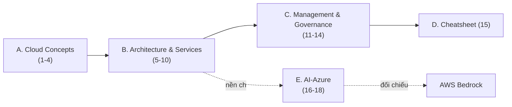

# MOC: Azure

> 📚 Học thêm theo nguyện vọng cá nhân (đề thi FresherAI dùng AWS). Bám giáo trình **AZ-900 Microsoft Azure Fundamentals** (3 module đúng outline thi) + cụm AI-Azure để đối chiếu với nhánh Bedrock.
> Nguồn: `_source/Microsoft/AZ-900.md` (khoá Jim Cheshire) + tham khảo web cho cụm AI.
>
> **Cấu trúc thư mục** (gom theo giáo trình cho rõ ràng):
> - `AZ-900/` — 15 note nền tảng Azure (cụm A–D dưới đây) ✅
> - `AI-Azure/` — 3 note AI-Azure đối chiếu Bedrock (cụm E) ✅
> - `AI-103/` — lộ trình Azure AI Engineer thế hệ Microsoft Foundry, 20 note (cụm F) — xem [[AI-103/00-MOC-AI-103|MOC riêng]] ✅
> - `AZ-204/` — cert Azure Developer Associate, 13 note (cụm G) — xem [[AZ-204/00-MOC-AZ-204|MOC riêng]] ✅

## Cụm A — Cloud Concepts (AZ-900 Module 1)

| # | Note | Trạng thái |
|---|------|------------|
| 1 | [[AZ-900/01-Tong-quan-Cloud-Shared-Responsibility\|Tổng quan Cloud & Shared Responsibility]] | ✅ |
| 2 | [[AZ-900/02-Cloud-Models-Consumption\|Cloud Models & Consumption-based]] | ✅ |
| 3 | [[AZ-900/03-Loi-ich-dam-may\|Lợi ích đám mây (HA/Scale/Reliability/Security)]] | ✅ |
| 4 | [[AZ-900/04-Cloud-Service-Types-IaaS-PaaS-SaaS\|Cloud Service Types: IaaS/PaaS/SaaS]] | ✅ |

## Cụm B — Azure Architecture & Services (AZ-900 Module 2)

| # | Note | Trạng thái |
|---|------|------------|
| 5 | [[AZ-900/05-Kien-truc-vat-ly-Regions-AZ\|Kiến trúc vật lý: Regions, Region Pairs, AZ]] | ✅ |
| 6 | [[AZ-900/06-To-chuc-tai-nguyen-Resource-Group-Management-Group\|Tổ chức tài nguyên: RG, Subscription, MG]] | ✅ |
| 7 | [[AZ-900/07-Compute-VM-Container-Functions\|Compute: VM, Container, Functions, App hosting]] | ✅ |
| 8 | [[AZ-900/08-Networking-VNet-VPN-ExpressRoute\|Networking: VNet, Peering, VPN, ExpressRoute]] | ✅ |
| 9 | [[AZ-900/09-Storage-Blob-Disk-Files\|Storage: Blob, Disks, Files, Tiers, Redundancy]] | ✅ |
| 10 | [[AZ-900/10-Identity-Security-AzureAD-RBAC\|Identity & Security: Entra ID, MFA, RBAC, Zero Trust]] | ✅ |

## Cụm C — Management & Governance (AZ-900 Module 3)

| # | Note | Trạng thái |
|---|------|------------|
| 11 | [[AZ-900/11-Quan-ly-chi-phi\|Quản lý chi phí: Calculators, Cost Management, Tags]] | ✅ |
| 12 | [[AZ-900/12-Governance-Blueprints-Policy-Locks\|Governance: Blueprints, Policy, Locks]] | ✅ |
| 13 | [[AZ-900/13-Cong-cu-quan-ly-CLI-ARM-Arc\|Công cụ: Portal, CLI/PowerShell, Arc, ARM]] | ✅ |
| 14 | [[AZ-900/14-Monitoring-Advisor-Monitor\|Monitoring: Advisor, Service Health, Monitor]] | ✅ |

## Cụm D — Tra cứu

| # | Note | Trạng thái |
|---|------|------------|
| 15 | [[AZ-900/15-AZ-900-Cheatsheet\|AZ-900 Cheatsheet & Glossary]] | ✅ |

## Cụm E — AI-Azure (đối chiếu Bedrock)

| # | Note | Trạng thái |
|---|------|------------|
| 16 | [[AI-Azure/16-Azure-OpenAI-Service\|Azure OpenAI Service]] (↔ Bedrock) | ✅ |
| 17 | [[AI-Azure/17-Azure-AI-Search\|Azure AI Search]] (↔ S3 Vectors) | ✅ |
| 18 | [[AI-Azure/18-Azure-App-Service-Functions-deploy\|Deploy FastAPI: App Service & Functions]] | ✅ |

## Cụm F — AI-103 (Azure AI Engineer, Microsoft Foundry era)

> Bộ 4 learning path Microsoft Learn thế hệ Foundry (2025-2026) thay thế giáo trình AI-102 cũ — agents, MCP, A2A, Content Understanding… Xem MOC riêng:

| Note | Trạng thái |
|------|------------|
| [[AI-103/00-MOC-AI-103\|MOC: AI-103]] (20 note, 5 cụm) | ✅ HOÀN TẤT |

## Cụm G — AZ-204 (Azure Developer Associate)

> Cert AZ-204 góc nhìn lập trình viên (SDK/code/deploy) — bổ sung cho AZ-900 & AI-103. Xem MOC riêng:

| Note | Trạng thái |
|------|------------|
| [[AZ-204/00-MOC-AZ-204\|MOC: AZ-204]] (13 note, 6 cụm) | ✅ HOÀN TẤT |

## Lộ trình

## Liên quan
- [[../00-MOC-Cloud|MOC: Cloud]]
- [[../01-AWS-Bedrock/00-MOC-AWS-Bedrock|MOC: AWS Bedrock]] — nhánh bám đề thi (so sánh tương đương)
- [[../../04-AI/00-MOC-AI|MOC: AI]] — RAG/LLM dùng Azure OpenAI + AI Search
