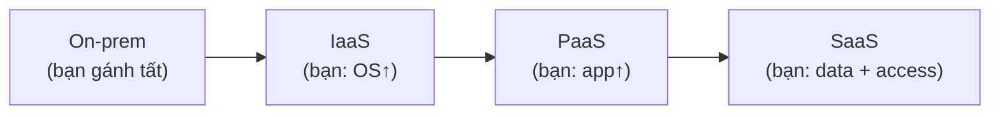

# Tổng quan Cloud & Shared Responsibility Model

> [!summary] TL;DR
> **Cloud computing** không chỉ là "nhiều máy tính nối mạng" — nó là tập hợp các đặc tính: tài nguyên theo yêu cầu, trả theo dùng (consumption-based), co giãn (elastic), độ sẵn sàng cao. **Shared Responsibility Model (mô hình trách nhiệm chia sẻ)** là khái niệm trụ cột: bạn **và** nhà cung cấp cùng chịu trách nhiệm cho ứng dụng chạy trên cloud; phần ai gánh nhiều hơn **tuỳ loại dịch vụ** (IaaS → bạn gánh nhiều; SaaS → bạn gánh ít). Nhà cung cấp **không bao giờ** chịu trách nhiệm 100%, và chỉ chịu cho thứ **trong tầm kiểm soát của họ** (vd: bug trong app của bạn là việc của bạn).

---

## 1. Cloud computing là gì?

Không có một câu định nghĩa duy nhất. Cloud là **tổng hợp nhiều khái niệm**: máy tính nối mạng + khả năng mở rộng (scalability) + co giãn (elasticity) + nhanh nhẹn (agility) + chịu lỗi (fault tolerance) + trả theo dùng. Mạng ở đây **không nhất thiết là Internet** (có thể là mạng riêng).

> [!question] Phỏng vấn: "Cloud computing có phải chỉ là server của người khác?"
> Không. "Server người khác" là điều kiện cần nhưng chưa đủ. Cloud computing là khi tập hợp tài nguyên đó đi kèm các đặc tính **tự phục vụ theo yêu cầu, co giãn đàn hồi, đo đếm & trả theo mức dùng, sẵn sàng cao**. Thiếu các đặc tính này thì chỉ là hosting/đặt máy chủ thông thường.

---

## 2. Shared Responsibility Model

Trách nhiệm cho một workload được **chia** giữa khách hàng và nhà cung cấp. Ranh giới dịch chuyển theo loại dịch vụ:

| Tầng trách nhiệm | On-premises | IaaS | PaaS | SaaS |
|---|---|---|---|---|
| Data & access (dữ liệu, danh tính) | **Bạn** | **Bạn** | **Bạn** | **Bạn** |
| Ứng dụng | Bạn | Bạn | chia sẻ | Provider |
| OS, middleware, runtime | Bạn | Bạn | Provider | Provider |
| Mạng, máy chủ, lưu trữ vật lý | Bạn | Provider | Provider | Provider |
| Datacenter (điện, làm mát) | Bạn | Provider | Provider | Provider |

**Quy tắc ghi nhớ:** có 3 thứ **luôn là của bạn** dù dùng dịch vụ nào — **dữ liệu, danh tính (account), và việc quản lý quyền truy cập**.



> [!question] Phỏng vấn: "Website bạn deploy lên cloud bị lỗi do bug code — ai chịu?"
> **Bạn chịu.** Nhà cung cấp chỉ chịu trách nhiệm cho phần **trong tầm kiểm soát của họ** (hạ tầng, mạng, phần cứng…). Bug trong code ứng dụng nằm ngoài tầm kiểm soát của họ nên không bao giờ là trách nhiệm của provider.

---

```
★ Insight ─────────────────────────────────────
• Shared Responsibility xuất hiện xuyên suốt AZ-900: mỗi khi học một
  dịch vụ, hãy tự hỏi "ranh giới trách nhiệm nằm đâu?".
• Đi lên từ IaaS→SaaS: bạn ĐỔI kiểm soát lấy tiện lợi. Càng ít trách
  nhiệm thì càng ít quyền tuỳ biến.
• "Data + identity luôn là của bạn" là câu chốt an toàn cho mọi câu
  hỏi tình huống về trách nhiệm bảo mật trên cloud.
─────────────────────────────────────────────────
```

---

## Tự kiểm tra

1. Vì sao "nhiều máy tính nối mạng" chưa đủ để gọi là cloud computing?
2. Ranh giới trách nhiệm dịch chuyển thế nào từ IaaS → SaaS?
3. 3 thứ luôn thuộc trách nhiệm của khách hàng bất kể loại dịch vụ?
4. Nhà cung cấp KHÔNG chịu trách nhiệm cho loại sự cố nào? Cho ví dụ.

---

## Liên quan
- [[02-Cloud-Models-Consumption]] — public/private/hybrid + trả theo dùng
- [[04-Cloud-Service-Types-IaaS-PaaS-SaaS]] — chi tiết 3 loại dịch vụ & trách nhiệm
- [[10-Identity-Security-AzureAD-RBAC]] — data & identity là của bạn → cần quản lý quyền
